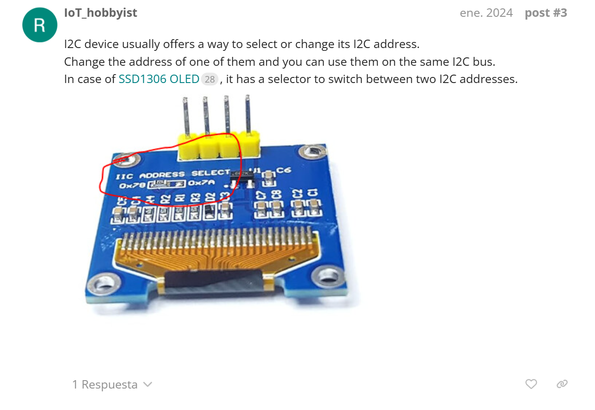
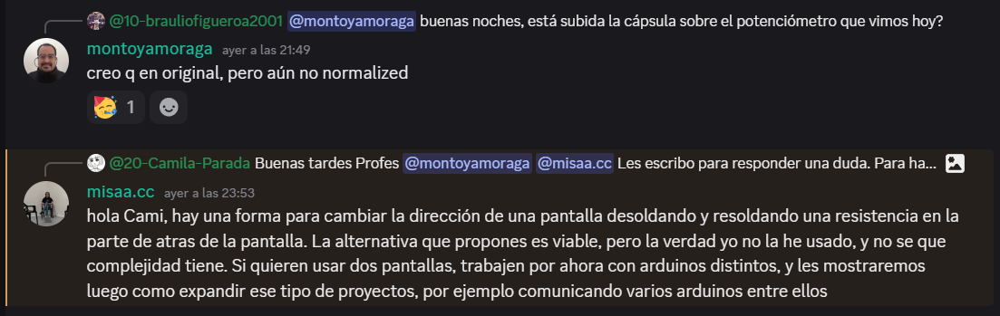

# ⋆₊˚⊹♡ Clase 04b - Trabajo en equipo ♡⊹˚₊⋆

Martes 26 Agosto 2025

***

## Observaciones

Este día consistió en poder definir qué proyecto queríamos montar con nuestro equipo, además de hacer la entrega de los materiales y otras cosas.

***

### Escaneo de bitácora y apuntes escritos del día

Tras hablar en equipo llegamos al consenso de que crearíamos un circuito que trabajara con dos pantallas oled, en la cuál una se mostraría una interface con texto y otra con imagen. Para ello decidí encargarme de averiguar sobre las conexiones necesarias para poder hacer ambas pantallas puedan funcionar conectadas al arduino y que procesen información distinta pero en paralelo.

Para comenzar quise indagar sobre videos explicativos donde presenten el circuito y los códigos para los módulos. Uno de los primeros videos que quise analizar fue ["Como CONTROLAR 2 o mas PANTALLAS LCD con un [ARDUINO]"](https://www.youtube.com/watch?v=Ej1_q4ogns0&ab_channel=NuevasTecnolog%C3%ADasJA) de ["Nuevas Tecnologías JA"](https://www.youtube.com/@nuevastecnologiasja). En este contenido se muestra la configuración y una simulación del circuito aplicado para pantallas de tipo LCD. Ello ayudó para

Tras sentirme disconforme comencé a buscar información más precisa sobre como hacer la interface física del montaje de los circuitos ["Connect Multiple OLED Displays With Arduino Nano (or any other board)"](https://www.youtube.com/watch?v=MO6hbQcX8fE&t=12s&ab_channel=TechWithRita). Este proyecto trabaja con 4 pantallas, por lo que me sirve de referencia para las conexiones. Al indagar destaco la importancia de un circuito integrado de tipo "Tca9548a", . Ello me dejó la duda de la necesidad de utilizar dicho módulo, por lo que continué investigando más sobre para entender cómo es que funciona esta la comunicación del I2C en el arduino.

Al consultar el sitio web de ["Programar fácil"](https://programarfacil.com/blog/arduino-blog/comunicacion-i2c-con-arduino/) pude comprender que esta tecnología es un estandar actual dentro de la industria, la cual involucra un "Controlador" (Master, quienes incian y coordinan la comunicación con las otras piezas) y una serie de "Componentes perifericos" (Slave, aquellos componentes que requieren de una señal para actuar, usualmente siendo sensores, actuadores o hasta microcontroladores).

Pese a los antecedentes, seguía sin poder entender e imaginarme la posibilidad de trabajar sin el adaptador "Tca9548a". Al consultar por el grupo del curso, el profesor Aarón me envió un link a un [foro de Arduino](https://forum.arduino.cc/t/arduino-uno-with-multiple-oled-displays/1207184/1) en donde explican más sobre como funcionan las pantallas que estamos usando.

▼ Captura de una parte del blog de arduino entregado por Aarón. Obtenido de: creación personal. 

Antes de mandarme un error que no pueda remediar decidí consultar cómo se realiza este procedimiento para dicho tipo de pantallas (considerando que son del tipo SSD1306). Terminé pillando este [otro foro de arduino](https://forum.arduino.cc/t/change-i2c-address-oled/991780/2) para seguir indagando sobre cómo cambiar la dirección del I2C de las pantallas entregadas. En dicho espacio virtual no llegué a una conclusión precisa dado que realizaban paralelismos un proyecto de un teclado. Más tarde, [Matías](https://github.com/misaaaaaa) me respondió, llevando a cabo una intervención del circuito de la pantalla.

▼ Captura al chat de discord. Obtenido de: creación personal.

Frente a esta situación tuvimos que replantearnos nuestra idea inicial, dado que al no poder tener dos pantallas conectadas solo teníamos la opción de usar 2 arduinos o tener 1 pantalla con el proyecto final. Terminamos por elegir la última de estas. 

En dicho caso me quise centrar en crear la interface para poder mostrar las piezas gráficas que diseñó mi compañera Camila. Antes de dar un paso tuve que seguir consultando para saber que hacer dado que me costó entender de si tendríamos animaciones o imágenes estáticas. Terminé optando por indagar sobre como poder mostrar contenido gráfico en movimiento. 
Tas averiguar y probar propuestas de varias páginas terminé dando con un video llamado ["https://www.youtube.com/watch?v=DPL4tOYMl44&ab_channel=KingKodes"](https://www.youtube.com/watch?v=DPL4tOYMl44&ab_channel=KingKodes).

***

### Posdata

Espacio para ideas y pensamientos varios ૮₍ ´ ꒳ `₎ა

***

°˖✧◝(⁰▿⁰)◜✧˖°
