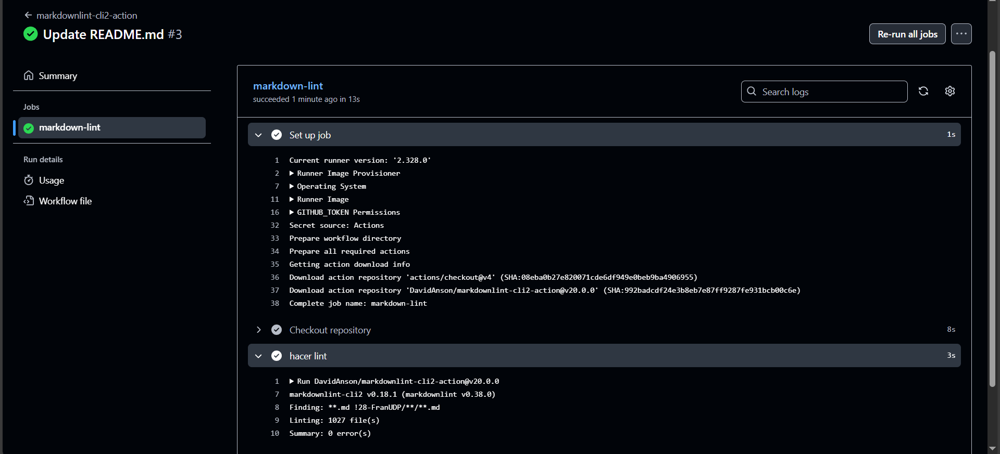
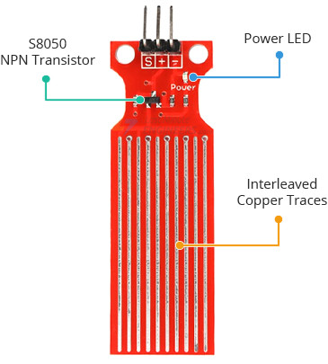
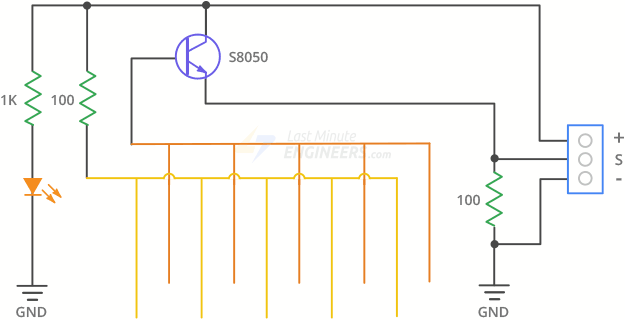
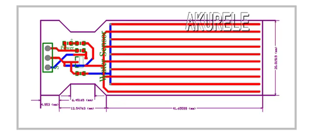
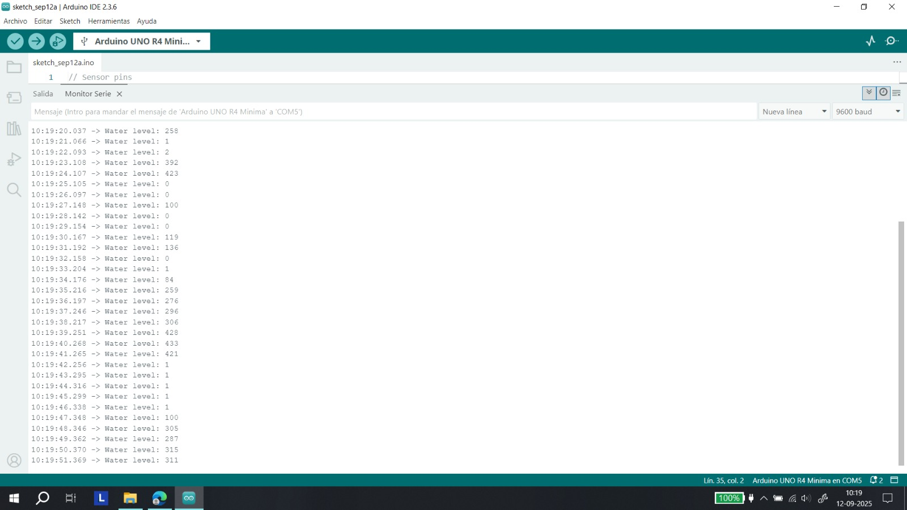

# ⋆₊˚⊹♡ Clase 06a - Lint hacker (Pelusas) y sensores ♡⊹˚₊⋆

Martes 9 Septiembre 2025

***

## Observaciones

Este día llegué tarde a la sala (16 min.) por lo que estaba en parte perdida.
Al preguntar al Fran me comentó que estaban viendo [Scratch](https://scratch.mit.edu/), que nos permite hacer OOP (Object-oriented programming o Programación orientada a objetos).

A la par se hablaron de forma superficial de otros software o programas como ["Touchdesigner"](https://youtu.be/-74dFi6jViQ?si=4BeW3M68PW1OzBnq) Y ["VVVV"](https://vvvv.org/).
A la par comenzamos a revisar la carpeta "Actions" dentro de la copia personal del repositorio del curso. Para ello se activo la opción para poder manejar los "flujos de trabajo" (workflows). Tras la activación nos dirigimos a la carperta ".github", para poder encontrar un archivo de tipo [YAML](https://es.wikipedia.org/wiki/YAML) y analizar en qué consiste.


▼ Recuperado de: https://github.com/Camila-Parada/dis8645-2025-02-procesos/blob/main/.github/workflows/markdown-lint.yml



▼ Recuperado de: https://github.com/Camila-Parada/dis8645-2025-02-procesos/actions/runs/17583174461/job/49944243470

A la par se fueron nombrando referencias de proyectos.

- https://en.wikipedia.org/wiki/LaTeX
- https://es.wikipedia.org/wiki/The_Art_of_Computer_Programming
- https://weavingxcoding.studio/
- https://es.overleaf.com/
- https://www.craftwork.today/work
- https://github.com/creativeinquiry

- Sensor Logger.

***

### Descubriendo sensores

En esta sección de la clase se nos presentaron algunos sensores de Arduino con los cuales podemos trabajar para el siguiente proyecto. Los profesores nos instaron a escoger uno (por equipo) y estudiarlo.

Personalmente quise escoger un sensor que mide la “presencia” de agua.

Este se compone de un transistor NPN ["J3Y"](https://www.alldatasheet.net/datasheet-pdf/view-marking/226239/BILIN/S8050.html), un mini led, una resistencia 102 (1k ohm) y dos resistencias 101 (100 ohm), además de un panel (que presenta varias líneas de un material conductor) que al entrar en contacto con líquidos arroja datos e información que se traduce a señales analógicas al Arduino.

Pese a intentar conseguir el “datasheet” (documento oficial del fabricante con toda la información de la pieza) solo pude recuperar el [manual de uso]( https://curtocircuito.com.br/datasheet/sensor/nivel_de_agua_analogico.pdf). En este se expone información básica como los usos, parámetros específicos e instrucciones para poder testear el producto.

De igual forma llegué a la conclusión de que no existe un documento completo puesto que no tiene un nombre oficial (k-0135, SL067), siendo más conocido como “Water Level Detection Sensor Module”.





▼ Recuperado de: https://lastminuteengineers.com/water-level-sensor-arduino-tutorial/



▼ Recuperado de: https://es.aliexpress.com/item/32763218957.html

Tras ello estuve indagando sobre como poder hacer funcionar dicho sensor. Por lo que pude averiguar, la mayoría de los proyectos están centrados en medir las cantidades de agua presente en un contenedor, puesto que el sensor arroja datos entre un intervalo de 0 a 520. Quise ponerlo a prueba, por lo que seguí las indicaciones de la página web ["Last minute engineers"](https://lastminuteengineers.com/water-level-sensor-arduino-tutorial/), en la que expone información importande sobre la pieza, su estructura, diagrama de construcción y funcionamiento, además de ejemplos de código.

Me puse manos a la obra, por lo que hice las conexiones como se indican ().
Tras ello copié el código a continuación y lo envié a arduino.

```cpp
// Sensor pins
#define sensorPower 7
#define sensorPin A0

// Value for storing water level
int val = 0;

void setup() {
  // Set D7 as an OUTPUT
  pinMode(sensorPower, OUTPUT);

  // Set to LOW so no power flows through the sensor
  digitalWrite(sensorPower, LOW);

  Serial.begin(9600);
}

void loop() {
  //get the reading from the function below and print it
  int level = readSensor();

  Serial.print("Water level: ");
  Serial.println(level);

  delay(1000);
}

//This is a function used to get the reading
int readSensor() {
  digitalWrite(sensorPower, HIGH);  // Turn the sensor ON
  delay(10);                        // wait 10 milliseconds
  val = analogRead(sensorPin);      // Read the analog value form sensor
  digitalWrite(sensorPower, LOW);   // Turn the sensor OFF
  return val;                       // send current reading
}
```

Al haber hecho funcionar todo el dispositivo sólo debí revisar la información del "Monitor serial", en el que cada 1 segundo se va actualizando, por lo que me dispuse a probar la sensibilidad para entender el la sensibilidad del sensor.




***

### Posdata

Hoy estoy un poco bajoneada, pero sin razón aparente.

***

°˖✧◝(⁰▿⁰)◜✧˖°
