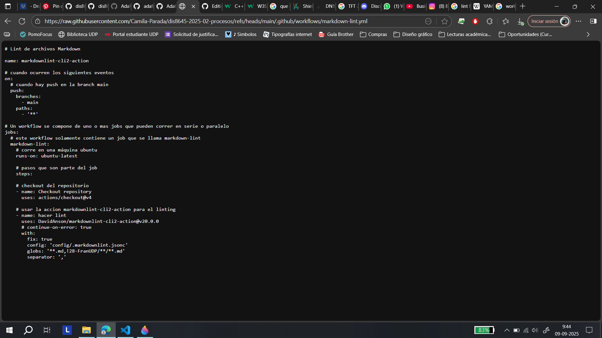

# ⋆₊˚⊹♡ Clase 06a - Meta "clases" y más "clases" ♡⊹˚₊⋆

Martes 9 Septiembre 2025

***

## Observaciones

Este día llegué tarde a la sala (16 min.) por lo que estaba en parte perdida.
Al preguntar al Fran me comentó que estaban viendo [Scratch](https://scratch.mit.edu/), que nos permite hacer OOP (Object-oriented programming o Programación orientada a objetos).

A la par se hablaron de forma superficial de otros software o programas como ["Touchdesigner"](https://youtu.be/-74dFi6jViQ?si=4BeW3M68PW1OzBnq) Y ["VVVV"](https://vvvv.org/).
A la par comenzamos a revisar la carpeta "Actions" dentro de la copia personal del repositorio del curso. Para ello se activo la opción para poder manejar los "flujos de trabajo" (workflows). Tras la activación nos dirigimos a la carperta ".github", para poder encontrar un archivo de tipo [YAML](https://es.wikipedia.org/wiki/YAML) y analizar en qué consiste.

- Recuperado de: https://github.com/Camila-Parada/dis8645-2025-02-procesos/blob/main/.github/workflows/markdown-lint.yml

***

### Apuntes escritos del día

***

### Posdata

Hoy estoy un poco bajoneada, pero sin razón aparente.

***

°˖✧◝(⁰▿⁰)◜✧˖°
