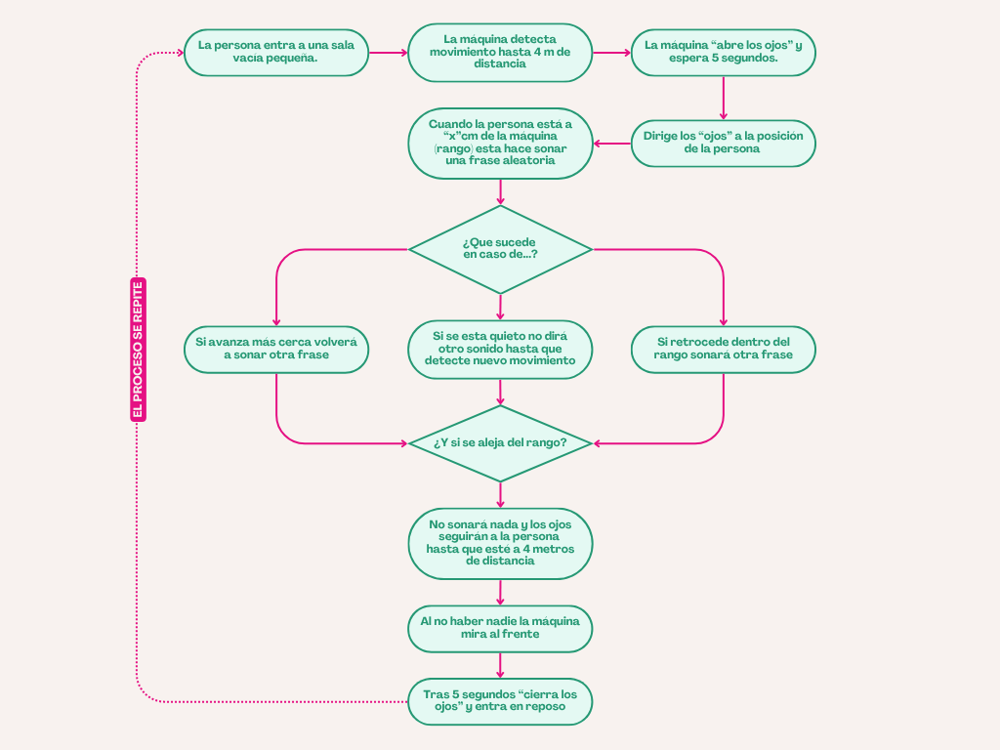

# ⋆₊˚⊹♡ Clase 08b - ... ♡⊹˚₊⋆

Viernes 26 Septiembre 2025

***

## Observaciones

Comenzamos hablando sobre la búsqueda de personas para la comisión del taller. Quien ha sido seleccionada del momento es ["Cynthia Shuffer"](https://www.diplomadosidea.usach.cl/dra-cynthia-shuffer). Además de aquello hablamos sobre los depósitos que se han efectuado, de los cuales 2 han ido a otra cuenta (corriente).
Tras ello comenzamos indagando sobre el ["Sensor eltrasonico hcsr04"](https://afel.cl/products/sensor-de-ultrasonico-hc-sr04), por lo que busqué el [datasheet](https://www.alldatasheet.com/html-pdf/1132204/ETC2/HCSR04/110/1/HCSR04.html) de dicha pieza.

Tras aquello siguieron nombrando referentes.
El verano suena distinto al invierno (sensibilidad del sensor a la temperatura, ambiente, etc.)

***

### encargo-14: Diagrama de flujo

"Cada persona del grupo debe implementar en diagrama de flujo dibujado o con la herramienta Mermaid.js con sus propias palabras y subirlo a su README."

Para este encargo sentí que pude haber usado varias herramientas, pero por comodidad y tiempo preferí diseñar a partir de una plantilla realizada en la plataforma [canva](https://www.canva.com/). Ello me guía en cuanto a comprender la estructura del mapa conceptual. A continuación decidí ordenar de forma estructurada una serie de pasos a seguir en un archivo de [word](./archivos/estructura-diagrama-flujo.docx), considerando el funcionamiento de esta caja negra.

-> Recuperado de: https://www.canva.com/design/DAG0Z4T4Wy4/x6DTRQf74DANGTeb7JGsUA/edit

***

### encargo-15: Estudio sobre los sensores a usar

"Cada persona del grupo debe subir a su README: documentar funcionamiento de sus sensores, incluyendo instrucciones de conexión y de configuración, subir el proyecto entero de arduino como carpeta, tiene que poder compilar sin problema y mostrar en consola los datos de los sensores."

#### [Sensor Ultrasonico HC-SR04](https://afel.cl/products/sensor-de-ultrasonico-hc-sr04?srsltid=AfmBOorH4IZiP9GI9Gb_L3xh13v08ZMh72sbK5VnQ0yme40VD8mGXXGl)

Puede medir una distancia entre 

***

## Aprendiendo más sobre el "Servomotor S90"

https://github.com/ManlyMorgan/Animatronic-Eye/blob/main/03_calibration/calibration/calibration.ino

https://www.instructables.com/Animatronic-Eyes-Double-and-Single-Fully-3D-Printe/

***

## Aprendiendo más sobre el ["DFPlayer Mini"](https://afel.cl/products/modulo-reproductor-mp3-dfplayer-mini)

https://wolles-elektronikkiste.de/en/arduino-controlled-dfplayer-mini

***

### Posdata

...

***

°˖✧◝(⁰▿⁰)◜✧˖°
