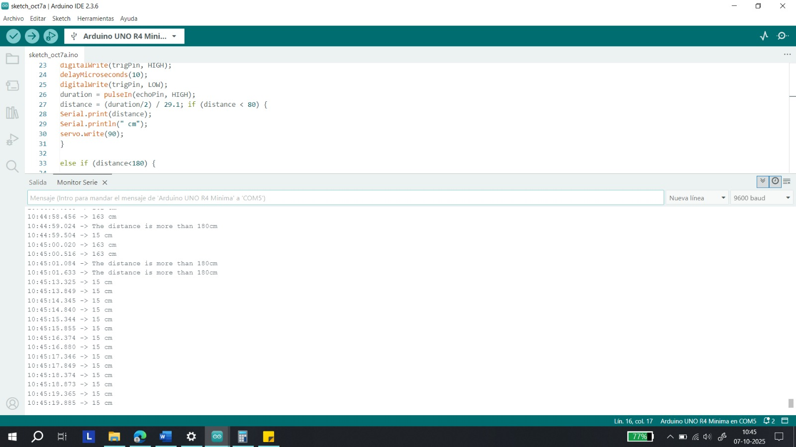

# ⋆₊˚⊹♡ Clase 09a - Más pasos de hormiga ♡⊹˚₊⋆

Martes 7 Octubre 2025

***

## Observaciones

Esta clase fue nuevamente bastante libre, por lo que sólamente se ha encargado de cotinuar las labores de trabajo de la semana pasada. El día anterior consulté para poder saber cómo se encontraba el equipo y en qué parte del proyecto se encontraban desarrollando. Al no recibir mucho feed es que decidí centrarme en continuar estudiando los servo sg90 y su código-funcionamiento.

Cómo mencioné en la sesión anterior ([08a](https://github.com/Camila-Parada/dis8645-2025-02-procesos/blob/main/20-Camila-Parada/sesion-08a/README.md)) es que logré hacer funcionar el servomotor con los pines digitales, y puesto que estos son los que más abundan dentro de la placa es que consideré buena idea utilizarlos (8 a 13, un total de 6 pines). Tras haber expuesto un poco de lo que estuve haciendo me dispuse a montar nuevamente todo en el ojo, y a establecer nuevos parametros para funcionar en un rango sin que se deformen los alambres. De ello quedó un registro visual del código, cuyos parametros de ubicación inicial del servo quedaron a 40 grados y los de ubicación final fueron calculado para quedar en 140. La velocidad se cambió a 5 y dio el siguiente resultado. 

https://github.com/user-attachments/assets/68464e3d-3e82-48ef-8fba-76288e9cbcbf

-> Agradecimientos a [Mateo Arce](https://github.com/matbutom/) por grabar. Recuperado de: https://github.com/Camila-Parada/dis8645-2025-02-procesos/blob/main/20-Camila-Parada/sesion-09a/video/IMG_0664.mp4

Tras ello empecé a revisar que investigaciones habían efectuado mis colegas, y pues al momento de ver el sensor de ultrasonido se me ocurrió el poder estudiar y probar un código que tuviera ambas partes funcionando, por lo que llegué al proyecto ["Controlling a Servo With an Ultrasonic Sensor"](https://www.instructables.com/Controlling-a-Servo-With-an-Ultrasonic-Sensor-Usin/). Inmediatmente lo quise poner a prueba para registrar su funcionamiento.

``` cpp

#include <Servo.h>
#define trigPin 10
#define echoPin 9

Servo servo;
int sound = 250;

void setup() {
Serial.begin (9600);
pinMode(trigPin, OUTPUT);
pinMode(echoPin, INPUT);
servo.attach(8);
}

void loop() {
long duration, distance;
digitalWrite(trigPin, LOW);
delayMicroseconds(2);
digitalWrite(trigPin, HIGH);
delayMicroseconds(10);
digitalWrite(trigPin, LOW);
duration = pulseIn(echoPin, HIGH);
distance = (duration/2) / 29.1; if (distance < 80) {
Serial.print(distance);
Serial.println(" cm");
servo.write(90);
}

else if (distance<180) {
Serial.print(distance);
Serial.println(" cm");
servo.write(180); }

else {
Serial.println("The distance is more than 180cm");
}
delay(500);
}

```

Por un lado el monitor serial se encontraba recopilando información de forma constante del ultrasónico, siendo en este caso la distancia aproximada en un intervalo desde 0 a 180 cm aprox. Al estar a un valor mayor 180 cm arrojaba el mensaje "The distance is more than 180cm".



-> Recuperado de: recurso propio - captura de pantalla.

https://github.com/user-attachments/assets/bb8fd83a-d103-41ac-b32a-aa0292ccc904

-> Recuperado de: https://github.com/Camila-Parada/dis8645-2025-02-procesos/blob/main/20-Camila-Parada/sesion-09a/video/IMG_0665.mp4

Por otra parte, el resto del equipo se encontraba trabajando con código o con el reproductor mp3. En un punto de la clase el profesor Aarón vino a nuestra mesa para revisar temas en torno a la programación, por lo que se retiraron algunas personas para entender mejor que es lo que haría el profesor.
Al no ir me perdí de ello, pero cuando revise los archivos que subió ([estos](https://github.com/disenoUDP/dis8645-2025-02-procesos/tree/main/00-docentes/sesion-09a/grupo-04)) le haré sus respectivas preguntas.

Al casi terminar la clase es que alcancé a registrar mediante video un avance que había realizado [FranUDP](https://github.com/FranUDP).

https://github.com/user-attachments/assets/28265e54-b8d4-4848-bed8-9a7f427a4a65

-> Recuperado de: https://github.com/Camila-Parada/dis8645-2025-02-procesos/blob/main/20-Camila-Parada/sesion-09a/video/IMG_0666.mp4

***

### Posdata

Se me está haciendo costumbre estar cansada, como que la vida privada y el trabajo me están agotando y me cuesta mantener el ritmo.
Estoy intentando esforzarme lo más que puedo... me da miedo que mi mente no lo soporte.
Se que nadie me fuerza. Mis ansias de ser más.

***

°˖✧◝(⁰ ^ ⁰)◜✧˖°
