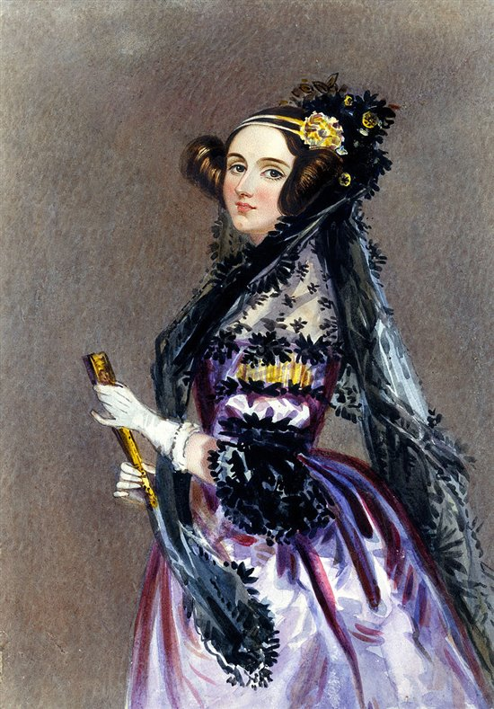
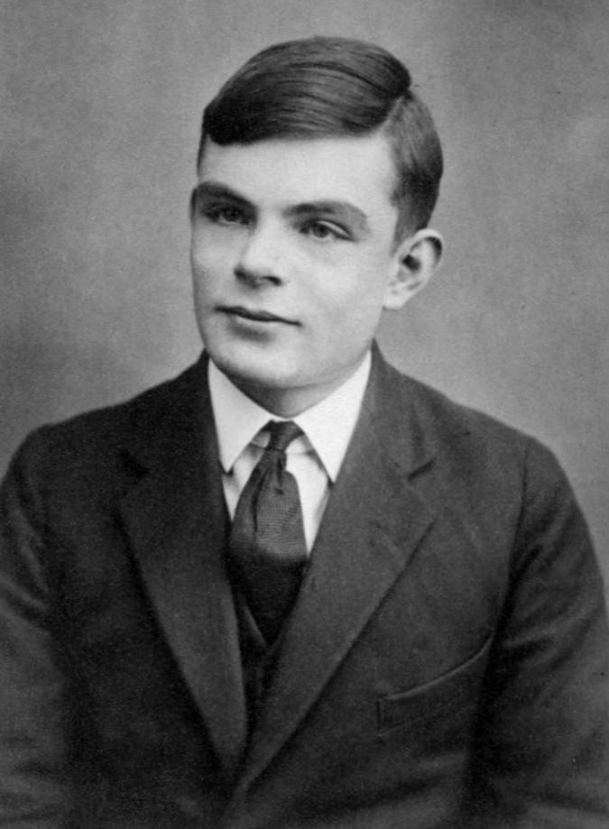

# sesion-01a

## Encargo

### Alan Turing
Alan Turing fue un genio que marcó un antes y un después en la historia. Desde muy joven mostró un talento increíble para las matemáticas y la ciencia; a los 16 años ya entendía y cuestionaba teorías de Einstein. En la universidad desarrolló ideas que se adelantaron a su tiempo, como la Máquina de Turing, que sentó las bases de la computación moderna.

Su mayor aporte llegó durante la Segunda Guerra Mundial, cuando trabajó en Bletchley Park para descifrar los códigos de la máquina Enigma utilizada por los nazis. Gracias a su trabajo y al de su equipo, se logró reducir la duración de la guerra y salvar millones de vidas. Ese logro convirtió a Turing en un héroe, aunque durante mucho tiempo no se le reconoció como tal.

Después de la guerra, continuó innovando en el campo de la computación y planteó el famoso Test de Turing, con el que introdujo una forma de pensar sobre la inteligencia artificial que sigue siendo vigente hasta hoy.

A pesar de sus grandes aportes, su vida estuvo marcada por la discriminación. En 1952 fue condenado por ser homosexual, lo que en ese entonces era ilegal en Gran Bretaña. Para evitar la cárcel, fue sometido a un tratamiento forzoso que afectó gravemente su salud. Murió en 1954 en circunstancias poco claras, y recién décadas más tarde recibió un perdón oficial y el reconocimiento que merecía.

Fuentes: 
https://www.lavanguardia.com/internacional/20250821/10991577/xi-jinping-celebra-progreso-region-autonoma-tibet-60-aniversario.html
https://historia.nationalgeographic.com.es/a/alan-turing-arma-secreta-aliados_16352

### Ada Lovelace
Ada Lovelace fue una mujer adelantada a su época y es recordada como la primera persona en crear un algoritmo para una máquina. Nació en 1815, hija del poeta Lord Byron, pero su vida tomó un rumbo totalmente distinto: desde chica se interesó por las matemáticas y la ciencia.

Cuando conoció a Charles Babbage, se fascinó con sus ideas sobre máquinas de cálculo. Lo impresionante es que Ada no solo entendió esos proyectos, sino que fue más allá: imaginó que esas máquinas podían trabajar con símbolos y no solo con números. Esa visión es lo que la convierte en pionera de la computación.

En 1843 publicó sus famosas Notas, donde explicó cómo programar la máquina analítica de Babbage. Ahí incluyó lo que muchos consideran el primer programa de la historia y hasta habló de conceptos que usamos hoy, como los bucles.

Lamentablemente, su vida fue corta: murió a los 36 años por un cáncer de útero. Sin embargo, su legado sigue vivo. Hoy se la reconoce como la primera programadora de la historia, y hasta un lenguaje de programación, ADA, lleva su nombre. Además, cada año se celebra el Ada Lovelace Day para destacar el aporte de las mujeres en la ciencia y la tecnología.

Fuentes: 
https://www.britannica.com/biography/Ada-Lovelace
https://historia.nationalgeographic.com.es/a/ada-lovelace-visionaria-hija-lord-byron_15864
