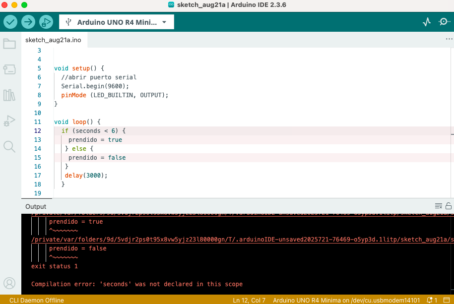
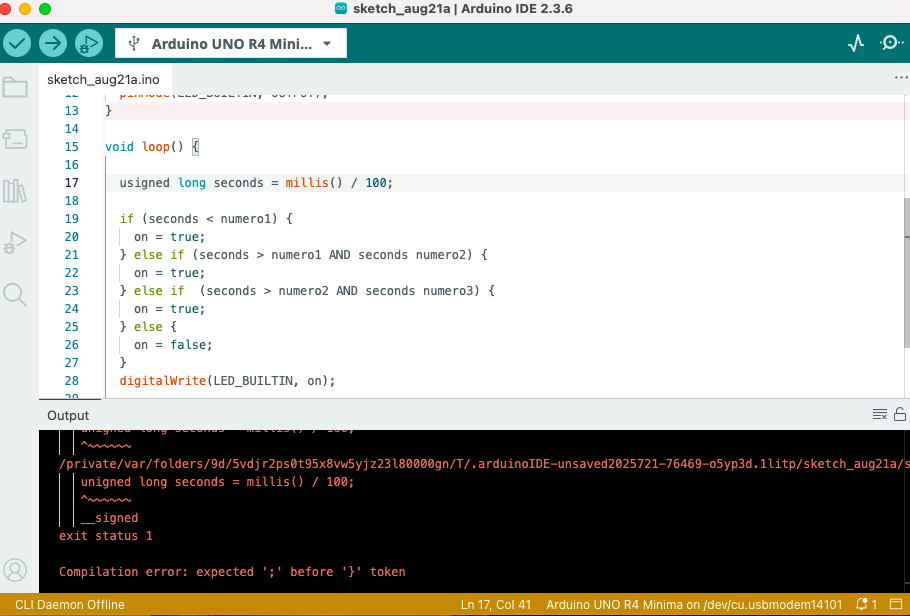
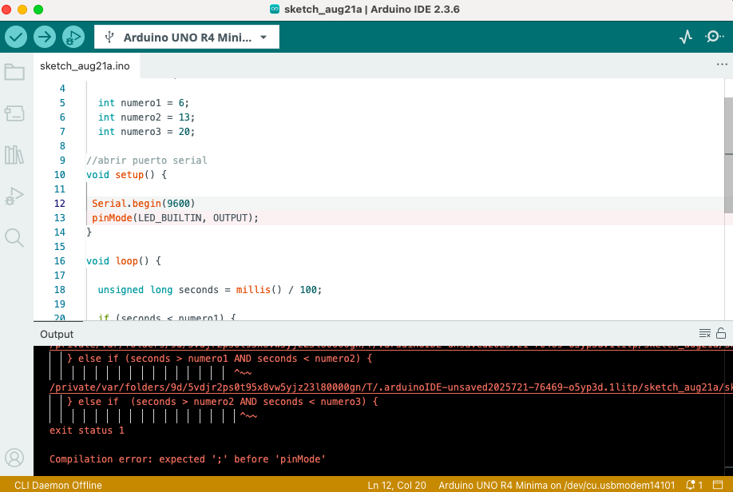
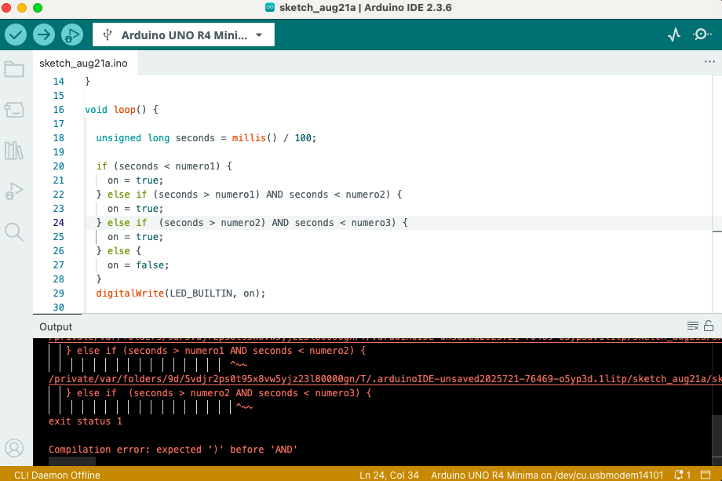
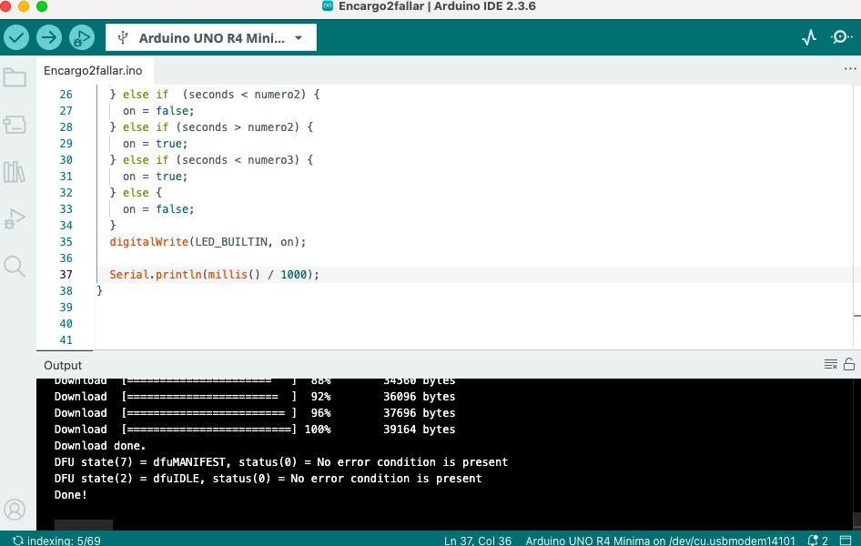

# sesion-01b

## Apuntes videos

int numeros enteros

float numeros decimales

char un carácter  ‘

String colección de caracteres uno tras otro “

“=“ no conmutativo, el lugar en la memoria que se llama como el que esta a la izq, adentro de eso vive el valor de la derecha.

notación camello “usar mayúscula entre palabras”

Serial. (adentro)

funcion debe tener ()

“;” fin de las lineas

\n enter

Declaracion: tipoDeDato nombreDeFantasiaUnico;

Funciones: así();

Variables: así = 7;

## Encargo



No declaré "seconds"



Escribí mal "unsigned long" entonces no le lo leyó bien



Olvidé poner ";" en "Serial.begin(9600)"



No supe ocupar realmente el AND



Arregladoo! :

```cpp
// se inicia boleana en falso
bool on = false;

// declarar numeros
  int numero1 = 6;
  int numero2 = 13;
  int numero3 = 22;

//abrir puerto serial
void setup() { 
  
 Serial.begin(9600);
 pinMode(LED_BUILTIN, OUTPUT);
}

void loop() {

  unsigned long seconds = millis() / 1000;

  // se comienza prendido y entre numeros se apaga
  if (seconds < numero1) {
    on = true;
  } else if (seconds > numero1) {
    on = false;
  } else if  (seconds < numero2) {
    on = false;
  } else if (seconds > numero2) {
    on = true;
  } else if (seconds < numero3) {
    on = true;
  } else {
    on = false;
  }
  digitalWrite(LED_BUILTIN, on);

  Serial.println(millis() / 1000);
}
```

