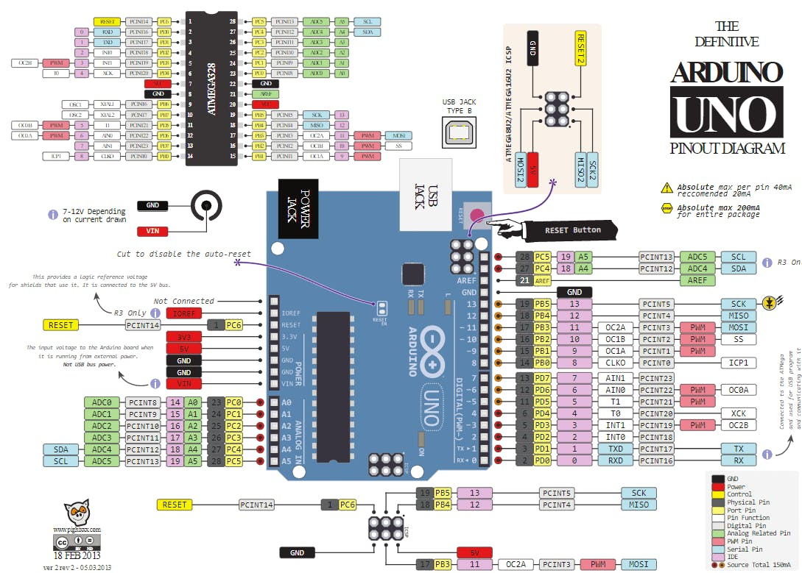

# sesion-03a
### Cómo poner imágenes en github:

### Pantallas y pixeles
Nos importa la resolucion, el tamaño y el chip.

Referentes:
>https://www.artesmediales.uchile.cl/academico/daniel-cruz/
>https://arteymedios.org/daniel-cruz/
Charla: >https://www.nucleofair.org/agenda/coloquio-posthumanamente-hablando-ii/

### Encargo
Navegador de poemas
Si ocupo un codigo base de ejemplo, documentar en encargo y separar lo que es del ejemplo y que hice yo.
Robar, modificar y citar.

Plataforma: >https://www.tinkercad.com/<

*Protocolo I2c* (4 puntos de conexión)
Nos permite con menos hardware conectar distintos dispositivos en paralelo.
Comunicación síncrona
Nos simplica las formas de conectar las cosas entre sí.
*4 cables* :
*gnd: El de tierra (verde), 0 volts, de acá comenzamos a contar los voltajes.
*vcc: Voltaje de alimentación. SV
*scl: Cl es Clock- Signal clock
*sda: Datos
Pantalla no recive información, la emite.
*unsigned (u)

Si queremos queremos expandir nuestro arduino: Libraries

Entrevista: 
>https://github.com/readme/stories/limor-fried<

Esos números son hexadecimales que significan otras cosas en binario
0x3C = 0111100
0x3D = 0111101
Solamente un elemento por dirección.

Cuestionarse y entender limites materiales.
>https://www.wolframalpha.com/<

Para poner imagenes:
>https://javl.github.io/image2cpp/<
Transformar a bytes, importante la resolución.
pegar en codigo, antes de setup
cons unsigned char (name) [] PROQNEM = {

Poema
String linea(nº)

dentro de setup:
linea(nº)= que dice

[] para decir el lugar
ejemplo: https://docs.arduino.cc/language-reference/en/variables/data-types/string/

array: arreglo - Arreglo pared, variable ladrillos.
For: Para secuencia.
