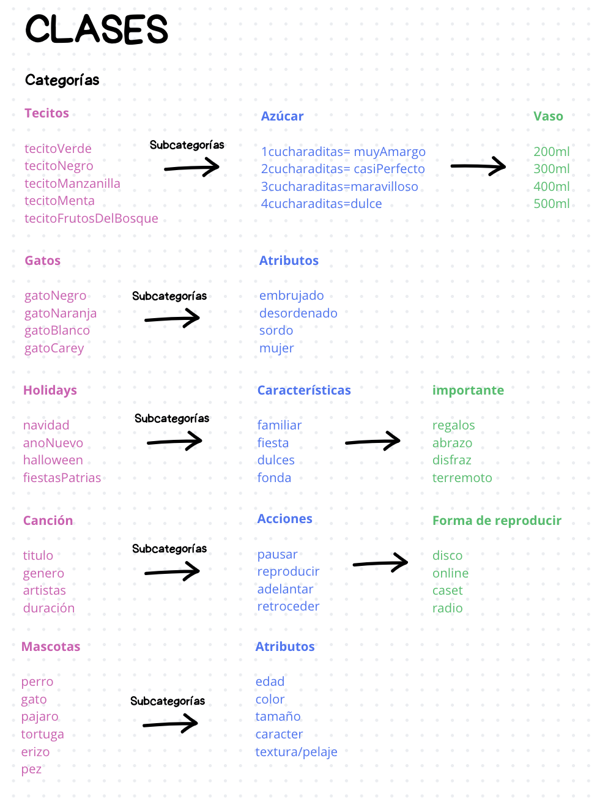

# sesion-05b 
## 05.09.24

+ Buscar nuestro rango en todo.

+ #include "<>" Búscalo en el computador donde sea que exista.
+ Archivo ".h" Se espicifican las posibilidades que hay. ¿Qué es lo que existe?/Prometo
+ Archivo ".cpp" donde nos encargamos que las cosas ocurran. ¿Cómo se hace?/Me hago cargo

+ "_arm_" Computadores chiquitos (celulares, etc)
+ "GFX" Biblioteca para hacer Gráficas. Clase abstracta y genérica.

**C++ Tutorial**
<https://www.w3schools.com/cpp/default.asp>

### En clases

Se usan cuando queremos crear estructuras de datos que no nos caben en los bloques fundamentales que vienen en un lenguaje de programación.
Si quiero tener la complejidad de darle mas detalles, info y funciones a mis carácteres.

+ Atributos son variables
+ Métodos son funciones
+ "Jig" Hrramienta hecha por mi que me ayuda a hacer cosas

  ## Planificación
  1 clase de texto en general
  1 clase que herede de texto, que sea poema
  
  + todos los poemas son textos pero no todos los textos son poemas
    
  1 clase que contenga un pixel  art en magen
  1 clase que herede de pixel art, que sea una colección de imágenes relacionadas, un array.

  + EL _Constructor_ y el _Destructor_ se llama exactamente igual que la clase.
    
 
  + Esqueleto para Archivo.h
    
    ```cpp
    #ifndef TEXTO_H
    #define TEXTO_H
    
    class Texto {
    
    //Constructor
    Texto();

    //Destructor
    ~Texto();
    
    };
    #endif
    ```
  + Esqueleto para otro Archivo.h
  
    ```cpp
    #ifndef POEMAPARRA_H
    #define POEMAPARRA_H

    #include "texto.h"
    
    class PoemaParra : public Poema
    {
    public:
    //Constructor
    PoemaParra();

    //Destructor
    ~PoemaParra();

    };
    #endif
    ```
    + TODOS LOS TEXTOS TIENEN UN _TIPO_ - topografía
    + Pueden tener una _dirección_ - bool
    + Puede usar _tinta_ - tinta
    + Tendrán una autoría - autora
   
    + En el contexto de cpp se usa solo _true or false_
      
+ Planificar Clases!
  Conjunto
  subconjunto
  que valores tiene
  etc.
    
### Ejercicio en clases "dibujar y escribir clases y subclases"



## Encargo
+ Escuchar primer disco de banda primus
+ ver alguna charla de Mitsh Resnick: Comentarios de él.


  
