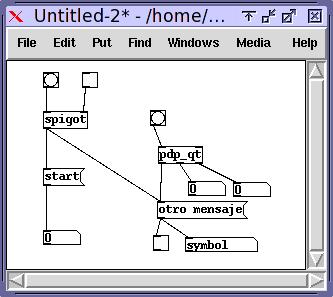

# sesion-06a

## 09.09.23
SCRATCH
<https://scratch.mit.edu/>
+ Software para primer acercamiento a la programación, especialmente para niños, usando bloques de programación sin tener la necesidad de escribir.
  
### Miller Pucket
+ trabaja generalmente en San Diego, vintage 1959, profesor del centro de investigación de computación y las artes.
+ Según wikipedia: Pofesor de música en la Universidad de California, San Diego , donde ha estado desde 1994. Puckette es conocido por ser el autor de Max , un entorno de desarrollo gráfico para música y síntesis multimedia , que desarrolló mientras trabajaba en IRCAM a fines de la década de 1980. También es el autor de **Pure Data** (Pd), una plataforma de ejecución en tiempo real para audio, video y lenguaje de programación gráfica para la creación de música informática interactiva y obras multimedia, escrita en la década de 1990 con aportes de muchos otros en las comunidades de música informática y software libre.

### Softwares de programación
+ **PURE DATA** Programado en C++, usa clases. Según wikipedia: Pure Data (o Pd) es un lenguaje de programación visual desarrollado por Miller Puckette durante los años 90 para la creación de música por ordenador interactiva y obras multimedia. Aunque Puckette es el principal autor del software, Pd es un proyecto de código abierto y tiene una gran base de desarrolladores trabajando en nuevas extensiones al programa. Está publicado bajo una licencia similar a la licencia BSD.
  
  

+ Programación en estado objetos, programo objetos que conversan, no frases.
  
+ **TouchDesigner** Según derivative.ca: TouchDesigner es un producto de software de Derivative (Toronto y Los Ángeles) que se utiliza para crear aplicaciones interactivas 3D y 2D. Es procedimental, basado en nodos, en tiempo real y se considera un lenguaje de programación visual.

+ **IsadoraSoftware** Según hybridart.net: Isadora es software disponible para macOSX y para Windows, que actualmente está por la versión 3.0 recientemente estrenada. Una plataforma de reproducción de medios interactivos que combina un entorno de programación visual con un potente motor de procesamiento de video y audio. La propia filosofía del software hace que dispongamos de increíbles recursos que se han ido adaptando a las tecnologías emergentes. Creado a mediados de los 80 por Mark Coniglio.

+ **LaTeX** Se usa para hacer typesetting. Según Gemini: Es un sistema de composición tipográfica y procesador de textos, creado por Leslie Lamport en 1984, que se utiliza para producir documentos de alta calidad, especialmente en los campos científicos y técnicos. Funciona mediante un lenguaje de marcado que permite describir la estructura del documento en lugar de su apariencia, centrándose en el contenido y delegando la parte visual a un compilador que genera un archivo de salida. Al ser software libre, es gratuito, de código abierto y multiplataforma.
+ **overleaf** es LAteX pero en la nube. <https://es.overleaf.com/>

### lint
+ Según Gemini: "linting" es el proceso de verificar automáticamente el código fuente para encontrar errores y malas prácticas de programación. Las herramientas de linter (como linters para C# como StyleCop.Analyzers) ayudan a los desarrolladores a escribir código de mayor calidad.
+ **Detección automática de errores:** Los linters analizan tu código para encontrar posibles errores, fallos y áreas problemáticas antes de que se ejecute.
+ **Estándares de codificación:** Ayudan a mantener la consistencia del código aplicando estándares de estilo y buenas prácticas de programación.
+ **Mejora de la calidad del código:** Al identificar y sugerir correcciones para problemas de estilo y posibles errores, el linter mejora la legibilidad y la mantenibilidad del código.

### WorkFlow: 
+ Link de archivos markdown: Carpeta ".github/workflows", archivo "markdown-lint.yml".
+ **"archivo.ylm":** Según Gemini: Un archivo .yml o .yaml contiene datos serializados en un formato legible por humanos, utilizado principalmente para archivos de configuración en DevOps, intercambio de datos y para gestionar la localización de traducciones. Se caracteriza por una sintaxis simple y legible, que utiliza sangría de espacios (no tabulaciones) para estructurar datos y comentarios que comienzan con el símbolo #.
+ LINT: DESPELUZAMIENTO
+ **main** es el software para que la gente lo use, **branch** (sapea los errores) está oculta del público.
+ Se compone de uno o mas "jobs"

  ```cpp
  # Lint de archivos Markdown

  name: markdownlint-cli2-action

  # cuando ocurren los siguientes eventos
  on:
  # cuando hay push en la branch main
  push:
    branches: ## SAPEA LOS ERRORES/OCULTO AL PÚBLICO
      - main ##PARA QUE LA GENTE LO USE
    paths:
      - '**'

  # Un workflow se compone de uno o mas jobs que pueden correr en serie o paralelo
  jobs:
  # este workflow solamente contiene un job que se llama markdown-lint
  markdown-lint:
    # corre en una máquina ubuntu
  
    # DEJA EL UBUNTU Y DAME EL MÁS RECIENTE
    runs-on: ubuntu-latest
    

    # pasos que son parte del job
    steps:
  
    #BAJA UN REPOSITORIO
    # checkout del repositorio
    - name: Checkout repository
      uses: actions/checkout@v4
  
    #HACE LINT
    # usar la accion markdownlint-cli2-action para el linting
    - name: hacer lint
      uses: DavidAnson/markdownlint-cli2-action@v20.0.0
      # continue-on-error: true
      with:
    #HAZLO EN TODOS MENOS EN FRANUDP
        fix: true
        config: 'config/.markdownlint.jsonc'
        globs: '**.md,!28-FranUDP/**/**.md'
        separator: ','

        ```
+ REVISA TODOS LOS ARCHIVOS MARKDOWN Y COLECTA TODOS LOS ERRORES QUE ENCUENTRE
  
+ **Arduino en Github.** Si usamos bibliotecas que arduino no tiene, le decimos "cada vez que corras esto baja temporalmente esta biblioteca"
+ Proxima entrega: acercamiento a estos mensajes  y automatizaciones. <https://github.com/Arduino>
+ "utf8" Usar "ñ" y tíldes.

+ **Creative Inquiry** La "investigación creativa" es un proceso de exploración intelectual y artística que se enfoca en la generación de nuevo conocimiento a través de la curiosidad, el cuestionamiento y la colaboración interdisciplinaria, en lugar de la mera reproducción de información existente.

#### Entrega proyecto 02 - 17.10.23
+ La máquina que saluda, si está lejos invitarte y cuando te acercas cambia su comportamiento.
+ ¿Cómo se detecta la presencia humana?
+ Por ejemplo usamos un sensor que lanza un az de luz y luego vuelve
+ "si la persona está a "x" distancia haz "x"
+ Hecho con clase - Máquina saludadora.
+ NADA PUEDE ESTAR AL AZAR.

+ <https://afel.cl/?utm_term=&utm_campaign=%40+Campa%C3%B1a+Inteligente+Display&utm_source=adwords&utm_medium=ppc&hsa_acc=1808722794&hsa_cam=11192697983&hsa_grp=&hsa_ad=&hsa_src=x&hsa_tgt=&hsa_kw=&hsa_mt=&hsa_net=adwords&hsa_ver=3&gad_source=1&gad_campaignid=21510966891&gbraid=0AAAAADBMsFTqaXFnAaRCBzwNfYDPlDfVI&gclid=Cj0KCQjwoP_FBhDFARIsANPG24NEQwG6zEmLpiTT2WY7xQBcPjUeFlB3YhZzInqOnQmm-mXgQvpcXI4aAkJSEALw_wcB>

+ **Caja negra** Tiene una entrada y una salida, Máquinas que recibirán un imput (sensor) y responderán de alguna manera (output)(actuador: Luz, movimiento y sonido).
+ **Leer** capítulo 3 <https://monoskop.org/images/8/8d/Flusser_Vilem_Hacia_una_filosofia_de_la_fotografia.pdf>.

#### Sensores disponibles
+ **Ultrasónico:** Emitiendo un sonido ultrasónico y detecta cuanto se demora en volver, esto detecta la distancia. Sonido: 350 mtrs x seg.
+ **Temperatura y humedad:** Mejor para ambiente.
+ **Dióxido de carbono**
+ **Encoder rotatorio**:Parecido al potenciómetro pero no tiene límite. Tiene click.
+ **Sensores de humedad**
+ **Sensor de lluvia**: Detecta gotitas de agua. Sensor pasivo que no requiere energía interna.
+ **Joystik**
+ **Luz**: Fotodiodo (Según gemini: Un fotodiodo funciona captando fotones de luz y convirtiéndolos en una corriente eléctrica, basándose en el efecto fotoeléctrico)
+ **Sonido**: Micrófono, para medir intensidad de sonido.

#### Encargo proyecto 02
+ Descubriendo el sensor de sonido (micrófono)
+ Lo conecté de esta manera a ARDUINO:
+ GND - GND
+ VCC - 5V
+ SIG - A0
  


+ Ocupé esta página: <https://www.murkyrobot.com/guias/sensores/ky-038> para mi primer acercamiento
+ Esta me sirvió para entender como conectarlo y como funciona.

+ Para probarlo ocupé este código:
+ Éste lo daba la página y el propósito era prender el LED si el sensor de micrófono detectaba un sonido y apagarlo en caso contrario.
  
  ```cpp
  const int pinLED = 13;
  const int pinMicrophone = 9;
 
  void setup ()
  {
  pinMode (pinLED, OUTPUT);
  pinMode (pinMicrophone, INPUT);
  }
 
  void loop ()
  {
  bool soundDetected = digitalRead(pinMicrophone);
  if (soundDetected)
  {
    digitalWrite (pinLED, HIGH);
    delay(1000);
  }
  else
  {
    digitalWrite (pinLED, LOW);
    delay(10);
  }
  }
  ```
  Este código hizo que el led prendiera pero no estoy segura si funcionaba con el sonido ya que no podia dejar la sala en completo silencio.

  + Otra página útil: <https://cursos.mcielectronics.cl/2022/12/27/interfaz-del-sensor-de-sonido-con-arduino-y-dispositivos-de-control-con-una-palmada/>

     

    + Otro sitio de referente: <https://www.luisllamas.es/detectar-sonido-con-arduino-y-microfono-ky-038/>

#### Tres ideas
+ **1- El guardia nocturno:** Con sensor de luz.
+ Cuando hay luz (día): LED verde encendido fijo.
+ Cuando se apaga la luz (noche): prende un LED rojo intermintente y dice “¿Quién anda ahí?” o cosas por el estilo.

+ **2- Sueño dramático:** Sensor de luz + pantallita
+ Si hay mucha luz: en la pantalla LCD aparece “No puedo dormir” y un LED rojo prende.
+ Si hay penumbra: mensaje “ahora sí, buenas noches" con LED azul.
+ //O algo parecido pero con un parlante en vez de pantallita, que diga no puedo dormir y luego haga el típico sonido de soñando//

+ **3- El Arduino indeciso:** Sensor ultrasónico + pantalita.
+ Si la máquina está quieta: en la pantalla aparece un mensaje de “Pregúntame algo…”.
+ Cuando la agitas: genera una respuesta y la muestra en la pantallita.
+ Ejemplos:
+ “Sí, dale loco.”
+ “Eri wn o te haci?.”
+ “igual puede ser…”
+ "No sé, pregunta más tarde.”

+ **4- La vela mágica:** Sensor de micrófono + LED.
+ LED parpadea amarillo como fuego.
+ Si soplas fuerte en el microfono: LED se apaga.
+ Si aplaudes dos veces: LED vuelve a encender.

  #### Referentes
  + <https://www.youtube.com/shorts/IxwlgXyNRds>
  + <https://www.youtube.com/shorts/pIdMibTZAAEa>
  + <https://www.youtube.com/shorts/0p1z8Zv7VDg>
  + <https://www.youtube.com/watch?v=BAfZWXbKrf0>
  + <https://www.youtube.com/shorts/atLXHi7XUTE>
  + <https://www.youtube.com/watch?v=l83rTkCTse4>
  + <https://www.youtube.com/shorts/eC68tESrPsg>

#### Cotizaciones
+ **Sensor de Sonido Analógico Digital** $2.300 en Afel <https://afel.cl/products/sensor-de-sonido-analogico-digital>
+ **Sensor Acelerómetro GY-291 ADXL345 - 3 ejes** $3.800 en Afel <https://afel.cl/products/sensor-acelerometro-gy-291-adxl345-3-ejes>
+ **Modulo Microfono Amplificador MAX4466** $2.990 en Afel <https://afel.cl/products/modulo-microfono-amplificador-max4466>
+ **Sensor analogo de sonido con microfono KY-037** $2.290 en mechatronicstore: <https://www.mechatronicstore.cl/sensor-analogo-de-sonido-con-microfono/?srsltid=AfmBOor_qucrqVArqHFluwswkUemWlc_1tw-Rij8wEx2tZD8tsL0c0o0>
+ **Sensor de Luz Ambiente TEMT6000** $2.300 en Afel <https://afel.cl/products/sensor-de-luz-ambiente-temt6000>
+ **Kit 50 Diodos Leds de 5mm Ultrabrillantes** $2.500 en Afel <https://afel.cl/products/kit-50-diodos-leds-de-5mm-ultrabrillantes>
+ **Sensor Analógico Sonido/Audio MAX9812 (SKU 614H1)** $3.790 en hubot: <https://hubot.cl/producto/sensor-analogico-audio-max9812-sku-614/?srsltid=AfmBOooGo97YTbkAtHRv7iFzCkwWLnrnDwqungPrliHZF_dnLwOTs1UD>
