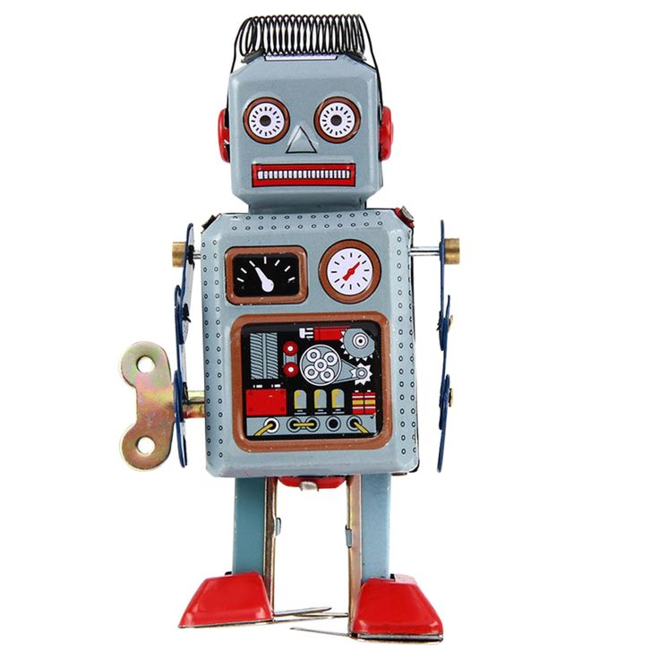
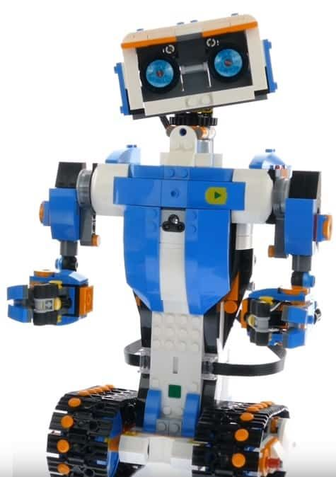

# sesion-07a
## 23.09.25
+ **Proyecto 02** 17 de oct.
+ Pantallita SSD 1306

### Encargo
+ Traer 10 proyectos de internet por grupo
+ Arduinoproyecthub, instructables.com, cosas de las que nos podamos inspirar a nivel de estrategia y código.
+ Bibliografía de buena calidad.

+ Revisar las bitácoras de los demás alumos y sus proyectos grupales. A partir de ello comentas semejanzas y diferencias entre estos para poder difereciarse.
+ Cada persona busca referentes en internet de 4 cosas: 2 de Codigos, 2 de materialidades, 2 de documentación (comerciales), 2 de Lenguaje (humano), Palabras, adjetivos y adverbios que queremos usar para describir nuestro proyecto.

### NFC
+ Según xacata.com NFC significa Near Field Communication, lo que traducido sería Comunicación de Campo Cercano. Es una buena definición, porque se trata de una tecnología que funciona por proximidad, cuando acercas un dispositivo a otro. Es de alta frecuencia, y funciona en la banda de los 13.56 MHz.
+ Cuando acercas los dispositivos, se crea un campo electromagnético por inducción, en el que se genera el intercambio de datos con una tasa de transferencia puede alcanzar los 424 Kbps. Pese a que sirve para intercambiar datos, debido a su limitada velocidad se usa sobre todo para la identificación y validación de equipos y personas.
+ <https://afel.cl/products/modulo-rfid-nfc-pn532?_pos=2&_sid=e511df31c&_ss=r>

### RTC
+ Según utec.edu RTC es Un reloj de tiempo real es un dispositivo electrónico que permite obtener mediciones de tiempo en las unidades temporales.
+ <https://afel.cl/products/modulo-rtc-ds1302-reloj-de-tiempo-real?variant=45125238358168&country=CL&currency=CLP&utm_medium=product_sync&utm_source=google&utm_content=sag_organic&utm_campaign=sag_organic&utm_term=&utm_campaign=@+Smart+Shopping+2&utm_source=adwords&utm_medium=ppc&hsa_acc=1808722794&hsa_cam=19569174895&hsa_grp=&hsa_ad=&hsa_src=x&hsa_tgt=&hsa_kw=&hsa_mt=&hsa_net=adwords&hsa_ver=3&gad_source=1&gad_campaignid=19560974580&gbraid=0AAAAADBMsFTdLOypf0Kd8CPYUW96Wob87&gclid=EAIaIQobChMI4cbunvHujwMVblRIAB0Qjg0yEAYYASABEgLo_PD_BwE>

### Referentes
+ Nonna Fernandez
+ Las llamadas que nunca hice
+ Robert Mapplethorpe
+ Patti Smith
+ <https://www.amsafe.org.ar/wp-content/uploads/Eramos-unos-ninos-Patti-Smith.pdf>
+ Ejemplo uso cintas led <https://www.youtube.com/watch?v=tHjmvry00_w>

### 4 tipos de motores
+ Identificar que driver usar
  
+ **Tipo DC** (Corriente directa) "ALta velocidad": Vibradores, ventiladores; etc
+ En Afel: <https://afel.cl/products/3v-0-2a-12000rpm-65gcm-mini-micro-dc-motor-for?variant=46538983080088&country=CL&currency=CLP&utm_medium=product_sync&utm_source=google&utm_content=sag_organic&utm_campaign=sag_organic&utm_term=&utm_campaign=@+Smart+Shopping+2&utm_source=adwords&utm_medium=ppc&hsa_acc=1808722794&hsa_cam=19569174895&hsa_grp=&hsa_ad=&hsa_src=x&hsa_tgt=&hsa_kw=&hsa_mt=&hsa_net=adwords&hsa_ver=3&gad_source=1&gad_campaignid=19560974580&gbraid=0AAAAADBMsFTdLOypf0Kd8CPYUW96Wob87&gclid=EAIaIQobChMI1peq3vXujwMVbmVIAB32oxJMEAQYASABEgK4EvD_BwE>

+ **Paso a Paso** Lento, preciso, se mueve lo que necesita. Se mueve por grados y no tiene idea donde está.
+ Torque, cuanto peso puede levantar.
+ En Afel: <https://afel.cl/products/mini-motor-paso-a-paso-driver-board-uln2003>

+ **Servo Motor** Sabe donde está y se mueve con precisión. (el de angulo 360 no sabe donde está)
+ En Afel: <https://afel.cl/products/micro-servomotor-sg90>
+ <https://afel.cl/products/high-torque-metal-gear-digital-servo>
+ Engranaje metálico <https://afel.cl/products/servomotor-engranaje-metalico-mg90s>

+ **Actuadores lineales** Segun gemini dispositivo que convierte un movimiento rotatorio en un movimiento de empuje o tracción en línea recta.
+ <https://articulo.mercadolibre.cl/MLC-3004697744--actuador-lineal-carrera-de-2-pulgadas-90-n203-libras-v-_JM?matt_tool=38723874&matt_word=&matt_source=google&matt_campaign_id=22187018092&matt_ad_group_id=175103618838&matt_match_type=&matt_network=g&matt_device=c&matt_creative=731217691876&matt_keyword=&matt_ad_position=&matt_ad_type=pla&matt_merchant_id=620079043&matt_product_id=MLC3004697744&matt_product_partition_id=2394827771649&matt_target_id=pla-2394827771649&cq_src=google_ads&cq_cmp=22187018092&cq_net=g&cq_plt=gp&cq_med=pla&gad_source=1&gad_campaignid=22187018092&gbraid=0AAAAADxxu6pd43e-bM7VEcidNgM1M1q8g&gclid=EAIaIQobChMI_ufS0vjujwMVXV9IAB0gwCKZEAQYAyABEgLtnvD_BwE>

+ **Motor síncrono** Velocidad constante y alta precisión.
+ Según hrmotor el motor síncrono es un tipo de motor eléctrico que gira a una velocidad constante y proporcional a la frecuencia de la corriente alterna que lo alimenta. Este motor utiliza imanes permanentes en su rotor, lo que permite un funcionamiento altamente eficiente y una excelente capacidad de control de la velocidad.

### Luces led
+ Led RGB
+ Neopixel (Dibujitos) (AdaFruit) 
+ Cintas led

### Encargo en clase

#### idea 1 
+ Maquina de acentos e idiomas/ Máquina bilingue
+ Joystick, Redproductor mp3, servo motor

  Grabación de 4 formas de decir hola en 4 distintos idiomas.
  + Servo motor con forma de mini robot que se mueva de acuerdo el dioma.
  
+ En afel: <https://afel.cl/products/modulo-grabacion-reproduccion-de-audio-isd1820-con-microfono-integrado?variant=45125239177368&country=CL&currency=CLP&utm_medium=product_sync&utm_source=google&utm_content=sag_organic&utm_campaign=sag_organic&utm_term=&utm_campaign=@+Smart+Shopping&utm_source=adwords&utm_medium=ppc&hsa_acc=1808722794&hsa_cam=18405560573&hsa_grp=&hsa_ad=&hsa_src=x&hsa_tgt=&hsa_kw=&hsa_mt=&hsa_net=adwords&hsa_ver=3&gad_source=1&gad_campaignid=17613659948&gbraid=0AAAAADBMsFT3Or_N8RJ5qRdX22Fmt0Z_G&gclid=EAIaIQobChMI8Im8qovvjwMVzlNIAB3NtiSYEAYYASABEgIm_vD_BwE>
+ Joystick : <https://afel.cl/products/joystick-palanca-de-mando>
+ <https://afel.cl/products/modulo-reproductor-mp3-dfplayer-mini>
+ <https://es.scribd.com/document/890144408/ISD-MODULO-GRABADOR-DE-SONIDO-ISD1820>
  
  Funcionará mediante la interacción con un joystick, (arriba, abajo, derecha, izquierda y presionar el centro, es reset).
  
  Al interactuar con el un saludo/ frase/ etc en algún idioma. Cada idioma tiene una gestualidad predeterminado de acuerdo a este.

+ joystik: restet + arriba un idioma+ abajo + derecha + izquierda

+ parámetro elegir idiomas/cantidad

+ **Entrada:** Mediante un joystick la persona tendrá diversas interacciones (arriba, abajo, derecha, izquierda y presionar el centro, es reset).
+ **Salida:** Al interactuar, se reproducirán audios de saludos en distintos idiomas, como: italiano, español chileno, japonés y portugués. Al mismo tiempo, como respuesta, dependiendo el idioma se moverá de manera representativa, como: japonés-reverencia. Nos falta como invitar a la persona.

**Funó idea** porque nos pueden funar al ofender a alguien.

#### idea 2
+ Máquina cuenta secretos
+ **Entrada:** La máquina mediante el sensor ultrasónico detecta tu presencia y tu distancia.
+ **Salida:** Depende tu distancia este reacciona, si estas lejos comienza a tiritar (de la emoción/ansioso) para poder contarte un secreto, al mismo tiempo te llama gritando para que te acerques más. Cuando estés lo suficiente cerca te susurra el secreto. definir: ¿Qué tipo de secreto? ¿Cómo te dice que te acerques?

+ motor DC , ultrasonico, reproductor mp3, altavoz.

#### Encargo 12
"leer las bitacoras de colegas, encontrar similitudes, diferencias, preguntas y aciertos de sus máquinas saludadoras propuestas. Citar correctamente las fuentes."

**Análisis comparativo** de máquinas saludadoras

+ Al leer las bitácoras de mis compañeros me doy cuenta de que, aunque todos partimos de la misma premisa (crear una máquina que salude e interactúe con las personas) cada uno le dio un giro distinto en cuanto a tono, materiales y experiencia de usuario.
  
#### Similitudes

+ **La interacción con el usuario es la esencia de todos los proyectos.** En mi caso, mi máquina detecta la distancia de la persona con un sensor ultrasónico: si está lejos tiembla de la emoción y grita para que se acerque, y cuando ya está cerca le susurra un secreto. Mis compañeros también trabajan con la cercanía, Braulio y Bernardita usan sensores para que sus máquinas sigan al usuario con la mirada y luego hablen, mientras que Santiago hace que sus ojos se activen a partir de micrófonos que captan sonidos. Además, varios incluimos sonido pregrabado como salida, ya sea para hablar, saludar o emitir frases aleatorias (Braulio, Bernardita, Pía y yo).

#### Diferencias

+ **Mi propuesta se centra en la ansiedad y la intimidad**, porque la máquina primero se agita y llama la atención, pero después revela un secreto, susurrándolo cuando logras acercarte lo suficiente, en cambio, Braulio y Bernardita juegan con lo irónico, creando orejas que hablan o miradas que incomodan. Santiago se va en la vola creepy, generando sensación de vigilancia con sus ojos que siguen el sonido. Pía, se va a lo más digital y visual, usando pantallas y encoders, lo que la diferencia de la mayoría que trabajamos con gestos y sonidos.

#### Aciertos

+ Creo que un punto fuerte de mi propuesta es la dinámica emocional: primero genera expectativa y ansiedad, y luego entrega algo íntimo como un "secreto". De Braulio me encanta lo de que una oreja hable, es inesperado y divertido. Santiago igual acierta en lo inquietante de sentirse observado, que provoca una reacción de incomodidaden el usuario. Bernardita logra una combinación interesante entre mirada y susurros. Y de Pía rescato lo sólido de su propuesta técnica con pantalla y encoder, que abre muchas posibilidades de interacción.

#### Referencias

+ Mi Bitácora :) idea máquina saludadora (máquina cuenta secretos). Sesión de clase.
+ Figueroa, Bitácora sesión 07a: formulación del proyecto.
+ Santiago, Bitácora sesión 07a: grupo proyecto-02, hijos de la tierra.
+ Bernardita, Bitácora sesión 07a: ideas proyecto-02.
+ Pía, Bitácora sesión 07a: sobre el proyecto.

#### Encargo 13

"buscar 2 referentes asociados a tu proyecto de cada una de estas 4 categorías: 1. lenguaje natural (personas), código, materialidad, documentación. escribir un párrafo por cada uno de los referentes encontrados, citando las fuentes, y explicando por qué lo elegiste, qué te aporta, qué te inspira, o incluso si lo incluyes como antiejemplo."

#### 1. Lenguaje natural (personas)

+ Referente 1: Mitchel Resnick "Let's teach kids to code" <https://www.ted.com/talks/mitch_resnick_let_s_teach_kids_to_code?subtitle=en>
+ Elegí esta charla de Mitchel Resnick porque destaca por su claridad y sencillez al explicar conceptos complejos. Su lenguaje es universal, accesible para cualquier persona sin importar si tiene conocimientos de programación o no. Me interesa especialmente cómo Resnick transmite ideas de forma cercana y empática. Este referente hace enfasis en que la comunicación efectiva es clave para que la tecnología sea entendida y disfrutada por todos.

#### 2. Código (tecnología/programación)

+ Referente 1: <https://naylampmechatronics.com/blog/10_tutorial-de-arduino-y-sensor-ultrasonico-hc-sr04.html>

Tutorial de Arduino y sensor ultrasónico HC-SR04 – Naylamp Mechatronics

Este sitio me enseña cómo utilizar el sensor ultrasónico HC-SR04 con Arduino, como la calibración, conexiones y programación básica. Este recurso es especialmente útil para mi máquina que susurra secretos. El tutorial explica cómo emitir un pulso al pin Trigger del sensor y medir el tiempo que tarda en recibir el eco mediante la función pulseIn(). Esta información es esencial para calcular la distancia al objeto y activar respuestas como sonidos o movimientos en función de la proximidad del usuario. Me sirve como base sólida para desarrollar la lógica de interacción de mi proyecto.

+ Referente 2: <https://www.youtube.com/watch?v=qUhhRjHKW4s>
Este video: "Arduino desde cero en Español - Capítulo 81 - Audio MP3 fácil con DFPlayer Mini y tarjeta MicroSD". Explica cómo usar e reproductor mp3, tanto como para conectarlo, las piezas necesarias y como hacerlo funcionar. Este también me sirve como una buena base para mi proyecto.

#### 3. Materialidad

+ Referente 1: Juguetes mecánicos antiguos.
+ Estos objetos combinaban movimientos simples con grabaciones de voz, generando interacción. Me sirven como referente porque muestran cómo materiales mecánicos y electrónicos básicos pueden dar vida a una experiencia emotiva y divertida. Este referente me aporta la idea de que no siempre hace falta tecnología compleja para generar interacción significativa.

+ Referente 2: Legos
+ Los Legos son un referente clave para mí por su versatilidad y la posibilidad de reutilizar piezas antiguas, dándoles una segunda vida. Me atrae la idea de incorporar materiales modulares, los Legos inspiran de por si a diseños flexibles y adaptables.
  

#### 4. Documentación

+ Referente 1: Tutorial de Adafruit sobre proyectos con audio y Arduino. <https://learn.adafruit.com/esenciales-para-circuitpython/salida-audio-circuitpython>
En esta documentación se explican paso a paso conexiones, códigos y ejemplos. Lo tomo como referente porque me da un ejemplo práctico de cómo documentar los procesos técnicos. Me ayuda a pensar en cómo quiero registrar y compartir mis propios proyectos.
