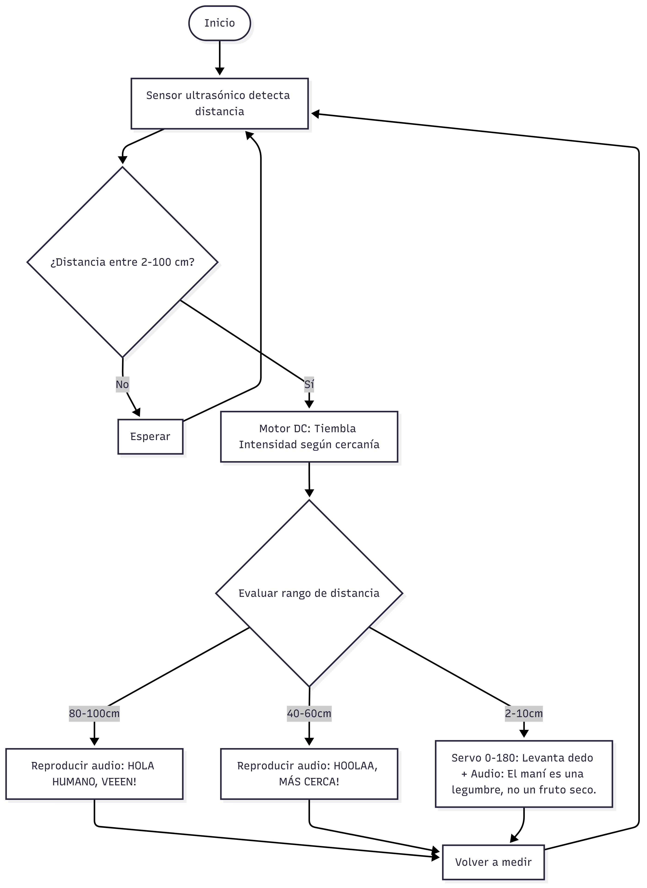
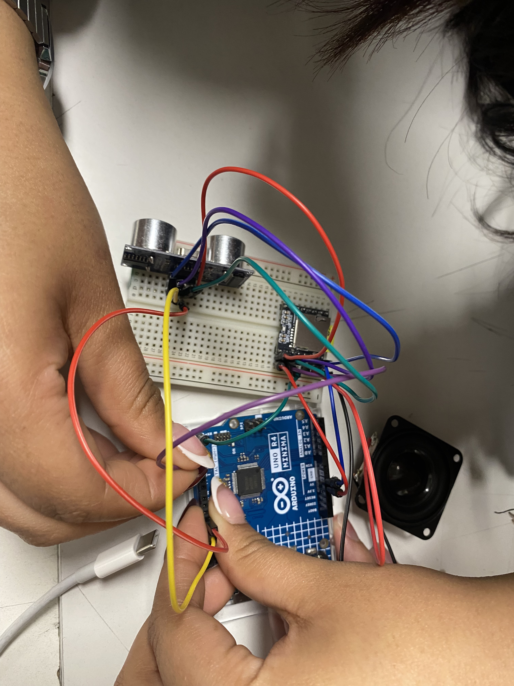
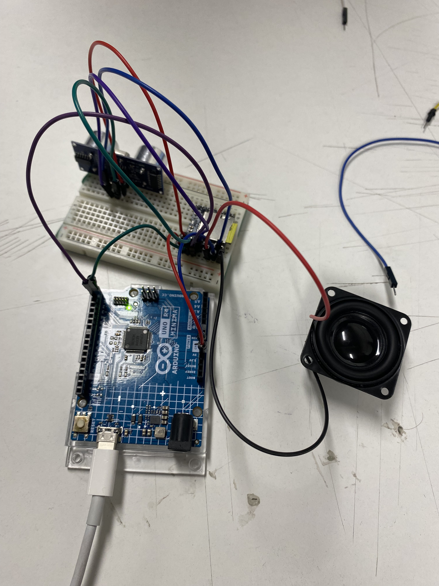
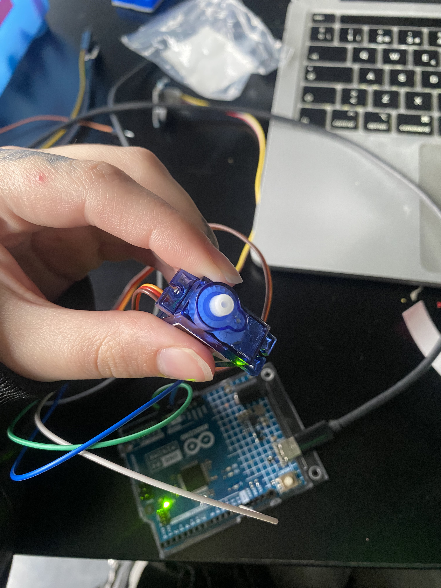

# sesion-07b / 26.09.25

**Comisión** Cynthia Shuffer

+ Sensor ultrasónico HC-sr04 <https://afel.cl/products/sensor-de-ultrasonico-hc-sr04>
+ Según Gemini la velocidad del sonido en el aire, en condiciones normales (20 °C y nivel del mar), es de aproximadamente 343 metros por segundo (m/s) o 1.235 kilómetros por hora (km/h).

**Ejemplos** de velocidad del sonido 
+ Aire a 20 °C: 343 m/s (aproximadamente 1235 km/h).
+ Aire a 0 °C: 331 m/s.
+ Agua dulce: 1.435 m/s.
+ Agua salada: 1.500 m/s.
+ Acero: 6.100 m/s.

+ vcc en caso de arduino r4 es 5v

+ **Rafael Benguria** según wikipedia Rafael José Urbano Benguria Donoso es un físico-matemático chileno, Premio Nacional de Ciencias Exactas de 2005.

## Pseudocódigo
+ INTENTAR QUE EL CÓDIGO SE PUEDA VER COMPLETO EN LA PRIMERA PANTALLA.

+ archivo.ino
+ creditos.ino
+ cableado.ino

### Archivo principal.ino

+ Usar **bool** para switch
+ **variables** con clases (.cpp/.h)
+ Usar booleanas para definir las variables, ej: Persona de 2 a 10 cm de disntancia : true / false

  ### ¿Qué hacemos primero?
  + Configurar sensor (ultrasónico en este caso) en archivo principal
  + Funciones con void
  + Quedaría en **setup:**
```cpp
 void setup() {
  configurarSensoresActuadores();
 }
```
  + En void **loop:**
```cpp
void loop() {
  leerSensores();
  tomarDecisiones();
  actuar();
}
```
  
### Archivo sensorUltrasonico.ino

  ¿Qué necesitamos para configurar un sensor?
  + En el archivo/ventana de sensor 
  + Necesitamos decidir en qué patita va
    
```cpp
 void configurarSensorUltrasonico() {
  // conectar la patita

  // definir la distancia minima
  // definir la distancia maxima

}
```

### Archivo sensoresActuadores.ino
    
+ Configurar más sensores y actuadores
  
```cpp
  void configurarSensoresActuadores() {

  configurarSensorUltrasonico();

  // configurar mas sensores
  // configurar actuadores
  }

  void leerSensores() {}

  void tomarDecisiones() {}

  void actuar() {}
```

### PROYECTO 02

+ Sensor **Ultrasónico:**

```cpp
  const int Trigger = 11;   //Pin digital 11 para el Trigger del sensor
  const int Echo = 12;   //Pin digital 12 para el Echo del sensor
```

  + distancia minima de 2 a 10 cm
  + distancia media de 45 a 60 cm
  + distancia maxima de 80 a 100 cm

  + Tiempo de reposo cuando no siente presencia
+ configuración **Altavoz**
  + **tono/volumen** del altavoz para cada distancia.
    + distancia minima: 30 - 40 decibeles
    + distancia media: 70- 80 decibeles
    + distancia maxima: 90 - 93 decibeles
   
+ configuración **Servomotor**
 + Movimiento en ángulo de 0 a 180 grados
 + Cuando la distancia que detecte el sensor ultrasónico sea de 2 a 10cm
 + Servo se mueve desde 0 a 180 grados
 + en cualquier otro caso se baja


#### Proyecto_02 - Máquina que da datos random

+ **¿Qué necesitamos?:** Sensor ultrasónico, Servo Motor, Motor DC, Reproductor mp3 y Altavoz
+ **Entrada:** Mediante el sensor ultrsónico la máquina detecta presencia y detalles de distancia de esta presencia (idealmente humana:P)
+ **Salida:** Al detectar la distancia de la presencia la máquina reacciona de diferentes maneras:
  + **1.** Cuando detecte una presencia esta comenzará a temblar (de nervios) mediante el motor DC el tembleque aumentará entre más cerca estés. 😋
  + **2.** El sensor detectará presencia en 3 instancias: 2 - 10cm, 40 - 60cm, 80 - 100cm
  + **3.** En cada parámetro la máquina reproduce un audio de voz distinto mediante la microSD en el reproductor MP3 y el altavoz.
  + **4.** Los parametros son:
    + 80 - 100cm = Te "grita" que vengas diciendo: "HOLA HUMANO, VEEEN!"
    + 40 - 60cm = Te grita de nuevo pidiendo que te acerque más, diciendo: "HOOLAA, MÁS CERCA!"
    + 2 - 10cm = Levanta un "dedo" usando el servo motor, este se moverá de los 0 grados a los 180 mientras estés a esa distancia. Al mismo tiempo te dirá algún dato interesante como "El maní es una legumbre, no un fruto seco.”
            
#### Encargo 14
"cada persona del grupo debe implementar en diagrama de flujo dibujado o con la herramienta Mermaid.js con sus propias palabras y subirlo a su README."



#### Encargo 15
"cada persona del grupo debe subir a su README: documentar funcionamiento de sus sensores, incluyendo instrucciones de conexión y de configuración, subir el proyecto entero de arduino como carpeta, tiene que poder compilar sin problema y mostrar en consola los datos de los sensores."

#### Referentes
   + <https://www.youtube.com/watch?v=8RLBxhA4ooI>
   + "Cómo hacer un robot con un servomotor y sensor de distancia"
     
   + <https://www.instructables.com/Controlling-a-Servo-With-an-Ultrasonic-Sensor-Usin/>
   + "Controlar un servo con un sensor ultrasónico usando Arduino"
  
   + <https://www.youtube.com/watch?v=z8wUPMt5Eyg>
   + "Mover un servomotor con Valores de Distancia del Sensor Ultrasonico"

+ **Ejemplo de codigo** sacado de internet para hacer funcionar un **servomotor:**

```cpp
  #include <Servo.h>

Servo myservo;  // Crea un objeto servo
int servoPin = 13; // El pin al que conectamos el cable de señal del servo

void setup() {
  myservo.attach(servoPin); // Vincula el objeto servo al pin 9
}

void loop() {
  myservo.write(0);   // Gira el servo a 0 grados
  delay(1000);        // Espera 1 segundo
  myservo.write(90);  // Gira el servo a 90 grados
  delay(1000);        // Espera 1 segundo
  myservo.write(180); // Gira el servo a 180 grados
  delay(1000);        // Espera 1 segundo
}
```
+ **Referencia** de código para **sensor ultrasónico** de **Nico Miranda**
```cpp
#include <Wire.h>
#include <Adafruit_GFX.h>
#include <Adafruit_SSD1306.h>

// Configuración de la pantalla OLED
#define SCREEN_WIDTH 128
#define SCREEN_HEIGHT 64
#define OLED_RESET    -1  
Adafruit_SSD1306 display(SCREEN_WIDTH, SCREEN_HEIGHT, &Wire, OLED_RESET);


const int TRIG_PIN = 11; // Pin TRIG del sensor
const int ECHO_PIN = 12; // Pin ECHO del sensor
long duration;
float distanceCm;


void setup() {
  // Inicialización de la pantalla OLED
  if (!display.begin(SSD1306_SWITCHCAPVCC, 0x3C)) { 
    Serial.println(F("Error al iniciar la pantalla OLED"));
    while (true);
  }
  display.clearDisplay();
  display.setTextColor(SSD1306_WHITE);
  
  // Configuración del sensor ultrasónico
  pinMode(TRIG_PIN, OUTPUT);
  pinMode(ECHO_PIN, INPUT);


  // Inicialización de la comunicación serial
  Serial.begin(9600);
}

void loop() {
  // Enviar pulso de ultrasonido
  digitalWrite(TRIG_PIN, LOW);
  delayMicroseconds(2);
  digitalWrite(TRIG_PIN, HIGH);
  delayMicroseconds(10);
  digitalWrite(TRIG_PIN, LOW);

  // Leer la duración del pulso de retorno
  duration = pulseIn(ECHO_PIN, HIGH);
  
  // Calcular la distancia en cm (velocidad del sonido = 343 m/s)
  distanceCm = duration * 0.0343 / 2;

 display.clearDisplay(); 
  display.setTextSize(1);
  display.setCursor(0,20);

  // Mostrar mensaje según la distancia
  if (distanceCm < 10) {
    display.println("Hola");
  }
  else if (distanceCm < 40) {
    display.println("Quien anda ahi?");
  }
  else if (distanceCm < 100) {
    display.println("Ah eras tu");
  }
  else if (distanceCm < 130) {
    display.println("Zzz.. nadie");
  }
  else {
    display.println("Oh ya te fuiste :c");
  }


  display.display(); // Actualizar la pantalla
  delay(500); // Esperar 500 ms
  }
```
+ ChatGPT Me ayudó con el **término &&**
   + "El && se usa para verificar que dos (o más) condiciones sean verdaderas al mismo tiempo. Es un AND lógico, que se aplica a expresiones que pueden ser true o false.
   + Solo devuelve true si todas las condiciones son verdaderas; si alguna es falsa, devuelve false.
   + Concepto simple:
   + “Condición A y Condición B” → A && B
   + Verdadero solo si A es verdadera y B es verdadera.

 + Ejemplo conceptual
   + Imagina que quieres salir a pasear:
     + Condición A: “No está lloviendo”
     + Condición B: “Tengo tiempo libre”
   + Con && dirías:
     + “Voy a salir a pasear si no está lloviendo Y tengo tiempo libre.”
   + Si alguna de las dos no se cumple, no sales.
   + Solo sales si ambas se cumplen al mismo tiempo.
 
  + En C/C++, el operador lógico “AND” siempre se escribe como &&.
  + Es parte de la sintaxis del lenguaje; AND en mayúsculas no funciona y dará error de compilación."

#### Avance de código con sensor ultrsónico y con servomotor







**Proyecto_02.ino** - ARCHIVO PRINCIPAL
```cpp
void setup() {
  configurarSensorUltrasonico(); // inicializar sensor ultrasónico
  configurarServo();  // inicializar servo motor (dedo)
}

void loop() {
  float distancia = medirDistancia();  // leer sensor ultrasonico
  mostrarMensaje(distancia);           // mostrar mensaje de acuerdo a la distancia

  // Control del servo según la distancia
  // si la distancia está entre 2 y 10 cm, se levanta el dedo.
  if (distancia >= 2 && distancia <= 10) {
    levantarDedo();
  } else {
    bajarDedo();
  }
  delay(500); // pausa para estabilidad
}
```
**SensorUltrasonico.ino** - SENSOR ULTRASÓNICO

```cpp
const int TRIG_PIN = 11;   // Pin digital 11 para el Trigger del sensor
const int ECHO_PIN = 12;   // Pin digital 12 para el Echo del sensor

// definir la distancia minima de 2 a 10 cm
// definir distancia media de 40 a 60 cm
// definir la distancia maxima de 80 a 100 cm
// Tiempo de reposo cuando no siente presencia 

long duration;
float distanceCm;

// Configurar pines del sensor ultrasonico
void configurarSensorUltrasonico() {
  pinMode(TRIG_PIN, OUTPUT);
  pinMode(ECHO_PIN, INPUT);
  Serial.begin(9600);
}

// Medir la distancia y devolverla
float medirDistancia() {
  digitalWrite(TRIG_PIN, LOW);
  delayMicroseconds(2);
  digitalWrite(TRIG_PIN, HIGH);
  delayMicroseconds(10);
  digitalWrite(TRIG_PIN, LOW);

  // Leer la duración del pulso de retorno
  duration = pulseIn(ECHO_PIN, HIGH);
  // Calcular la distancia en cm (velocidad del sonido = 343 m/s)
  distanceCm = duration * 0.0343 / 2;

  // Mostrar distancia medida en el monitor serial
  Serial.print("Distancia: ");
  Serial.print(distanceCm);
  Serial.println(" cm");

  return distanceCm;
}

// Mostrar mensajes según la distancia
  // && = dos condiciones se cumplan al mismo tiempo.
  // quiere decir que si las dos condiciones que de se cumple lo que sea que pida
  // o sea, si la distancia está entre 2 y 10 cm, el mensaje se muestra.
void mostrarMensaje(float distancia) {
  if (distancia >= 2 && distancia <= 10) {
    Serial.println("no se lo digas a nadie… pero me da miedo el WiFi.");
  }
  // si la distancia está entre 40 y 60 cm, el mensaje se muestra.
  else if (distancia >= 40 && distancia <= 60) {
    Serial.println("ACERCATE MAS");
  }
  // si la distancia está entre 80 y 100 cm, el mensaje se muestra.
  else if (distancia >= 80 && distancia <= 100) {
    Serial.println("HOLA HUMANO VEN");
  }
  // si no está en ninguno de los rangos anteriores
  else {
    Serial.println("ZZZ...");
  }
}
```
**DedoServo.ino** - SERVO MOTOR
```cpp
#include <Servo.h>

Servo dedo;// Crear objeto servo
const int SERVO_PIN = 13;

// Configurar servo motor
void configurarServo() {
  dedo.attach(SERVO_PIN);
  dedo.write(0); // posición inicial 0°
}

// Levantar dedo
void levantarDedo() {
  dedo.write(180);
}

// Bajar dedo
void bajarDedo() {
  dedo.write(0);
}
```
