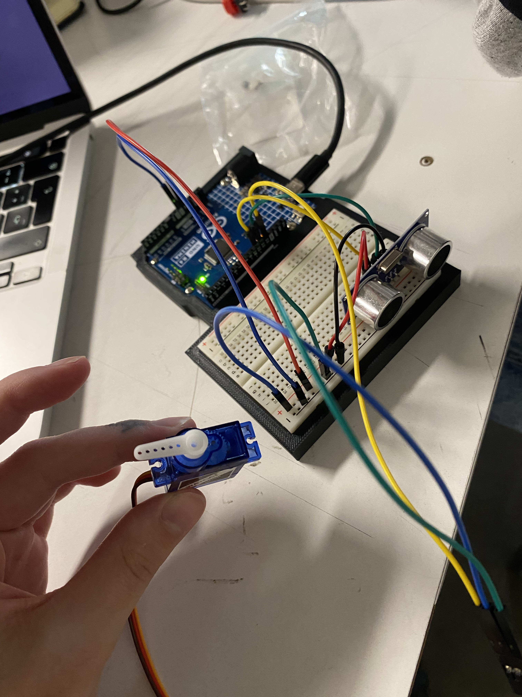

# sesion-08a 30.09.25

## Proyecto 02
 "cada persona del grupo debe subir a su README: qué llevan hasta el final de esta sesión, qué sí funciona, qué funciona casi, qué no funciona. después subir nueva versión del código y de la documentación, del trabajo que hagan entre 8a y 9a."));
}
+ **Errores y problemas en el código:** El reproductor mp3 no nos funcionaba, no sonaba el altavoz, pensamos que un problema podría ser la tarjeta SD.
+ La formateamos con las instrucciones que nos dió gemini:

"Para formatear una tarjeta SD para Arduino Uno, conéctala a tu computadora e inicia la herramienta de formateo de tu sistema operativo. En la configuración de formato, elige FAT32 como sistema de archivos, o FAT para tarjetas de menos de 2GB, y luego inicia el formateo. Para obtener los mejores resultados, considera usar la herramienta oficial SD Formatter de la SD Association."

Conecciones y registro:

## Proyecto_02 - Máquina que da datos random
¿Qué necesitamos?: Sensor ultrasónico, Servo Motor, Motor DC, Reproductor mp3 y Altavoz
Entrada: Mediante el sensor ultrsónico la máquina detecta presencia y detalles de distancia de esta presencia (idealmente humana:P)
Salida: Al detectar la distancia de la presencia la máquina reacciona de diferentes maneras:
1. Cuando detecte una presencia esta comenzará a temblar (de nervios) mediante el motor DC el tembleque aumentará entre más cerca estés. 😋
2. El sensor detectará presencia en 3 instancias: 2 - 10cm, 40 - 60cm, 80 - 100cm
3. En cada parámetro la máquina reproduce un audio de voz distinto mediante la microSD en el reproductor MP3 y el altavoz.
4. Los parametros son:
80 - 100cm = Te "grita" que vengas diciendo: "HOLA HUMANO, VEEEN!"
40 - 60cm = Te grita de nuevo pidiendo que te acerque más, diciendo: "HOOLAA, MÁS CERCA!"
2 - 10cm = Levanta un "dedo" usando el servo motor, este se moverá de los 0 grados a los 180 mientras estés a esa distancia. Al mismo tiempo te dirá algún dato interesante como "El maní es una legumbre, no un fruto seco.” 🤓☝🏻

La idea es que se vea así con el dedo cuando te diga el dato:

Se probó el código subido en la sesión anterior y esta, con el ultrasónico y el servo motor.
Funcionó!

### Qué nos falta hacer?
 + Carcasa
 + Mecanismo con carcasa
 + Diálogo ✅
 + Motor DC
 + Unir código

#### Al final de la clase pudimos hacer:

  + Código para usar el mp3 y el altavoz funcionó gracias a janis y mateo <3
  + El código salvador fué este de aquí:
  + <https://github.com/DFRobot/DFRobotDFPlayerMini>

  + Logramos hacer funcionar el sensor ultrasónico junto al servomor, fotito arriba y el código está adjunto en files.

  + Preparamos como serían más o menos los dialogos de la máquina para convertirlos en audio y poder añadirlas a nuestro código.
    
#### Diálogo listo ✅
+ Los diálogos serán:
 + **1.** "hola1.mp3" de 80-10cm, para llamar a la persona: "Hola humano ¿Por qué estás tan lejos? Acércate."
 + **2.** "hola2.mp3" de 40-60cm, para hacer que la persona se acerque más: "Hola! No seas timido, ven más cerca, no tengo virus... creo jiji"
 + **3.** "dato1, 2, 3, 4,5 y 6.mp3" de 2-10cm:
   + **dato1:** "¿Sabías qué? El primer mause era de madera... Seguro también servía de leña jajaj"
   + **dato2:** "¿Sabías qué? El error 404 es mi manera de hacerme el leso... jajaja"
   + **dato3:** "¿Sabías qué? La nube no existe, son computadores de otro... pero no se lo digas a nadie"
   + **dato4:** "¿Sabías qué? Los datos nunca se borran, solo se esconden... igual que tus calcetines"
   + **dato5:** "¿Sabías qué? Apagar y prender arregla todo, y sino, un golpecito y como nuevo"
   + **dato6:** "¿Sabías qué? El porcentaje exacto de 99,999999999999... Nah, inventé jajaja pero aún sigues aquí ¿no?"

  Audios en files! hechos con <https://aivoice-es.vidnoz.com/text-to-speech>
