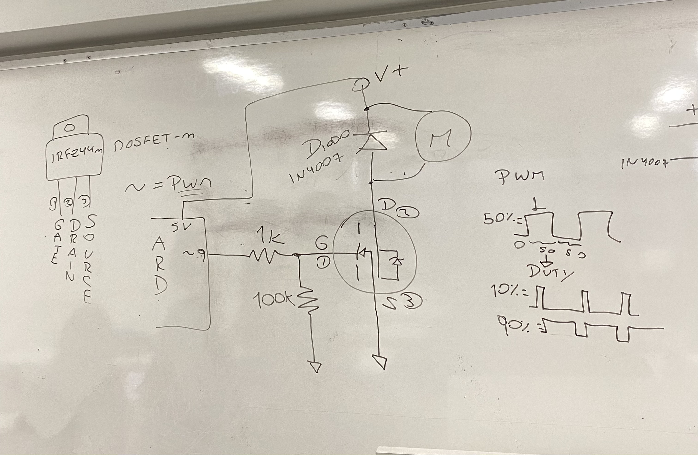
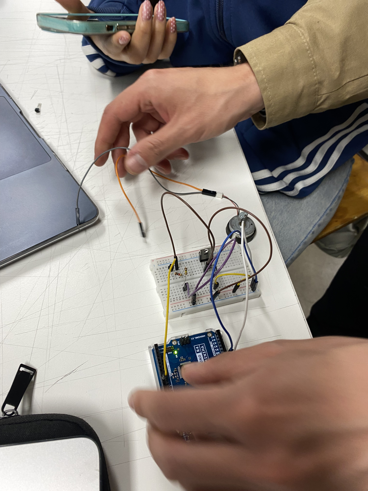
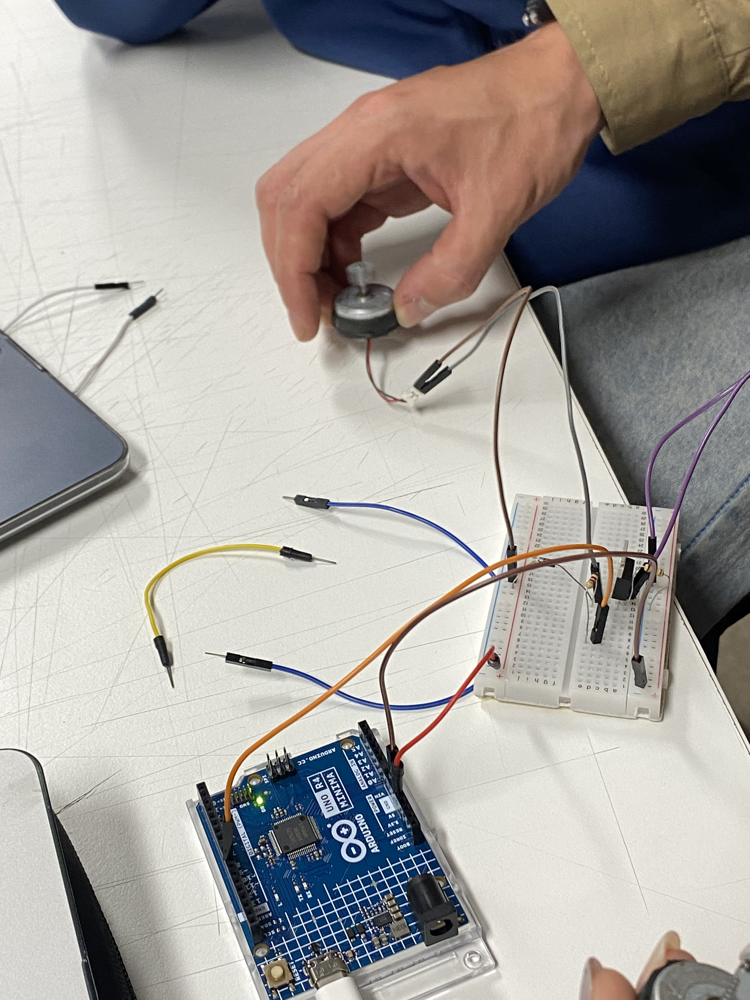

# sesion-09b 10.10.25
## Motores vibradores

+ Primera prueba con **EasyBuzzer - PKM22EPP - 40**

```cpp
#include <EasyBuzzer.h>
 
void sonidoTerminado(){
  Serial.println("Sonido terminado");
}
 
void setup() {
  Serial.begin(9600);

  // Configuración del pin
  EasyBuzzer.setPin(5);
 
  Serial.println("Comienza el sonido");

  // Configuración del beep
  EasyBuzzer.beep(
    2000,          // Frecuencia en herzios
    100,           // Duración beep en ms
    100,           // Duración silencio en ms
    2,             // Números de beeps por ciclos
    300,           // Duración de la pausa
    1,             // Número de ciclos
    sonidoTerminado// Función callback que es llamada cuando termina
  );
}
 
void loop() {
  // Función para que funcione la librería
  EasyBuzzer.update();
}
```
EL buzzer solo hacia beep :( asi que creimos que solo era para eso el que teníamos.

+ Segunda prueba con **Motor vibrador de joystick**

CONEXIÓN:



Conección que no funcino y misa arregló:



Código de prueba: 

```cpp
int pinMotor = 9;
int intensidad = 0;

void setup(){
  pinMode(pinMotor, OUTPUT);
}

void loop(){

  intensidad = intensidad + 1;
  analogWrite(pinMotor, intensidad);

  if (intensidad >= 255){
    intensidad = 0;
  }
  delay(10);
}
```


