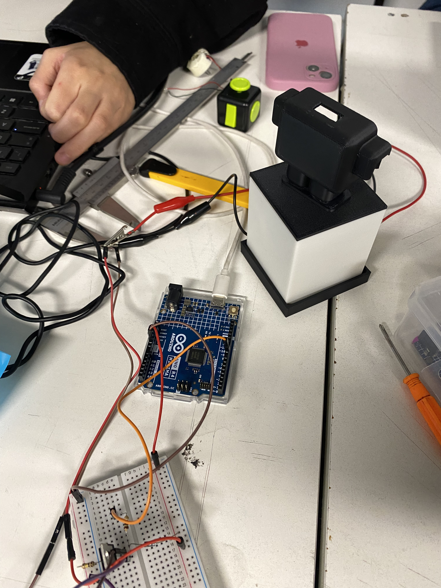
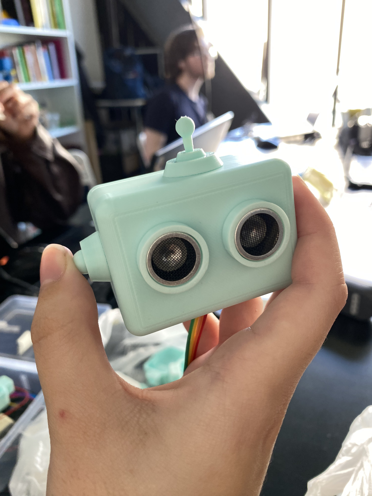

# sesion-10a 14.10.25

Hoy revisamos código y trajimos nuestro nuevo prototipo a clase.

## Proceso de nuestro nuevo AND-Y (RAMon 2.0)





Al cambiar nuestro código ".ino" a clases en el sensor ultrasónico tuvimos un ploblema con esta parte del código:

```cpp
float EntradaUltrasonico::medirDistancia() {
```
Ya que estaba en void no en float, si está en void no nos dejaba "return" la distancia al final del códigoi y necesitabamos eso para poder usar la distancia en otras partes del código.

### Libreria "newping"

Misa nos dijo que esta libreria podia servirnos para controlar mejor nuestro ultrasónico.

<https://eloctavobit.com/librerias-arduino/newping>

Funciones:

+ **sonar.ping ([max_cm_distance]):** envía un ping y obtiene el tiempo de eco (en microsegundos) como resultado. [max_cm_distance] permite establecer opcionalmente una nueva distancia máxima.
+ **sonar.ping_in ([max_cm_distance]):** envía un ping y obtiene la distancia en pulgadas enteras. [max_cm_distance] permite establecer opcionalmente una nueva distancia máxima.
+ **sonar.ping_cm ([max_cm_distance]):** envía un ping y obtiene la distancia en centímetros enteros. [max_cm_distance] permite establecer opcionalmente una nueva distancia máxima.
+ **sonar.ping_median (iteraciones [, max_cm_distance]):** realiza varios pings (predeterminado = 5), descarta los pings fuera de rango y devuelve la mediana en microsegundos. [max_cm_distance] permite establecer opcionalmente una nueva distancia máxima.
+ **sonar.convert_in (echoTime):** convierte echoTime de microsegundos a pulgadas.
+ **sonar.convert_cm (echoTime):** convierte echoTime de microsegundos a centímetros.
+ **sonar.ping_timer (function [, max_cm_distance]):** envía un ping y llama a la función para probar si el ping está completo. [max_cm_distance] permite establecer opcionalmente una nueva distancia máxima.
+ **sonar.check_timer ():** comprueba si el ping ha regresado dentro del límite de distancia establecido.
+ **NewPing :: timer_us (frecuencia, función):** función de llamada cada microsegundos de frecuencia.
+ **NewPing :: timer_ms (frecuencia, función):** función de llamada cada milisegundos de frecuencia.
+ **NewPing :: timer_stop ():** detiene el temporizador.

Tambien encontramos el github: <https://github.com/eliteio/Arduino_New_Ping>
