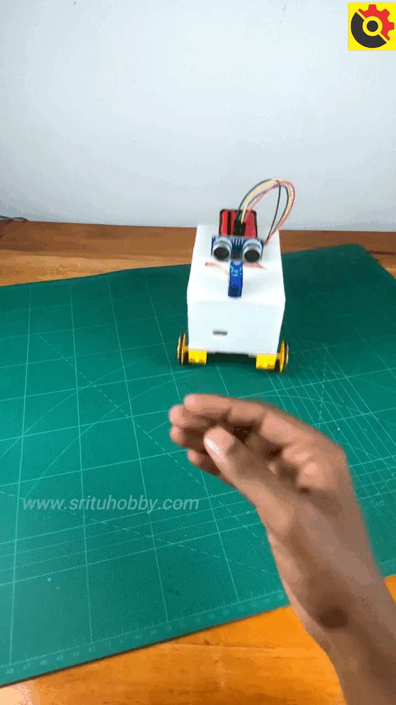
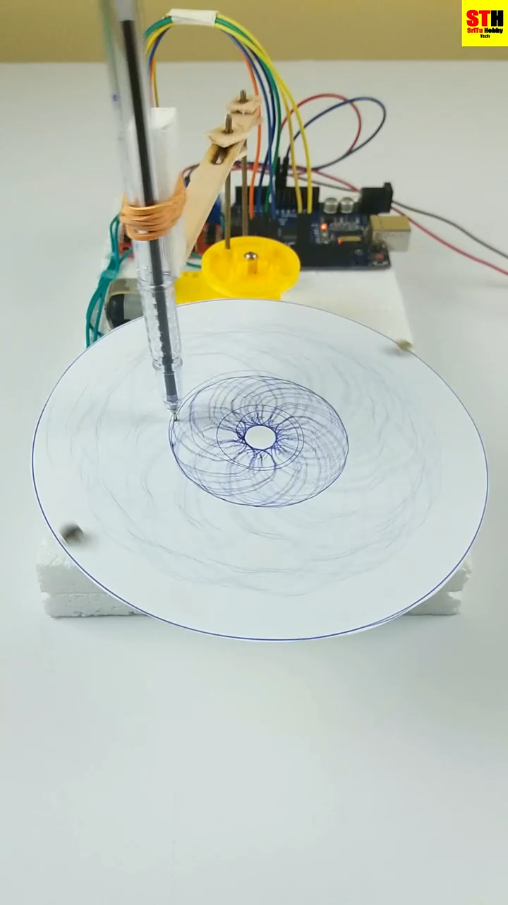

# sesion-11a 21.10.25

## Proyecto 03

+ Quizás mismo Poryecto 02 pero evolucionado

+ Diseño abierto mas fomeque, simplecito, no tanta puesta en escena. 9 al 12 de diciembre.

+ Quizás grupos de más personas / Por roles

+ Página que celebra cosas inútiles <http://uselesspress.org/>
+ Referente, **Call to wait** <http://uselesspress.org/things/call-to-wait/>

+ <https://www.lukedubois.com/projects-3/learningmachines>
+ <https://sfpc.io/>
+ <https://yeseul.com/Slow-Dimming-Study-Rice-Dimmer>
+ <https://vimeo.com/114414122>

+ **The claw of shame** <https://www.youtube.com/watch?v=zDtlHdqREVY>

### HID
Según Gemini: HID puede referirse a dos conceptos principales: Dispositivo de Interfaz Humana (Human Interface Device), una clase de dispositivos de entrada como teclados y ratones, o a HID Global, una empresa de soluciones de seguridad y control de acceso. Los "Dispositivos de Interfaz Humana" (HID) usan un protocolo estándar para comunicarse con un ordenador, mientras que "HID Global" fabrica productos como lectores de tarjetas, tarjetas de acceso y soluciones de credenciales móviles. 
  
### Referentes para proyecto 03

#### Lenguajes

+ **Metáfora:** Estrategia de escritura que sirve en terminos artisticos y diseño además que para escritura.
+ Para constrirla necestiamos 2 objetos distintos, aparentemente na que ver.
+ **Por ejemplo:** Algodón y fuego, que pasaría si los hago interactuar? el algodón se quema.
+ Se convierte en "Algodón en llamas".

#### ontología orientada a objetos / tecnología orientada a objetos
Según Gemini: La **tecnología orientada a objetos (POO)** es un paradigma de programación que organiza el código en "objetos" que contienen datos (atributos) y comportamiento (métodos). Este enfoque se centra en los objetos en lugar de la lógica y las funciones, lo que permite crear software más modular, reutilizable y fácil de mantener. 

+ Características principales
   + **Clases y objetos: **Las clases son como plantillas para crear objetos. Un objeto es una instancia de una clase con sus propios datos y métodos. Por ejemplo, una clase "Coche" podría tener atributos como "marca" y "color", y métodos como "arrancar". 
   + **Encapsulamiento:** Agrupa los datos y los métodos que operan sobre esos datos dentro de un solo objeto. Esto oculta los detalles internos y protege los datos de manipulaciones no autorizadas. 
   + **Herencia:** Permite que una nueva clase herede propiedades y comportamientos de una clase existente. Esto promueve la reutilización de código, ya que no es necesario escribir el mismo código desde cero. 
   + **Polimorfismo:** Permite que objetos de diferentes clases respondan al mismo mensaje de manera diferente. Por ejemplo, un método "moverse" podría tener diferentes implementaciones para una clase "coche" y una clase "bicicleta". 
   + **Abstracción:** Permite representar conceptos complejos del mundo real de forma simplificada en el mundo lógico, enfocándose en las características esenciales y ocultando los detalles irrelevantes.

La **ontología orientada a objetos (OOO)** es una corriente filosófica que sitúa los objetos en el centro del estudio de la existencia, liberándolos de la primacía de la conciencia o el sujeto humano. Sostiene que todo objeto, ya sea real o sensible, es autónomo, posee cualidades propias y existe independientemente de su percepción humana o de sus relaciones con otros objetos. Figuras clave de esta corriente incluyen a Graham Harman y Bruno Latour. 

+ **Referente:** Juan Downey <https://www.youtube.com/watch?v=353ZBHG0L2k>

##### Manifiesto
Según gemini: Un manifiesto es un documento público en el que un individuo, grupo o partido político declara públicamente sus ideas, intenciones, propósitos o programa. Se trata de una declaración escrita de creencias, con el objetivo de persuadir a otros y a menudo para proponer un cambio social, político o artístico. En otros contextos, como el comercio internacional, un manifiesto puede ser una lista detallada de la carga que se transporta en un envío. 
