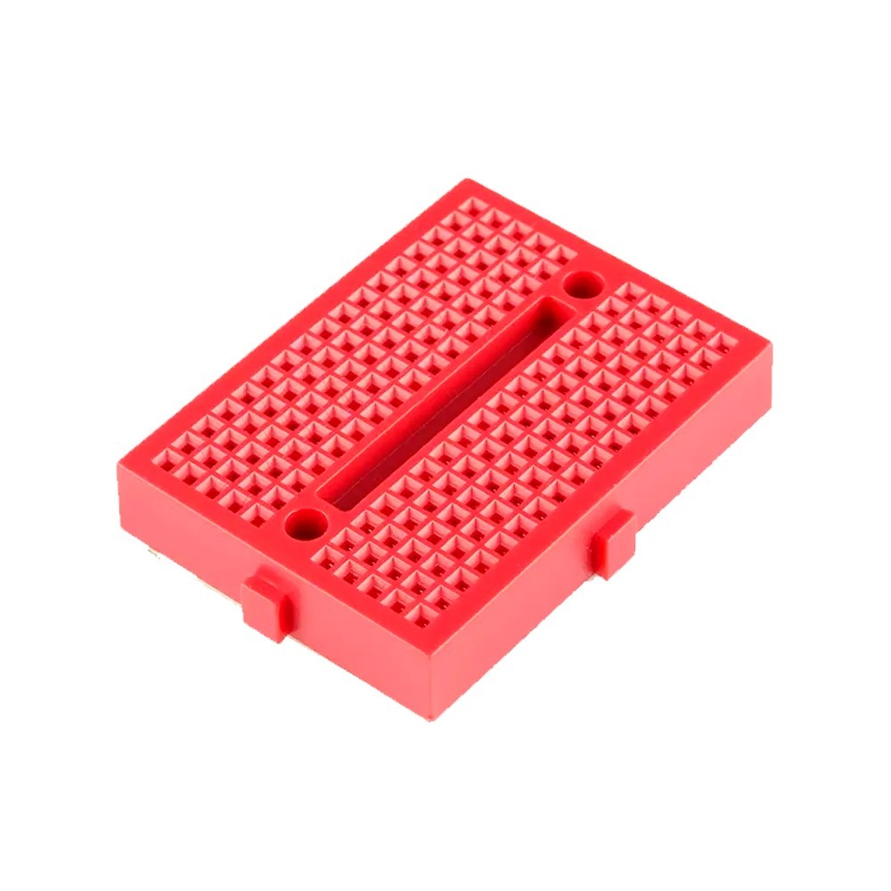
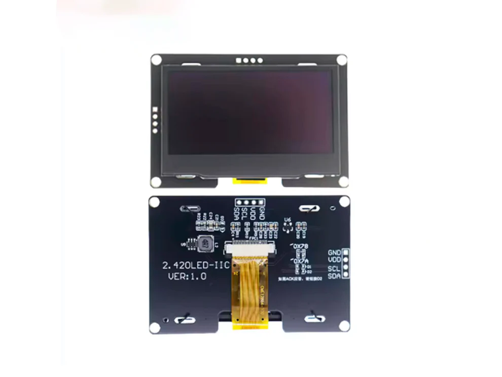
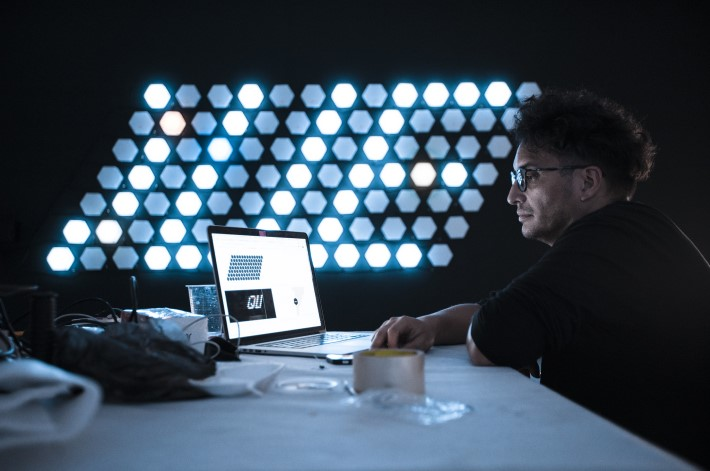
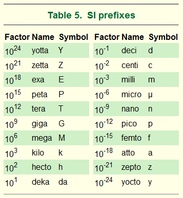
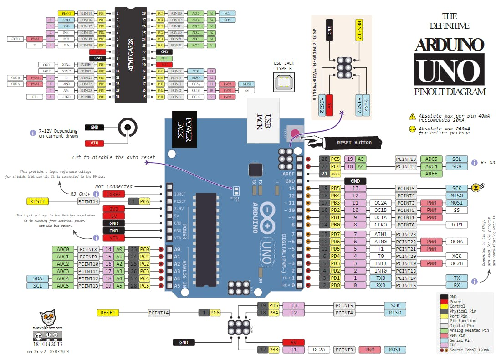

# sesion-03b
22-08-25

presentacion de materiales que utilizaremos en la sesion 04a :

- mini protoboard 170 puntos
 
   
  
- pantalla oled
 
  
 
display resolution: numero de pixeles en cada dimensión que pueden mostrarse.

daniel cruz --> artista visual que trabaja con pantallas led



plataforma arte y medios

para prototipado usaremos tinkercad y wokwi

pantalla oled usa un protocolo llamado i2c

i2c --> comunicación entre diferentes partes de un circuito, por ejemplo, entre un controlador y circuitos periféricos integrados.

metric prefix --> se utilizan para nombrar a los múltiplos y submúltiplos de cualquier unidad del SI (Sistema Internacional de Unidades)



los elementos están calibrados para un volataje particular.

GND --> tierra

VCC --> volatje

SCL --> signal clock

SDA --> datos



library --> biblioteca de codigos 

usamos la biblioteca de adafruit 

adafruit, creada por ladyada

importante: fijarse bien en la placa en la que estoy conectando, ya que muchas bibliotecas, como la que usamos de adafruit, me dice donde debo conectar cada pin según la placa que quiero usar.

el ejemplo no funcionó, ya que la direccion de i2c estaba incorrecta, ya que debia ir en XC y no en XD

esos números son hexadecimales que significan otras cosas en binario

0x3C = 0111100

0x3D = 0111101

if(!display.begin(SSD1306_SWITCHCAPVCC, SCREEN_ADDRESS)) { // ! quiere decir "lo contrario"

## funciones
ejemplos de funciones:

pantallita.clearDisplay(); // Limpiamos toda la pantalla

pantallita.setTextSize(2); // Tamaño de texto más grande

pantallita.setTextColor(SSD1306_WHITE);

codigo de ejemplod visto en la clase con algunos cambios.

```cpp
#include <Wire.h>
#include <Adafruit_GFX.h>
#include <Adafruit_SSD1306.h>

//estos son llamados a bibbliotecas instaladas
//si no las tengo
//habrá un error
//si yo muevo estas carpetas de lugar
//no las encontrará

#define SCREEN_WIDTH 128
#define SCREEN_HEIGHT 64
#define OLED_RESET -1
Adafruit_SSD1306 pantallita(SCREEN_WIDTH, SCREEN_HEIGHT, &Wire, OLED_RESET);

int contador = 0;

void setup() {
  if(!pantallita.begin(SSD1306_SWITCHCAPVCC, 0x3C)) {
    Serial.println(F("No se encontró la pantalla SSD1306"));
    for(;;);
  }
  pantallita.clearDisplay();
  pantallita.setTextColor(SSD1306_WHITE);
}

void loop() {
  pantallita.clearDisplay(); // Limpiamos toda la pantalla
  pantallita.setTextSize(2); // Tamaño de texto más grande
  String mensaje = "Contador:";
  int16_t x1, y1;
  uint16_t w, h;
  
  // Medimos el ancho del texto para centrarlo horizontalmente
  pantallita.getTextBounds(mensaje, 0, 0, &x1, &y1, &w, &h);
  pantallita.setCursor((SCREEN_WIDTH - w)/2, 0);
  pantallita.println(mensaje);

  // Mostramos el número centrado
  String numero = String(contador);
  pantallita.getTextBounds(numero, 0, 0, &x1, &y1, &w, &h);
  pantallita.setCursor((SCREEN_WIDTH - w)/2, 30); // 30 píxeles hacia abajo
  pantallita.println(numero);

  pantallita.display(); // Actualiza la pantalla
  contador++;
  delay(1000);
}
```
podemos incluir imagenes conviertiendolas a bit.

lo podemos hacer con la siguiente página:

https://javl.github.io/image2cpp/

fijarse bien en el tamaño de la imagen y en la resolución.

