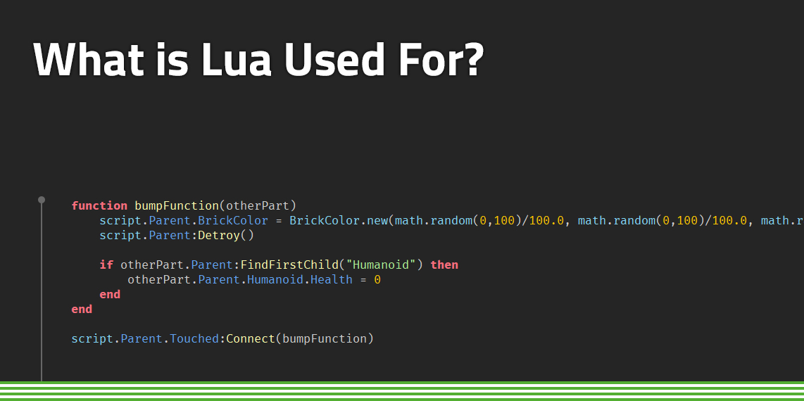

# sesion-05a
02-09-25

## Apuntes
Teloneo 

- Todo tiene cualidades.
- La materia y su forma > filosofía de Aristóteles, la materia es lo que una cosa está hecha, mientras que la forma es la escencia o estructura que determina esa materia.
- [OOO](https://en.wikipedia.org/wiki/Object-oriented_ontology): Ontología Orientada a Objetos. Corriente filosófica asociada al realismo especulativo que propone que los objetos (físicos, ideales, conceptuales) son entidades primordiales de la realidad
- Fenomenología > el estudio de las cosas como aparecen
- [POO](https://es.wikipedia.org/wiki/Programaci%C3%B3n_orientada_a_objetos) Programación orientada a objeto
- 10 categorías aristotélicas
- lenguaje [C++](https://es.wikipedia.org/wiki/C%2B%2B)

Cuando se explica algo a alguien que no sabe nada, primero se dice:
- De qué está hecho.
- Para qué sirve.

### Bjarne stroustrup

Es un científico de la computación y catedrático de Ciencias de la computación en la Universidad A&M de Texas. Es conocido por ser desarrollador del lenguaje de programación [C++](https://es.wikipedia.org/wiki/C%2B%2B). Además tiene un libro sobre el lenguaje de programación C++
  


[Processing](https://processing.org/): Es un software flexible y un lenguaje para aprender a programar

## Arduino
Lenguaje c++ o cpp

programamos el arduino en c++ y no en javascript porque tiene compresión 

- `#ifndef` → Se usa para comprobar si algo no está definido.
- `#endif` → Indica el final del bloque `#ifndef`.
- `public` → Los miembros declarados aquí son accesibles desde cualquier parte del programa.

lua programming language: Es un lenguaje de programación multiparadigma, imperativo, estructurado y bastante ligero, que fue diseñado como un lenguaje interpretado con una semántica extendible. Está diseñado principalmente para ser utilizado de manera incorporada en aplicaciones.​



tres puntitos> new tab> nueva pestaña, para tener otra pestaña en el mismo documento 

documento.h > tipo de archivo de c++

### Ejemplo

```cpp
#ifndef CONSTANTES_H
#define CONSTANTES_H

const int numEstudiantes = 29;

#endif
```
**¿Qué significa?**

`#ifndef CONSTANTES_H`

- Significa: "si NO está definido CONSTANTES_H..."
- Sirve para evitar que este archivo se incluya más de una vez en el programa.

`#define CONSTANTES_H`

- Ahora se define CONSTANTES_H, marcando que el contenido ya se incluyó.
- Si se intenta incluir otra vez, se ignora para no duplicar código.

`const int numEstudiantes = 29;`

- Declara una constante entera llamada numEstudiantes que siempre vale 29.
- No se puede cambiar su valor en ninguna parte del programa.

`#endif`

- Indica el final del bloque de protección iniciado con #ifndef.
  
 --> Se usa para evitar errores de compilación cuando el mismo archivo .h se incluye varias veces.
 
 ## Clases
Archivos `.h`

```cpp
#ifndef PERSONA_H
#define PERSONA_H

class Persona {

public:
  // Métodos
  Persona(bool vida);  // Constructor
  ~Persona();          // Destructor
  void setEdad(int nuevaEdad);  // Establece la edad
  int getEdad();                // Devuelve la edad

  // Atributos
  bool estaViva;
  int edad;

};

#endif
```
--> Esto se usa para:
- Es un molde para crear objetos del tipo Persona.
- Los objetos tendrán atributos y métodos.

### Métodos
#### Constructor

```cpp
~Persona();
```
Se ejecuta al destruir un objeto.

```cpp
Persona(bool vida);
```
Se ejecuta al crear un objeto.
- Vida indica:

true → persona viva.

false → persona muerta.

#### Destructor

```cpp
~Persona();
```
Se ejecuta al destruir un objeto.

```cpp
~Persona();
```
Se ejecuta al destruir un objeto.

#### Setters y getters

- `void setEdad(int nuevaEdad);` → Asigna edad.

- `int getEdad();` → Devuelve edad.

#### Atributos

- `bool estaViva;` → Estado de vida.

- `int edad;` → Edad de la persona.

---
Archivos `.cpp`

```cpp
#include "Persona.h"

// constructor
Persona::Persona(bool vida) {
  Persona::estaViva = vida;
}

// destructor
Persona::~Persona() {}

// set edad
void Persona::setEdad(int nuevaEdad) {
  Persona::edad = nuevaEdad;
}

// get edad
int Persona::getEdad() {
  return Persona::edad;
}
```
- Contiene la implementación de los métodos declarados en el `.h`.
- Aquí se escribe qué hace cada función en detalle.

## Información importante
- Cuando algo está en mayúsculas significa que es muy importante.
- Las clases comienzan con mayúscula.
  

