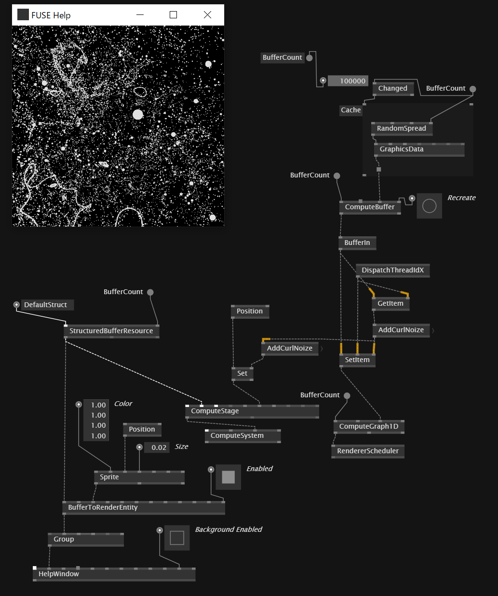
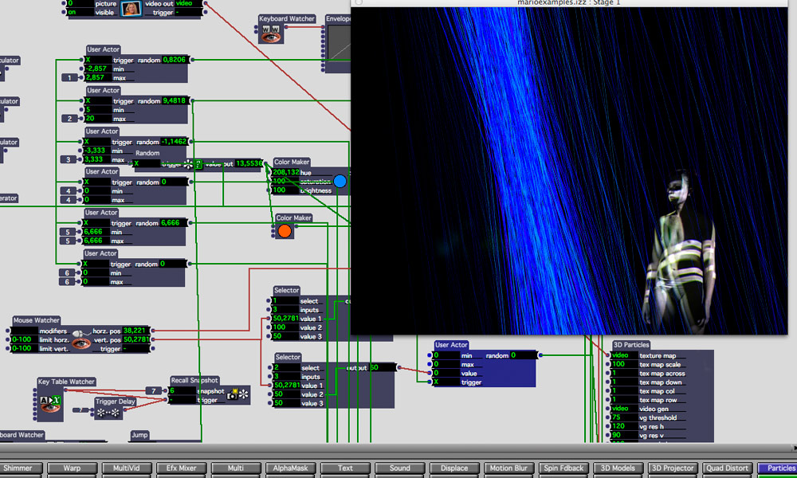
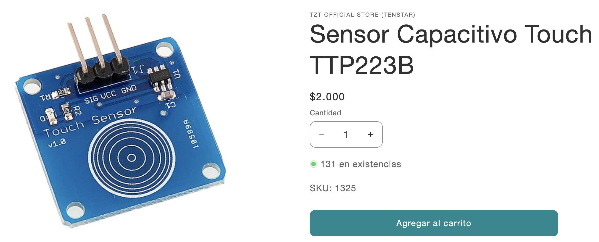
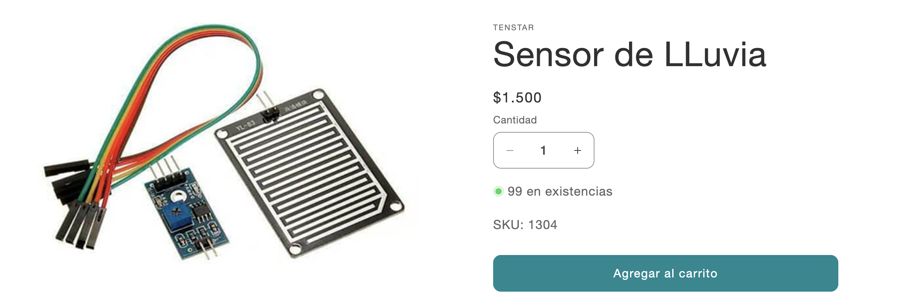
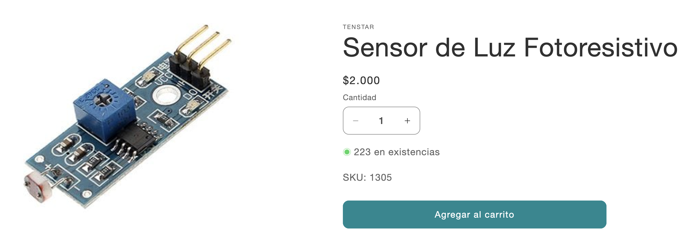
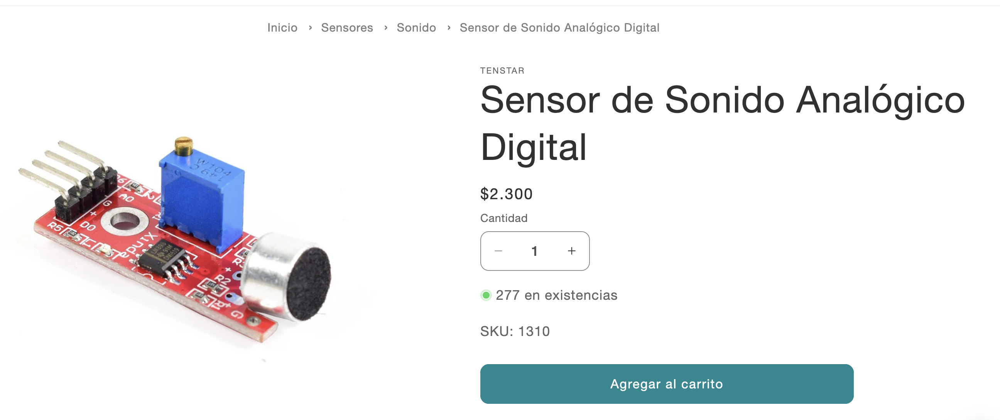
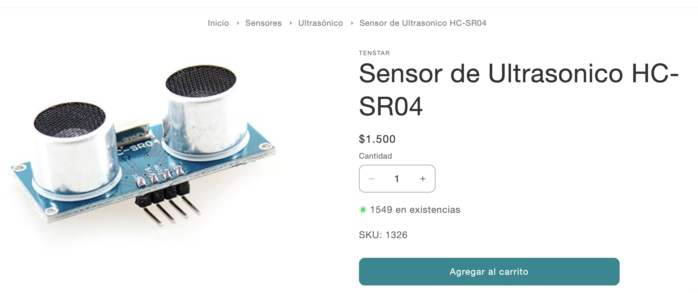

# sesion-06a
09/09/25

teloneo

Scratch, es un motor de videojuegos desarrollado por MIT Media Lab.​ Su principal característica consiste en que permite el desarrollo de habilidades mentales mediante el aprendizaje de la programación sin tener conocimientos profundos sobre el código.

https://scratch.mit.edu/ 

Miller Puckette, es un matemático, programador y profesor de música estadounidense, director asociado del CRSA, así como miembro del claustro de la facultad de la UC University of California en San Diego donde trabaja desde 1994. 

Desarrolló un lenguaje de programación llamado Pure Data, el cual sirve para la creación de música por ordenador interactiva y obras multimedia.

vvvv, Es un entorno de programación híbrido (visual/textual) que permite a los usuarios construir aplicaciones de forma modular, conectando "nodos" para crear "parches". 

https://vvvv.org/

https://natansinigaglia.com/works/forms-of-resonance/ --> performance multisensioral hecha en vvvv.

Las imágenes responden en directo a la música a medida que se interpreta, añadiendo un elemento espontáneo e inmediato a la experiencia. Esto se consigue gracias al Yamaha Disklavier, un piano que graba cada nota y cada gesto, y envía los datos a un software personalizado que crea entornos visuales dinámicos. Otros controladores de movimiento siguen los movimientos de las manos y los dedos del pianista, que se visualizan junto con la música. Un rastreador de movimiento independiente permite al artista visual dar forma de forma interactiva a la escena tridimensional.

Otro entorno de programación visual/textual es Isadora de Troikatronix.

https://troikatronix.com/

Cierre de telón

## Apuntes
Revisamos github.

que es linthacker?

podría referirse a la idea de usar herramientas de "linting" (análisis de código) para encontrar y "hackear" (corregir o explotar) fallas en el código.

-# + espacio significa comentario
- YAML, formato de serialización de datos legible por humanos que se utiliza principalmente para archivos de configuración y para transmitir datos entre sistemas.

Las actions son acumulativas, te muestra el historial de cosas que han pasado. El más nuevo es el que vale.

LaTeX es un sistema de composición de textos orientado a la creación de documentos escritos que presenten una alta calidad tipográfica.

https://es.overleaf.com/learn/latex/Learn_LaTeX_in_30_minutes#What_is_LaTeX? 

---

proyecto 02

crear una máquina que saluda. Grupos de 4 a 5 

## encargo
- imaginar 3 o mas formas para usar sensores en conjunto con arduino
- investigar sensores y actuadores
- cotizar
- investigar referentes
  
### sensores y actuadores
Sensor capacitivo TTP223B

utiliza el circuito integrado TTP223B que es un sensor touch capacitivo. En su estado normal la salida del módulo se encuentra en cero lógico y baja consumo de corriente, cuando un dedo toca la posición correspondiente la salido del módulo se activa en uno lógico, sino se toca el modulo en 13 segundos vuelve a modo de bajo consumo.

- $2.000 AFEL
- $1.118 + envío Aliexpress
- $900 + envío hubot

Sensor de LLuvia

Permite detectar gotas de lluvia, como un sensor de lluvia, y seguimiento de humedad y se puede utilizar para una variedad de condiciones climáticas. Convierte en números la señal de referencia de salida output AO. La salida analógica puede ser conectada al puerto AD de un microcontrolador para detectar la intensidad de la humedad y la precipitación.

Posee un amplificador operacional, específicamente el circuito integrado LM393. Este es el encargado de amplificar el pequeño diferencial de voltaje que se general cuando una gota de agua cae sobre las pistas del módulo.

- $1.500 AFEL
- $600 + envío zamper
- $2.000 + envío Mercadolibre

Sensor de luz

Capta la luz del medio ambiente por medio de un fotoresistor. Cuando la luz supera el umbral ajustado se acciona la salida digital del módulo. El valor de umbral puede ser ajustada por el potenciómetro multivuelta.

- $2.000 AFEL
- $1.050 Mechatronicstore
- $3.990 + envío Mercadolibre

Sensor de Sonido Analógico Digital

Puede detectar la intensidad de sonido que se presenta en el medio ambiente, cuenta con un potenciómetro el cual permite ajustar su sensibilidad, así­, de esta manera solo se detectarí­an ciertos niveles de frecuencia (sonidos).

- $2.300 AFEL
- $3.805 + envío Mercadolibre
- $3.790 + envío hubot

Sensor de Ultrasonico HC-SR04

Miden la distancia a la que están respecto a un objeto por medio de un sistema de medición de ecos.
Estos sensores está formados por un transductor que emite un pulso corto de energí­a ultrasónica, cuando el pulso es reflejado por un objeto, el sensor captura el eco producido por medio de un receptor, y mediante un sistema de tratamiento de la señal, calcula la distancia a la que está de dicho objeto.

- $1.500 AFEL
- $2.590 mcielectronics
- $1.500 Prodelab
  
### Ideas uso de sensores
- Caja que canta con la luz (sensor LDR)
- Teclado invisible (sensor capacitivo)
- Flor que se abre cuando alguien acerca la mano (sensor de proximidad)
- Plantas que cantan (sensor de humedad)
- Tejidos que dibujan (sensor ultrasónico)
  
### Referentes que me gustan 
- Afroditi Psarra -> https://blog.arduino.cc/2013/07/15/afroditi-experiments-with-embroidery-soft-circuit-and-diy-electronics/
- https://dl.acm.org/doi/abs/10.1145/3721249.3731636
- https://stevezafeiriou.com/arduino-art-projects/
- Pounikko -> https://www.behance.net/gallery/48320961/Pounikko-Interactive-textile-surface?tracking_source=search_projects|arduino+art&l=5

  
