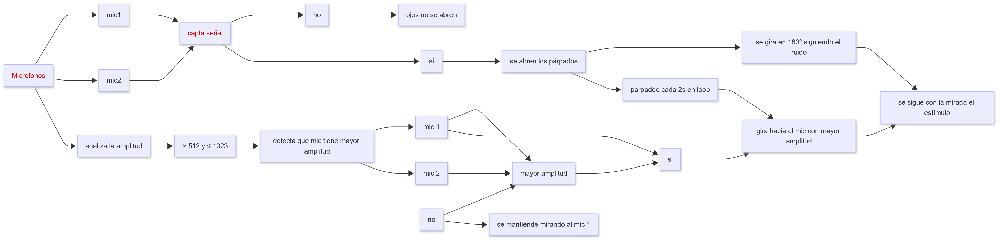

# sesion-07b

26/09/25

## Proyecto 02: Investigación y seudocódigo

Es posible comprimir un mismo proyecto en su totalidad mediante arduino y mandarlo a otra persona.

Crear los seudo códigos de nuestro proyecto.

Usaremos 2 servomotores. 1 para controlar ambos párpados, y otro para controlar la rotación de la estructura. Ambos servomotores serán de 90° 

Seudo código:

```cpp
int valorMic;
void setup() {
  Serial.begin(9600);
}

void loop() {
valorMic = analogRead(A0);
valorMic = constrain(valorMic, 511, 1023);
Serial.println(valorMic);
delay(500);
}
```

```cpp

const int sampleWindow = 50;  // Sample window width in mS (50 mS = 20Hz)
int const AMP_PIN = A0;       // Preamp output pin connected to A0
unsigned int sample;

void setup()
{
  Serial.begin(9600);
}

void loop()
{
  unsigned long startMillis = millis(); // Start of sample window
  unsigned int peakToPeak = 0;   // peak-to-peak level

  unsigned int signalMax = 0;
  unsigned int signalMin = 1024;

  // collect data for 50 mS and then plot data
  while (millis() - startMillis < sampleWindow)
  {
    sample = analogRead(AMP_PIN);
    if (sample < 1024)  // toss out spurious readings
    {
      if (sample > signalMax)
      {
        signalMax = sample;  // save just the max levels
      }
      else if (sample < signalMin)
      {
        signalMin = sample;  // save just the min levels
      }
    }
  }
  peakToPeak = signalMax - signalMin;  // max - min = peak-peak amplitude
  Serial.println(peakToPeak);
  //double volts = (peakToPeak * 5.0) / 1024;  // convert to volts
  //Serial.println(volts);
}
```

```cpp
//en este codigo, se calcula a cual mic le llega sonido con mayor intensidad,
//de eso depende si se reste mic1-mic2 o mic2-mic1.
//Esto con el proposito de que el valor sea siempre positivo

//luego usando el resultado de la resta, el servo se mueve esa cantidad resultante(mapeada)
//es por esto que dependiendo de cuál mic recibia sonido con mayor intensidad, 
//el servo corre de derecha a izquierda, o de izquierda a derecha
int valueMic1;
int valueMic2;

if(valueMic1>valueMic2){
 origenSonido = valueMic1-valueMic2;
 apuntacionServo = map(origenSonido, 0, 1023, 10, 170); 
}else if(valueMic1<valueMic2){
 origenSonido = valueMic2-valueMic1;
 apuntacionServo = map(origenSonido, 0, 1023, 170, 10); 
}
```

```cpp
//en este ejemplo, mic0,mic1 y mic2 estan colocados de izquierda a derecha, en ese orden. 
int mic0;
int mic1;
int mic2;

mic0 = analogRead(A0);
mic1 = analogRead(A1);
mic2 = analogRead(A2);

if(mic0 > mic1 && mic0 > mic2){
   Serial.println("hay un wn q me quiere matar a la izquierda");
}else if(mic1 > mic0 && mic1 > mic2){
   Serial.println("hay un wn q me quiere matar al frente");
}else if(mic2 > mic0 && mic2 > mic1){
   Serial.println("hay un wn q me quiere matar a la derecha");
}
```

```cpp
//en este ejemplo, los posibles lugares donde apuntará el servo, son separados en zonas. De esta manera, asumimos que siempre que el microfono de la izq reciba sonido con mayor intensidad, significa que el sonido proviene desde la izquierda. Lo mismo para el micro a la derecha
int micA;
int micB;

bool zona0 = false;
bool zona1 = false;

mic0 = analogRead(A0);
mic1 = analogRead(A1);


if(mic0 > mic1){
   zona0 = true;
   zona1 = false;
}else if(mic1 > mic0){
  zona0 = false;
  zona1 = true;
}

//si se detecta desde la zona izq, el movimiento se limita desde 0 hasta 45°
//si se detecta desde la zona izq, el movimiento se limita desde 45° hasta 90°
if(zona0 && !zona1){
   servo = map(servo, 0, 1023, 0, 44);
}else if(!zona0 && zona1){
   servo = map(servo, 0, 1023, 45, 90);
}
```

## Investigación de la audicion bineural.

La binauralidad se entiende como la capacidad del cerebro para procesar la información que llega desde los dos oídos y así construir una percepción espacial del sonido.

Diferencias interaurales de tiempo (ITD): el sonido llega antes a un oído que al otro. El cerebro mide ese micro–desfase para ubicar la dirección (muy útil para frecuencias bajas).

Diferencias interaurales de nivel (ILD): la cabeza bloquea parte del sonido, por lo que llega más fuerte a un oído que al otro (especialmente en frecuencias altas).

Efecto del pabellón auditivo: la forma del oído externo modifica el sonido según el ángulo, ayudando a percibir altura y profundidad.

Gracias a esto el cerebro logra:

Localizar la fuente sonora en el espacio.

Percibir distancia y tridimensionalidad.

Separar voces o sonidos en ambientes ruidosos.

En lo artístico-tecnológico es el uso creativo de la escucha con dos oídos para generar experiencias inmersivas y espaciales.

La binauralidad es una función neuroacústica que convierte las pequeñas diferencias entre lo que oye cada oído en una experiencia sonora 3D natural.

Esta investigación nos permitirá entender que es lo que "escucha" y como funciona nuestro proyecto al tener este 3 microfonos y 2 servomotores que le darán la sensación de que está buscando de donde viene el sonido, mirando especificamente hacia el lugar de donde proviene el sonido.


fuente -> OpenBinaural by CarlosGS https://github.com/CarlosGS/OpenBinaural?tab=readme-ov-file

hacer un diagrama de flujo de como funciona el proyecto

documentar funcionamiento de cableado y código

---

Diagrama de flujo según mi entendimiento de como funciona el proyecto


