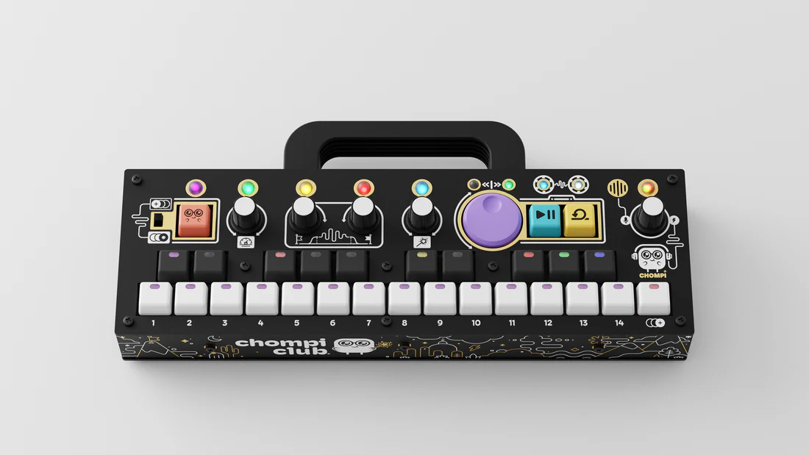
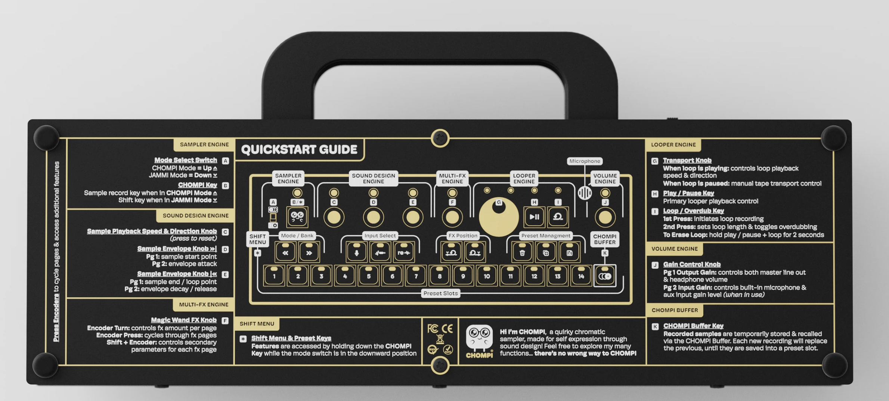
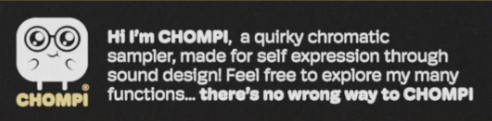
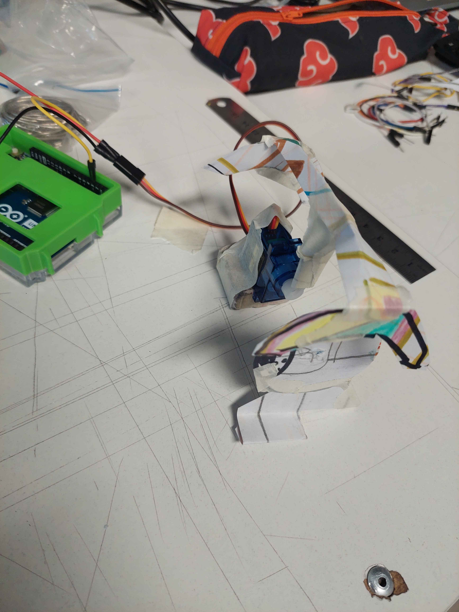

# sesion-08a
30/10/25

Teloneo

Aarón trajo un chompi, que es un sampler compacto y pórtatil, lanzado en 2023 por Chelsea y Tobias Hendrickson. Diseñado para ser accesible y sin pantalla, el sampler utiliza LED y etiquetas físicas para mostrar el estado de varios filtros y efectos. Lo amé y ahora quiero uno para mi.

Me parece muy genial que tenga un manual de como usarlo en la parte de atrás/debajo.

Además el personaje es muy lindo. Lo amo y quiero una figurita de chompi.

Siento que se parece a mi un poco... ojalá que si.

Cierre telón

---

## Trabajo en grupo en los proyectos 
clase express de misaa sobre el sonido. mucha matemáticas para mi nulo conocimiento, admito que me disocié un poco.

Esto es lo que retuve:

Ecuación de la onda: y(x,t) = A sin (wt + kx + ∂)

Amplitud: que tan fuerte llega el sonido

Frecuencia: cuantas veces se repite por segundo, cuantas ondas caben en un segundo

Periodo: cuanto tiempo dura un ciclo de onda

Cambiando el ángulo se pude medir la forma e intensidad de onda, esto depende de la amplitud y del ángulo 

Calibrar los micrófonos con un parlante, los dos a la misma distancia, se mueve la perilla para calibrar.

Detectar la diferencia de amplitud de los estímulos, comparar las dos señales de los dos micrófonos.

---

Documentación de nuestro proceso

