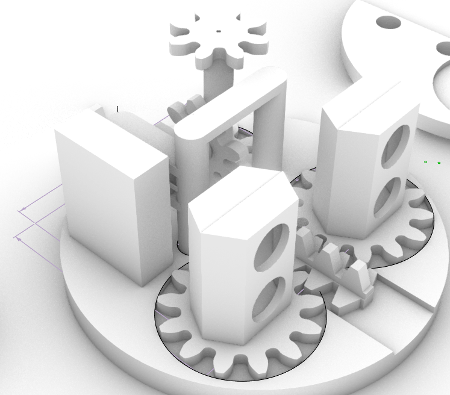

 # sesion-10a
14/10/25

---
Hoy nuestro compañero Santiago https://github.com/santiagoClifford trajo un nuevo prototipo de nuestro proyecto, consta de un sistema de engranajes en una estructura base que movera la estructura completa. 



Félix https://github.com/felix-rg416 , hizo una versión del código, llamada codigo-10a, para no dañar el que hicimos la semana pasada.

## Código 
Me tocó trabajar en el código junto con Antonia https://github.com/AntFuentealba , se nos dificultó un poco debido a la gran cantidad de componentes que tenemos en el proyecto, sin embargo el código final compila de forma correcta y sin errores.

Aquí hay una parte del código:

```cpp
void setup() {
  Serial.begin(9600);
  sensores.configurar(10);
  cuello.configurar();
  parpados.configurar();
  sensorProxIZQ.configurar();
  sensorProxDER.configurar();

  sensores.moverMotorcillo(90, 0);
  cuello.moverMotorcillo(90, 0);
  parpados.moverMotorcillo(0, 0);

  Serial.println("Iniciando sistema de ojos...");
}
```

## Visitas
Durante la clase recibimos la visita de 2 personas, maguimolinari y de mecha.mio. Nos dieron su opinión en cuanto a nuestro proyecto y nos dieron varios consejos que nos ayudo a resolver algunas dudas que teniamos sobre el funcionamiento de los engranajes. Además nos hablaron sobre su trabajo, nos contaron que en la universidad en donde trabajan existe una sala inmersiva donde los estudiantes pueden experimentar con visualidades y sonidos, me gustó mucho imaginarme en ese lugar, quisiera que la udp implementara ese tipo de recursos para el alumnado.
