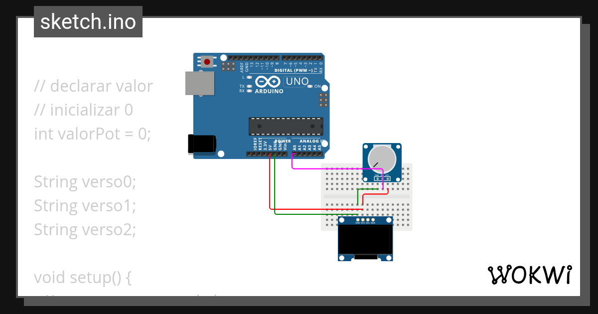
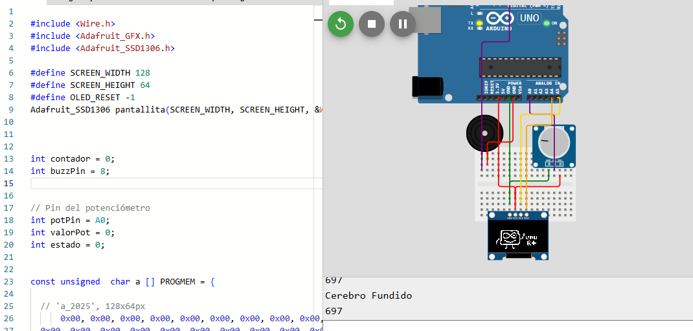

# sesion-04a
( entrega de cajas , pantalla , cables,breadboard, buzzer)

Protoboard : o breadboard es una herramienta para facilitar la conexión de componentes gracias que las columnas están interconectas , es decir que si conecto algo en la columna 6 todo lo que se conecte en el resto de los espacios de esta se conectaran  

Potenciómetros  un componente que puede interpretar datos análogos para el Arduino 

diferencia entre digital  y análogo
 Digital: discreto , pixeles , hora 
 Análogos: continuo, colores gradientes, tiempo

Ejemplo de como ocupar un potenciómetro 
 imagen de como se conecta 
 

## Avance 

### Buzzer
Buzzer Activo vs. Pasivo:
Los buzzers activos solo necesitan una señal para sonar, mientras que los buzzers pasivos requieren una señal de frecuencia para producir el sonido.
Función tone():
Es la función más versátil para los buzzers pasivos, permitiendo definir la frecuencia (tono) y la duración de la nota.
Función analogWrite():
Para buzzers que funcionan con PWM (la mayoría de los módulos de 3 pines), se puede usar analogWrite() con valores de 0 a 255 para controlar la señal, pero es menos común para crear melodías.
Pines PWM:
Algunos pines en la placa Arduino tienen capacidad PWM (marcados con un ~), pero la función tone() puede interferir con el PWM en los pines 3 y 11 de algunas placas, como el Arduino Uno.

**codigo buzzer**
```cpp
int buzzPin = 8;
int potVal;
int potPin = A5;


void setup() {
  // put your setup code here, to run once:
Serial.begin(9600);
pinMode(buzzPin, OUTPUT);
pinMode(potPin, INPUT);
}

void loop() {
  // put your main code here, to run repeatedly:

potVal = analogRead(potPin);
Serial.println(potVal);

if (potVal > 1000){
digitalWrite(buzzPin,HIGH);
}

if (potVal <= 1000){
  digitalWrite(buzzPin, LOW);
}
}
```


<https://www.youtube.com/watch?v=PfXZ3ptiGVA>

* ver como se utiliza el buzzer con un potenciómetro , estidiar ejemplo del video , para agregar el buzzer al codigo del encargo . Tratar de que el buzzer suene cuando hay un cambio en la pantalla 


