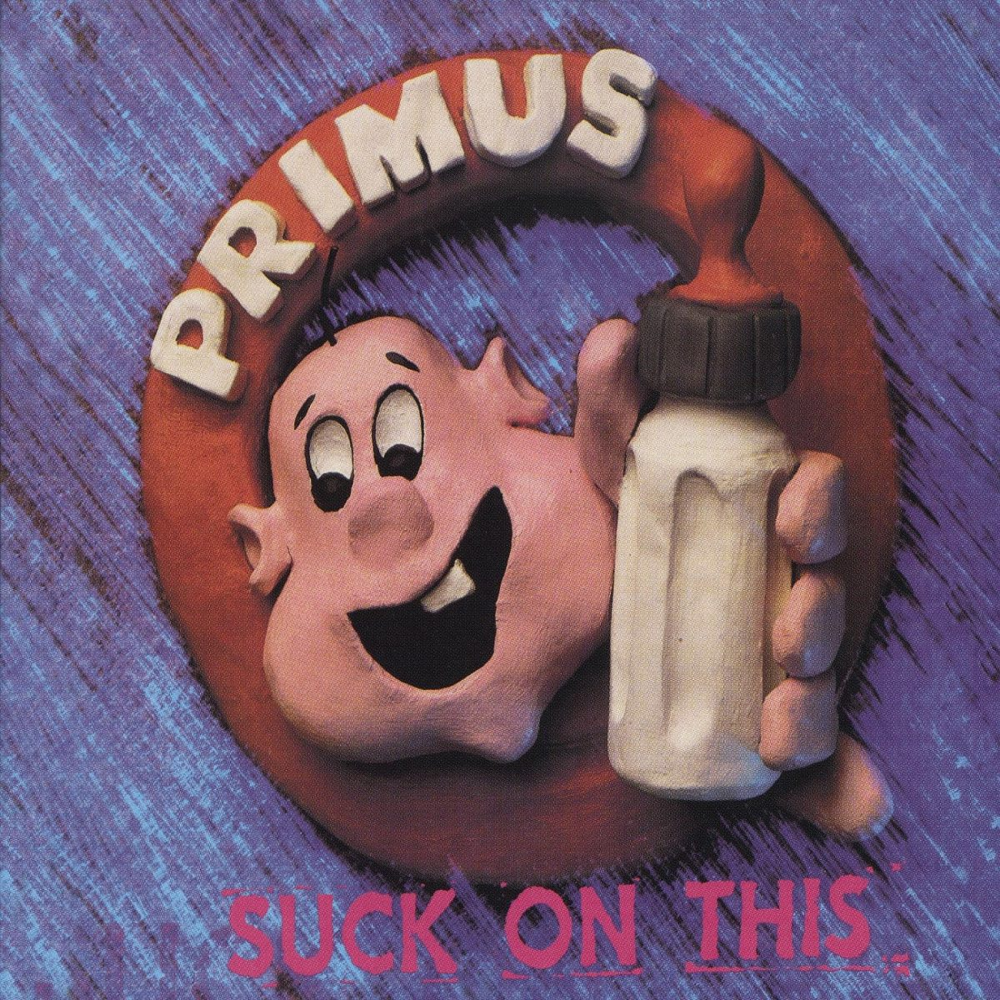

# sesion-05b

## error actions

<https://www.w3schools.com/>
 ejemplo

```cpp
#ifndef TEXTO_H
# define TEXTO_H
```

### error actions listo

```cpp
class texto
{
  public:
 // constructor
  texto();
 // destructor
    ~texto ();
```
## Encargos 

### -escuchar y comentar uno de los tres primeros discos de la banda Primus

<https://www.youtube.com/watch?v=R6DBWwjN9qY&list=RDR6DBWwjN9qY&start_radio= 1>

Primus es una banda estadounidense formada a fines de los años ochenta, conocida por su estilo único que mezcla funk, metal y humor absurdo. Su líder, Les Claypool, destaca por su forma muy técnica y poco convencional de tocar el bajo, lo que le da a la banda un sonido completamente distinto al de otras del mismo tiempo.

Su primer disco, *Frizzle Fry* (1990), refleja toda esa originalidad desde el comienzo. Tiene un sonido crudo, lleno de energía y con un bajo que domina las canciones. Las letras son extrañas y divertidas, y todo el álbum se siente experimental y fuera de lo común. Me pareció interesante escuchar algo tan diferente, aunque no es mi estilo de música; fue más una experiencia curiosa que algo que escucharía seguido.

### investigar sobre la obra de Mitchel Resnick, leer uno de sus escritos o ver una de sus charlas, y comentarla críticamente

<https://www.youtube.com/watch?v=Ok6LbV6bqaE>

Mitchel Resnick es profesor del MIT Media Lab y director del grupo Lifelong Kindergarten. Es conocido por crear Scratch, una plataforma de programación para niños y jóvenes, y por su trabajo en educación creativa. Su enfoque se centra en que las personas aprendan creando, jugando y experimentando, fomentando la curiosidad, la colaboración y la expresión personal desde temprana edad.

Me parece muy interesante su forma de enseñar porque pone el foco en crear, jugar y experimentar, en lugar de solo memorizar cosas. La idea de aprender a programar como una forma de expresarse y divertirse es genial. Obvio, no todos tienen acceso a las herramientas que él usa, así que a veces puede ser difícil aplicarlo en todos lados, pero igual es un buen recordatorio de que aprender puede ser creativo y en grupo, no solo en la clase tradicional.
