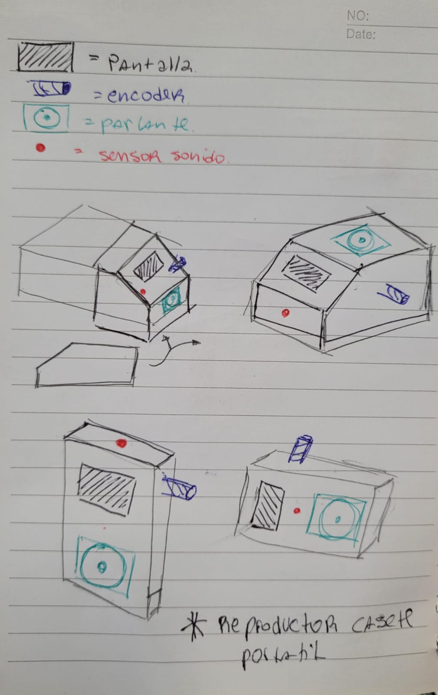

# sesion-09b
## Trabajo en clase 
Estube trabajndo en el codigo pasando los archivos .ino a .h y .cpp lo hice con la pantalla y como debe quedar el sensor sonido falta agragar lo que trabajo angie con los aplausos , ideamos bocetos de como puede ser la carcasa 
