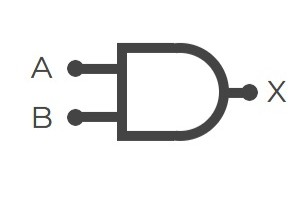
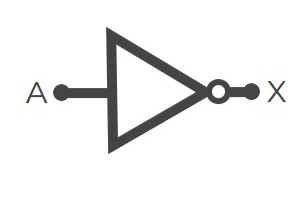
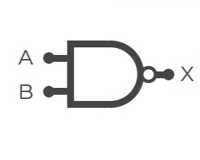
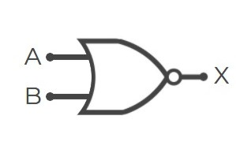
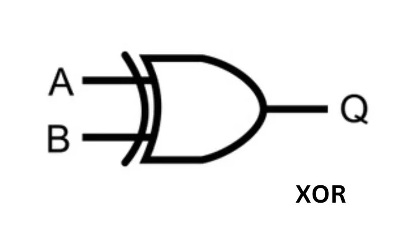

# sesion-03a

19 de agosto

- <https://isitchristmas.com/> - una página que dice si es navidad o no
- Pantalla OLED
- [millis en Arduino](https://docs.arduino.cc/language-reference/en/functions/time/millis/)

El viernes 29 de agosto tenemos entrega. Ver [00-proyecto-01](https://github.com/felix-rg416/dis8645-2025-02-procesos/tree/main/00-proyecto-01)

## Condicionales e iteradores

```cpp
if (Boolean condition) THEN
    (consequent)
else
    (alternative)
``


```cpp
if (estaLloviendo==true) {
    hacerSopaipillas();
}
else {
    salirAAndarEnBici();
}
```

```cpp
// si no hay arana
// reacciono tranqui
if (!hayArana){
    reaccionarTranqui();
}
else{
    chillar(volumen = infinito)
}
```

```cpp
// si mi edad es igual o mayor a 18
// y es menor a 80
if (edad >= 18 AND edad < 80){
// puedo conducir
    puedoConducir();
}
```

```cpp
// !
if (diciembre AND donFrancisco AND !godZilla AND !lecciones){
    teleton;
}
```

- Operadores lógicos --> OR - AND
- El ``else``es opcional
- = es para asiganr un valor
- == comparación - Es una pregunta ¿lo de la izquierda es igual a la derecha?
  - el else es si la respuesta a la pregunta anterior es NO

> "mientras más escribas más riego de equivocarme" ~Aarón

```cpp
// variable booleana
// la inicializamos falsa
bool prender = false;

void setup(){
// hacer que una patita sea OUTPUT
// usamos la constante incluida en Arduino
// LED_BUILTIN, porque sabe donde está el LED interno
  pinMode(LED_BUILTIN, OUTPUT);
}

void loop() {
  digitalWrite(LED_BUILTIN, prender);
}
```

```cpp
// el serialMonitor genera milisegundos
// en este caso, partido en 1000 para que sean segundos
Serial.println(millis() / 1000)
```

- long es para números muy grandes
  - unsigned long --> es para que parte desde el 0
  - si crean variables con `millis()`, que sean declaradas con  ``unsigned long``

```cpp
// variable booleana
// la inicializamos falsa
bool prendido = false;

void setup() {
  // abre el puerto serial
  Serial.begin(9600);

  // hacer que una patita sea output, salida
  // usamos la constante incluida en Arduino
  // LED_BUILTIN, porque sabe donde esta el LED interno
  pinMode(LED_BUILTIN, OUTPUT);
}

void loop() {
  // hago que "segundos" sea millis() / 1000 
  int segundos = millis() / 1000;

  if (segundos < 3) {
    prendido = true;
  }
  // también si > 10
  else if (segundos > 10){
    prendido = true;
  }
  // si no pasa eso = false
  else {
   prendido = false;
  }

  digitalWrite(LED_BUILTIN, prendido);

  Serial.println(segundos);
}
```

## operadres lógicos

### AND



|A|B|OUT|
|-|-|-|
|0|0|0|
|0|1|0|
|1|0|0|
|1|1|**1**|

### OR


|A|B|OUT|
|-|-|-|
|0|0|0|
|0|1|**1**|
|1|0|**1**|
|1|1|**1**|

### NOT



|A|B|
|-|-|
|0|1|
|1|0|

### iterar

[FOR en Arduino](https://docs.arduino.cc/language-reference/en/structure/control-structure/for/)

se itera con ``for``, se pone entre paréntesis 3 cosas: ``1° partida`` ; ``2° termino``; ``3° cambio entre iteraciones``

entre murciélagos lo que quiero itear

se podría decir que es como un índice

```cpp
int veces;

for (parto; termino; qué hago cada paso)
{
    hazEsto();
}
```

Ejemplo:

```cpp
// int i--> se avbrevia iterar
// i empieza valiendo 0; termina cuando sea mayor que i;
// cuando llegue al final, i es igual a i + 1  
// (también se puede decir "i++" en vez de "i = i + 1")
for (int i = 0; i < veces; i = i + 1)
{
    hazEsto
}
```

```cpp
int numEstudiantes = 29;

void setup() ;

// activa el monitorSerial 
  Serial.begin(9600);

  Serial.begin(9600);

  for (int i = 0; i < numEstudiantes; i++) {
    // imprime "estudiante:"
    Serial.print("estudiante:");
    // imprime un espacio luego de "estudiante:"
    Serial.print(" ");
    // si numEstudiante es menor que 10
    // agrega un espacio antes del número
     if (i < 10) {
    Serial.print(" ");
   }
    // si i es 13 que no aparezca
    if (i != 13) {
    Serial.print(i);
    }
    // imprime el numEstudiantes
    Serial.print(i);
    // imprime un enter
    Serial.print("\n");
    delay(500)
  }
}
```

```cpp
// PARTE 02.2 ~ MISA

//QUIERO PODER DECIRLE A ARDUINO
//EN EL MONITOR SERIAL
//CADA CUANTO TIEMPO PARPADEE EL LED
bool estadoLed = 0;

  int numero1 = 5
  int numero2 = 2
  int division;

void setup() {
  // activamos el pin del led
  pinMode(LED_BUILTIN, OUTPUT);
  Serial.begin(9600);
}

void loop() {
  // crea una variable "segundos" que equivale a
  // "millis() / 1000"
  unsigned long segundos = millis() / 1000;

  //YA QUE division ES UN int
  //ELIMINA TODO LO QUE ESTA DESPUES DE LA COMA
  division = numero1 / numero2;
  // % = restalo, pero no me des el resultado, dame lo que sobra
  resto = numero1 % numero2;
  //EL RESULTADO VA A SER "2", NO "2.5"

  // con esto le pedimos que imprima:
  // la division vale X con un resto de X
  Serial.print("la division vale ");
  Serial.print(division);
  Serial.print(" con un resto de ");
  Serial.println(resto);
}
```

``7/2=3`` con el ``/`` me entrega el resultado

``7%2=1`` con el ``%`` me entrega el sobrante

```cpp
// PARTE 02.2 ~ MISA

//QUIERO PODER DECIRLE A ARDUINO
//EN EL MONITOR SERIAL
//CADA CUANTO TIEMPO PARPADEE EL LED
bool estadoLed = 0;

  int numero1 = 5
  int numero2 = 2
  int division;

void setup() {
  // activamos el pin del led
  pinMode(LED_BUILTIN, OUTPUT);
  Serial.begin(9600);
}

void loop() {
  // crea una variable "segundos" que equivale a
  // "millis() / 1000"
  unsigned long segundos = millis() / 1000;

  //YA QUE division ES UN int
  //ELIMINA TODO LO QUE ESTA DESPUES DE LA COMA
  division = numero1 / numero2;
  // % = restalo, pero no me des el resultado, dame lo que sobra
  resto = numero1 % numero2;
  //EL RESULTADO VA A SER "2", NO "2.5"

  // con esto le pedimos que imprima:
  // la division vale X con un resto de X
  Serial.print("la division vale ");
  Serial.print(division);
  Serial.print(" con un resto de ");
  Serial.println(resto);

  //voy a incrementar numero1 de 1 en 1
  numero1++;
  delay(500);

// cuando los segundos son pares 
// (cuando los divido en 2 y el resto da 0)
//  estadoLed es falso (apagado)
  if (segundos%2 == 0){
    estadoLed = false;
}
// si no es así (si es impar)
// entonces es true (prendido)
  else{
    estadoLed = true;
  }
  digitalWrite(LED_BUILTIN,estadoLed);
}
```

## Encargo

Investigar compuertas:

- NAND
- NOR
- XOR

### Compuerta NAND



|A|B|OUT|
|-|-|-|
|0|0|**1**|
|0|1|**1**|
|1|0|**1**|
|1|1|0|

### Compuerta NOR



|A|B|OUT|
|-|-|-|
|0|0|**1**|
|0|1|0|
|1|0|0|
|1|1|0|

### Compuerta XOR



|A|B|OUT|
|-|-|-|
|0|0|0|
|0|1|**1**|
|1|0|**1**|
|1|1|0|

> imágenes sacadas de:
>
> - <https://mielectronicafacil.com/category/sistemas-digtales/>
> - <https://compraco.com.br/es/blogs/tecnologia-e-desenvolvimento/simbolo-de-xor-desvendando-os-segredos-do-or-exclusivo>

----

Repasar ``if`` y ``else``
