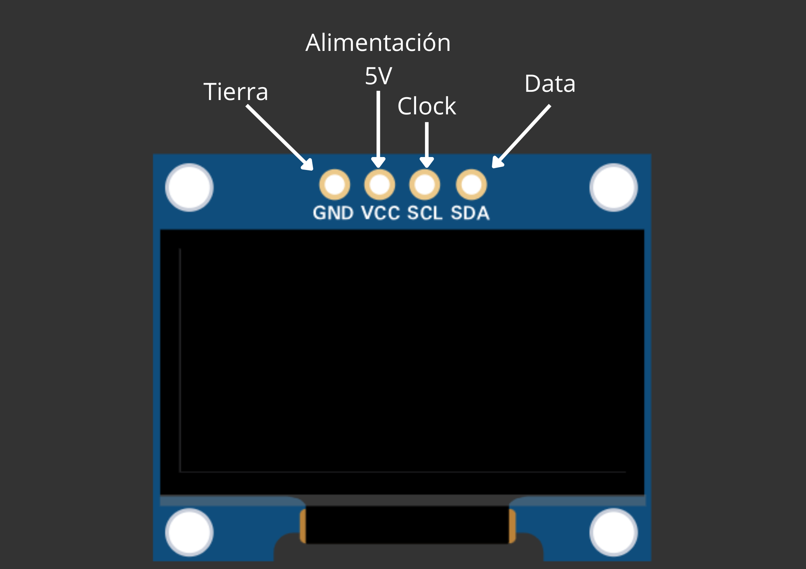
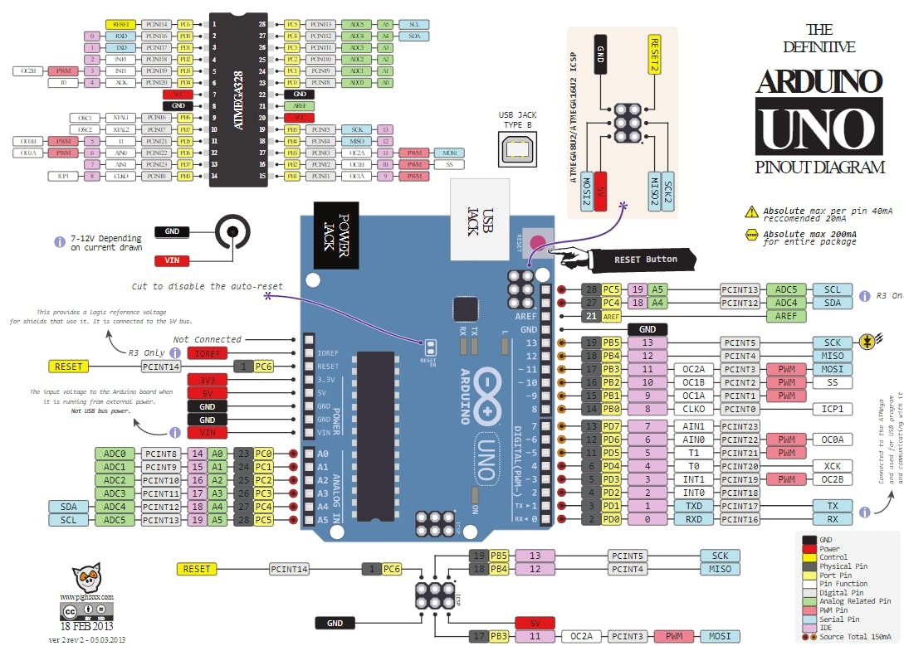
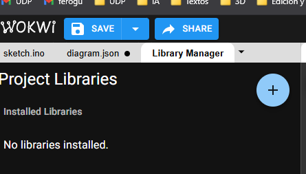
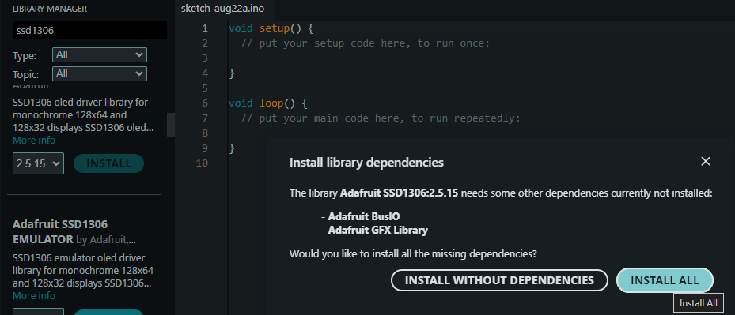
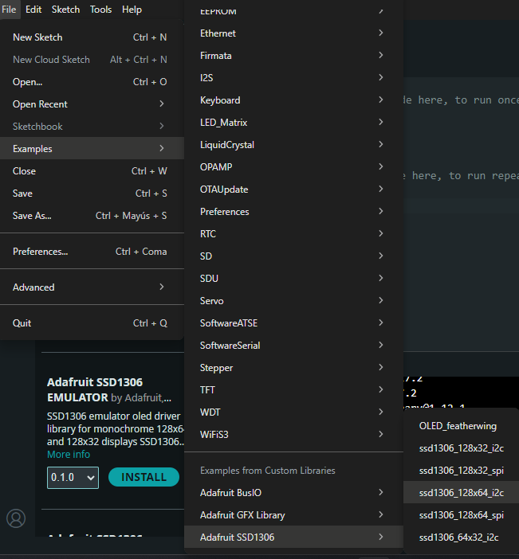
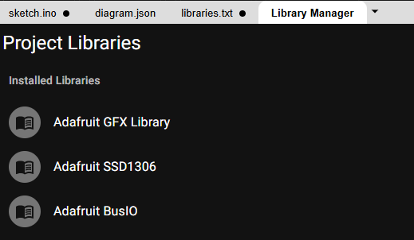
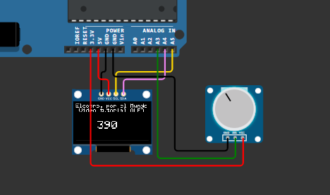

# sesion-03b

viernes 22 de agosto

Está lloviendo demasiado, se cancelaron las clases presenciales. Así que estamos por zoom.

- En teoría ibamos a usar pantallas con arduino
  - Usaremos pantalla OLED y/o TFT
    - La diferencia es la resulución y brillo en la pantalla
  - También existen las pantallas DISPLAY que son para los números
  - Hay algunas pantallas con las que sólo se pueden programar los caracteres, no los pixeles
  - Hay otra pantalla display de 64 puntos, ese necesita un chip MAX7219
- [Dando la hora](https://www.dandolahora.cl/collections/los-mas-vendidos) una tienda de relojes. Uno de esos es, el [UNO](https://www.dandolahora.cl/products/prototipo-el-numero-uno-el-primer-reloj-digital-en-la-historia-de-chile?_pos=1&_psq=primer&_ss=e&_v=1.0) , tiene una cuenta regresiva para el 18 de septiembre.
- Daniel Cruz - [Masivo.cl](https://web.archive.org/web/20160208093950/http://www.masivo.cl/) [Video](https://www.youtube.com/watch?v=YIiusyVejX4&t=1s)  
- Hacer pixel arte en github <https://github.com/gelstudios/gitfiti>
- Una página súper fea para bucar componenentes [MOUSER](https://www.mouser.cl/?gad_campaignid=194752936)
- Una página más bonita y fácil <https://www.adafruit.com/>
- **Ladyhada**
  - [tesis](https://dspace.mit.edu/handle/1721.1/33151)
  - vamos a usar su biblioteca para la pantalla 
  - tienen la fábrica en Nueva York
- Calculadora [WolframAlpha](https://www.wolframalpha.com/)

## Clase

- [Wokwi](https://wokwi.com/)
- [TinkeCAD](https://www.tinkercad.com/dashboard)

## Usaremos WOKWI

Vamos a usar la pantalla OLED ssd1306. La cual usa un protocolo [I2C](https://en.wikipedia.org/wiki/I%C2%B2C) donde se usan sólo 4 cables.



Siempre se debe alimentar la pantalla primero. En el pin GND y VCC. Los otros dos pines son SLC "En honor a Santiago de Chile" -Aarón- y el otro es SDA "En honor a la Sandía" -Aarón-

Hoy vamos a preder 128x64 leds

Para saber donde conectar las cosas, sirve la siguiente imagen:



Se puede descargar [AQUÍ](https://docs.arduino.cc/hardware/uno-rev3/)

Se pueden buscas bibliotecas.



Estas vez usaremos:

- [Adafruit_SSD1306](https://github.com/adafruit/Adafruit_SSD1306)
- [Adafruit-GFX](https://github.com/adafruit/Adafruit_SSD1306)

> No siempre las bibliotecas van a funcionar.

A veces es necesario instalar más de una biblioteca antes de otra porque suelen depender.

En Arduino IDE también hay bibliotecas



Si aparece que necesita otras bibliotecas, hay que instalarlas

Luego, para ponerlo en Arduino:



## Volviendo a Wokwi

Hay que instalar estas bibliotecas:



CADA VEZ QUE USEMOS I2C HAY QUE REVISAR CUÁL ES LA DIRECCIÓN - SUELE SER DISTINTO

En la primera parte intentamos usar una biblioteca (./sesion-03b-01.zip)

Hace unas animaciones muy bonitas.
Estaba con una cosa que había que cambiar, básicamente era la casas de la pantalla

Luego usamos un código que Misa sacó de ChatGPT

(./sesion-03-02.zip)

### Código MISA

```cpp
#include <Wire.h>
#include <Adafruit_GFX.h>
#include <Adafruit_SSD1306.h>

#define SCREEN_WIDTH 128
#define SCREEN_HEIGHT 64
#define OLED_RESET -1
// Le cambiamos el nombre de "display" a "pantalita"
Adafruit_SSD1306 pantallita(SCREEN_WIDTH, SCREEN_HEIGHT, &Wire, OLED_RESET);

int contador = 0;

void setup() {
  if(!pantallita.begin(SSD1306_SWITCHCAPVCC, 0x3C)) {
    Serial.println(F("No se encontró la pantalla SSD1306"));
    for(;;);
  }
  pantallita.clearDisplay();
  pantallita.setTextColor(SSD1306_WHITE);
}

void loop() {
  pantallita.clearDisplay(); // Limpiamos toda la pantalla
  
  // SE LE PUEDE CAMBIAR EL TAMAÑO
  pantallita.setTextSize(1); // Tamaño de texto más grande
  String mensaje = "Contador muy grande, Misa recomienda javiera contador";
  int16_t x1, y1;
  uint16_t w, h;
  
  // Medimos el ancho del texto para centrarlo horizontalmente
  // contador, con esas letras, ese tamaño ¿Cuánto mides?
  // es importante que se haga manual
  pantallita.getTextBounds(mensaje, 0, 0, &x1, &y1, &w, &h);
  pantallita.setCursor((SCREEN_WIDTH - w)/2, 0);
  pantallita.println(mensaje);

  // Mostramos el número centrado
  // TOMA EL VALOR 0 NUMÉRICO, PERO DÁMELO EN VERSIÓN TEXTO
  String numero = String(contador);
  // CUÁNTO MIDE LA PANTALLA
  pantallita.getTextBounds(numero, 0, 0, &x1, &y1, &w, &h);
  pantallita.setCursor((SCREEN_WIDTH - w)/2, 30); // 30 píxeles hacia abajo
  pantallita.println(numero);

  // EN QUÉ MOMENTO SE DIBUJA
  // UNO LE DICE TODO LO QUE TIENE QUE HACER
  // Y LO HARÁ CUANDO APAREZCA "pantallita.display();"
  pantallita.display(); // Actualiza la pantalla
  // A LO QEU VALE CONTADOR, AGRÉGALE 1
  contador++;
  // CON UN TIEMPO DE UN SEGUNDO
  delay(1000);
}
```

Se puede momostrar una imagen, para transformarla hay que entrar acá <https://javl.github.io/image2cpp/)> - hay que fijarte en

### Scroll text

[Wokwi](https://wokwi.com/projects/440317833580419073)

```cpp
#include <Wire.h>
#include <Adafruit_GFX.h>
#include <Adafruit_SSD1306.h>

#define SCREEN_WIDTH 128
#define SCREEN_HEIGHT 64
#define OLED_RESET -1
Adafruit_SSD1306 pantallita(SCREEN_WIDTH, SCREEN_HEIGHT, &Wire, OLED_RESET);

int contador = 0;

String linea0;
String linea1;
String linea2;

void setup() {
  if(!pantallita.begin(SSD1306_SWITCHCAPVCC, 0x3C)) {
    Serial.println(F("No se encontró la pantalla SSD1306"));
    for(;;);
  }
  pantallita.clearDisplay();
  pantallita.setTextColor(SSD1306_WHITE);

  linea0 = "respuesta del oraculo";
  linea1 = "hagas lo que hagas";
  linea2 = "te arrepentiras";
}

void loop() {
  pantallita.clearDisplay(); // Limpiamos toda la pantalla
  
  // LLAMA AL "testscrolltext"
  testscrolltext(linea0);
  testscrolltext(linea1);
  testscrolltext(linea2);
  
  pantallita.display(); // Actualiza la pantalla
}

// void testscrolltext(void) {
  // CAMBIAR LA LINEA ANTERIOR
  // PARA AGREGAR PARÁMETRO String
  // DE INPUT
  void testscrolltext(String texto) {
  pantallita.clearDisplay();

  pantallita.setTextSize(2); // Draw 2X-scale text
  pantallita.setTextColor(SSD1306_WHITE);
  pantallita.setCursor(10, 0);

  // SE PUEDE CAMBIAR LO QUE ESTÁ EN LA PANTALLA
  // pantallita.println(F("scroll"));
  
  // HICE QUE LA PANTALLA DIJERA LO QUE DICE "linea0"
  // SACÁNDOLE EL F()
  pantallita.println(linea0);
  pantallita.display();      // Show initial text
  delay(100);

  // Scroll in various directions, pausing in-between:
  pantallita.startscrollright(0x00, 0x0F);
  delay(2000);
  pantallita.stopscroll();
  delay(1000);
  pantallita.startscrollleft(0x00, 0x0F);
  delay(2000);
  pantallita.stopscroll();
  delay(1000);
  pantallita.startscrolldiagright(0x00, 0x07);
  delay(2000);
  pantallita.startscrolldiagleft(0x00, 0x07);
  delay(2000);
  pantallita.stopscroll();
  delay(1000);
}
```

Fue una clase demasiado dura.
Me costó harto seguir el hilo a Aarón.
Se me ahce dificil cachar en qué parte del código se hacen los cambios.

----

Si usamos ejemplos para nuestro encargo, tiene que estar acreditado, citado, mencionado, tenemos que poner qué parte está robado, mixeado y/o editado

## Avance entrega viernes 29

Para poder usar la pantalla OLED SSD1306 hay que instalar bibliotecas 

```cpp
#include <Wire.h>
#include <Adafruit_GFX.h>
#include <Adafruit_SSD1306.h>
```

### Información importante sobre el potenciómetro

Está un poco enredado el tema del potenciómetro.
En [Wokwi](https://docs.wokwi.com/parts/wokwi-potentiometer) hay información de cómo usarlo. Igualmente me cuasta entenderlo.

|PINES||
|--|--|
|**NOMBRE**|**DESCRIPCIÓN**|
|GND| ground |
|SIG| output, se conecta a un "analog input pin" (A0, A1...)|
|VCC| voltaje|

```cpp
// define al pin A0 como salida
  pinMode(A0, INPUT)

// pone el nombre "POTENTIOMETER" al pin A0
#define POTENTIOMETER A0
```
---

#### Referencia-01

Vi un video que enseñaba a mostrar el valor del potenciómetro en la pantalla OLED, creo que es importante. También usa las bibliotecas de Adatfruit [Ver aquí](https://www.youtube.com/watch?v=l_2vnl5MOpo)

[Ver en Wokwi](https://www.youtube.com/watch?v=l_2vnl5MOpo)



```cpp
// ESTE ES EL CÓDIGO
#include <Wire.h>			
#include <Adafruit_GFX.h>		
#include <Adafruit_SSD1306.h>		

#define ANCHO 128			
#define ALTO 64				

int valor;

#define OLED_RESET 4			
Adafruit_SSD1306 oled(ANCHO, ALTO, &Wire, OLED_RESET);	

void setup() {
  Wire.begin();					
  oled.begin(SSD1306_SWITCHCAPVCC, 0x3C);	
}
 
void loop() {
  oled.clearDisplay();			
  oled.setTextColor(WHITE);		
  oled.setCursor(0, 0);			
  oled.setTextSize(1);			
  oled.print("Electro. por el Mundo Video tutorial OLED "); 	
  oled.setCursor (38, 30);		
  oled.setTextSize(2);		
  valor = analogRead(A3);
  oled.print(valor);	
  oled.display();			
}
```

----

#### Referencia-02

Encontré también una página donde explica usos para el potenciómetro con Arduino

[Enciendiendo LEDs con un potenciómetro](https://programarfacil.com/blog/arduino-blog/el-potenciometro-y-arduino/#Encendiendo_LEDs_con_un_potenciometro)

En este caso se usa el potenciómetro para encender LEDs. Dependiendo de dónde está el potenciómetro, se enciende un LED u otro.

Aquí se usa el `if` para determinar en qué rango de valores del potenciómetro se enciende cada LED.

Para sacar los rangos se divide el valor máximo del potenciómetro `1023` en la cantidad de LEDs que se usarán `4`

"Los rangos de valores que tenemos son los siguientes:
- De 0 a 255, encender LED 1
- De 256 a 511, encender LED 2
- De 512 a 767, encender LED 3
- De 768 a 1023, encender LED 4"

[Ver en Wokwi](https://wokwi.com/projects/440315014921013249)

```cpp
//Variable donde almacenaremos el valor del potenciometro
long valor;

//Declaramos los pins de los LEDs
int LED_1 = 2;
int LED_2 = 3;
int LED_3 = 4;
int LED_4 = 5;

void setup() {
  //Inicializamos la comunicación serial
  Serial.begin(9600);
  
  //Escribimos por el monitor serie mensaje de inicio
  Serial.println("Inicio de sketch - valores del potenciometro");

  pinMode(LED_1, OUTPUT);
  pinMode(LED_2, OUTPUT);
  pinMode(LED_3, OUTPUT);
  pinMode(LED_4, OUTPUT);
}

void loop() {
  // leemos del pin A0 valor
  valor = analogRead(A0);

  //Imprimimos por el monitor serie
  Serial.print("El valor es = ");
  Serial.println(valor);

// EN ESTE RANGO
// SÓLO EL LED 1 SE ENCIENDE
  if(valor >= 0 && valor <=255)
  {
      digitalWrite(LED_1, HIGH);
      digitalWrite(LED_2, LOW);
      digitalWrite(LED_3, LOW);
      digitalWrite(LED_4, LOW);
  } 
  
  // EN ESTE RANGO
  // SÓLO EL LED 2 SE ENCIENDE
  if (valor >= 256 && valor <=511)
  {
      digitalWrite(LED_1, LOW);
      digitalWrite(LED_2, HIGH);
      digitalWrite(LED_3, LOW);
      digitalWrite(LED_4, LOW);
  }

  // EN ESTE RANGO
  // SÓLO EL LED 3 SE ENCIENDE
  if (valor >= 512 && valor <=767)
  {
      digitalWrite(LED_1, LOW);
      digitalWrite(LED_2, LOW);
      digitalWrite(LED_3, HIGH);
      digitalWrite(LED_4, LOW);
    }

  // EN ESTE RANGO
  // SÓLO EL LED 4 SE ENCIENDE
  if (valor >= 768 && valor <=1023)
  {
      digitalWrite(LED_1, LOW);
      digitalWrite(LED_2, LOW);
      digitalWrite(LED_3, LOW);
      digitalWrite(LED_4, HIGH);
   }
}
```

Con este código podemos mostrar un verso del poema por rango del potenciómetro.

#### Referencia-03

Esta página web muestra el control de un servomotor con un potenciómetro

<https://www.mechatronicstore.cl/servomotor-controlado-por-potenciometro-y-valores-visualizados-en-display-pantalla-oled-128x32-0-91/>

### Avance 00

[Wokwi](https://wokwi.com/projects/440317589620701185)

```cpp
#include <Wire.h>
#include <Adafruit_GFX.h>
#include <Adafruit_SSD1306.h>

#define SCREEN_WIDTH 128
#define SCREEN_HEIGHT 64
#define OLED_RESET -1
Adafruit_SSD1306 pantallita(SCREEN_WIDTH, SCREEN_HEIGHT, &Wire, OLED_RESET);

String linea0;
String linea1;
String linea2;
String linea3;
String linea4;
String linea5;

void setup() {
    if(!pantallita.begin(SSD1306_SWITCHCAPVCC, 0x3C)) {
    Serial.println(F("No se encontró la pantalla SSD1306"));
    for(;;);
  }
  pantallita.clearDisplay();
  pantallita.setTextColor(SSD1306_WHITE);

  linea0 = "En Santiago de Chile";
  linea1 = "Los";
  linea2 = "dias"; 
  linea3 = "son";
  linea4 = "interminablemente";
  linea5 = "largos";

  pantallita.setTextSize(1); // Draw 2X-scale text
  pantallita.setTextColor(SSD1306_WHITE);
  pantallita.setCursor(0, 10);
}

void loop() {

// LINEA 0 **************
// lipiar toda al pantalla
  pantallita.clearDisplay();

// pantallita, imprime la linea 0
  pantallita.println(linea0);

// actualiza la pantalla
  pantallita.display();
// tiempo que se muestra
  delay(1000);

// LINEA 1 *****************
// lipiar toda al pantalla
  // pantallita.clearDisplay();

// pantallita, imprime la linea 0
  pantallita.println(linea1);

// actualiza la pantalla
  pantallita.display();
// tiempo que se muestra
  delay(1000);

// LINEA 2 ***************
  // lipiar toda al pantalla
  // pantallita.clearDisplay();

// pantallita, imprime la linea 0
  pantallita.println(linea2);

// actualiza la pantalla
  pantallita.display();
// tiempo que se muestra
  delay(1000);

// LINEA 3 **************
// lipiar toda al pantalla
  // pantallita.clearDisplay();

// pantallita, imprime la linea 0
  pantallita.println(linea3);

// actualiza la pantalla
  pantallita.display();
// tiempo que se muestra
  delay(1000);

// LINEA 4 **************
// lipiar toda al pantalla
  // pantallita.clearDisplay();

// pantallita, imprime la linea 0
  pantallita.println(linea4);

// actualiza la pantalla
  pantallita.display();
// tiempo que se muestra
  delay(1000);

// LINEA 5 **************
// lipiar toda al pantalla
  // pantallita.clearDisplay();

// pantallita, imprime la linea 0
  pantallita.println(linea5);

// actualiza la pantalla
  pantallita.display();
// tiempo que se muestra
  delay(1000);
}
```

### IDEAS

#### 01

Dependiendo de la dirección del potenciómetro, el poema va hacia abajo o hacia arriba

#### 02

Que el potenciómetro regule la velocidad a la que sube o baja el poema