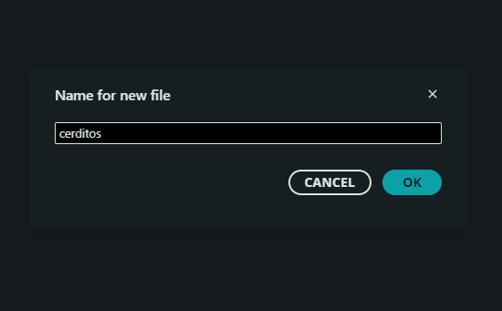
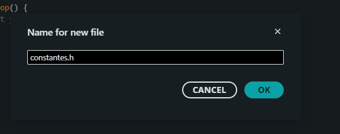

# sesion-05a

martes 02 de septiembre

- programación orientada objetos
- ontologia orientada a objetos - Graham Harman
- Markus Gabriel - "no podemos acceder a los objetos, los obejtos se manifiestan ante noosostros" ~Misa
- **10 categorías de Aristóteles** - Sustancia, Cantidad, Cualidad, Relación, Lugar, Tiempo, Posición (o Situación), Posesión (o Hábito), Acción y Pasión- Libro *Problemas*
- Mnomer Norms
- [esolang](https://esolangs.org/wiki/Main_Page)
- .

## Lenguajes de programación

- .c --> el título
- .h --> encabezados
- C++ --> Bjarne Strousup La bibila de C++ "Tenemos que teclear mucho y más específico para que el computador haga menos cosas" ~Aarón
- openfranworks - entorno de programación para hacer apps en C++, pero es muy duro. Incluso es terrible instalarlo
- Swift lenguage - programar cositas en IOS
- Lua
- Chuck - tesis <https://chuck.stanford.edu/>
- Turing complete significa "es un leguaje que puede haer todo lo que un coputador puede hacer" ~Aarón

## CLASES

<https://www.w3schools.com/cpp/cpp_classes.asp>

Sirven para que el código principal se vea más limpio y con menos líneas

Es mejor poner las imágenes en otra clase .h para no cargar el código principal

Según Aarón "es un model de galleetas para hacer galletas"

Crear nuevos Tab (pestañas) dentro de la carpeta de ``


Lo que hace Aarón es crear una sintaxis con .h


"nos protege de problemas cunado creamos nuevos archivos"

- `#ifndef` = "si no existe" o "si no está definido"
- `#define` = "defínelo"
- `#endif` = fin del `#ifndef`
- ``CONSTANTES_H` = nombre del archivo, es en mayúsculas para que se muy importante, es `_H` porque no deja poner `.h`

```cpp
// archivo constantes.h
#ifndef CONSTANTES_H
#define CONSTANTES_H

const int numEstudiantes = 28;

#endif
```

```cpp
  // incluyo el archivo ""constantes.h""
#include "constantes.h";

void setup() {
  // inicio la comunicacion con el monitor serial
  Serial.begin(9600);
}

void loop() {
  Serial.println(numEstudiantes);
}
```

"FUNCIÓN PORQUE SALEN LOS PARÉNTESIS" ~Aarón

### Paso 00

- Abrir Arduino IDE y crear un nuevo sketch

### Paso 01

Crear un nuevo archivo tipo **.h** para poder **definir** los nombres para las constantes y comandos

- El archivo debe tener la inicial con mayúscula para saber que es importante `Persona.h`
- Se debe crear una "berma" para que no se muera el códgo
Se crea un perámetro "constructor"

```cpp
// berma para proteger el codigo
#ifndef PERSONA_H
#define PERSONA_H

**CODIGO**

// se cierra la berma
#endif
```

### Paso 01.1

- Se crea el metodo constructor, sirve para crear instancias
- También se crea el destroctor con `~` el cual dice "olvidate de esta persona, que deje de existir" para ahorrar memoria

```cpp
// "esta es la clase 'Persona'"
// "class Persona {" es un molde de galletas
class Persona {
public:

// este es el metodo "Persona();"
// nos sirve para hacer las galletas
Persona(bool vida);

// este es el destructor
~Persona();

};
```

## Paso 02

- Crear un archivo tipo `.cpp` donde decimos a las funciones lo que tinen que hacer.
- Para que este **archivo** sepa que necesita el archivo `Persona.h` se debe llamar con `#include "Persona.h"`
- Además, para que las **funciones** sepan a qué clase pertenecen, se les agrega `Persona::` antes de cada función.

```cpp

#include "Personas.h"

```

## bibliografía y referentes

[destructor en cpp](<https://learn.microsoft.com/es-es/cpp/cpp/destructors-cpp?view=msvc-170>]
