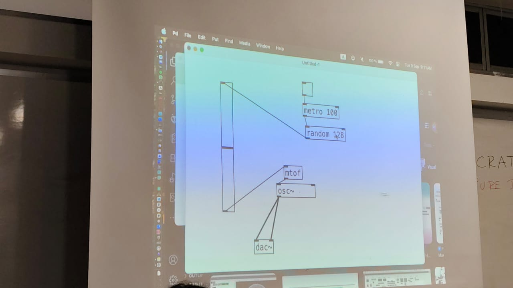

# sesion-06a
martes 9 de septiembre

- [scratch](https://scratch.mit.edu/) - un programa de progamación con bloques
- [Pure Data](https://puredata.info/) lenguaje de programación/ entoorno de programación, creado para programar cosas de audio, creado por Miller Puckette - "Con legunaje puedo crear más lenguaje" ~ Aarón. Se pueden crear cajas negras

Me encantaría hacer algo como Pure Data para controlar motores y luces de forma más amigable. Con un entorno de programación
- touchdesigner
- latex software - basasdo en Tex
- [Overlaf](https://es.overleaf.com/)
- Llamk'ana - lenguaje de programación en Quechua
- [Weaving to coding](https://weavingxcoding.studio/) - puedes aprender código tejiendo y aprender a tejer con código
- [Studio for Creative inquiry](https://studioforcreativeinquiry.org/) investigación creativa - [libro](https://drive.google.com/file/d/1nINNHaT2K8J4e0vC1CEPemVNpAJVJPi5/view?usp=drive_link)
- maywa denki toy
- [Hacia una filosofía de la fotografía - capítulo 3](https://monoskop.org/images/8/8d/Flusser_Vilem_Hacia_una_filosofia_de_la_fotografia.pdf)
- [lauren lee mccarthy tools for improved social interacting](https://get-lauren.net/Tools-for-Improved-Social-Interacting)
- [renata gaui hysterical wearable](https://vimeo.com/215600031?fl=pl&fe=sh)

## Máquina que saluda

- Input --> Sensor "los sentidos del arduino" ~Misaa
- Output --> Actuador - Luz, movimiento y sonido

---

- Hay sensores de color
- Acelerómetros que identifican en qué eje x,y,z se desplaza
> lo puedo poner en un guante, cuando mueva la mano me salude
- Sensor de luz ambiente
- Sensor ultrasónico - sensor de cercanía
- DHT11 --> Sensor de temperatura y humedad
- Sensor de gas
- Encoder rotatorio - un ptenciómetro sin límite
- Sensor de humedad - una plantita que te pida agua cuando esté seca
- Sensor de lluvia - resistencia variable, si cae algo orgánico, se activa
- Sensor de agua - "dame agua!" le das agua "gracias por el agua!"
- Joystick
- LDR - sensor de luz
- Foto diodo - los paneles solares lo udan para generar energía
- Sensores de sonido - detector de aplausos
- Shield data logger - permitee asber la hora exacta y tiene una tarjeta SD
- NFC - etiqueta que detecta un lector NFC - puede detectar si algo está en su lugar

## Tarea

Buscar 3 ideas para usar sensores

### Sensor de lluvia
"2 electrodos separados por una distancia muy pequeña, cuando llueve las gotas de agua cierran el circuito entre los 2 electrodos y permiten el paso de una pequeña corriente."

### Acelerómetro

Existen varios tipos
- Acelerómetros capacitivos MEMS: Se basa en una masa y un muelle unido a las caras de un condensador de peine. Cuando se aplica una aceleración, la masa se  mueve cambiando la distancia entre la masa y las placas del condensador, al cambiar la distancia, envía una señal eléctrica. 
- Acelerómetro piezoeléctrico

### NFC

## Bibliografía y referencias

- Sensor de lluvia - <https://altronics.cl/sensor-lluvia-nieve-fc-37>
- Acelerómetro - <https://www.tme.com/cl/es/news/library-articles/page/22568/Como-funciona-y-que-hace-el-acelerometro/#Jak-dziala-akcelerometr>