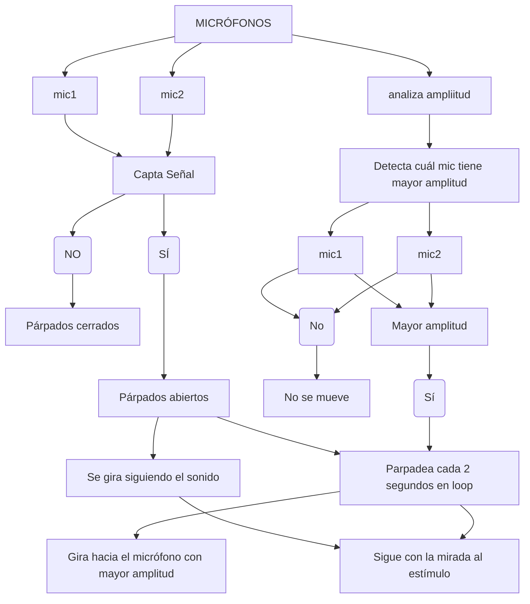

# sesion-07b

viernes 29 de septiembre

No fui a clases por campamento scout

COMPLETAR APUNTES

Revisar apuntes de [sofia-perezm](https://github.com/sofia-perezm/dis8645-2025-02-procesos/tree/main/22-sofia-perezm/sesion-07b)

## Encargo 14

Cada persona del grupo debe implementar en diagrama de flujo dibujado o con la herramienta Mermaid.js con sus propias palabras y subirlo a su README

## Encargo 15

Cada persona del grupo debe subir a su README: documentar funcionamiento de sus sensores, incluyendo instrucciones de conexión y de configuración, subir el proyecto entero de arduino como carpeta, tiene que poder compilar sin problema y mostrar en consola los datos de los sensores.