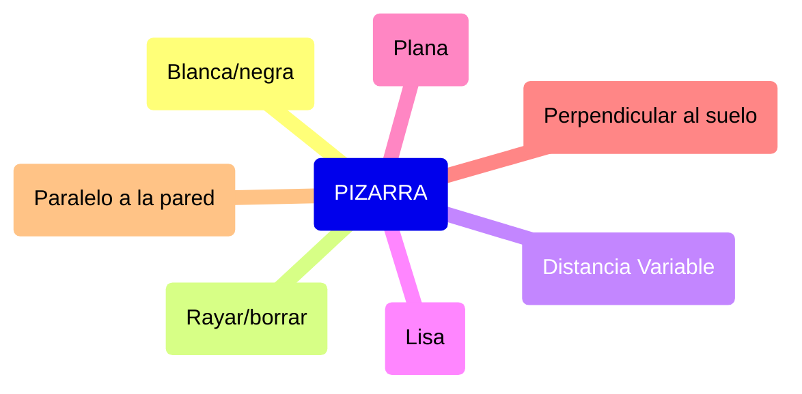

# sesion-12a

martes 28 de octubre

## Momento Misaa

### Pizarra

### Completo italiano --> Reproductor de música

## Máquinas sentimentales

> Ver referentes

- Objetos con culaidades extrañas
- Que producen sentimientos específicos
- Emociones específicos
- 

## Encargo

- 2 objetos --> 15 cualidades cada uno

- Lluvia de ideas del equipo

### Ideas de máquinas sentimentales

#### 01 - Máquina transicional

Máquina que muestra el cambio emocional, enfocado en la transición emocional. Cambios de humor entre dos emociones. Se muestran con luces y movimiento.

- Máquina cambiante
- Emociones no cómodas
- Coreografía con luces
- Flujo emocional
- Subidas y bajadas de emoción
- Cambio de emoción
- Complentativo
- Colgante, no fijo en la mesa
- Sin sensores
- Involucrarse con sus emociones y el entorno
- Personificar las emociones

#### 02- Máquina que descepciona

Generar una expectativa para luego romperla. Todos esperen lo que va a pasar, pero nunca pasa.

#### 03 - Maquina saturadora/quejadora

Un teléfono de auxilio que se queja y desahoga cuando tu lo llames

## Bibliografía y referencias

- Happiness Hat by Lauren McCarthy <https://finzhao.wordpress.com/2010/10/14/happiness-hat-by-lauren-mccarthy/>
- 