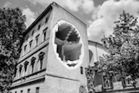

# sesion-02a

12-08-2025

## Apuntes

- Serial begin: Sirve para sostener la comunicación, es decir, inicializar y configurar el puerto de comunicación serial entre la placa Arduino y un ordenador u otro dispositivo, estableciendo la velocidad de transmisión de datos (en baudios) necesaria para que puedan entenderse mutuamente. Se usa dentro de void setup()
- Serial begin: 9600
  - baudios: significa a qué velocidad va un baudio, velocidad de comunicación, a qué velocidad lo estoy viendo.
  - (Bd) Baud Rate cantidad de símbolos o cambios de señal por segundo en una comunicación.
- Serial monitor: Sirve para la comunicación bidireccional entre tu placa Arduino y el ordenador
- Un cable usb tiene 4 conexiones. Al conectar el arduino (sin código cargado) se usa los cables GND / VCC. Al cargar un código, la información pasa por D+ y D-
  - 1. no comunicación
    2. upload
    3. sostener la comunicación 

> Nombre de carpeta en Arudino IDE

El nombre de la carpeta debe ser el mismo del archivo al guardar. 

## [Sokio](https://pueblonuevo.cl/bios/sokio/)

- Mauricio Días Gallardo. Es un artista chileno experimental y productor musical, conocido por su trabajo en ópera, film y música electrónica, y por fundar New Latin Wave para promover la cultura Latine. Su carrera comenzó en 1990 componiendo música para teatro. Rápidamente comenzó a trabajar con sintetizadores, creando un particular sonido basado en influencias latinas y cercano al ambient.Incorporó 8 bit a sus mezclas y composiciones. Forma parte del Pueblo Nuevo Netlabel.
- Tiene una organización que se llama [New Latín Wave](https://newlatinwave.com/team)
- Spitting/Abscence:

## [Gordon Matta-Clark Artista](https://es.wikipedia.org/wiki/Gordon_Matta-Clark)

- Fue un artista estadounidense con ascendencia chilena que exploró diferentes modos de intervención arquitectónica, en el que le llaman *buildings cuts* o *cortes de edificios*.
- Son obras claiedoscopal, juega con los cortes en las paredes.
- Sus padres son Roberto Matta, pintor surrealista chileno y su madre, Anna Clark que fue pintora estadounidense.

<https://www.archdaily.cl/cl/768903/en-perspectiva-gordon-matta-clark>

> Apuntes

- [Bricolo de Nick Yulma](https://www.nysoundworks.org/)
- Solenoide
- [Cdm](https://cdm.link/): Create Digital Music
- Hammond Box
- Juan Downey: fue un artista multidisciplinario chileno, pionero del videoarte y el arte interactivo.

## Encargo 03

Ordenar Github
