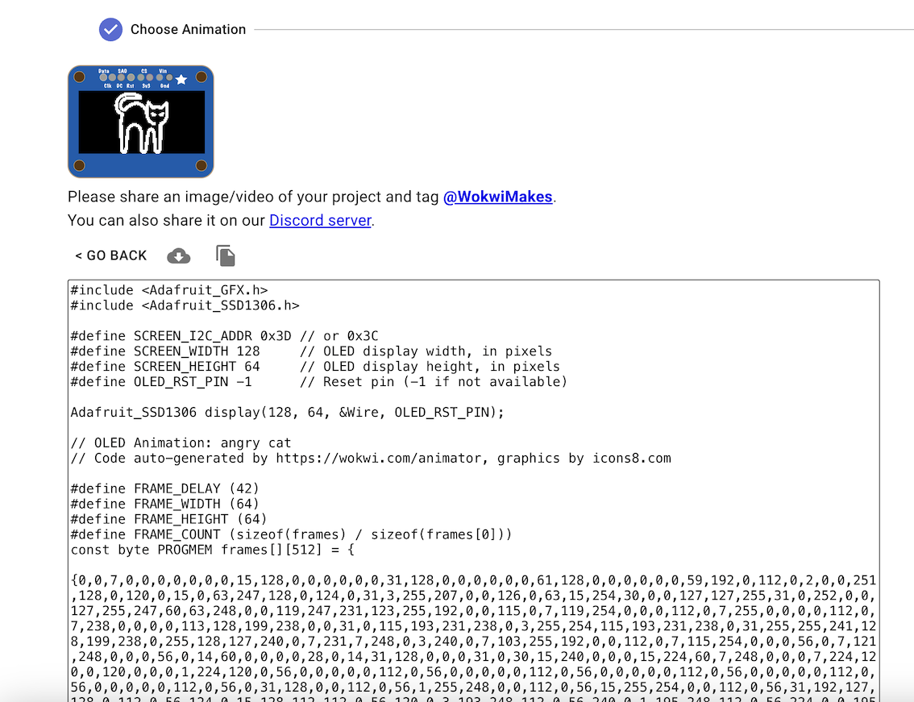
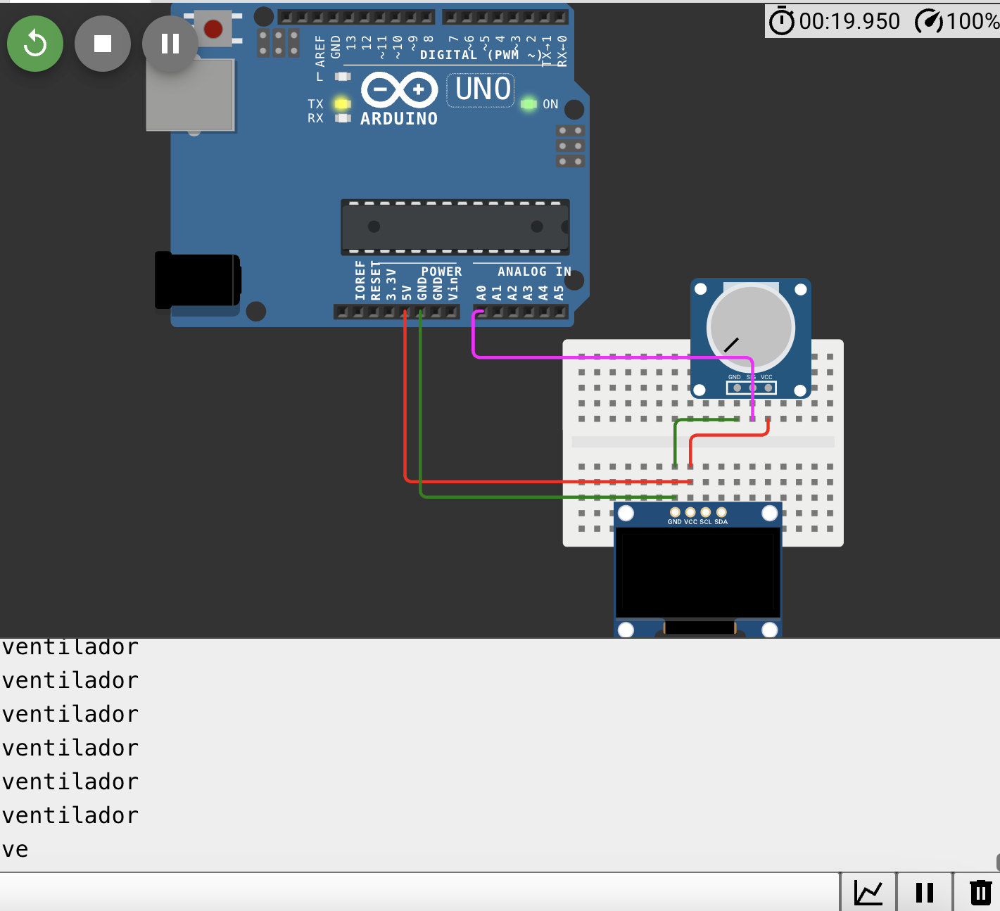
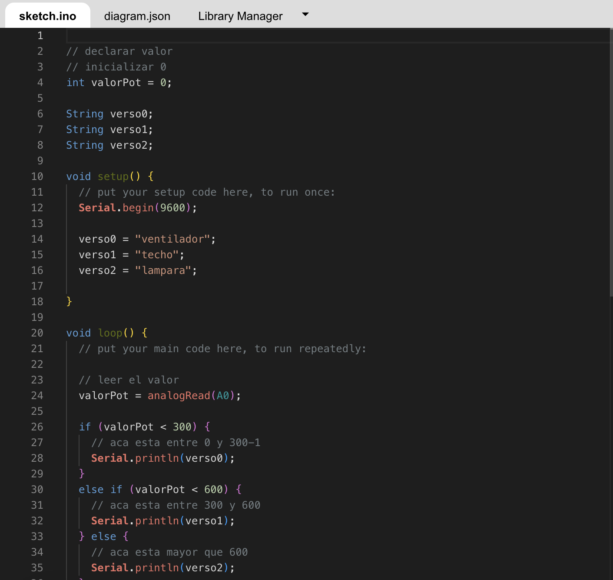

# sesion-04a

26-08-2025

## Apuntes

- Nos pasaron cajitas para guardar nuestros arduinos, las pantallas, cables, etc.
- También nos pasaron protoboards y la pantal SSD1306
- DigitalWrite: para leer los LEDS (input)
- AnalogRead: output

|Digital|Análogo|
|---|---|
|discreto|continuo|
|ej: hora|ej: tiempo|
|minecraft|mundo|
|pixel|foto|
|foto|analoga|

Usar el ejemplo del contador para que se vea las cosas en la pantalla

En esta clase avanzamos en nuestro proyecto, donde buscamos diferentes tipos de referentes para poder realizar un código. Primero nos guíamos del código visto en clases, para luego hacer ciertas modificaciones y lograr que se vea algo en la pantalla. Por otro lado, colocabamos imagenes ya hechas de [Wokwi Animator](https://animator.wokwi.com/) para entender un poco el movimiento y el código de la imagen. Acá cambiamos algunos parámetros, como:

```cpp
#define SCREEN_I2C_ADDR 0x3D
```
Se cambió a 

```cpp
#define SCREEN_I2C_ADDR 0x3C
```



También empezamos a definir que era lo que queríamos hacer en nuestro proyecto, mis compañeras Sofía y Anto buscaron distintos tipos de poemas, comenzaron a realizar bocetos y buscar información. Sofia Cartes y yo comenzamos a intervenir el código principal para lograr distintas cosas y también buscamos información sobre algunos códigos de arduino.

- Código modificado:

```cpp
#include <Adafruit_GFX.h>
#include <Adafruit_SSD1306.h>

#define SCREEN_I2C_ADDR 0x3C // or 0x3C
#define SCREEN_WIDTH 128     // OLED display width, in pixels
#define SCREEN_HEIGHT 64     // OLED display height, in pixels
#define OLED_RST_PIN -1      // Reset pin (-1 if not available)

Adafruit_SSD1306 display(128, 64, &Wire, OLED_RST_PIN);

// OLED Animation: maneki
// Code auto-generated by https://wokwi.com/animator, graphics by icons8.com

#define FRAME_DELAY (42)
#define FRAME_WIDTH (64)
#define FRAME_HEIGHT (64)
#define FRAME_COUNT (sizeof(frames) / sizeof(frames[0]))
const byte PROGMEM frames[][512] = {
  {0,0,0,0,0,0,0,0,0,0,0,0,0,0,0,0,0,0,0,0,0,0,0,0,0,0,31,192,1,248,0,0,0,0,31,224,7,248,0,0,0,0,59,255,255,188...
}
};

void setup() {
  display.begin(SSD1306_SWITCHCAPVCC, SCREEN_I2C_ADDR);
}

int frame = 0;
void loop() {
  display.clearDisplay();
  display.drawBitmap(32, 0, frames[frame], FRAME_WIDTH, FRAME_HEIGHT, 1);
  display.display();
  frame = (frame + 1) % FRAME_COUNT;
  delay(FRAME_DELAY);
}
```

### Imágenes de los primeros poemas

Insertar imagenes

// declarar valor
// inicializar 0

int valorPot;

void setup() {
    Serial.begin(9600);
}

void loop() {
    // leer el valor analógico
    valorPot = analogRead(A0);
}

### Potenciómetro ¿Cómo colocar un potenciómetro al arduino?





-El menor valor que puede hacer es 0 y el máximo es 1023.
  -Se escribe en digital y se lee en analógico.
  -Los comandos para escribir o leer en analóco y digital:

|Leer|-|
|---|---|
|Analógico|analogRead|
|Digital|digitalread()|

|Escribir|-|
|---|---|
|Analógico|analogWrite()|
|digital|digitalWrite()|

insertar imagenes de digital y analoga

```cpp
// declarar valor
// inicializar 0

int valorPot;

void setup() {
    Serial.begin(9600);
}

void loop() {
    // leer el valor analógico
    valorPot = analogRead(A0);

}
```

Código hecho en [Wokwi](https://wokwi.com/projects/440360994230097921)

```cpp
// declarar valor
// inicializar 0
int valorPot = 0;

String verso0;
String verso1;
String verso2;

void setup() {
  // put your setup code here, to run once:
  Serial.begin(9600);

  verso0 = "ventilador";
  verso1 = "techo";
  verso2 = "lampara";

}

void loop() {
  // put your main code here, to run repeatedly:
  
  // leer el valor
  valorPot = analogRead(A0);

  if (valorPot < 300) {
    // aca esta entre 0 y 300-1
    Serial.println(verso0);
  }
  else if (valorPot < 600) {
    // aca esta entre 300 y 600
    Serial.println(verso1);
  } else {
    // aca esta mayor que 600
    Serial.println(verso2);
  }

  
  // Serial.println(valorPot);
}
```

insertar imagenes de wokwi


