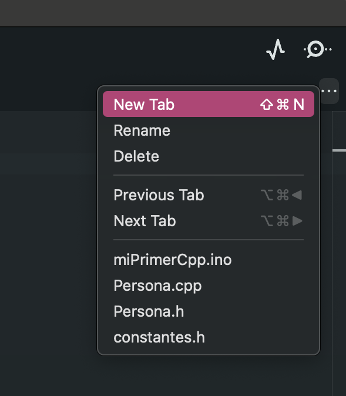
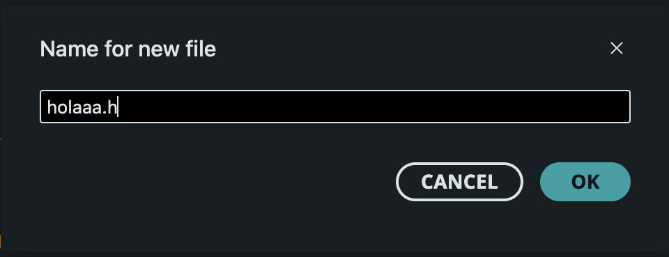
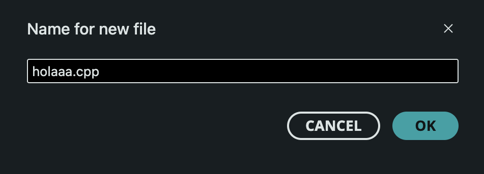

# sesion-05a

02-09-2025

## Apuntes 

Teloneo 

- Todo tiene cualidades.
- La materia y su forma > filosofía de Aristóteles, la materia es lo que una cosa está hecha, mientras que la forma es la escencia o estructura que determina esa materia.
- [OOO](https://en.wikipedia.org/wiki/Object-oriented_ontology): Ontología Orientada a Objetos. Corriente filosófica asociada al realismo especulativo que propone que los objetos (físicos, ideales, conceptuales) son entidades primordiales de la realidad
- Fenomenología > el estudio de las cosas como aparecen
- [POO](https://es.wikipedia.org/wiki/Programaci%C3%B3n_orientada_a_objetos) Programación orientada a objeto
- 10 categorías aristotélicas
- lenguaje [C++](https://es.wikipedia.org/wiki/C%2B%2B)

### Bjarne stroustrup

Es un científico de la computación y catedrático de Ciencias de la computación en la Universidad A&M de Texas. Es conocido por ser desarrollador del lenguaje de programación [C++](https://es.wikipedia.org/wiki/C%2B%2B)

- "Todo en C++/CPP está asociado a clases y objetos, junto con sus atributos y métodos."
- Los atributos y métodos son básicamente variables y funciones que pertenecen a la clase


[Processing](https://processing.org/): Es un software flexible y un lenguaje para aprender a programar

---

### Lenguaje de programación 

- Los archivos terminan en .c (título) / .h (encabezados).
- El **cpp** es lo más complejo porque dice que es lo que hace el archivo.
- Programamos el Arduino en **C++** y no en **Javascript** porque tiene mejor compresión.
- Lenguaje Turing Complete: Un lenguaje que puede hacer de todo, es el mas completo.
- [Lua](https://www.lua.org/) programming languaje: Es un lenguaje de programación multiparadigma, imperativo, estructurado y bastante ligero, que fue diseñado como un lenguaje interpretado con una semántica extendible (según Wikipedia)

[Supercollider](https://supercollider.github.io/): Es un entorno y un lenguaje de programación originalmente publicado en 1996 por James McCartney para síntesis audio en tiempo real y composición algorítmica.​​

Arduino ide: Plataforma de software y hardware para programar un arduino

---

### Clases dentro de Arduino

- [W3schools](https://www.w3schools.com/cpp/cpp_classes.asp)
- Las clases sirven para que el código principal se vea más limpio
- Tres puntitos > new tab > nueva pestaña (para tener otra pestaña en el mismo documento)



Le asignamos un título al nuevo archivo, donde incorporamos .cpp / .h

documento.h > tipo de archivo de c++





### Ejercicio en clases

Las clases en Arduino, se guardan en archivo .h

ARCHIVO.INO

```cpp
//programacion orientada a objetos
#include "constantes.h"
#include "Persona.h"

Persona aristoteles(false);
Persona javieraMena(true);
void setup() {
  // put your setup code here, to run once:

  Serial.begin(9600);

  aristoteles.setEdad(2025 + 384);
  javieraMena.setEdad(2025 - 1983);
}

void loop() {
  // put your main code here, to run repeatedly:

  Serial.print("Aristoteles tiene ");
  Serial.print(aristoteles.getEdad());
  Serial.println(" años");

  Serial.print("Javiera Mena tiene ");
  Serial.print(javieraMena.getEdad());
  Serial.println(" años");
}
```

ARCHIVO.h

- Clase: la clase nos permite definir lo que es una persona para hacer varias personas 
  - // persona con P pq es una clase, solo cuando definamos una clase va un ;
  - // dentro de las clases hay muchas opciones, se parte primero con public
  - // clase Persona es un molde de galleta
  - // es el molde; la clase se escribe con mayuscula al principio
  
- Public: para que cualquier otra clase pueda decir hazlo, quien tiene acceso 
  - // metodo; es una funcion dentro de una clase
  - // metodo constructor
  - // sirve para crear nuevas instancias
  - // metodo Persona() nos permite hacer las galletas 
  - // que parametros puedo darle a una persona 

```cpp
// es para crear nuevos archivos en c++
// cualquier codigo que incluya este archivo, tendra la información de este archivo
#ifndef PERSONA_H
#define PERSONA_H

#include <Arduino.h>

// clase Persona es un molde de galleta 
class Persona { // nos permite definir lo que es una persona, para hacer varias personas

// es un metodo, es decir, una funcion dentro de una clase
public: // cualquier otra clase pueda decir hazlo, quien tiene acceso

// parametro del constructor es un boolean vida 
//true si esta vivo, false si esta muerto 
Persona(bool vida); // metodo Persona() nos permite hacer las galletas

// destructor
~Persona();
// option + Ñ:~ 

// funcion void; que define la edad 
// necesita parametro int (numero entero)
void setEdad(int nuevaEdad);

//funcion int
// devuelve la edad
int getEdad();

//las personas adentro de la clase, le pusimos un bool que nos dice que está vivo y un int que nos indica la edad
bool estaViva;
int edad;

}; // se debe escribir ; al final de cada } pero solo en las clases

#endif
```

ARCHIVO.cpp

```cpp
#include "Persona.h"

// el primer archivo (.h) es para definir, te dice la interfaz
// el cpp es lo más complejo porque dice que es lo que hace el archivo

// constructor
Persona::Persona(bool vida) {
  Persona::estaViva = vida;
}

// destructor
Persona::~Persona();

// set edad
void Persona::setEdad(int nuevaEdad) {
  Persona::edad = nuevaEdad;
}

// get edad
int Persona::getEdad() {
  return Persona::edad;
}
```

No hay encargo, semana de solemnes
