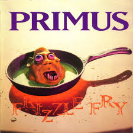
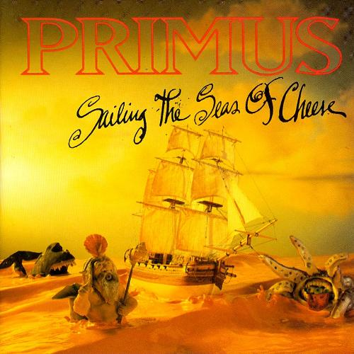

# sesion-05b

05-09-2025

## Apuntes

- <>: significa que hay que buscar el archivo para colocarlo en el código.
- .h: significa que estas son las cosas que puede hacer la pantallita, los h son los encabezados; me entero de lo que existen. Prometo.
- archivo cpp: significa que nos encargamos de que las cosas ocurran; me entero de lo que hace esto. Me hago cargo.
- Parte central del código es: Comentar antes de hacer el código, para saber que es lo que hace el código en si.
- se puede incluir bibliotecas dentro de bibliotecas
- los archivos h son muy crudos

---

Cuando colocamos en el código `#include`, aquí debemos llamar el archivo nombrado

- `<>`: el archivo estará en alguna parte del computador
- `""`: es cuando el archivo está en la misma carpeta que el archivo principal

En el archivo `.h` prometo, las cosas que puede hacer la pantallita y en el archivo `.cpp` resuelvo, nos encargamos de que las cosas ocurran

La parte fundamental de antes de realizar el código es saber que hace el código en si y comentarlo. 

- Adafruit_GFX: es la bilbioteca de las gráficas 
- AdafruitSSD1306: es la biblioteca para hacer funcionar la pantalla OLED
- Arquitectura arm: es una forma de programar computadores más pequeños
- Atributos, son variables

```cpp
Adafruitssd1306 : public Adafruit_GFX
```

Es como decir

```cpp
class Completo_italiano : public Completo {}
```

Completo italiano es un tipo de completo

---

- `#infdef`: verifica si el código ha estado definido (`#define`) antes en un archivo o en un archivo incluido
- `endif`: es el cierre del código definido
  
[w3schools](https://www.w3schools.com/): página WEB que sirve para aprender sobre programación, tiene ejemplos de código y distintas herramientas. 

Inheritance: te permite que una clase rehuse métodos y atributos de otras clases, dentro de una clase.

Las clases se usan cuando queremos crear estructuras de datos; cuando no nos cabe en el lenguaje de programación

- Dentro de una clase tenemos:
  - Atributos: Variables
  - Métodos: Funciones

 ```cpp
#ifndef POEMA_PARRA_H
#define POEMA_PARRA_H

class Texto {}
 ```

### Actividad en clases

Cabe destacar que aún no entiendo bien completamente lo de las clases, si pueden repasarlo algún día, sería de mucha ayuda.

En este caso, hay un archivo principal que es  `lentes.ino ` que tiene varios archivos dentro, como por ejemplo:  `lentesSol.h` , `lentesSol.cpp` , `lentesOpticos.h` y `lentesOpticos.cpp`

Dentro del archivo `lentesOpticos.h` hay dos archivos más, `conRUV.h` y `sinRUV.h`

```cpp
#ifndef LENTESOPTICOS_H
#define LENTESOPTICOS_H

#include "conRUV.h"
#include "sinRUV.h" //no sabemos si va aqui, porque esta en el cpp

class lentesOpticos : public conRUV
{
  public:
      
}
```

```cpp
#include "lentesOpticos.h"

lentes::lentes(bool conRUV) {
  lentes::proteger = conRUV;
}

lentes::~lentes(bool sinRUV) {
  lentes::sinproteger = sinRUV;
}

void lentes::
```

```cpp
#ifndef LENTESSOL_H
#define LENTESSOL_H

#include "vidrioCafe"
#include "VidrioNegro"

class lentesSol : public vidrioCafe
{
public:
    
}
```

También probamos con gatos, pero se nos hizo más complicado entender, de hecho, este fue el primer código que realizamos. Aún así no entendí bien la lógica de las clases. 

Creamos el archivo principal `Gatos.ino` en donde, dentro de este archivo separamos por el sexo de los gatos y luego si es femenino o masculino. 

```cpp
#ifndef SEXOGATOS_H
#define SEXOGATOS_H

#include "femeninoGatos.h"
#include "masculinoGatos.h"

class sexoGatos
{
  public:
  sexoGatos();

  ~sexoGatos();

  femeninoGatos;
  masculinoGatos;

}

#endif
```

Luego, el día miércoles, hice un bosquejo de como irían las clases, para entenderlas mejor, donde tenemos el archivo principal que es `Fruna.ino`, en el cual se separa en dos `dulce.h` y `salado.h` (cada uno con su cpp). 

Luego `dulce.h` se separa en `galletas.h` y `gomitas.h`

- Donde en galletas, tenemos: Serranitas, doblones y tabletones
- Y en gomitas, tenemos: Gomatón, amberries y flippy

Lo mismo para salado, donde se separa en `papas.h` y `suffles.h`

- En papas, tenemos: papas Lays, papas Mom's y papas Marcopolo
- Y en suffles, tenemos: Suflé de aros de cebolla, suflé de queso y suflé tutti-frutti

 

### Encargo

Escuchar los dos primeros discos de Primus.

Primus es una banda estadounidense de funk metal creada en 1984 en San Francisco, California. Actualmente es compuesta por el bajista y vocalista Les Claypool y el guitarrista Larry Ler Lalonde.

El Funk Metal, es un género musical que surgió de la fusión entre elementos del funk y heavy metal. El funk está enfocado en melodías rítmicas y repetitivas, principalmente se usa el bajo eléctrico, baterías, teclados, entre otros, sus orígenes musicales vienen del jazz y el soul; el funk suele construirse sobre un groove complejo creado a partir de instrumentos rítmicos. Por otro lado, tenemos el heavy metal, cuyos orígenes provienen del hard rock y blues rock, se caracteriza por sus guitarras fuertes y distorsionadas, con ritmos enfáticos como el bajo y la batería, donde también se incorpora una voz desgarradora o aguda. 

insertar foto de primus 

Escuché el primer disco, Frizzle Fry de 1990, albúm debut de la banda. El disco tiene una mezcla experimental de jazz, metal y punk. El álbum demuestra la destreza de Claypool al bajo, con líneas y slappings de bajo fenomenales que, combinados con su voz caricaturesca, crean un sonido muy distintivo y influyente.

El segundo disco que escuché fue Sailing the Seas of cheese, creado en 1991, en este albúm tocan distintas melodías, dando la impresión de que son varios bajistas. Es un disco raro, pero te dan ganas de seguir escuchando.





---

Wikipedia. (24 de julio de 2025). Funk. Wikipedia. https://es.wikipedia.org/wiki/Funk

Wikipedia. (4 de febrero de 2025). Funk metal. Wikipedia. https://es.wikipedia.org/wiki/Funk_metal

Wikipedia. (—). Heavy metal. Wikipedia. https://es.wikipedia.org/wiki/Heavy_metal

Wikipedia. (—). Primus. Wikipedia. https://es.wikipedia.org/wiki/Primus
