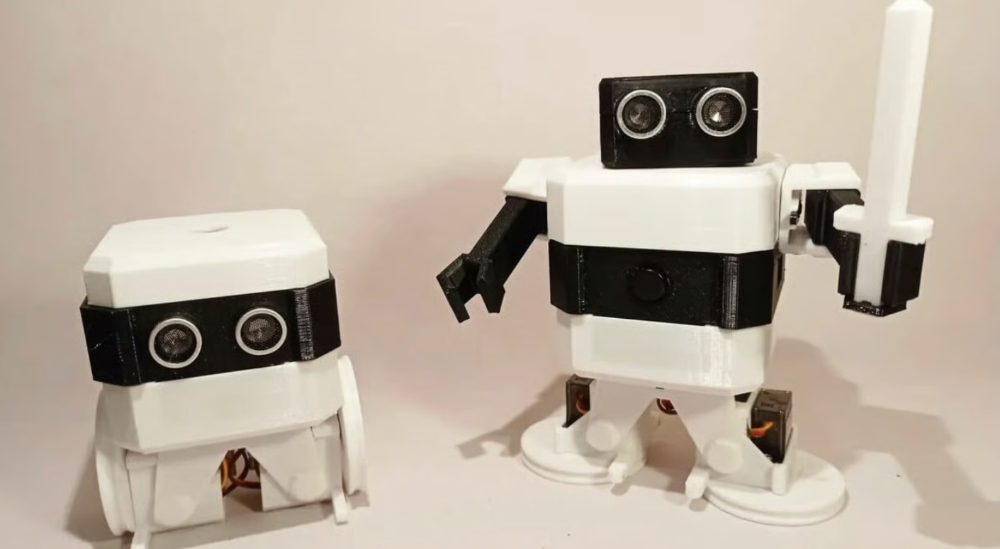

# sesion-07a

23-09-2025

## Apuntes 

Cosmotécnica / Tecnodiversidad
- Concepto que desarrolla Yuk Hui en su libro The Question Concerning Technology in China. Critica la idea que exista una sola tecnología universal. Propone entender la tecnología como inseparable de un cosmos y una moral: Cada sociedad desarrolla sus técnicas en base a su visión del mundo (cosmos) y sus valores (ethos)

`Toda la teoría del universo`

- [Susana Chau](https://www.linkedin.com/in/susana-chau/?originalSubdomain=cl): Comunicadora social, periodista. 
- [Yuk Hui](https://cajanegraeditora.com.ar/autores/?autor=hui-yuk): Estudió ingeniería informática y filosofía en la Universidad de Hong Kong.

`Cada lugar tiene su técnica y su forma de pensamiento`

- [Liquen Lab](https://liquenlab.cl/)

---

Perillas para parámetros

Botones para cosas rápidas

NFC: Near Field Communication, es una tecnología de comunicación inalámbrica de corto alcance que permite la transferencia de datos entre dos dispositivos acercándolos entres sí. [NFC](https://www.amazon.com/Beginning-NFC-Communication-Arduino-PhoneGap/dp/1449372066)

[CW&T:](https://cwandt.com/) Práctica artística y de diseño de Che-Wei y Taylor. Crean herramientas permanentes para transformar la perspectiva del trabajo, la vida y el tiempo.

Nicolas Briceño Aravena: Artista visual, licenciado de artes plásticas en la Universidad de Chile. Ha participado en exposiciones como `Nuevas guerras / vieja propaganda`. [link de bibiografía](https://www.cultura.gob.cl/coleccionarte/nicolas-briceno-aravena/)

Hackaday: Hackaday es una revista en línea que publica hacks cada día, así como un especial semanal sobre "Cómo" hackear. [Hackaday](https://hackaday.com/2023/02/23/sneaky-clock-displays-wrong-time-if-it-catches-you-looking/)

Modulo Reproductor MP3 DFPlayer Mini: Esta pequeña placa es un pequeño reproductor de audio MP3 con amplificador integrado y que puede funcionar por si sólo simplemente conectando unos pulsadores que permiten la reproducción de archivos directamente cargados en una tarjeta de memoria Micro SD. Tiene dos modos de funcionamiento.

Módulo RTC DS1302 Reloj De Tiempo Real: Un módulo RTC (Real Time Clock) o "Reloj de tiempo real" consiste en un circuito integrado alimentado por una batería el cual, en todo momento, registra la fecha, día de la semana y hora al igual que un reloj digital convencional.

Referente sonoro: (https://www.instagram.com/juanjoacuna/)

Patti Smith: Cantante y compositora, artista visual y escritora estadounidense. Tiene un apodo que es "La madrina del punk". (https://es.wikipedia.org/wiki/Patti_Smith)

`El sonido lleva al tiempo`

- Un motor DC, motor de corriente continua, pertenece a la clase de los electromotores y sirve para transformar la energía eléctrica en energía mecánica. Es rápido y no sabe dónde está; Lo podemos encontrar en drones, en el ventilador o en el vibrador del celu; cambiando los cables puedo cambiar la direccion del giro.
  - Motor 12V DC 20160rpm
  - Motor DC miniatura 3-6V 
- Motor paso a paso, motor eléctrico CC, sin escobillas que convierte pulsos digitales en rotación mecánica; es lento, preciso y no sabe dónde está, se mueve en grados (1,8° grados)
  - Mini motor paso a paso Driver board ULN2003
  - Nema 17 modelo 17hs2408 0.6A
- Servomotores; tiene la capacidad de ubicarse en cualquier posición dentro de su rango de operación; motor relativamente preciso y sabe donde está, (si le decimos: andate al ángulo 90°, va y sabe donde está)
  - Solenoide: movimiento lineal
  - Motor síncrono

---

(https://www.demasled.cl/cintas-led/)

Neo píxel: puedo darle un color a cada píxel. Puedo controlar cada píxel con algún color 

Luces LED, LED RGB

---

Proyecto 2, se entrega antes de las solemnes, 17 de octubre. Semana del 9 trabajar solo en el proyecto

Integrantes:

Grupo `Leonas.ino`
- Yamna Carrión
- Sofía Cartes
- Millaray Millar
- Vania Paredes
- Valentina Ruz 

### Idea 1

Selector de idiomas con joystick 

Entrada: Mediante un joystick, la persona tendrá distintas interacciones (arriba, abajo, izquierda, derecha y presionar el centro, es reset).

Salida: Al interactuar, se reproducirán audios de saludos en distintos idiomas, como: italiano, portugués, japonés y español chileno. Al mismo tiempo, como respuesta, dependiendo el idioma se moverá de manera representativa: japonés = reverencia

- Reproductor de idiomas por joystick 
- Lenguaje diferencia de dialecto 
- Joystick y reproducir sonido 
- Buscar una forma que sea más interactivo

[Modulo Reproductor MP3 DFPlayer Mini](https://afel.cl/products/modulo-reproductor-mp3-dfplayer-mini)

[Servomotor Engranaje Metálico Mg90s](https://afel.cl/products/servomotor-engranaje-metalico-mg90s)

[Joystick Palanca de Mando](https://afel.cl/products/joystick-palanca-de-mando)

como hablar de una cultura sin faltar el respeto 

lenguaje y dialecto 

### Idea 2

Máquina que cuentas secretos

Entrada: Al comienzo la máquina está tiritando; al detectar movimiento deja de tiritar y comienza a llamarte según la distancia a la que uno se encuentre.

- Si estas lejos (distancia de 1 metro aprox) comenzará a gritar "HOLAA, ACERCÁTE QUIERO CONTARTE ALGO"
- Si estas a una distancia mediana (distancia de 50 cm aprox) te hablará en un tono normal, sin gritar y te dirá "Todavía estás lejos, necesito que te acerques un poco más"
- Si estás cerca (distancia de 5 a 10 cm aprox) te susurrará un secreto

`Utilizaríamos:`

[Sensor de proximidad](https://afel.cl/products/sensor-de-ultrasonico-hc-sr04)

[Modulo Reproductor MP3 DFPlayer Mini](https://afel.cl/products/modulo-reproductor-mp3-dfplayer-mini)

[Motor de alta velocidad](https://afel.cl/collections/alta-velocidad)

Altavoz

---

### Encargo 12 

- Leer las bitacoras de colegas, encontrar similitudes, diferencias, preguntas y aciertos de sus máquinas saludadoras propuestas. Citar correctamente las fuentes. Comentar semejanzas, diferencias, etc con otros proyectos

Cabe recalcar que todas las máquinas tienen un propósito, que es saludar; pero cada una tiene un objetivo distinto. 

1• [valechavezalb](https://github.com/disenoUDP/dis8645-2025-02-procesos/tree/main/07-valechavezalb/sesion-07a)

La idea del grupo se resume en una máquina dispensadora de dulces, contiene distintos tipos de colores de chicles, la máquina reconoce el color y arroja un mensaje mediante un altavoz. 

- `Similitudes`
  - Ambas son máquinas saludadoras.
  - Ambas utilizan un altavoz como salida para que la máquina diga su saludo.
  - En ambos casos, el saludo cambia según una condición (color y distancia).
    
- `Diferencias`
  - Nuestra máquina se activa dependiendo de la proximidad. La idea de mis compañeros se activa dependiendo del color del chicle.
  - Nuestra máquina cambia el tono y el contenido del saludo. En cambio, la de mis compañeras cambia el mensaje dependiendo del color del chicle.
  - Nuestra máquina tiene interacción con la persona, es decir, nos habla directamente. La de mis compañeras, es más interacción con el objeto y el mensaje.
    
- `Preguntas`
  - ¿Qué pasaría si la máquina se queda sin chicles? ¿Sigue saludando o simplemente deja de funcionar?
  - ¿Los mensajes estarán pre-grabados con sus voces o tipo robótica?
  
- `Aciertos`
  - El uso de colores del chicle y la asociación con un mensaje, agrega un nivel de sorpresa y que el mensaje sea más "personalizado"
  - Es interesante el hecho de que, la máquina sea un mounstruo con un ojo animado, hace que sea un personaje atractivo.
  - La interacción del dispensador de chicles con mensajes; ya que es una acción "cotidiana" (sacar un chicle) en una experiencia distinta.

2• [aileendespessailles-design](https://github.com/disenoUDP/dis8645-2025-02-procesos/tree/main/08-aileendespessailles-design/sesion-07a) [MiguelVera23](https://github.com/vxlentiinaa/dis8645-2025-02-procesos/tree/main/29-MiguelVera23/sesion-07a)

Una máquina que saluda dependiendo si tiene o no tiene frío, el cual te dará un mensaje con respecto a si tiene o no tiene frío.

- `Similitudes`
  - Ambas son máquinas saludadoras, programadas en Arduino
  - En ambas máquinas hay un estado inicial neutro y se activa con la presencia de una persona.
  - Ambas interacciones son en base a "expresión corporal"
  - Ambas tienen más de una salida: nosotras sería el mensaje en altavoz y la vibración; el de mis compañeros sería mensaje en pantalla y el saludo con el brazo mecánico.

- `Diferencias`
  - Nuestra máquina se activa por sensor de proximidad y distancia y la de mis compañeros por sensor de temperatura y movimiento.
  - Nuestra máquina responde con distintos tonos de voz y la de mis compañeros responde con un movimiento mecánico (brazo) y textos.
  - Nuestra máquina depende de la distancia del usuario y la de mis compañeras depende de la temperatura para decidir si te saluda o no.

- `Preguntas`
  - ¿Cómo controlarían la suavidad del movimiento del servomotor?
  - ¿Cómo creen que reaccionaría la persona frente a un saludo con movimiento de brazo robótico comparado con un saludo solo textual?

- `Aciertos`
  - Al usar condiciones ambientales (temperatura) hace que el saludo no sea repetitivo, sino que depende del contexto del ambiente.
  - Implementar un brazo robótico como saludo, refuerza la parte sorpresiva de la máquina

3• [brauliofigueroa2001](https://github.com/disenoUDP/dis8645-2025-02-procesos/tree/main/10-brauliofigueroa2001/sesion-07a) [Bernardita-Jesus](https://github.com/disenoUDP/dis8645-2025-02-procesos/tree/main/13-Bernardita-Jesus/sesion-07a) 

Una máquina que tiene unos ojos que identifiquen y triangulen la profundidad de dónde estoy. Cuando me acerque a un espacio, una oreja me hable con un sonido aleatorio.

- `Similitudes`
  - Ambas máquinas dependen de la cercanía e interacción con la distancia de la persona.
  - Ambas máquinas están inspiradas en la idea de contar un secreto (nuestra máquina susurra y la demis compañeros usa la oreja como parlante)
  - Ambas máquinas utilizarían la voz y el sonido

- `Diferencias`
  - Nuestra máquina tiene tres encuentros: distante, cerca, íntimo (secreto). La de mis compañeros juega con la ironía, es decir, una oreja que es para escuchar, sea la que hable.
  - Nuestra máquina es efusiva, es decir que grita para que te vayas acercando. La de mis compañeros es más misteriosa, ya que, te va siguiendo con la mirada.
  - Nuestra máquina usa la distancia del usuario para variar el tono de la voz. En cambio la de mis compañeros utiliza ojos que te siguen con la mirada y una oreja que habla.

- `Preguntas`
  - ¿Qué tipo de mensajes o sonidos reproducirá la oreja? ¿serán secretos o frases graciosas?
  - ¿Los ojos solo siguen al usuario o también cambian las expresiones (parpadean, se agrandan, se achican)?

- `Aciertos`
  - La ironía de que una oreja hable en vez de escuchar, sería muy gracioso.
  - Los ojos que siguen al usuario, te hacen sentir observado; atrayendo a las personas a la interacción.
  - El uso de sonidos aleatorios, evita la repetición, por lo que el usuario podría acercarse más de una vez.

### Encargo 13

- Buscar 2 referentes asociados al proyecto: Lenguaje natural (personas), código, materialidad, documentación.
- Escribir un párrafo por cada uno de los referentes encontrados, citando las fuentes, y explicando por qué lo elegiste, qué te aporta, qué te inspira, o incluso si lo incluyes como antiejemplo.

---

•Referente de código•

Encontré un código de cómo programar el sensor HC SR04 de proximidad en Arduino. El usuario solo quiere que el sensor, al detectar un vaso se enciendan las bombas, pero no sabía como escribir el código

Elegí este referente para guiarme sobre el uso del sensor de proximidad HC sr04, saber que códigos usaba para tener una idea de como hacerlo para el proyecto con mis compañeras.

Colocó en el forum este código de abajo.

```cpp
const int boton1 = 2;
const int boton2 = 3;
const int boton3 = 4;
const int pin = 9;
const int pin2 = 11;

long dis;
long tiem;
int led = 8;

int bs0_1=0;
int bs1_1=0;
int bs2_1=0;
int bs0_2=0;
int bs1_2=0;
int bs2_2=0;

void setup() {
  
  Serial.begin(9600);
pinMode(LED_BUILTIN, OUTPUT);
pinMode(boton1, INPUT);
pinMode(boton2, INPUT);
pinMode(boton3, INPUT);
pinMode(pin, OUTPUT);
pinMode(pin2, OUTPUT);
pinMode(6, OUTPUT); //salida del pulso generado por el sensor ultrasónico
pinMode(5, INPUT);//entrada del pulso generado por el sensor ultrasónico
pinMode(8, INPUT);//alarma de la distancia(encenderá el led)
}

void loop() {
  bs0_1=bs0_2;
  bs1_1=bs1_2;
  bs2_1=bs2_2;
  
  bs0_2=digitalRead(boton1);
  bs1_2=digitalRead(boton2);
  bs2_2=digitalRead(boton3);

  digitalWrite;(6,LOW);//recibimiento del pulso.
  delayMicroseconds(5);
  digitalWrite(6, HIGH);//envió del pulso.
  delayMicroseconds(10);
  tiem=pulseIn(5, HIGH);//fórmula para medir el pulso entrante.
  dis= long(0.017*tiem);//fórmula para calcular la distancia del sensor ultrasónico.
  
  delay(100);
  
while (dis>3){

  digitalWrite(led, HIGH);
 
  if ((bs0_2 == HIGH )&&(bs0_1 == LOW)) {
    digitalWrite(pin, HIGH);
    delay(5000); 
    digitalWrite(pin2, HIGH);
    delay(10000);
    
  }
  else if ((bs1_2 == HIGH )&&(bs1_1 == LOW)) {
    digitalWrite(pin, HIGH);
    delay(7000); 
    digitalWrite(pin2, HIGH);
    delay(10000);
    
  }
  else if ((bs2_2 == HIGH )&&(bs2_1 == LOW)) {
    digitalWrite(pin, HIGH);
    delay(10000); 
    digitalWrite(pin2, HIGH);
    delay(10000);
    
  }
  digitalWrite(pin, LOW);
  digitalWrite(pin2, LOW);
  digitalWrite(led, LOW);
  digitalWrite(LED_BUILTIN, HIGH);
  
  Serial.println("LA DISTANCIA MEDIDA ES:");
  Serial.println(dis);
  Serial.println("cm");
  delay(500);

}
}
```
Alexander28. (2 de octubre de 2017). Programación sensor de proximidad [Mensaje en un foro]. Arduino Forum. Recuperado de (https://forum.arduino.cc/t/programacion-sensor-de-proximidad/483637)


Naylamp Mechatronics SAC. (s. f.). Tutorial de Arduino y sensor ultrasónico HC-SR04. Recuperado de https://naylampmechatronics.com/blog/10_tutorial-de-arduino-y-sensor-ultrasonico-hc-sr04.html

---

•Otto Ninja•

Otto Ninja, es un robot de fácil armado y con instrucciones fáciles de seguir. Por eso lo tomé como referente, ya que usa sensor de proximidad, servomotores e impresiones 3D. Además su programación se puede usar con Scratch.

Diseñador: OttoDIY



Otto Robot. (2024, 15 de febrero). Otto Ninja robot Arduino Nano design [Modelo 3D]. Printables. https://www.printables.com/model/256569-otto-ninja-robot-arduino-nano-design


