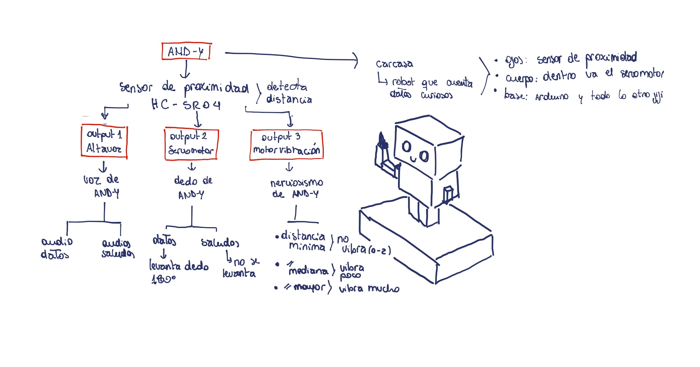

# sesion-07b

26-09-2025

## Apuntes

Comisión Cynthia Shuffer 

- Sensor ultrasónico [HC-sr04](https://afel.cl/products/sensor-de-ultrasonico-hc-sr04) 
- La velocidad del sonido en el aire, a 20°C, es de aproximadamente 343,2 metros por segundo (m/s), lo que equivale a 1234 km/h
  - Ejemplos de velocidad de sonido en diferentes medios:
  - Aire (a 15°C): 340 m/s (1224 km/h)
  - Agua (a 25°C): 1593 m/s
  - Madera: 3700 m/s
  - Acero: 6100 M/s

### Pseudocodigo

- 1- Intentar que el código se pueda ver completo en la primera pantalla
  2- archivo.ino
  3- creditos.ino
  4- cableado.ino

### Archivo principal.ino

- Usar bool para switch
- variables con clases (.cpp/.h)
- Usar booleanas para definir las variables, ej: Persona de 2 a 10 cm de distancia : true / false

### Pasos

- Configurar sensor (ultrasónico en este caso) en archivo principal
- Funciones con void
- Quedaría en setup

```cpp
 void setup() {
  configurarSensoresActuadores();
 }
```

En void loop:

```cpp
void loop() {
  leerSensores();
  tomarDecisiones();
  actuar();
}
```

### Archivo sensorUtlrasónico.ino

Necesitamos

- archivo/ventana del sensor
- decidir en que patita va

```cpp
 void configurarSensorUltrasonico() {
  // conectar la patita

  // definir la distancia minima
  // definir la distancia maxima

}
```

### Archivo sensoresActuadores.ino

- sirve para configurar más sensores y actuadores

```cpp
  void configurarSensoresActuadores() {

  configurarSensorUltrasonico();

  // configurar mas sensores
  // configurar actuadores
  }

  void leerSensores() {}

  void tomarDecisiones() {}

  void actuar() {}
```
---

Comentar lo que vamos hacer, que es lo que hará el código.

Y ver la idea final del proyecto para poder ejecutarla después.

---

## Proyecto 02 

- Sensor ultrasónico/proximidad HC-sr04

```cpp
  const int Trigger = 11;   //Pin digital 11 para el Trigger del sensor
  const int Echo = 12;   //Pin digital 12 para el Echo del sensor
```

Entrada: Al comienzo la máquina está tiritando; al detectar movimiento deja de tiritar y comienza a llamarte según la distancia a la que uno se encuentre.

Hemos decidido las distancias de esta manera:

- distancia mínima de 2 a 15 cm
- distancia media de 80 a 100 cm
- distancia máxima de 80 a 150 cm
- El tiempo de reposo es cuando no siente presencia

Luego hemos visto la configuración del Altavoz:

- tono/volumen del altavoz para cada distancia.
  - distancia minima: 30 - 40 decibeles
  - distancia media: 70- 80 decibeles
  - distancia maxima: 90 - 93 decibeles
 
También definimos la configuración del servomotor:

- Cuando el sensor detecte distancia de 2 a 15cm
  - el movimiento en ángulo es de 0 a 180° grados   
- Servo se mueve desde 0 a 180 grados
- Si no detecta la distancia requerida, se baja 

### Máquina de datos curiosos 🤓

Antes se llamaba RAM-ON pero ahora se llama AND-Y

`¿Qué necesitamos para el robot?`

- Sensor ultrasónico
- Servomotor
- Arduino R4 minima
- Altavoz
- Reproductor MP3
- Motor DC (motor vibrador)

`Entrada:`

Mediante el sensor ultrsónico, la máquina detecta presencia y detalles de distancia de esta presencia (persona/humano)

`Salida:`

Al detectar la distancia de la presencia la máquina reacciona de diferentes maneras:

- 1- Cuando AND-Y detecte una presencia, comenzará a temblar (de nervios) mediante el motor DC el tembleque aumentará entre más cerca estés.
- 2- El sensor detectará presencia en 3 instancias: 2 - 15cm, 80 - 100cm, 80 - 150cm
- 3- En cada parámetro la máquina reproduce un audio de voz distinto mediante la microSD en el reproductor MP3 y el altavoz.
- 4- Los parametros son:
  - 80 - 150cm = Te "grita" que vengas diciendo: "HOLA HUMANO, VEEEN!"
  - 80 - 100cm = Te grita de nuevo pidiendo que te acerque más, diciendo: "HOOLAA, MÁS CERCA!"
  - 2 - 15cm = Levanta un "dedo" usando el servo motor, este se moverá de los 0 grados a los 180 mientras estés a esa distancia. Al mismo tiempo te dirá algún dato interesante como "El maní es una legumbre, no un fruto seco.”

foto del robot

### Encargo 14

- cada persona del grupo debe implementar en diagrama de flujo dibujado o con la herramienta Mermaid.js con sus propias palabras y subirlo a su README.




### Encargo 15

cada persona del grupo debe subir a su README: documentar funcionamiento de sus sensores, incluyendo instrucciones de conexión y de configuración, subir el proyecto entero de arduino como carpeta, tiene que poder compilar sin problema y mostrar en consola los datos de los sensores.

### Servomotor

Este ejemplo de código lo sacó Vania de Gemini Ai

```cpp
  #include <Servo.h>

Servo myservo;  // Crea un objeto servo
int servoPin = 13; // El pin al que conectamos el cable de señal del servo

void setup() {
  myservo.attach(servoPin); // Vincula el objeto servo al pin 9
}

void loop() {
  myservo.write(0);   // Gira el servo a 0 grados
  delay(1000);        // Espera 1 segundo
  myservo.write(90);  // Gira el servo a 90 grados
  delay(1000);        // Espera 1 segundo
  myservo.write(180); // Gira el servo a 180 grados
  delay(1000);        // Espera 1 segundo
}
```


### Sensor Ultrasónico

Este ejemplo, lo hizo Nicolás Miranda y nos mandó el código por wsp.

```cpp
#include <Wire.h>
#include <Adafruit_GFX.h>
#include <Adafruit_SSD1306.h>

// Configuración de la pantalla OLED
#define SCREEN_WIDTH 128
#define SCREEN_HEIGHT 64
#define OLED_RESET    -1  
Adafruit_SSD1306 display(SCREEN_WIDTH, SCREEN_HEIGHT, &Wire, OLED_RESET);


const int TRIG_PIN = 11; // Pin TRIG del sensor
const int ECHO_PIN = 12; // Pin ECHO del sensor
long duration;
float distanceCm;


void setup() {
  // Inicialización de la pantalla OLED
  if (!display.begin(SSD1306_SWITCHCAPVCC, 0x3C)) { 
    Serial.println(F("Error al iniciar la pantalla OLED"));
    while (true);
  }
  display.clearDisplay();
  display.setTextColor(SSD1306_WHITE);
  
  // Configuración del sensor ultrasónico
  pinMode(TRIG_PIN, OUTPUT);
  pinMode(ECHO_PIN, INPUT);


  // Inicialización de la comunicación serial
  Serial.begin(9600);
}

void loop() {
  // Enviar pulso de ultrasonido
  digitalWrite(TRIG_PIN, LOW);
  delayMicroseconds(2);
  digitalWrite(TRIG_PIN, HIGH);
  delayMicroseconds(10);
  digitalWrite(TRIG_PIN, LOW);

  // Leer la duración del pulso de retorno
  duration = pulseIn(ECHO_PIN, HIGH);
  
  // Calcular la distancia en cm (velocidad del sonido = 343 m/s)
  distanceCm = duration * 0.0343 / 2;

 display.clearDisplay(); 
  display.setTextSize(1);
  display.setCursor(0,20);

  // Mostrar mensaje según la distancia
  if (distanceCm < 10) {
    display.println("Hola");
  }
  else if (distanceCm < 40) {
    display.println("Quien anda ahi?");
  }
  else if (distanceCm < 100) {
    display.println("Ah eras tu");
  }
  else if (distanceCm < 130) {
    display.println("Zzz.. nadie");
  }
  else {
    display.println("Oh ya te fuiste :c");
  }


  display.display(); // Actualizar la pantalla
  delay(500); // Esperar 500 ms
  }
```
