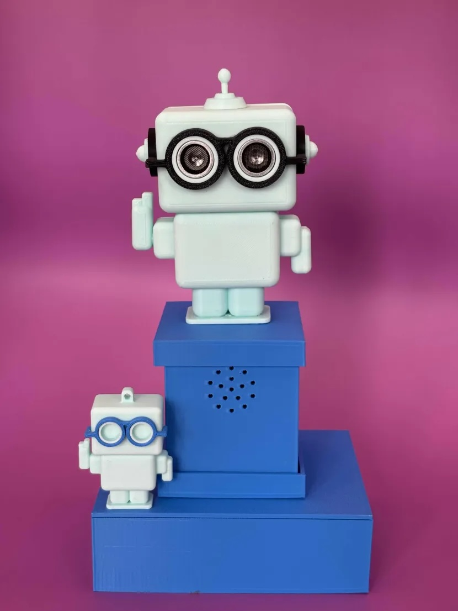
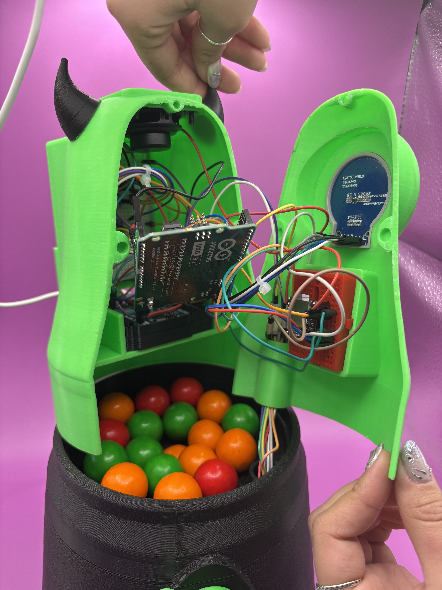
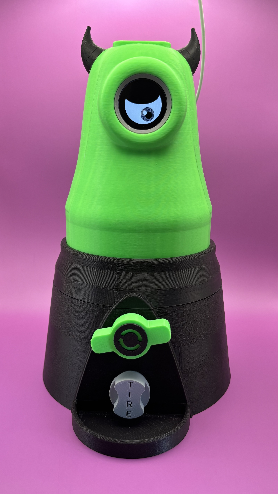
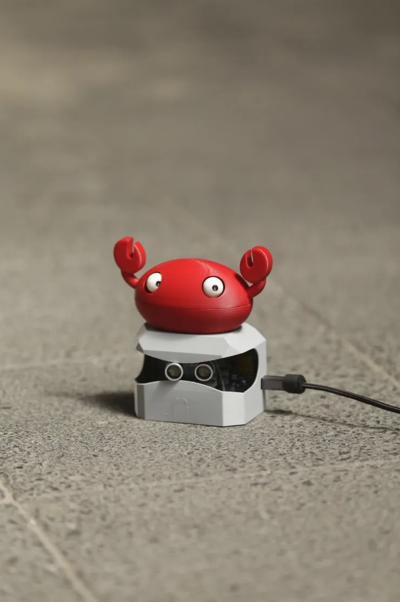
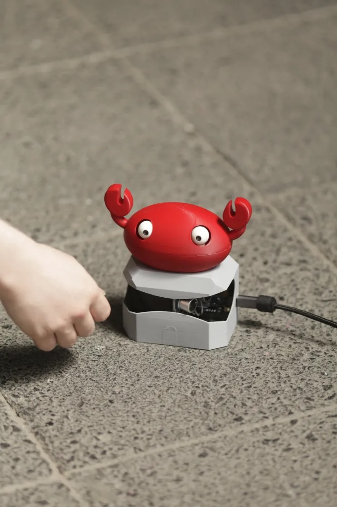
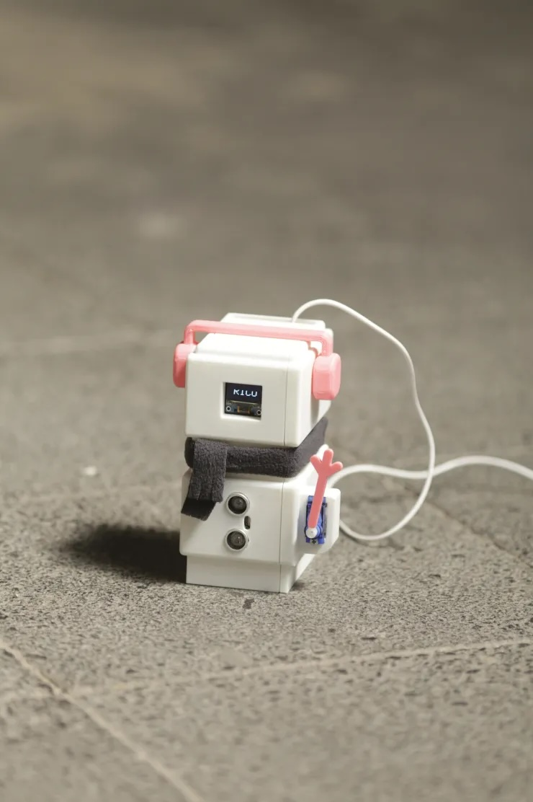
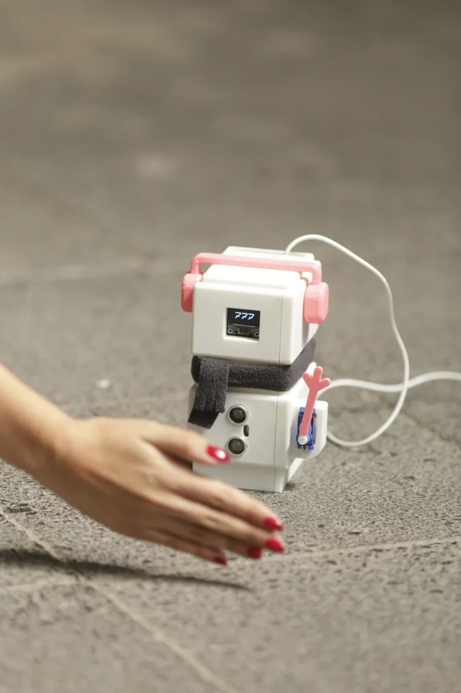
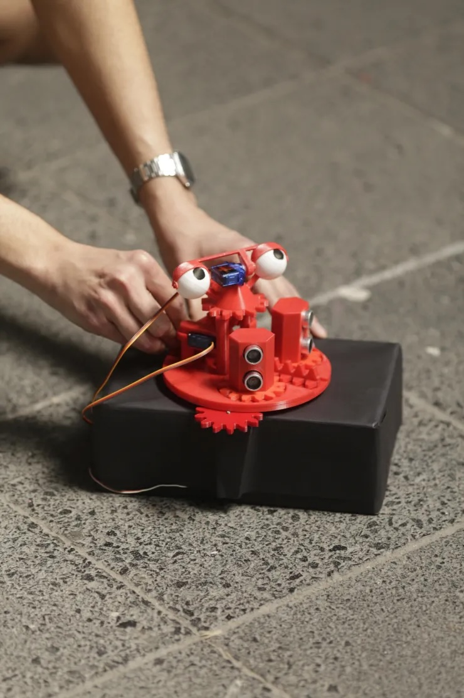
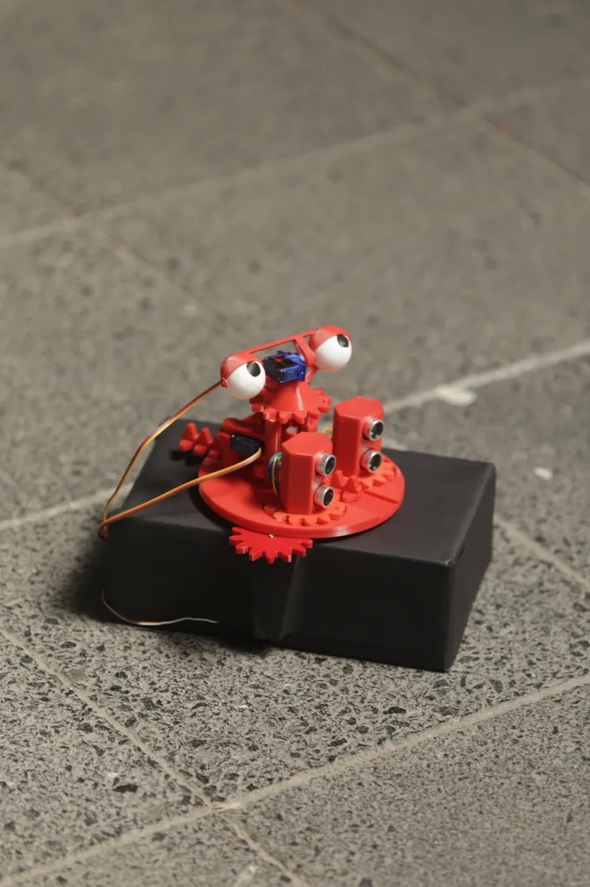

# sesion-10b

17-10-2025

## Apuntes

- Comenzamos con las presentaciones de los proyectos de nuestros compañeros :)

### Grupo 01 | AND-Y

El proyecto consiste en un robot que saluda mediante la interacción con algún humano, por medio de el sensor de ultrasónico programado con Arduino R4 Minima. A través, de las diferentes distancias puede recorrer tres fases de audios:

`DIÁLOGOS:`

Audios de saludo: Fase 1 y 2

Decir "hola humano, ¿porqué estas tan lejos?. Acércate"
"Hola, no seas tímido, ven más cerca. no tengo, virus creoo, jiji. "
Datos curiosos que dirá: Fase 3

“¿Sabías qué?, los 99% de los problemas se arreglan reiniciando.”
“La nube no existe, son computadores de otro.”
“Los datos nunca se borran, sólo se esconden.”
“El error 404 es mi manera de hacerme el leso.”
“El primer mouse era de madera.”

`INPUT`

Mediante el sensor ultrasónico, la máquina detecta movimiento/presencia y mide la distancia.

`OUTPUT`

Al detectar la distancia de la presencia la máquina reacciona de diferentes formas, según los siguientes componentes:

- Altavoz
- Servomotor al levantar el brazo
- Motor vibrador al detectar presencia de algún humano

### Grupo 02 | GUSTAVO LITA

Dispensador interactivo en forma de monstruo de color verde que reacciona emocionalmente según el color del chicle detectado. Como cada color significa una emoción, al momento de girar la manilla para obtener tu chicle, el monstruo te dará tu suerte del día (mensaje), acompañado de una animación y un audio correspondiente a la emoción/color del chicle.

`INTERACCIÓN`

- El usuario gira la manilla para que caiga un chicle.
- El chicle pasa por el sensor de color.
- El sensor detecta el color dominante.
- El sistema identifica la emoción asociada.
- El ojo del monstruo cambia su animación según la emoción.
- Se reproduce el sonido correspondiente desde el módulo MP3.
- El proceso se repite con cada chicle.

### Grupo 03 | CHISPOP

Chispop es un proyecto interactivo que combina tecnología, sonido y lenguaje. La idea es crear una experiencia donde el usuario pueda elegir un idioma desde un menú en pantalla y, al aplaudir, recibir un saludo tanto visual como sonoro en el idioma seleccionado.

`FUNCIONAMIENTO`

- Al encender el dispositivo, se muestra en la pantalla un menú de idiomas ( Ruso, Japones, Francés).
- El usuario gira un encoder rotatorio para desplazarse entre las opciones y presiona su botón para seleccionar un idioma.
- Luego, la pantalla muestra un mensaje que indica:
- “Aplaude dos veces para continuar o presiona el botón para volver al menú.”
- Si el sensor de sonido detecta un aplauso no pasa nada pero si detecta dos aplausos, se activa el reproductor DFPlayer Mini, que emite un saludo en audio correspondiente al idioma elegido y en la pantalla OLED se muestra una imagen del saludo en el idioma correspondiente.
- Si el usuario presiona el botón, vuelve al menú principal.

INSERTAR IMAGEN CHISPOP (no le saqué foto:( )

### Grupo 04 | JUANITO LA JAIBA

La máquina consiste en un dispositivo funcional que está planeado para ser utilizado por una persona a la vez. Esta trabaja detectando la presencia del usuario a través de un “radar” compuesto por un “sensor ultrasónico HC-SR04” y un “servomotor SG90” que se encuentra en constante movimiento, rotando continuamente desde 0 a 180 grados.

### Grupo 05 | FRIOLÍN

Friolín, un robot friolento, funciona con un sensor ultrasónico HC-SR04, que usaremos para detectar si hay o no hay alguien frente al robot, un sensor DHT11, que es de temperatura, humedad y presión; en nuestro caso solo utilizaremos la función de medir la temperatura ambiental, una pantalla OLED SSD1306, para mostrar una retroalimentación visual con características faciales; y un servomotor, para que cometa el acto de saludar con un brazo que le daremos al robot.

### Grupo 06 | FEELMYPARADOIA

El proyecto es una máquina con ojos que reacciona ante la presencia de una persona. En su estado normal, la base en donde están los ojos se mueven constantemente de un lado a otro y pestañean en un ciclo continuo, como si estuvieran explorando el entorno. Este movimiento se logra, gracias a un conjunto de engranajes, que sumados al movimiento que entregan los servos, logra mover toda la estructura.

Cuando el sensor ultrasónico detecta a alguien cerca, la máquina se detiene y queda “mirando” fijamente, dejando de pestañear, como si reconociera la presencia y le impactara esta misma.

Al momento en que la persona se aleja, el sistema entra en un estado de alivio y vuelve a su comportamiento inicial, retomando el movimiento y el parpadeo en bucle.

`INPUT`

Mediante los sensores ultrasónicos, la máquina detecta si existe o no presencia de un sujeto u objeto. Esto mediante el movimiento de los sensores a través de servomotores, además la estructura tiene unos ojos que parpadean constantemente mientras está buscando que detectar.

`OUTPUT`

Al detectar cualquier tipo de presencia, se queda mirando fijamente a la dirección en donde se haya sensado, y el pestañeo se detiene

