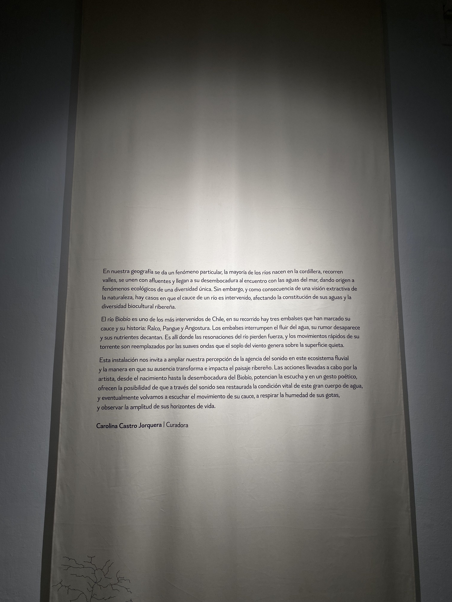
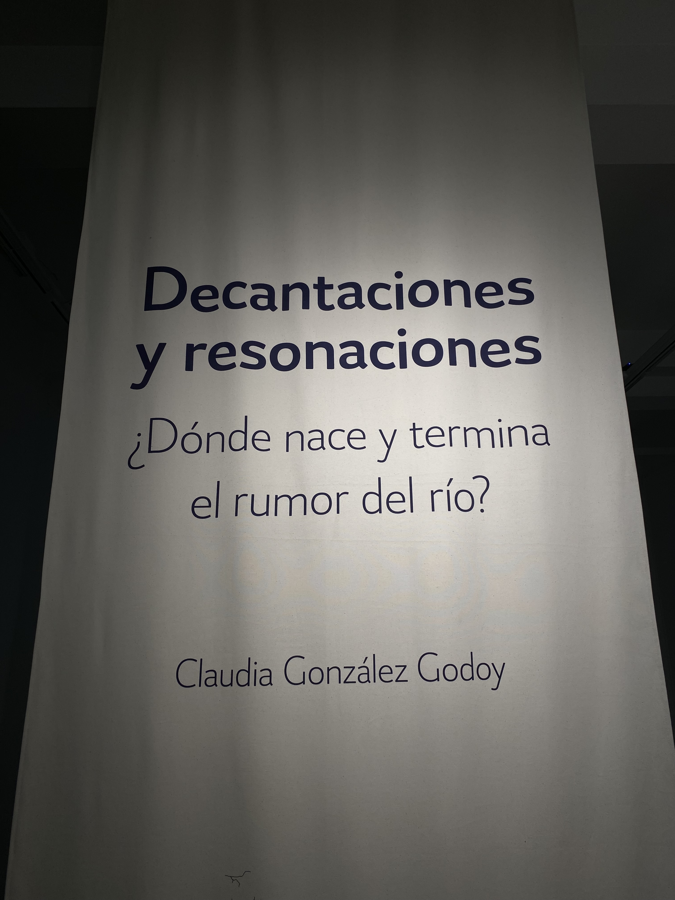
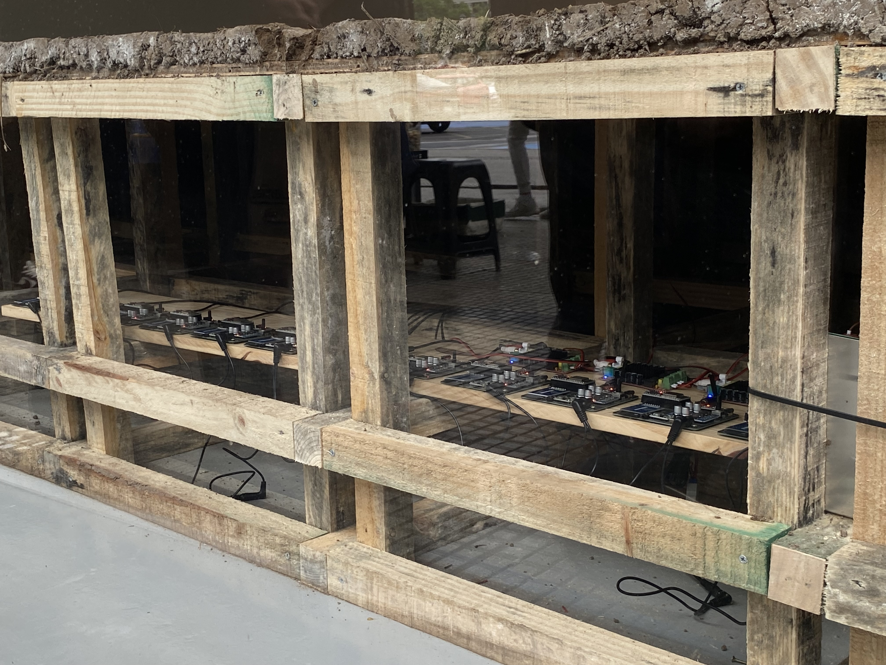
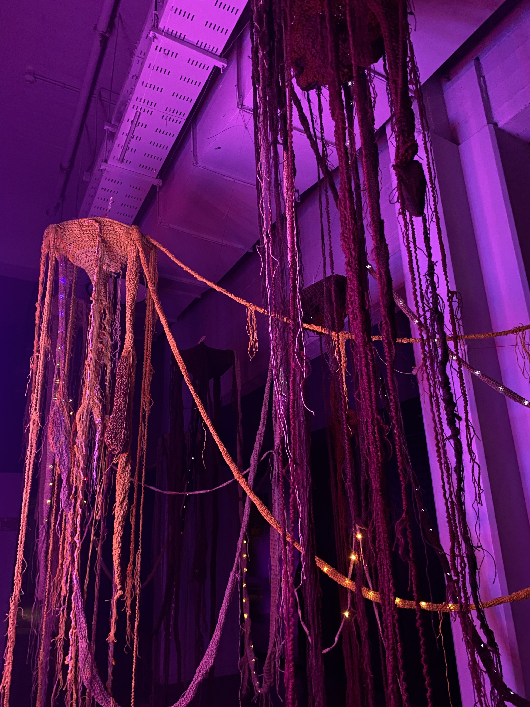
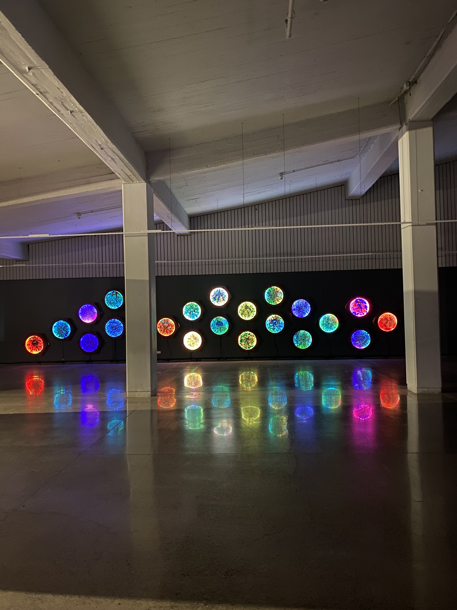
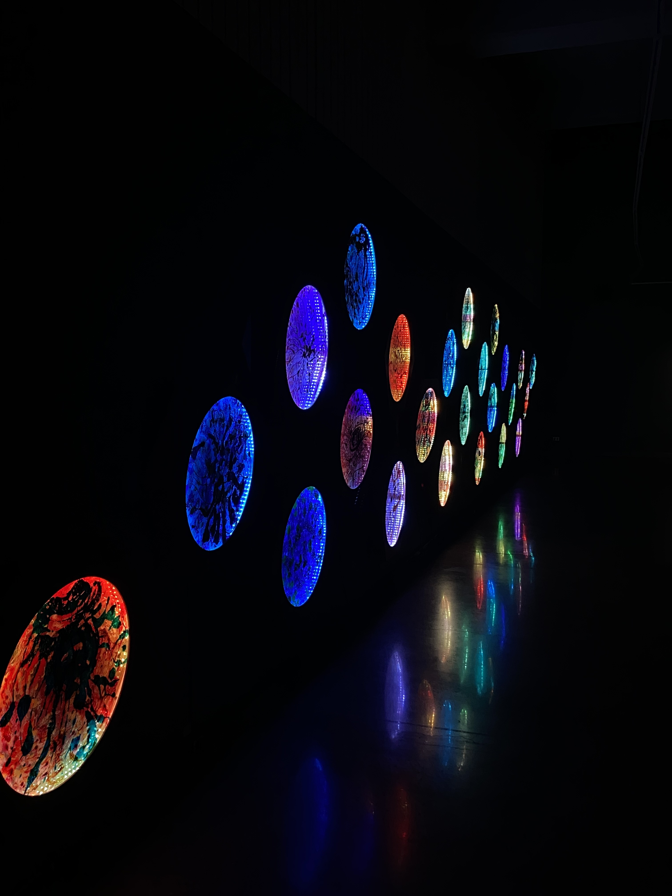
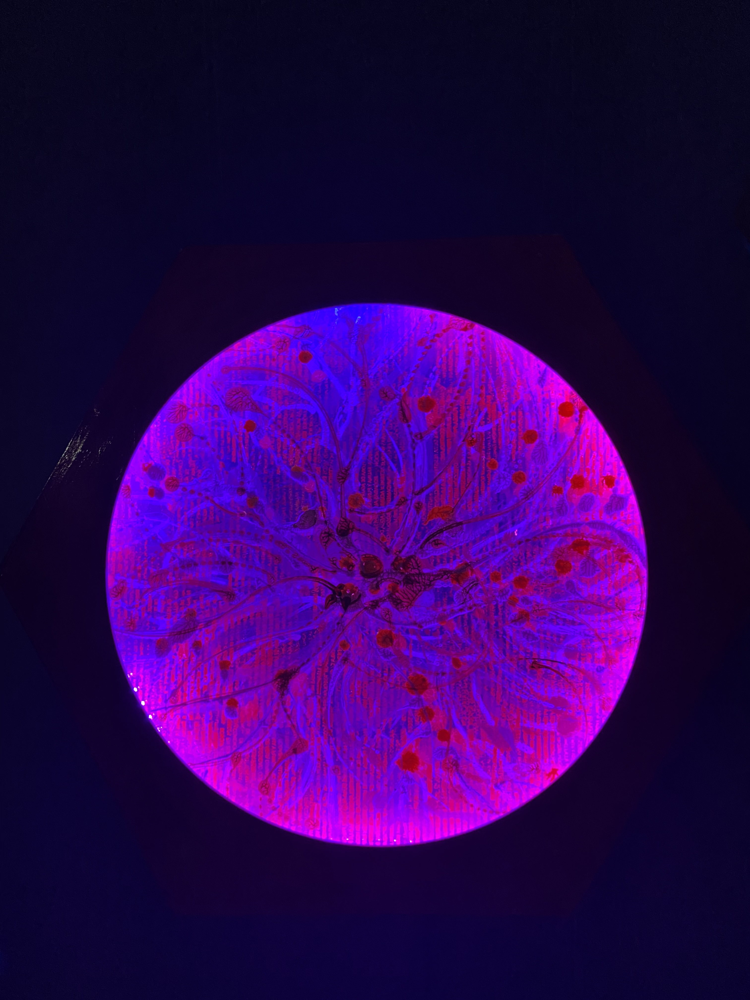
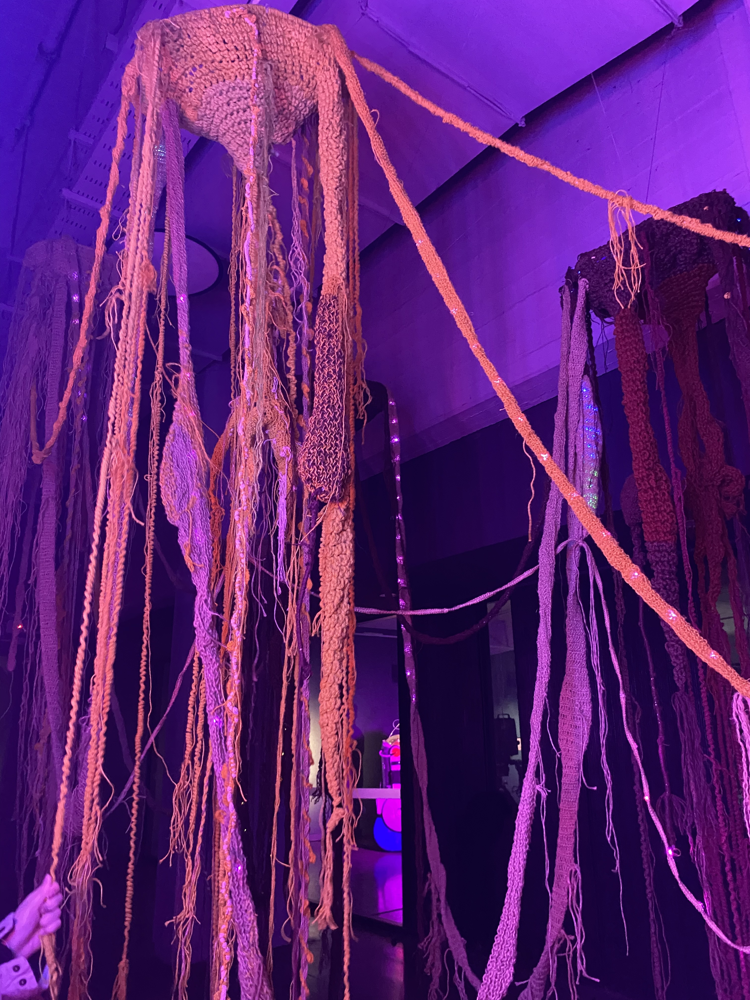

# sesion-11b

24-10-2025

## Apuntes

- Tenemos dos encargo para hacer. iremos al centro de Santiago a ver obras de artes mediales.
  - Analizar las obras y ver que tipo de sensores tiene, que actuadores, como se hizo, que conexiones tiene, etc.
- Máquinas de lenguaje
- Máquinas de felicidad
- Máquinas transductoras -> convertir E° en otra
- Máquinas sentimentales
- Chewing the apple of your eye -> sentimiento, es una metáfora.
- Ontología Orientada a Objetos (OOO)
- Un atributo es una variable en una clase 
- Un buen diseño pasa desapercibido

¿Qué son las artes mediales?

Según Google: El arte medial, también conocido como arte de los nuevos medios, es un campo artístico que utiliza diversas tecnologías de comunicación y medios emergentes, como la realidad virtual (RV), la realidad aumentada (RA), Internet y las tecnologías digitales, para crear obras. Este tipo de arte se caracteriza por ser interdisciplinario, explorando la relación entre tecnología, estética y sociedad, y abordando cuestiones sociales, culturales, políticas y legales. 

---

- Filosofía correlacionista: Pienso luego existo (Decartes)
  - Ségun google: es una corriente de pensamiento que sostiene que solo tenemos acceso a la correlación entre el pensamiento y el ser, y nunca a ninguno de los dos por separado. Este término, acuñado por Quentin Meillassoux, critica la idea de que es imposible pensar en la realidad independientemente de la mente que la percibe
- Fenomenología: El estudio de como las cosas aparecen, un estudio bien desarrollado.
  - Según google: La fenomenología es una corriente filosófica que estudia la estructura de la conciencia y la experiencia tal como se presentan a la mente, sin prejuicios preconcebidos.
- Paradoja de Zenon: Un muy buen ejemplo; dice que si un objeto muy lento tiene una ventaja en contra de otra cosa, que va mas rápido, nunca lo va a poder alcanzar (lo dijo seba)
  - Según google: Las paradojas de Zenón son argumentos filosóficos que buscan demostrar que el movimiento es imposible al cuestionar la naturaleza del espacio y el tiempo, dividiéndolos infinitamente.

`Aarón dijo:` Abajo los de arriba, pero deberia decir arriba los de abajo; para eso se hizo la poesía

---

### Graham Harman

Es un filósofo estadounidense. Es profesor de filosofía en el Instituto de Arquitectura del sur de California de Los Ángeles. Su obra sobre la metafísica de los objetos condujo al desarrollo de la ontología orientada a los objetos. COSMOLOGÍA

Filósofo reciente, actual. El enemigo de Harman es el lenguaje. Dice que la realidad existe, dpeendiendo de como llamemos las cosas. 

Realismo especulativo: es un movimiento filosófico contemporáneo que busca la existencia de una realidad independiente de la conciencia humana, a diferencia de las filosofías del siglo XX que se centraban en el lenguaje y la subjetividad. Se basa en la idea de que podemos conocer el mundo a través de la especulación (la razón) y se opone al "correlacionismo", la idea de que solo podemos conocer la relación entre pensamiento y ser, y no los objetos en sí mismos. 

- La tercera mesa de Graham; ¿qué propone? ¿qué es una mesa? hay ciertos tipos de pensamientos que nos permiten llegar a esto, es decir, la filosofía y el arte (el arte nos suele presentar las cosas como son, son metáforas, en el arte no hay respuestas correctas, la filosofía sigue siendo lo mismo que Sócrates)
- Harman dice que: Hay dos estrategias para llegar ahí; filosofía y el arte.
  - antiguamente el arte es representativo
  - nos propone las cosas como son
  - Sofismo es igual a una metáfora, argumento falso que parece válido, diseñado para engañar o confundir a una persona.

---

¿Por qué empieza "la tercera mesa"?

Porque Harman quiere definir qué es la mesa (el medio que hablamos antes), bueno, de ahí sale la Ontología Orientada a Objetos (OOO) [Asíntota]

Filosofía: amor al conocimiento, pero no es llegar a el (Sócrates)

¿Cómo llegamos a la mesa real? Mediante la filosofía y el arte (como son) -> metáforas

Metáforas: uno puede proponer como hablar de la mesa. Según Harman, las metáforas consisten en conectar dos cualidades

Para Harman; hay cualidades que son escenciales y cualidades que no son escenciales. La escencia de los objetos es inaccesible.

Harman dice: las metáforas consisten en conectar dos cualidades no escenciales (accidentes) de objetos distintos.

---

`¿Qué es una metáfora?`

Según google: figura retórica que compara dos cosas distintas de forma figurada, es decir, sin usar palabras como "como" o "parece". Se usa para describir algo diciendo que es otra cosa, con el fin de crear una imagen vívida o transmitir una idea.

---

- Ejemplo: zapato-ataud es una metáfora
- Zapato: sirve para no tocar el suelo, un propursor
  - empujar el mundo y yo avanzar (caminar), cóncavo

Diseño orientado a objetos, ¿cómo lo interpreta Matías? diseñar pensando que la interacción con los objetos es una metáfora.

¿Qué similitudes tiene con lo que hicimos en el proyecto 02?

- Funciones = métodos (OOP)
- Metaclases = variables, atributos (OOO)
- Cuando diseñamos pensamos en estas ambas dimensiones, factura y materialidad/escenciales y no escenciales
- Cómo resolver el diseño

---

Luego de la intensa clase de filosofía que tuvimos, en el segundo bloque salimos a terreno. Fuimos a la Galería Gabriela Mistral y al Centro Cultural CEINA a ver la 17 Bienal de Artes Mediales.

### Encargo 17 

Cada persona debe subir una investigación detallada de la obra artística de Claudia González Godoy, con énfasis en su investigación sobre ríos, incluyendo información sobre premios, exposiciones, colaboradores, estudios y referencias en su obra.

`¿Quién es?`

- Claudia González Godoy (Chile, 1983) es artista medial independiente y gestora de proyectos educativos en arte y tecnología. Su obra se centra en la noción de materialidad de soportes tecnológicos tanto analógicos como digitales, así como en el comportamiento de los materiales en el tiempo y su manifestación en la dimensión del sonido.

`Síntesis de la obra`

- Decantaciones y resonaciones. ¿Dónde nace y termina el rumor del río? 
  - es una instalación sonora y espacial de Clauda González Godoy que transforma la sala, Galería de arte contemporáneo Gabriela Mistral, en una "topografía suspendida" que se asimila a una zona embalsada del río Biobío. La obra reflexiona sobre las transformaciones que ha sufrido este "charco" de agua, poniendo su atención en el sonido, capturando grabaciones de su flujo libre y contrastándolas con el silencio de las aguas retenidad. La pieza reúne grabaciones de campo, elementos textiles que representan la red hidrográfica y composiciones que confrontan el flujo (sonidos de río libre) con el silencio de las aguas retenidas en embalses, invitando a la escucha y a repensar la intervención humana en ecosistemas fluviales.
  - La muestra ocupa ambas salas de la galería; es el resultado de una investigación artística y ecológica, en la que la artista realizó performances sonoras a lo largo del curso del río, desde su nacimiento en la Laguna Galletué hasta su desembocadura en la Península de Hualpén. 

- ¿Qué hace la obra? la obra se divide en tres "marcos"
  - Sonido: Registro de flujos libres del río versus paisajes sonoros de embalse; uso de grabaciones de campo y diseño sonoro espacial para “resonar” la sala.
  - Textil / cartografía: Representación textil de la red hidrográfica del Biobío que actúa como topografía ficticia (la exposición monta una especie de paisaje embalsado dentro de la galería).
  - Instalación espacial: Objetos, cuencas/vasijas y dispositivos sonoro-mecánicos que componen una escena que tensiona lo artificial y lo natural, obligando a la calma y escucha atenta.
  
`Marco investigativo de la obra`

- Eje central de la obra
  - La obra forma parte de un proceso de investigación que Claudia ha desarrollado durante años sobre la materialidad sonora del agua y las transformaciones socioterritoriales de ríos (particularmente el Biobío). En entrevistas y fichas de proyecto la artista señala que el trabajo busca explorar la “memoria” del río, las huellas sumergidas por represas y el contraste entre el ruido del flujo natural y la quietud del embalse.
  - Cruce entre arte, ciencia y tecnología: campo sonoro (grabaciones de campo, egofonía), técnicas textiles/cartográficas y montajes que generan experiencias sensoriales y contemplativas. Esto está alineado con su trayectoria como artista medial interesada en materialidad tecnológica y en el comportamiento de materiales en el tiempo.
 
`Proyecto relacionado`

- Hidroscopias / Biobío / Maule: La obra se inscribe en una serie de proyectos del mismo eje investigativo (por ejemplo, “Hidroscopia / Biobío” y trabajos previos sobre el Maule), donde la artista reconoce interlocuciones con investigaciones territoriales, archivos sonoros y colaboraciones con comunidades y organizaciones ligadas al cuidado de ríos. En entrevistas recientes habla explícitamente de estos procesos y del interés por la “retribución” al río.

`Exhibiciones importantes`

- Galería Gabriela Mistral (GGM) — Presentación de Decantaciones y resonaciones (muestra anunciada para 11 de octubre; se situó en el espacio expositivo del Ministerio de las Culturas). Curaduría: Carolina Castro. (Ficha de la GGM y nota del Ministerio de las Culturas).
- Casa de la Cultura de Chiguayante / proyectos en Biobío: exhibiciones y acciones públicas en la región del Biobío vinculadas a “Hidroscopia / Biobío” (documentadas en artículos y reseñas).
- Participación en Bienal de Artes Mediales y otras muestras: la artista ha estado vinculada a circuitos de arte medial (ej.: Bienal de Artes Mediales) y su obra forma parte de colecciones y catálogos de arte contemporáneo. "Hiperrealidades" (que también fuimos a la exposición)

`Premios, reconocimientos, etc`

- Residencias /programas internacionales: aparece registrada su participación en programas internacionales como el Berliner Künstlerprogramm /residencias (ficha en Berliner Künstlerprogramm) y otras residencias/documentos de su CV artístico.
- Colecciones y reconocimientos locales: su trabajo figura en registros institucionales (Colección de Arte Contemporáneo del Ministerio de las Culturas) y en plataformas especializadas. Esto muestra reconocimiento institucional a su obra.

`Estudios`

- Claudia González Godoy (Santiago, 1983) es Artista Visual y Profesora de Arte (Escuela de Arte y Cultura Visual, Universidad Arcis) y tiene un Magíster en Artes Mediales (Universidad de Chile). Su trayectoria incluye docencia y gestión de proyectos en arte y tecnología.

### Encargo 18

cada persona debe subir taxonomía detallada de sensores, actuadores, software y hardware utilizado en 1 obra exhibida en la Bienal de Artes Mediales 2025, citando correctamente a las fuentes.

- La obra elegida es `~~~Desde la raíz~~~ Aproximaciones al bosque esclerófilo` por Yto Aranda.

La obra es una instalación inmersiva que invita a imaginar el bosque esclerófilo desde su interior: el subsuelo. La obra es compuesta mediante tejidos que integra la luz, la interacción táctil, sonido y olores propios del bosque. La obra recrea la red subterránea de raíces y micorrizas, como un sistema sensible y activo; capaz de responder al tacto y revlear el funcionamiento interconectado de la obra.

La obra pone en escena la inteligencia del mundo natural, donde las plantas no solo perciben y se comunican, sino también que sostienen la vida mediante relaciones basadas en el cuidado y la reciprocidad. La luz se convierte en código, el sonido se asocia a la vida, y el cuerpo visitante se integra como una extensión sensible de esta red en constante transformación.

Por otro lado, están las 24 pinturas electrónicas, organizadas en tres bloques (planeta raíz, simbiosis-micorrizas y agua raíz), invitan a imaginar el mundo subterráneo desde distintas perspectivas. Esta experiencia se amplifica con un video que documenta visualmente el bosque real, conectando la instalación con su territorio de origen. En su conjunto, `~~~Desde la raíz~~~` entrelaza arte, ciencia y tecnología en una experiencia transmedial que desestabiliza la mirada antropocéntrica, revelando el mundo vegetal como un sistema complejo, sensible e interconectado, del cual depende la vida de otras especies, incluida la humana.

Para la 17 Bienal de Artes Mediales propone una instalación inmersiva que integra tejido, luz, sonido, video y sensores, configurando una experiencia sensorial que desestabiliza la mirada antropocéntrica.

- Sensores:
  - La obra posee sensores táctiles instalados en las raíces/micorrizas tejidas que al tocarlos generan sonidos de canto de aves mediante parlantes abiertos.
    
- Actuadores:
  - Parlantes abiertos/altavoces para la reproducción de los sonidos del bosque.
  - Audífonos para escuchar narraciones (se menciona reproducción de seis narraciones por raíz en audífonos).
  - Iluminación LED programable que se integra a las raíces (se habla de luz como código y las imágenes muestran tiras/luces integradas en los tejidos).
  - Video, proyector que documenta el bosque real y conecta la instalación con su territorio.
  - Elementos olfativos, olores propios del bosque (la obra integra lo olfativo como parte de la experiencia).

- Infraestructura:
  - Tejidos de yute o sisal que simbolizan las raíces, hechas con técnicas como crochet, macramé y palillos.
  - Estructura colgante (parece ser de alambre) donde caen los tejidos.
  - 24 piezas electrónicas (de 67 x 77 cm - 54 cm de diámetro) y los módulos textiles integrados con electrónica; la inclusión de 24 pinturas electrónicas hexagonales y la proyección de un video que registra flora, fauna y funga del bosque esclerófilo, recopilado durante las exploraciones territoriales de la artista en su propio hábitat, Rao Caya.

- Software/Hardware/programación:
  - Microcontroladores, en las descripciones de la instalación hablan de microcontroladores/circuitos integrados en las pinturas electrónicas y módulos textiles (la ficha y la documentación técnica de la obra lo listan como parte del montaje).
  - Iluminación LED programables.
  - Sistemas de reproducción de audio (grabaciones del bosque, narraciones en español/inglés), vinculados a la interacción táctil).

|Componente|Tipo|Especifícaciones|Función|
|----------|----|----------------|-------|
|Sensor táctil|Sensor|Dentro de los tejidos de yute|Detecta prescencia y activa sonidos de aves|
|Parlantes|Output/Hardware|Instalados dentro de la sala|Reproducen sonidos del bosque|
|Audífonos|Output/Hardware|Instalados para escuchar 6 narraciones|Escuchar las narraciones de la obra|
|Iluminación LED|Actuador/Harware|Tiras LED programables que se integran en las raíces y en las piezas electrónicas|Generar patrones lumínicos|
|Proyección de Video|Hardware/Software|Documenta el bosque real|Proyectar imágenes del bosque|
|Elementos olfativos|Olfativo|La obra integra lo olfativo como parte de la experiencia|Simula olores propios del bosque|
|Microcontrolador|Hardware|Arduino|Controlar sensores, LED y sonidos|

- Cosas que probablemente estén:
  - Amplificadores de audio (para alimentar parlantes abiertos).
  - Controladores de tiras LED (drivers / PWM) y fuentes de alimentación específicas.
  - Relés o drivers para controlar difusores de olor.
  - Placas de desarrollo / microcontroladores (p. ej. Arduino/Teensy/Raspberry Pi) para leer sensores táctiles y disparar audio/LEDs (las páginas mencionan “microcontroladores” en la ficha/introducción del montaje).
  - Tarjetas de audio USB, DACs, interfaces de sonido y mezcladores para enrutar audio a parlantes y audífonos.
  - Cableado, protoboards / PCBs de circuito impreso (para las “pinturas electrónicas”).
  - Software de audio interactivo (Max/MSP, Pure Data, Ableton Live con control MIDI/Open sound control; comunes en instalaciones sonoras; no explicitado por la documentación de la obra, por lo tanto marcado como inferencia).

- Flujo de interacción
  - a. Interacción humana (tocar un nudo / raíz tejida)
  - b. Sensor táctil detecta la presencia
  - c. Microcontrolador procesa la señal
  - d. dispara archivo de audio (ave/narración) a parlante o audífono;
  - e. activa secuencia lumínica (LED) y/o
  - f. coordina elementos de vídeo/loop. (Este flujo está descrito en términos de lo que la obra hace; el detalle técnico exacto de cada paso no siempre aparece en las notas públicas)

---

Bibliografía / Enlaces:

- Ministerio de las Culturas, las Artes y el Patrimonio. (2025, 6 de octubre). Galería Gabriela Mistral presenta “Decantaciones y resonancias. ¿Dónde nace y termina el rumor del río?” de Claudia González Godoy. Ministerio de las Culturas. <https://www.cultura.gob.cl/agendacultural/galeria-gabriela-mistral-presenta-decantaciones-y-resonaciones-donde-nace-y-termina-el-rumor-del-rio-de-claudia-gonzalez-godoy/>
- Artishock Revista. (2025, 14 de septiembre). Claudia González Godoy: Hidroscopia / Biobío. Artishock Revista. <https://artishockrevista.com/2025/09/14/claudia-gonzalez-godoy-hidroscopias/>
- González Godoy, C. (s. f.). CGG | Claudia González Godoy. <https://www.claudiagonzalez.cl/>
- Berliner Künstlerprogramm. (s. f.). Claudia Paulina González Godoy. Berliner Künstlerprogramm / DAAD. <https://www.berliner-kuenstlerprogramm.de/en/artist/claudia-paulina-gonzalez-godoy/>
- Arte y Medios. (2025). ¿Dónde nace y termina el rumor del río? de Claudia González Godoy. Arte y Medios. <https://arteymedios.org/donde-nace-y-termina-el-rumor-del-rio-de-claudia-gonzalez-godoy/>
- El Dínamo / ED. (2025, 11 de octubre). “Decantaciones y resonancias” en Galería Gabriela Mistral. ED.cl. <hhttps://www.ed.cl/event/decantaciones-y-resonaciones-en-galeria-gabriela-mistral/>
- El Ciudadano. (2025, 7 de octubre). Una reflexión ecológica y sonora: Galería Gabriela Mistral presenta “Decantaciones y Resonancias” de Claudia González Godoy. El Ciudadano. <https://www.elciudadano.com/arte-cultura/una-reflexion-ecologica-y-sonora-galeria-gabriela-mistral-presenta-decantaciones-y-resonaciones-de-claudia-gonzalez-godoy/10/07/>
- Ministerio de las Culturas, las Artes y el Patrimonio — Colección de Arte Contemporáneo. (2022, 2 de noviembre). González, Claudia | Colección de Arte Contemporáneo. <https://www.cultura.gob.cl/coleccionarte/claudia-gonzalez-godoy>
- Instagram (@_claudiagonzalezgodoy). (s. f.). Publicaciones relacionadas con Decantaciones y Resonancias [Publicaciones e imágenes]. Instagram. <https://www.instagram.com/_claudiagonzalezgodoy/>
- Bienal de Artes Mediales de Santiago. (s. f.). Claudia González Godoy [Ficha participante] <https://17.bienaldeartesmediales.cl/participante/claudia-gonzalez-godoy/>
- Arte Informado. (s. f.). Claudia González Godoy – artista [Ficha de artista] <https://www.arteinformado.com/guia/f/claudia-gonzalez-godoy-168978>
- Casa Hoffmann. (s. f.). Claudia González Godoy [Perfil de artista]. <https://casa-hoffmann.com/portfolio/claudia-gonzalez-godoy/>
- 17ª Bienal de Artes Mediales de Santiago. (2025). ~~~ desde la raíz ~~~ una aproximación al bosque esclerófilo. Recuperado de <https://17.bienaldeartesmediales.cl/obra/desde-la-raiz-una-aproximacion-al-bosque-esclerofilo>
- Vilches, M. J. (2025, 14 agosto). Yto Aranda: arte, naturaleza y tecnología. 17ª Bienal de Artes Mediales de Santiago. Recuperado de <https://17.bienaldeartesmediales.cl/2025/08/14/yto-aranda>
- Aranda, Y. (2023, 27 septiembre). ~~~ desde la raíz ~~~: una aproximación al bosque esclerófilo. Recuperado de <https://yto.cl/desdelaraiz/>
- <https://www.instagram.com/p/DPtsRnuDVAY/>
- <https://www.instagram.com/p/DPwvI5yDwcN/>
- <https://arteymedios.org/claudia-gonzalez/>
- <https://culturaacompanada.blogspot.com/2025/10/galeria-gabriela-mistral-presenta.html>
