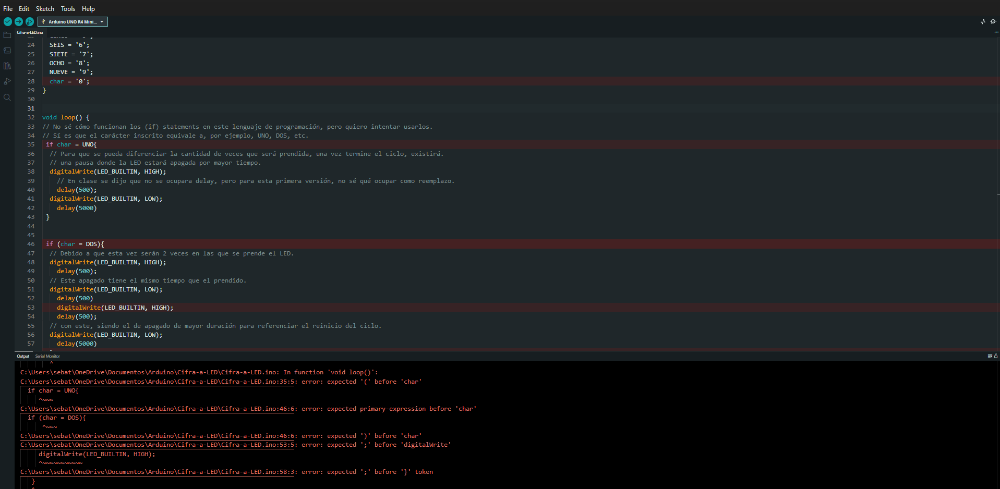
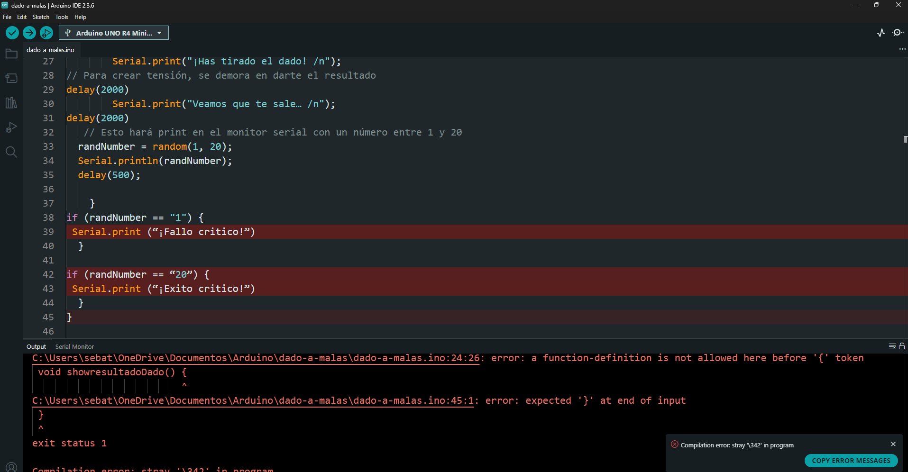
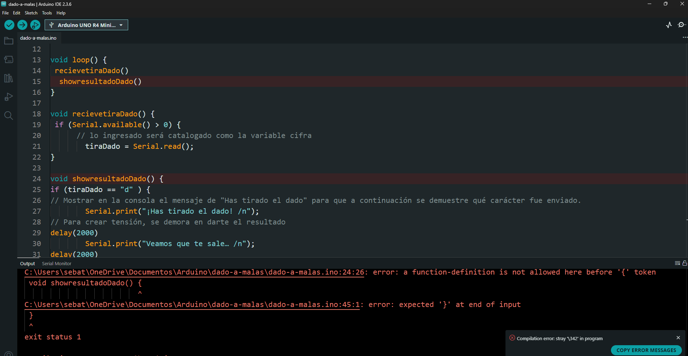
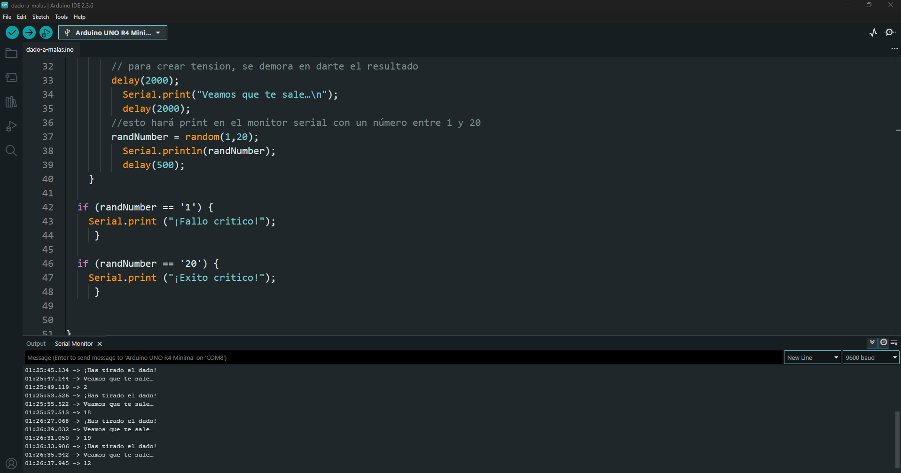

# sesion-01b

## Módulo de la mañana

Alias es un nombre, el cual le colocamos a una colección de datos.

Empezamos hablando de la buena comunicación, sobre todo por cómo deberíamos enviar y tomar en cuenta los correos electrónicos.

Debería ocupar el Reply All, para que todas las personas dentro de una conversación se puedan enterar.

Vamos a instalar Arduino IDE desde la página arduino.cc, un lugar donde nos quieren vender productos; el Arduino IDE 2.x será el que ocupemos para esta clase.

IDE es Integrated Development Environment.

Control+coma es para abrir las preferencias.

Las cosas open source son aquellas que pueden ir más allá de la compañía, debido a que personas que leen absolutamente todo el código, y si llega a existir algún peligro de seguridad, se puede hacer saber al desarrollador para mejorar la seguridad y/o funcionamiento.

Tenemos que instalar el Board Manager de la placa R4 para poder ser capaces de usar este Arduino.

Piruetasxyz (Aarón Montoya) está creando librerías de sus proyectos para que puedan llegar a más personas. La biblioteca te permite hacer funciones preprogramadas, para que otras personas no tengan que volver a pasar por ese proceso tan largo.

File-01.Basics-Blink, donde parte haciendo nada, donde existen los comentarios que indican el funcionamiento de las determinadas líneas de código…

() paréntesis

{} murciélagos

[] corchetes

En la esquina superior izquierda hay 2 botones; un check es donde verifica si el código está funcionando, mientras que upload es lo que enviará el código al Arduino siempre y cuando esté conectado y seleccionado el Arduino que específicamente vamos a usar.

Cada vez que presiono el botón de reset, vuelve a su estado original, de la misma manera en la que funcionaría si es que el cable fuese conectado y desconectado.

Si presiono dos veces rápidamente el botón reset, se va a un estado…

Todo Arduino es C, todo C no es Arduino…

/* es para indicar que todo es un comentario hasta que se encuentre el */ al menos Aarón Montoya prefiere escribir cada línea individualmente, que sería con //.

El comentario, como buen modal, debería ir una línea anterior a donde iría a pasar, por ejemplo:

// Aquí iría el color…

color(255,132,201)

Muy importante documentar, para no tener que pelear en contra de nuestra propia memoria…

El digitalWrite nos permite emitir un voltaje donde nosotros queramos de manera binaria; serían HIGH y LOW (1,0).

Usar delay es una muy mala práctica; hay que usar unas 20 líneas de código para que quede elegante.

Int (¿integrales?) Antes del setup pondremos los datos de tiempo de prendido y apagado.

Las palabras que son seguidas por un paréntesis son funciones.

Las funciones son palabras que agarran código que esté en otra parte.

Los parámetros que van dentro de las funciones se separan de cada uno con una coma.

## Módulo después del break

Declarar es extremadamente importante en computación.

Con void estaré creando mi declaración.

En este programa en específico no importa el orden de qué voy a declarar.

Las int son variables, pero no son void.

char letrita = '1'; (Entra solo un carácter, sea un número, símbolo o letra).

String poema = "‘Te regalaré un abismo" (con mayúscula y con doble comilla)…

Comillas simples ‘ ’ solo entra 1 letra…

Comillas dobles “ “ entra cualquier cantidad de caracteres que queramos…

Él igual = no es conmutativo, funciona de izquierda a derecha; el lugar de la memoria que se llama como está a la izquierda, adentro de eso vive el valor de la derecha…

Nuestras variables no deberían partir de un número, no deberían tener un espacio.

Serial es muy importante, donde se pueden encontrar muchas cosas distintas; entre esas, Serial.begin(9600) haría que al momento de pasar 9600 milisegundos se abra el Serial, donde se pueden transmitir mensajes.

Serial.print(poema);

“\n” es una nueva línea de texto en la consola.

// declaración

// tipoDeDato nombreDeFantasia

Para tener una variable o una función, primero debo declararla una vez; ese nombre de fantasía debe ser único.

Después de declararlo, puedo usarlo.

C++ W3Schools

## encargo 3 "programar y equivocarse 3 veces, documentar textualmente"

Primero quiero lograr que, con los dígitos de mi computador, el LED del Arduino brille la cantidad de veces que corresponda al dígito ingresado.

Basándome en el ejemplo de Blink y el print de la poesía que hicimos en clase, intenté crearme una base para poder trabajar en este código.

Con ciertos conocimientos previos, llegué a lo siguiente:

``` c++
// Pasar de dígitos en mi compu a brillos en el LED de prueba en el pin 13.

// Dejar escrito los caracteres que quiero que existan.
char UNO;
char DOS;
char TRES;
char CUATRO;
char CINCO;
char SEIS;
char SIETE;
char OCHO;
char NUEVE;

void setup() {
 // Escribo que el LED que quiero usar es el que está montado en el mismo Arduino.
  pinMode(LED_BUILTIN, OUTPUT);
  Serial.begin(9600);
  // Declaro que cada una de estas palabras equivale a la cifra que está escrita entre ''
  UNO = '1';
  DOS = '2';
  TRES = '3';
  CUATRO = '4';
  CINCO = '5';
  SEIS = '6';
  SIETE = '7';
  OCHO = '8';
  NUEVE = '9';
  char = '0';
}


void loop() {
// No sé cómo funcionan los (if) statements en este lenguaje de programación, pero quiero intentar usarlos.
// Sí es que el carácter inscrito equivale a, por ejemplo, UNO, DOS, etc.
 if char = UNO{
  // Para que se pueda diferenciar la cantidad de veces que será prendida, una vez termine el ciclo, existirá.
  // una pausa donde la LED estará apagada por mayor tiempo.
  digitalWrite(LED_BUILTIN, HIGH);
    // En clase se dijo que no se ocupara delay, pero para esta primera versión, no sé qué ocupar como reemplazo.
    delay(500);    
  digitalWrite(LED_BUILTIN, LOW);
    delay(5000)
 }


 if (char = DOS){
  // Debido a que esta vez serán 2 veces en las que se prende el LED.
  digitalWrite(LED_BUILTIN, HIGH);
    delay(500);    
  // Este apagado tiene el mismo tiempo que el prendido.
  digitalWrite(LED_BUILTIN, LOW);
    delay(500)
    digitalWrite(LED_BUILTIN, HIGH);
    delay(500);    
  // con este, siendo el de apagado de mayor duración para referenciar el reinicio del ciclo.
  digitalWrite(LED_BUILTIN, LOW);
    delay(5000)
  }
}

```

Ya que realmente no tenía idea de cómo comunicarme con el Arduino, busqué en internet una manera en la que el Arduino podía entender mis inputs, llegando al siguiente link:

<https://forum.arduino.cc/t/serial-input-basics-updated/382007>

Específicamente, el ejemplo n.° 1 para “recibir” un carácter, que incorporé a mi código para poder observar cuando mi Arduino estaba recibiendo estos caracteres, lo cual funcionó bastante bien.

Ahora existía un problema, el cual era que cualquier carácter recibido causaba que se activara este display de que un carácter había sido recibido, por esta razón busqué alguna manera en la que se pudiese identificar específicamente los dígitos que yo quiero.

Pensé que cambiando “if (Serial.available() > 0) {” a algo como “if (Serial.available() = 1) {”, significando que el número disponible fuese 1, pero no funcionó tal cual, asumo que esto puede tener que ver con el [ASCII](https://www.w3schools.com/charsets/ref_html_ascii.asp), que es un modo de codificación de datos, pero no puedo confirmar mi hipótesis, debido a que encontré otro modo en el que podía hacer funcionar el código.

al buscar si tal vez un if statement podía servir, encontré lo siguiente:

<https://docs.arduino.cc/built-in-examples/strings/CharacterAnalysis/>

Esto mostraba unas maneras de usar los if statements para diferenciar distintos datos, con lo que usé if (cifra == '1') {; servía como condición para identificar mi dato específico, lo cual funcionó. De esta manera empecé a escribir, como con el ejemplo de Blink, la cantidad de veces que quería que se prendiese el LED según cada cifra enviada al Arduino.

Esto estaba funcionando genial, pero me empecé a dar cuenta de que si quería llegar a que se prendiera y se apagara el LED múltiples veces, el código se empezaría a ver desordenado o sobresaturado, por lo que busqué si había una manera de lograr hacer loops de alguna cantidad específica que yo deseara, donde encontré la siguiente página:

<ttps://docs.arduino.cc/language-reference/en/structure/control-structure/for/>

donde “for” es un argumento en el que puedo repetir un bloque de código que está contenido entre [murciélagos}, con esto ya optimicé el código a un punto que me agradó.

```cpp
// Pasar de dígitos en mi compu a brillos en el LED de prueba en el pin13

// El carácter que voy a obtener se guardará con el alias cifra
char cifra;

// No estoy seguro de por qué se usa una bool
boolean newData = false;

void setup() {
  // Escribo que el LED que quiero usar es el que está montado en el mismo Arduino
  pinMode(LED_BUILTIN, OUTPUT);
  // Para poder comunicarme con Arduino a partir del Serial Monitor
  Serial.begin(9600);
}

void loop() {
  // Obtener el carácter que sea ingresado eventualmente
  recvOneChar();
    showNewData();
  }

void recvOneChar() {
  // Detecta si el monitor serial está recibiendo algo
    if (Serial.available() > 0) {
      // Lo ingresado será catalogado como la variable cifra
        cifra = Serial.read();
        // Mostrar en la consola el mensaje de "Acabas de enviarme un " para que
        // a continuación se demuestre qué carácter fue enviado.
        Serial.print("Acabas de enviarme un ");      
        Serial.println(cifra);
    }
}

void showNewData() {
  // Cuando la variable cifra equivale a 1
    if (cifra == '1') {
    // Se encenderá el LED que está en el pin13 del Arduino
    digitalWrite(LED_BUILTIN, HIGH);
    // En clase se dijo que no se ocupara delay, pero para esta primera versión, no sé qué ocupar como reemplazo
    delay(500);    
        // Después de que pase el tiempo, se apagará el LED
        digitalWrite(LED_BUILTIN, LOW);
        delay(500);
    }
       
    if (cifra == '2') {
      // Debido a que esta cifra es 2, esta vez serán 2 veces en las que se prende y apaga el LED
      digitalWrite(LED_BUILTIN, HIGH);
      delay(500);    
        digitalWrite(LED_BUILTIN, LOW);
        delay(500);
          digitalWrite(LED_BUILTIN, HIGH);
          delay(500);    
              digitalWrite(LED_BUILTIN, LOW);
              delay(500);
       }
    if (cifra == '3') {
      // Debido a que esta vez serán 3 veces en las que se prende el LED, lo repito 3 veces
      digitalWrite(LED_BUILTIN, HIGH);
      delay(500);    
        digitalWrite(LED_BUILTIN, LOW);
        delay(500);
          digitalWrite(LED_BUILTIN, HIGH);
          delay(500);    
            digitalWrite(LED_BUILTIN, LOW);
            delay(500);
              digitalWrite(LED_BUILTIN, HIGH);
              delay(500);    
                digitalWrite(LED_BUILTIN, LOW);
                delay(500);
       }

      if (cifra == '4') {
      // Cuando la cifra 4 sea enviada al Arduino, este "x" se repetirá hasta que sea mayor que el número indicado
      // Cada vez que se repite este bloque de código, aumenta el "contador" gracias a x++
      for ( int x = 0; x < 4; x++ ) {
          digitalWrite(LED_BUILTIN, HIGH);
          delay(500);    
           digitalWrite(LED_BUILTIN, LOW);
           delay(500);
          }
      }

      if (cifra == '5') {
      for ( int x = 0; x < 5; x++ ) {
          digitalWrite(LED_BUILTIN, HIGH);
          delay(500);    
            digitalWrite(LED_BUILTIN, LOW);
            delay(500);
          }
      }

      if (cifra == '6') {
      for ( int x = 0; x < 6; x++ ) {
          digitalWrite(LED_BUILTIN, HIGH);
          delay(500);    
            digitalWrite(LED_BUILTIN, LOW);
            delay(500);
          }
      }

      if (cifra == '7') {
      for ( int x = 0; x < 7; x++ ) {
          digitalWrite(LED_BUILTIN, HIGH);
          delay(500);    
           digitalWrite(LED_BUILTIN, LOW);
           delay(500);
          }
      }

      if (cifra == '8') {
      for ( int x = 0; x < 8; x++ ) {
          digitalWrite(LED_BUILTIN, HIGH);
          delay(500);    
           digitalWrite(LED_BUILTIN, LOW);
           delay(500);
          }
      }
       
      if (cifra == '9') {
      for ( int x = 0; x < 9; x++ ) {
         digitalWrite(LED_BUILTIN, HIGH);
         delay(500);    
          digitalWrite(LED_BUILTIN, LOW);
          delay(500);
         }
      }
   }  

```

Como otro código, quise programar un dado de 20 caras, que, por ejemplo, podría ser usado para un juego de D&D, ocupare la función random de esta página: 

https://docs.arduino.cc/language-reference/en/functions/random-numbers/random/

Hay que resaltar que con esta función genera números enteros de por sí, entre el mínimo y el máximo que se establezca (min, max) o entre 0 y el número establecido como máximo (max), solo siendo necesario el escribir más código si es que deseara conseguir números decimales.

```c++

long randNumber;
char tiraDado;
boolean resultadoDado = false;

void setup() {
 // Empezar comunicación con el monitor Serial
  Serial.begin(9600);
// empezar el “randomizador”
  randomSeed(analogRead(0));
}

void loop() {
 recievetiraDado()
  showresultadoDado()
}

void recievetiraDado() {
 if (Serial.available() > 0) {
      // lo ingresado será catalogado como la variable cifra
        tiraDado = Serial.read();     
}

void showresultadoDado() {
if (tiraDado == "d" ) {
// Mostrar en la consola el mensaje de "Has tirado el dado" para que a continuación se demuestre qué carácter fue enviado.
        Serial.print("¡Has tirado el dado! /n");
// Para crear tensión, se demora en darte el resultado
delay(2000)
        Serial.print("Veamos que te sale… /n");
delay(2000)
   // Esto hará print en el monitor serial con un número entre 1 y 20
  randNumber = random(1, 20);
  Serial.println(randNumber);
  delay(500);

    }
if (randNumber == "1") {
 Serial.print (“¡Fallo critico!”)
  }

if (randNumber == “20”) {
 Serial.print (“¡Exito critico!”)
  }
}

```

como no funciono, volvi a ocupar las variables que deje en el código anterior, no estoy seguro de la razón exactamente del porque no me funcionaban las que escribí yo

```c++
// Para jugar con este dado, introduce la letra (d) en el monitor serial.


long randNumber;
char tiraDado;
bool newData = false;
//nuevaData

void setup(){
    // Empezar comunicación con el monitor Serial
     Serial.begin(9600);
    //empezar el “randomizador”
     randomSeed(analogRead(0));
    }

void loop(){
  recvOneChar();
    showNewData();
}

void recvOneChar(){
   if (Serial.available() > 0) {
      // Lo ingresado será catalogado como la variable cifra
      tiraDado = Serial.read();     
    }
}

void showNewData(){
    if (tiraDado == 'd' ) {
      // Mostrar en la consola el mensaje de "Has tirado el dado" para que a continuación se demuestre qué carácter fue enviado.
      Serial.print("¡Has tirado el dado!\n");
        // Para crear tensión, se demora en darte el resultado
        delay(2000);
          Serial.print("Veamos que te sale…\n");
          delay(2000);
        //Esto hará print en el monitor serial con un número entre 1 y 20
        randNumber = random(1,20);
          Serial.println(randNumber);
          delay(500);
    }
// Si es que te sale un 1, te fue muy mal, así que te lo transmitirá diciendo "fallo crítico"
  if (randNumber == '1') {
    Serial.print ("¡Fallo critico!");
     }
// Si es que te sale un 20, te fue muy bien, así que te lo transmitirá diciendo "Éxito crítico"
  if (randNumber == '20') {
    Serial.print ("¡Exito critico!");
     }
}
```

## encargo 4 "programar y equivocarse 3 veces, documentar visualmente" 

Aquí se puede observar el error de mi prueba de escritura de código que yo me imaginé, el cual ni siquiera logra pasar la parte de comprobar el funcionamiento.



A continuación, un video de su funcionamiento correcto, una vez corregí y adapté el código que investigué.


Aquí muestro los mensajes de error con mis primeros códigos, los cuales más que todo están erróneos por la falta del uso de ";" en múltiples partes.





Pero, una vez que logro hacer funcionar, se pueden observar los resultados de mi dado, con la "tensión" que le programé antes de entregar los resultados, esta siendo visible gracias al timestamp de la parte de la izquierda del monitor serial.


