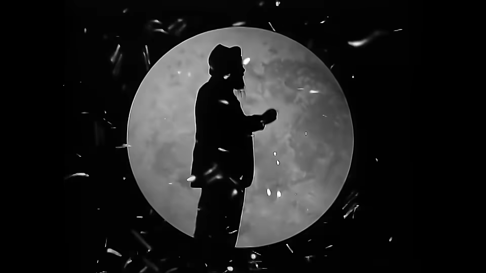
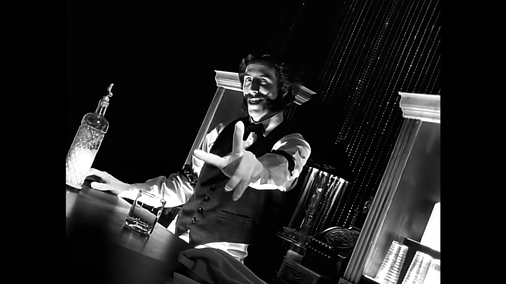
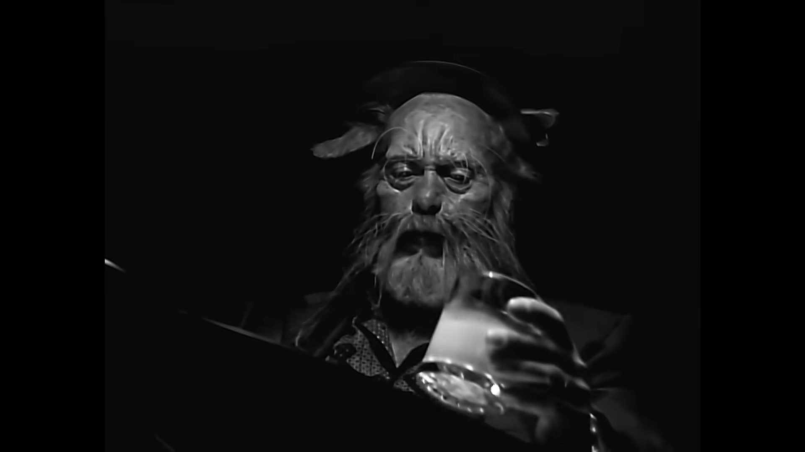
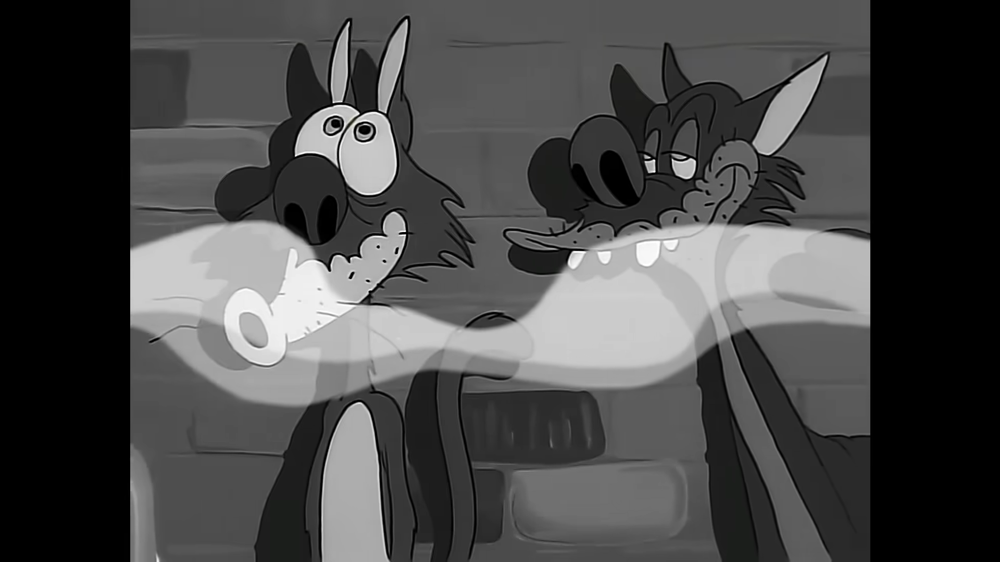
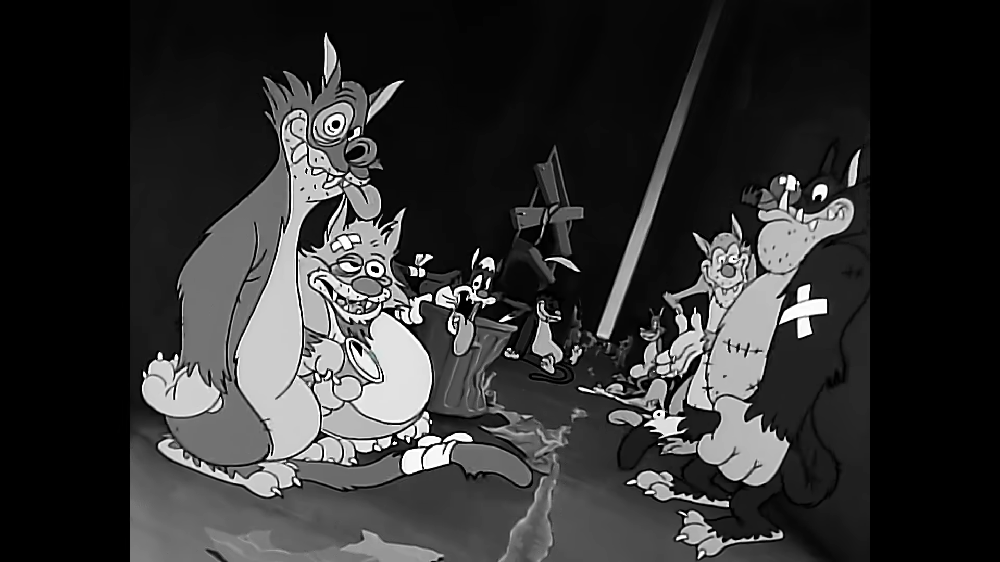
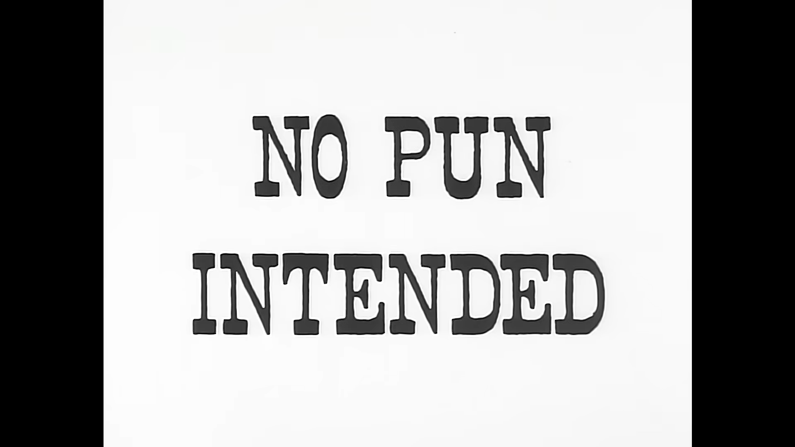

# sesion-05b

Apuntes que escribí al revisar la clase grabada, ya que falté a la primera mitad de la clase.

Según entiendo, nos están mostrando los archivos de Adafruit, con los que logramos hacer funcionar nuestra pantalla OLED para el proyecto 1, para poder entender la importancia de los distintos archivos y las “class”.

En el archivo .cpp es donde nos encargamos de que las cosas funcionen y ocurran.

Los archivos .h normalmente son más cortitos, donde me entero de que existen.

En el h prometo, en el cpp me hago cargo.

Una parte muy central del código son los comentarios; no vamos a hacer una lámina, vamos a hacer una documentación decente que será legible, explicando quién hizo las cosas, en qué contexto y por qué.

Casi todos los celulares funcionan con arquitectura ARM, que es una manera de dar instrucciones a un computador chiquitito; nuestro Arduino funciona con ARM.

Adafruit_GFX es una biblioteca que creó Adafruit para crear gráficas en general; luego se dedicaron a crear las gráficas específicas para múltiples distintos displays y chips.

``` cpp

// todos los completos italianos son un subtipo de completos

class Completo_Italiano : public Completo{ }

// El pudú Waton es un tipo de pudú

class Pudu_Waton : public Pudu{ }

```

En W3Schools hay tutoriales de todo lo que quisiera poder aprender del mundo de la programación, sobre todo de C++, si es que quiero repasar algo.

La herencia (Inheritance en inglés) permite que una clase rehúse atributos (versión fancy de decir una variable que está dentro de una clase) y métodos (versión fancy de decir una función que está dentro de una clase) de otra clase.

Existen 2 tipos de herencias:  

- Base (parent), que es de donde está siendo heredada.  

- Derivada (child): la clase que hereda de la clase parent.  

Las clases se ocupan cuando queremos ocupar estructuras de datos que no nos caben en los bloques fundamentales que vienen en un lenguaje de programación.

Distintos archivos .h pueden ser dependientes unos de los otros, así que debo asegurarme de ponerles el #include, pero no es necesario que ponga, como en el ejemplo de la clase, el #texto para absolutamente todo, no, porque ya está incluido en otro archivo; de esta manera no haré mi código tan enredado.

Encargo 9: "Escuchar y comentar uno de los tres primeros discos de la banda Primus".

El disco que me dediqué a escuchar fue “Sailing The Seas Of Cheese”, que fue el 2.º disco de la banda Primus, que fue lanzado el 14 de mayo de 1991.

Escogí este disco exclusivamente debido a que soy un fan del queso, ya que no conocía la banda previamente, así que ese fue el nombre que más me cautivó.

El tracklist de este disco es el siguiente:    

- "Seas of Cheese"

- "Here Come the Bastards"

- "Sgt. Baker"

- "American Life"

- "Jerry Was a Race Car Driver"

- "Eleven"

- "Is It Luck?"

- "Grandad's Little Ditty"

- "Tommy the Cat" 

- "Sathington Waltz"

- "Those Damned Blue-Collar Tweekers"

- "Fish On (Fisherman Chronicles, Chapter II)"

- "Los Bastardos"

Algo que me llama la atención es que yo, con mi poco conocimiento del mundo musical, diría que este estilo musical corresponde a algo como el rock o el metal, ya que pude identificar el uso de guitarras, bajos, baterías y algo más posiblemente, pero la manera en que se toca la música, combinada con la voz, lo hace bastante distinto a lo que he escuchado previamente.

Las letras de las distintas canciones son bastante repetitivas, o al menos yo pienso de esa manera, pero la música va cambiando después de ciertas repeticiones, creo; no estoy seguro si era un factor intencional que fue pensado para aplicarlo durante las canciones, o si era solo un error humano.

Otro factor que encontré curioso eran 2 intermissions muy cortas, una al inicio con “Seas of Cheese”, que parecía una saloma marinera, y otra con “Grandad’s little ditty”, que era una persona cantando en la ducha, donde siento que le da más personalidad al disco, también volviendo a traer mi concentración al escucharlo, ya que no soy muy bueno con la música muy repetitiva; estos segmentos me traían de vuelta a la realidad.

Mi canción favorita del disco definitivamente fue “Tommy The Cat” por la variación de cómo se presenta la música con la narración rápida de las letras, como también el video musical, que encontraba muy entretenido, donde se hacía un cambio entre la banda tocando sus instrumentos, como en un video musical típico, una narrativa de un bartender y animación.

Screenshot de la banda:




Screenshots de la narrativa:





Screenshots de la animación:







Referencias:  

- https://en.wikipedia.org/wiki/Sailing_the_Seas_of_Cheese

