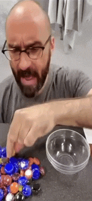

# sesion-07a

Misaa fue a dar una charla sobre toda la teoría del universo, un evento que se da todos los años. La directora se llama Susana Chau (@robotinfame o @humanrobot en Instagram).

Hacen convocatorias habitualmente donde buscan proyectos como lo que estamos haciendo nosotros, proyectos colectivos (Instagram) o colectivos.

El 17 de octubre tenemos la entrega de nuestro proyecto.

Vamos a tener pequeños módulos para poder hacer clases asociadas a ciertos sensores.

El encargo para el viernes es super fácil: vamos a tener una idea del proyecto y sensores que queremos poder llevar a cabo, vamos. Vamos a tener que investigar en, por ejemplo, las siguientes páginas: instructable.com, arduino.com, github.com, referentes de los que nos podríamos inspirar para desarrollar este proyecto, como mínimo tener 10 como grupo.

Usar una perilla o botón para poder forzar el comportamiento de nuestra máquina, para demostrar los distintos parámetros que íbamos a programar.

Hackaday.

O'Reilly Media books.

@lasllamadasquenuncahice hizo una máquina computacional dentro de un teléfono público.

Un motor DC es rápido y no sabotea; es de corriente continua y no sabe dónde está, es de corriente continua. Se puede ocupar en un ventilador o en un dron.

Step motor es paso a paso, es lento, preciso y sabe dónde está; requiere un driver que le entregue energía y se mueve de a grados. 

## Encargo 12 "leer las bitacoras de colegas, encontrar similitudes, diferencias, preguntas y aciertos de sus máquinas saludadoras propuestas. Citar correctamente las fuentes."

El grupo de 05-sofiacartes querían hacer la máquina que cuenta un secreto, pero personalmente no soy capaz de acordarme o comprender el uso del step motor que está mencionado en sus materiales.

El grupo de 07-valechavezalb van a realizar un una máquina dispensadora de chicles que dependiendo del color te daría un mensaje distinto, como desafío que almenos yo me imagino es el mantener el área donde se detecte el color del dulce regularizada como también de qué manera reconocerá el Arduino que el ”humano” está sacando su dulce, debido a que me suena a que es de funcionamiento mecánico

El grupo de 10-brauliofigueroa en un principio tenían pensado la máquina del “Ooooosoooooo” pero luego de compartir ideas, decidieron cambiarla por una máquina que “te persigue” con la mirada y que la oreja de esta máquina de acabase hablando, para añadirle un sentido cómico. Para problema almenos a mi se me complica el pensar cómo es que esta máquina detecta la *dirección* del usuario.

El grupo de 12-santiagoClifford quería hacer una maquina que se incomode con la presencia de una persona, medida específicamente a través del sonido, donde yo encuentro que es bien difícil especificamente decir que está detectando una persona, ya que en mi opinión esto es más un robot que se pone nervioso por cualquier ruido fuerte, una máquina auditivamente sensible.

## Encargo 13 "buscar 2 referentes asociados a tu proyecto de cada una de estas 4 categorías: 1. lenguaje natural (personas), código, materialidad, documentación. escribir un párrafo por cada uno de los referentes encontrados, citando las fuentes, y explicando por qué lo elegiste, qué te aporta, qué te inspira, o incluso si lo incluyes como antiejemplo."

### Lenguaje natural 
Para mi primer ejemplo, a mí personalmente me gusta harto el canal de YouTube [Veritasium](https://www.youtube.com/@veritasium), en el que uno de sus narradores más recurrentes, Derek Muller, explica múltiples temas distintos, que normalmente están situados en el mundo de la ciencia. 

Personalmente, lo que me inspira de estas narraciones es la calma con la que explica todo; no siento que nada de lo que dice sea apresurado, algo que a mí me gustaría poder adaptar, porque pienso que hablo rápido en muchas ocasiones, como también el uso de un vocabulario claro y preciso para la explicación de cada uno de los temas que se presentan en sus videos, donde se da el tiempo de explicar absolutamente todo lo que está presentando, paso a paso, desde lo más simple hasta lo más complejo, de una manera que todos (al menos, creo yo que todos los que tomen atención) pueden ser capaces de comprender a lo que se refiere y expone a lo largo de sus variados videos.

Eso es lo que yo desearía poder llegar a hacer: hablar solo lo justo y necesario, de una manera clara, y poder exponer a las personas que me observan y escuchan para que entiendan y se interesen en lo que digo y hago.

Como ejemplo, ofrezco este video sobre la invención del [LED azul](https://www.youtube.com/watch?v=AF8d72mA41M). 

Mi segundo referente del lenguaje, me quisiera no solo referir a un lenguaje por voces, sino a las expresiones y el lenguaje corporal que presenta Michael Stevens del canal de YouTube [Vsauce](https://www.youtube.com/@Vsauce).

Lo que más me gusta de la manera de expresarse de Michael es que claramente tiene un conocimiento amplio de múltiples temas y habla de una manera ordenada y controlada, pero con su lenguaje corporal, haciendo expresiones exageradas, movimientos de manos u otras acciones, logra agregar un humor a la narrativa que intenta presentar, de una manera que, al menos personalmente, hace mucho más memorable lo que está hablando para mí, ya que de esta manera pongo más atención y recuerdo los temas de una manera mucho más agradable a mi parecer.

También, entiendo que el humor o la exageración no podrá ser ocupado en todo momento, pero a mí me gusta ser gracioso y, si es que llegase a ser alguien que expone sus proyectos, me gustaría poder darle un poco de esta gracia que tiene Michael.

  

Aquí dejo uno de mis videos que recientemente me ha gustado bastante de Vsauce, sobre un debate existencial sobre [la existencia de las sillas](https://www.youtube.com/watch?v=fXW-QjBsruE).

### Materialidad

PLA, un filamento de impresión 3d, el cual tengo entendido que está en el LID, este material es orgánico y reciclable, así que es medioambientalmente más amigable que otros filamentos de uso común, este es un filamento que es fácil de usar al momento de imprimir, también es un material que necesita de un postratamiento menor, con un lijado una pieza puede quedar bien.

La intención de porque me gustaría usar este material es, porque de esta manera podemos tener una libertad grande respecto a la forma de nuestra carcasa o elemento que sobreponga al arduino, como también elementos que podrían ir en nuestros otros componentes como el servomotor y aún más importante, que se puede lijar y pintar de manera razonable para que tenga la estética que deseamos

Referencias:  

- https://www.3dnatives.com/es/guia-filamento-pla-en-la-impresion-3d-190820192/#!

### Documentación

Encontre en el subReddit de Arduino una publicacion hecha de un proyecto de nombre [Pedro](https://www.reddit.com/r/arduino/comments/1l2k3vu/open_source_project/), este proyecto que estaba desarrollado con l intencion de poder aprender de robotica, electronica y programacion y como punto extra es open source

Al revisar el repositorio de [GitHub](https://github.com/almtzr/Pedro) se puede observar una documentacion, que almenos yo encuentro que tiene mucho cariño, desde una presentación del Pedro Project, con una descripción detallada de todo lo que es necesario para poder traer a Pedro a la realidad, fotografias con todas sus piezas sin ensamblar, la placa y los archivos de impresión 3d.

También es muy interesante debido a que es una máquina la cual funciona a través de servomotores, algo que pensamos usar yo y mi grupo para nuestro Proyecto 2.

Otro proyecto que encontre era un [ventilador controllado a base de la temperatura medida](https://www.hackster.io/tubelightthimeri/arduino-based-temperature-controlled-fan-c2e14a#overview) en el que se va a un contexto de explicación desde la perspectiva del creador, yendo paso a paso de como se empieza a ensamblar todas las partes, con una descripción interesante de cad auno de los componentes, mencionando detalles los cuales son bastante relevantes, como la temperatura de funcionamiento, por ejemplo del sensor de temperatura [LM35](https://es.wikipedia.org/wiki/LM35), como se lee la temperatura con este sensor, y de qué manera utilizar estos datos recibidos, he incluso testeos de datos obtenidos en distintos ambientes y circunstancias.

También es bastante claro con todas los procedimientos, desde el ensamblaje, los circuitos, la PCB y también, como explicaré en el punto del encargo de código, sus comentarios dentro del archivo.

### Código

En el proyecto del ventilador controlado por la [temperatura ambiente](https://www.hackster.io/tubelightthimeri/arduino-based-temperature-controlled-fan-c2e14a#overview), dejó escrito todo el código que escribió para poder llevar a cabo el funcionamiento del producto final, que al menos a mi me gusta mucho es que casi todas las lineas tiene algun comentario para poder guiar al lector (yo) de que estara sucediendo 

