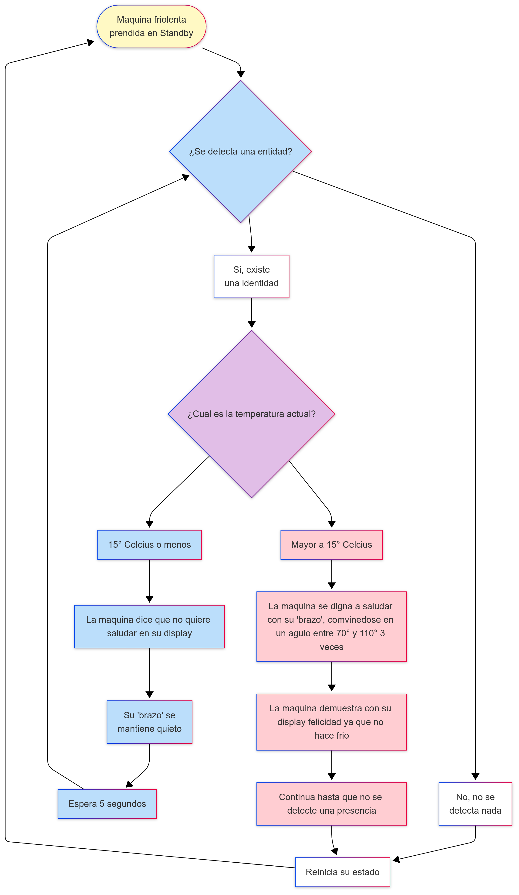

# sesion-07b

Hoy vamos a hablar muy brevemente de cómo programar el proyecto.

Estamos haciendo cosas extremadamente delicadas como si fuera una cirugía.

Aaron compró en Afel porque está cerca y es barato.

Siempre tomar atención al voltaje de los actuadores. 

Ojo con sus sensores, que son muy sensibles.

Aaron nos invitó a partir un proyecto con calma.

Cuando hacemos otra pestaña y no le ponemos una extensión, significa que no vamos a ser más osados y acabaremos usando otro lenguaje, por ejemplo.

Programar es decidir cómo son las cosas.

Al principio, por ejemplo, podemos configurar el sensor.

En otra pestaña pondré el funcionamiento de la configuración del sensor ultrasónico.

El sueño de Aaron es que el código principal sea supercorto, que se vea solo lo necesario.

Hoy es un día para planear el marco del proyecto.

## Módulo después del break 

Podemos usar las pestañas de, por ejemplo, un sensor de temperatura; me voy a asegurar de que todo lo que tenga que ver con este sensor lo haré en esta pestaña, ya sea el void o el analogRead.

En los .ino no necesitaba poner el #ifndef, #define o #endif. Solo se pone en los .h o los .cpp.

## Encargo 14 "cada persona del grupo debe implementar en diagrama de flujo dibujado o con la herramienta Mermaid.js con sus propias palabras y subirlo a su README."



## Encargo 15 "cada persona del grupo debe subir a su README: documentar funcionamiento de sus sensores, incluyendo instrucciones de conexión y de configuración, subir el proyecto entero de arduino como carpeta, tiene que poder compilar sin problema y mostrar en consola los datos de los sensores."

Yo personalmente me quise dedicar a revisar el sensor de temperatura para nuestro “robot friolento” 

Para empezar revise el link de la lista de materiales de los profesores, para saber con toda seguridad cual era el sensor que tenía en mis manos, el cual fue un [aht20+bmp280](https://afel.cl/products/sensor-de-temperatura-humedad-y-presion-aht20-bmp280) que tiene de datos importantes:  

- Utiliza la interfaz I2C para la comunicación que garantiza una transmisión de datos estable y rápida, mejorando la eficiencia de la comunicación entre dispositivos.

- Combina los sensores digitales AHT20 y BMP280.  

- TIene un amplio rango de voltaje operativo de 2.0V-5V

- Alta Precisión en Medición: Proporciona mediciones exactas de temperatura, humedad y presión atmosférica, asegurando datos confiables y consistentes.

- Dimensiones: 1.5 x 1.5 mm


Luego para empezar a revisar código de funcionamiento encontre una [pagina de venta](https://uelectronics.com/producto/aht20-bmp280-modulo-de-presion-de-atmosferica-temperatura-y-humedad/) de este módulo, donde se puede observar un codigo de demostración de la lectura de este modulo el cual es el siguiente:

``` cpp
/*
  Código de comprobación de funcionamiento para Modulo AHT20 + BMP280
  Se obtendrán las lecturas de Presión Atmosférica, Humedad y Temperatura a través del Monitor Serial 
  del IDE de Arduino
*/

//Librerías
#include <Wire.h>
#include <Adafruit_BMP280.h>
#include <AHT20.h>

//Objetos
Adafruit_BMP280 bmp;
AHT20 myAHT20;

void setup() {
  Serial.begin(115200);
  Serial.println(F("AHT20+BMP280 test"));

  while (myAHT20.begin() != true) {
    Serial.println(F("No se ha conectado AHT20 o falló al cargar el coeficiente de calibración")); //(F()) guarda el string en la Flash para mantener la memoria dinámica libre
    delay(5000);
  }
  Serial.println(F("AHT20 OK"));
  
  if (!bmp.begin()) {
    Serial.println(F("No se encuentra un sensor BMP280 compatible, revisa la conexión"));
    while (1);
  }

  /* Configuración default según el datasheet. */
  bmp.setSampling(Adafruit_BMP280::MODE_NORMAL,     /* Modo de Operación. */
                  Adafruit_BMP280::SAMPLING_X2,     /* Temp. oversampling */
                  Adafruit_BMP280::SAMPLING_X16,    /* Pressure oversampling */
                  Adafruit_BMP280::FILTER_X16,      /* Filtrado. */
                  Adafruit_BMP280::STANDBY_MS_500); /* Tiempo de Standby. */
}

void loop() {
  float temperature = myAHT20.getTemperature();
  float humidity = myAHT20.getHumidity();
  float pressure = bmp.readPressure();


  if(myAHT20.available() == true)
  {
  //Impresion de Resultados
    Serial.print("Temperatura: ");
    Serial.print(temperature, 2);
    Serial.print("°C\t");
    Serial.print("Humedad: ");
    Serial.print(humidity, 2);
    Serial.print("% RH\t");
    Serial.print("Presion: ");
    Serial.print(pressure, 2);
    Serial.println("Pa");

    Serial.println();
  }
  delay(2000);
}
```

donde instale las librerias de “Adafruit_BMP280” y “AHT20” para intentar compilar y enviar el codigo a mi arduino pero me dio problemas, sobre una clase no tenia una variable escrita (myAHT20.available()), y como no sabia como poder corregirlo, tuve que ir a otro ejemplo de código.

La siguiente pagina que encontre fue una documentación del componente en [Cirkit Designer](https://docs.cirkitdesigner.com/component/3d8e6da8-841a-47a6-a1aa-0aa902c905e1/aht20bmp280) donde se era mucho mas descriptivo en mi opinion de como se debia conectar el componente, los parametros de este, todas las librerias que eran necesarias para que funcionara el codigo, que es el siguiente:
```cpp

#include <Wire.h>
#include <Adafruit_AHTX0.h> // Library for AHT20
#include <Adafruit_BMP280.h> // Library for BMP280

// Create sensor objects
Adafruit_AHTX0 aht;
Adafruit_BMP280 bmp;

void setup() {
  Serial.begin(9600);
  while (!Serial); // Wait for Serial Monitor to open

  // Initialize AHT20 sensor
  if (!aht.begin()) {
    Serial.println("Failed to initialize AHT20 sensor!");
    while (1);
  }
  Serial.println("AHT20 sensor initialized.");

  // Initialize BMP280 sensor
  if (!bmp.begin(0x76)) { // Default I²C address for BMP280 is 0x76
    Serial.println("Failed to initialize BMP280 sensor!");
    while (1);
  }
  Serial.println("BMP280 sensor initialized.");
}

void loop() {
  // Read data from AHT20
  sensors_event_t humidity, temp;
  aht.getEvent(&humidity, &temp);

  // Read data from BMP280
  float pressure = bmp.readPressure() / 100.0F; // Convert to hPa
  float altitude = bmp.readAltitude(1013.25); // Sea level pressure in hPa

  // Print sensor data to Serial Monitor
  Serial.print("AHT20 - Temperature: ");
  Serial.print(temp.temperature);
  Serial.print(" °C, Humidity: ");
  Serial.print(humidity.relative_humidity);
  Serial.println(" %");

  Serial.print("BMP280 - Pressure: ");
  Serial.print(pressure);
  Serial.print(" hPa, Altitude: ");
  Serial.print(altitude);
  Serial.println(" m");

  delay(2000); // Wait 2 seconds before next reading
}


```

pero para mi desgracia, este código tampoco me funciono pero esta vez el código si se compilo y fue subido a mi arduino, el problema se encontraba en el hecho de que no recibe ningún mensaje en el monitor serial, nada de nada, incluso lo deje funcionando por un buen rato en caso que se demorarse, pero no ocurrió nada.

Como me imagine que podia ser un error de la comunicación i2c, que no tenía idea que era, me puse a investigar llegando a una página de la [documentación de arduino sobre I2C](https://docs.arduino.cc/learn/communication/wire/#controller-reader) que explicaba de una manera bastante comprensiva esta manera de conectar un sensor a el arduino de una manera sin muchos cables, a través del pin del clock y del pin de la serial data.

Ahora que siquiera entendí un poco a que se refiere el I2C, con los ejemplos de la página de arduino, no encontré algo que me servía mucho con mi problema de que no se identificaba el sensor, así que busqué directamente si existía un código para arduino que me permitiera hacer un escaneo o detección de si existía una conexión I2C para encontrarme con un post en la pagina de [learn Adafruit](https://learn.adafruit.com/scanning-i2c-addresses/arduino)


```cpp
// SPDX-FileCopyrightText: 2023 Carter Nelson for Adafruit Industries
//
// SPDX-License-Identifier: MIT
// --------------------------------------
// i2c_scanner
//
// Modified from https://playground.arduino.cc/Main/I2cScanner/
// --------------------------------------

#include <Wire.h>

// Set I2C bus to use: Wire, Wire1, etc.
#define WIRE Wire

void setup() {
  WIRE.begin();

  Serial.begin(9600);
  while (!Serial)
     delay(10);
  Serial.println("\nI2C Scanner");
}


void loop() {
  byte error, address;
  int nDevices;

  Serial.println("Scanning...");

  nDevices = 0;
  for(address = 1; address < 127; address++ )
  {
    // The i2c_scanner uses the return value of
    // the Write.endTransmisstion to see if
    // a device did acknowledge to the address.
    WIRE.beginTransmission(address);
    error = WIRE.endTransmission();

    if (error == 0)
    {
      Serial.print("I2C device found at address 0x");
      if (address<16)
        Serial.print("0");
      Serial.print(address,HEX);
      Serial.println("  !");

      nDevices++;
    }
    else if (error==4)
    {
      Serial.print("Unknown error at address 0x");
      if (address<16)
        Serial.print("0");
      Serial.println(address,HEX);
    }
  }
  if (nDevices == 0)
    Serial.println("No I2C devices found\n");
  else
    Serial.println("done\n");

  delay(5000);           // wait 5 seconds for next scan
}
```

Peeeero otra vez no se detectaba nada, almenos di un paso adelante, un código siquiera me daba un mensaje en el monitor serial, pero solo decia que ningun dispositivo I2C fue encontrado asi que me rendi por el dia, espero que sea un problema humano mio, y no un problema del sensor para poder desarrollar nuestro proyecto de buena manera.
