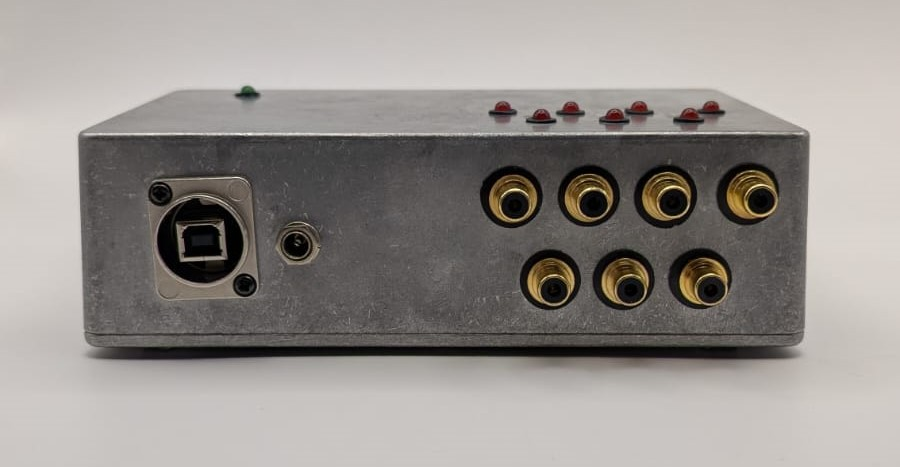
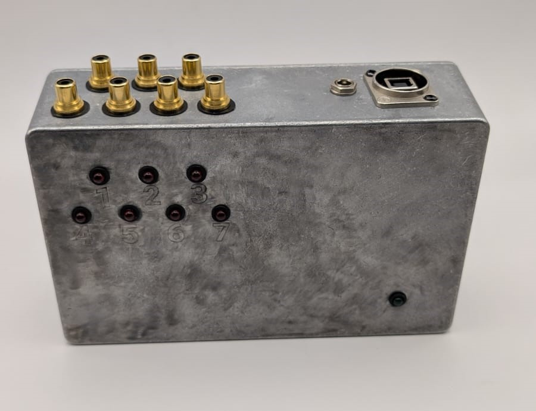
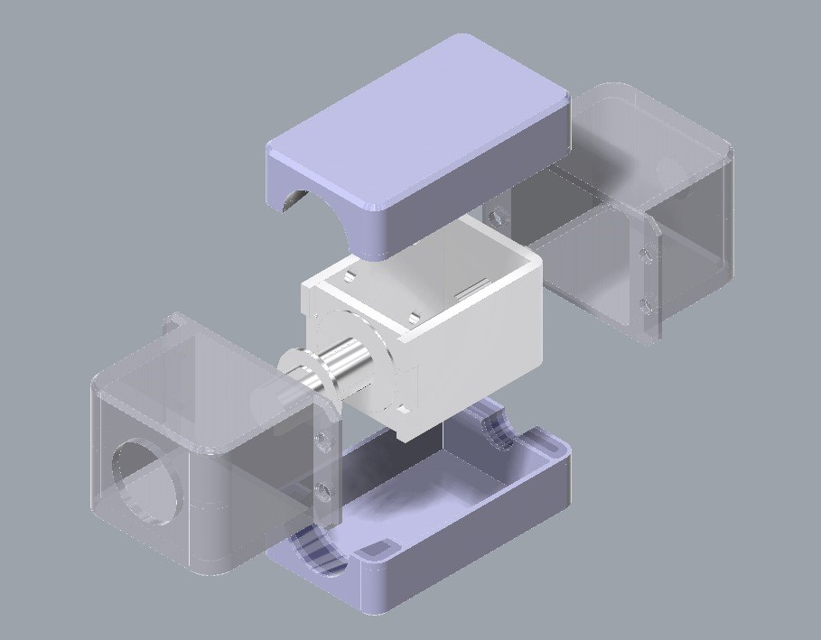
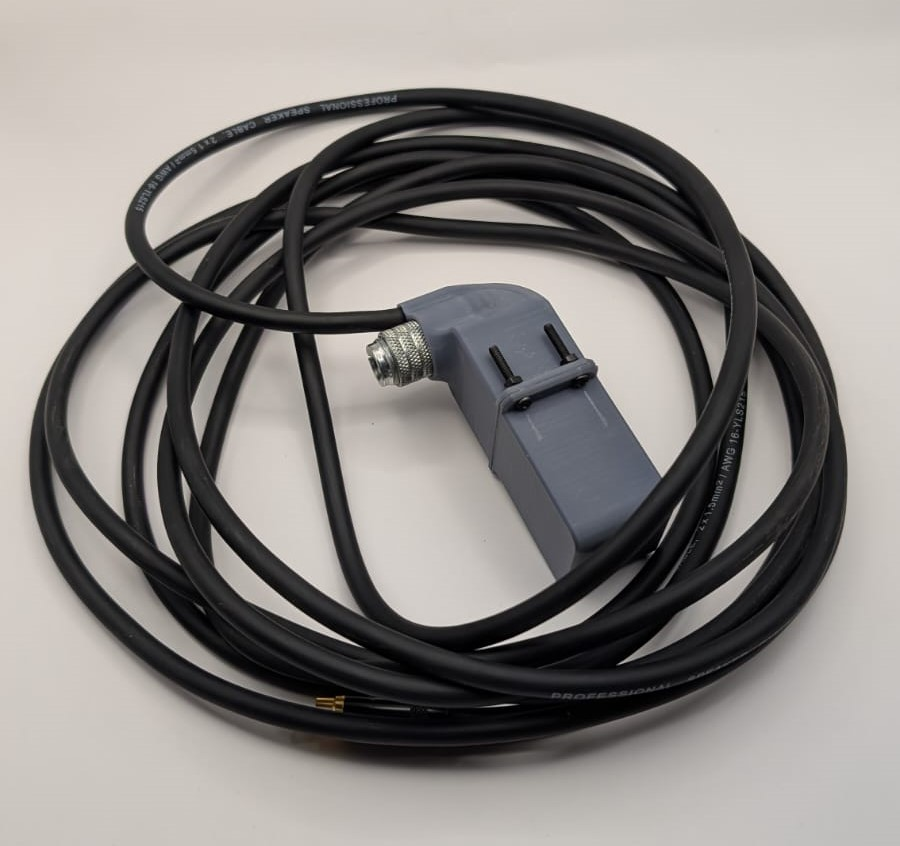
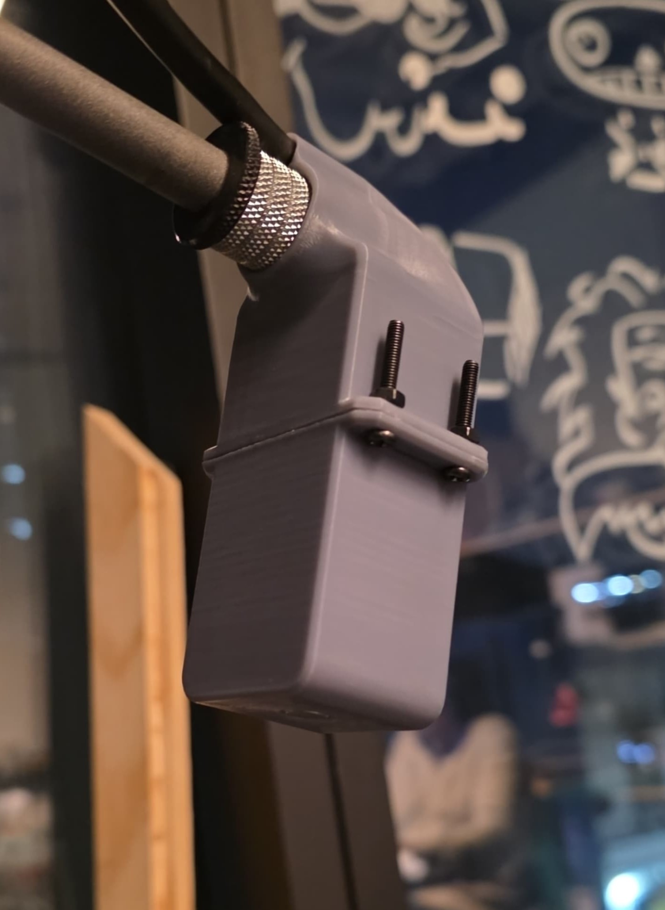

# sesion-02a

## Apuntes
###### ${\color{#3d3d44}Se \ recomienda \ usar \ modo \ oscuro, \ hay \ palabras \ en \ color \ blanco \ que \ de \ otra \ forma \ no \ son \ visibles.}$ <br/>
###### ${\color{#3d3d44}The \ use \ of \ dark mode \ is \ recommended, \ there's \ white \ colored \ text \ that \ otherwise \ is \ not \ visible.}$ <br/>

### [Sokio](https://pueblonuevo.cl/bios/sokio/)
Artista chileno experimental, con una amplia trayectoria, desde musica de teatro a electrónica, cine, opera, maquinas y computación. 

En la clase le hicimos entrega de una [maquina percutora](https://www.instagram.com/piruetas.xyz/p/DNPBPs8v-Ra/) que toma input MIDI y acciona un solenoide. 
 Imagen tomada por santiagoClifford. De izquierda a derecha [misaaaaaa](https://github.com/misaaaaaa), [Sokio](https://www.instagram.com/sokio/), [Bernardita-lobo](https://github.com/Bernardita-lobo), [FranUDP](https://github.com/FranUDP) y [montoyamoraga](https://github.com/montoyamoraga). <br/>

 







 *imagenes extraidas de nuestro grupo de WhatsApp, sokio1, sokio2 y sokio 4 tomadas por [montoyamoraga](https://github.com/montoyamoraga), sokio3 por [Bernardita-lobo](https://github.com/Bernardita-lobo) y sokio5 por [FranUDP](https://github.com/FranUDP). 

<br>

### [Clases y objetos](https://www.youtube.com/watch?v=_8H2n0nDfd4)

Una clase permite definir las características de multiples objetos, por ejemplo, todos los autos tienen un motor, manubrio, ruedas, cinturón de seguridad, etc.

en lugar de definir estas caracteísticas para cada tipo de auto, se define una clase y se asignan objetos a esa clase.

### [Anexar archivos de arduino](https://youtu.be/HtYlQXt14zU?si=D9nGCln6XQFocKOa&t=143)

Para evitar tener un solo archivo super largo y dificil de leer, se separan distintas partes del código en distintos archivos que trabajan en conjunto.

 por ejemplo, en un proyecto donde se utiliza sensores, un algoritmo y un modulo para comunicación inalábrica, se pondrían en distintos archivos el codigo que trabaja con los sensores, el algoritmo y la comunicación inalámbrica.

 De esa forma el codigo es modular y si se quiere alterar, revisar o reutilizar componentes es mucho más facil.

 para que los distintos codigos funcionen en conjunto hay que decirle al archivo principal que los incluya

 ````cpp
#include <library.h>
 ````

 Esto es lo mismo que se hace con librerías y otras piezas de código que otra gente ha hecho, ahorrandonos el tiempo de escribir el código cada vez que queramos usarlo.

-----------------------------------------------------------------------------------------------------------
## Subir el archivo del código anterior <!-- TEXT -->
### [Código LED pulsante]()
