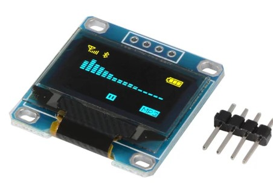
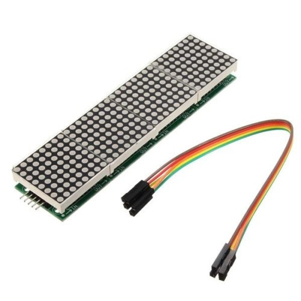
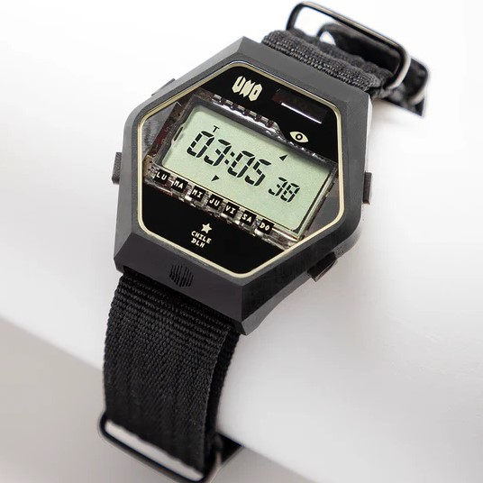
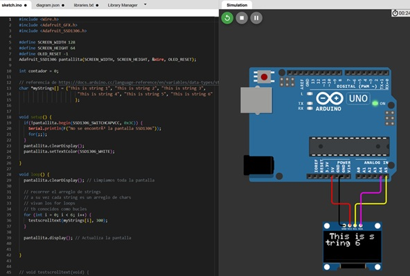
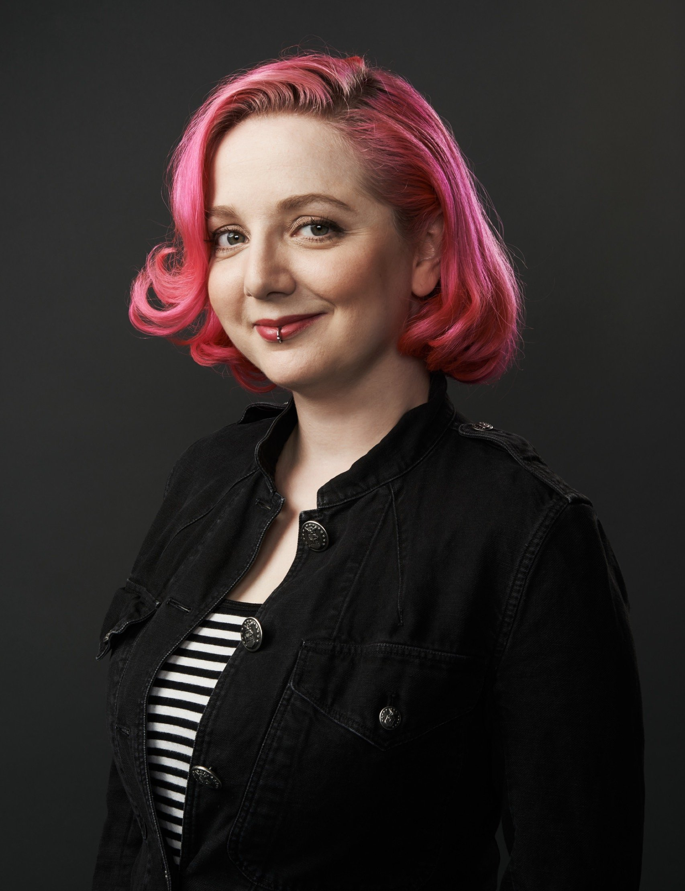
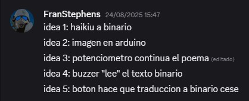
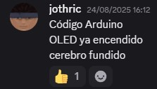
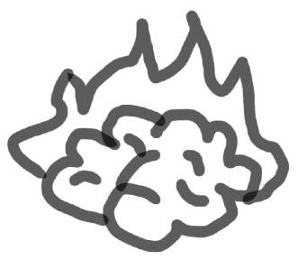
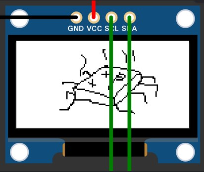
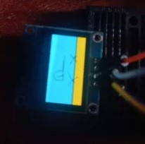

# sesion-03b

## Apuntes
###### ${\color{#3d3d44}Se \ recomienda \ usar \ modo \ oscuro, \ hay \ palabras \ en \ color \ blanco \ que \ de \ otra \ forma \ no \ son \ visibles.}$  
###### ${\color{#3d3d44}The \ use \ of \ dark mode \ is \ recommended, \ there's \ white \ colored \ text \ that \ otherwise \ is \ not \ visible.}$  

### [OLED](https://afel.cl/products/pantalla-lcd-oled-azul-y-amarillo-0-96?gad_campaignid=17613659948&gad_source=1&gclid=Cj0KCQjw_L_FBhDmARIsAItqgt7FQf06zB9L3BBcFrnx9PxDMEH9seB1_uIr-JeGjhxS8AjSE59Hm4UaAlqEEALw_wcB&hsa_acc=1808722794&hsa_ad=&hsa_cam=18405560573&hsa_grp=&hsa_kw=&hsa_mt=&hsa_net=adwords&hsa_src=x&hsa_tgt=&hsa_ver=3&utm_campaign=%40+Smart+Shopping&utm_medium=ppc&utm_source=adwords&utm_term=)

    

Pantalla de 128x64 pixeles que se controla mediante el protocolo I2C.

    

### [Matriz LED + chip (max7219)](https://altronics.cl/modulo-matriz-led-max7219)

     

Similar a la pantalla anterior, pero cada pixel es un LED. En lugar de usar I2C, se comunica mediante SPI.

      

### [Reloj número uno](https://www.dandolahora.cl/products/prototipo-el-numero-uno-el-primer-reloj-digital-en-la-historia-de-chile?srsltid=AfmBOoqnT4P8xS2TiSho_ynCvAzDEW_eCsjVy5_tRNTTmCspOt1bsBS4)

      

El primer reloj digital diseñado y fabricado en Chile

      

### [Daniel Cruz (artista)](https://arteymedios.org/daniel-cruz/)

Artista visual chileno cuyo trabajo se centra en la investigación y creación artística que vincula tecnología, comunicación y crítica social.

### [Tinkercad](https://www.tinkercad.com/) y [Wokwi](https://wokwi.com/)

   

Simuladores de circuitos online, incluyen arduinos y otras dev boards que se pueden programar para experimentar.

   

### [Mouser Electronics](https://www.mouser.cl/)

Distribuidor de componentes electrónicos, contiene una cantidad de productos exorbitante y es dificil vitrinear para encontrar algo.
 

### [Adafruit](https://www.adafruit.com/)

Distribuidor de componentes electrónicos y kits DIY. Su página y productos están hechos para Makers, hobbyists y gente en general que no son ingenieros eléctricos.

### Limor Fried (aka, LadyAda)

  

Fundadora de Adafruit Industries y promotora de la cultura hacker, maker, DIY y open source.

    

### Other things: <!-- Things to organize + random stuff -->
> ### SUB_SUBTITULO

-----------------------------------------------------------------------------------------------------------
## Encargo 07<!-- Experimentar con el display -->
### TITULO

-----------------------------------------------------------------------------------------------------------
## Proyecto 01 <!-- Avance -->
### Reunión en Discord
Nos reunimos los 4 el fin de semana para definir ideas, objetivos y roles.

        

Tras varios minutos intentando hacer poemas, nos decidimos por el siguiente haiku:

      

También estuvimos viendo ideas de imágenes y viendo cómo quedaban en la pantalla.

 

 
