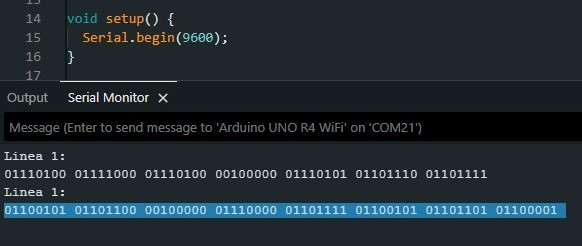
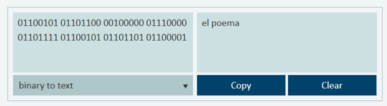

# sesion-04a

## Apuntes
###### ${\color{#3d3d44}Se \ recomienda \ usar \ modo \ oscuro, \ hay \ palabras \ en \ color \ blanco \ que \ de \ otra \ forma \ no \ son \ visibles.}$ <br/>
###### ${\color{#3d3d44}The \ use \ of \ dark mode \ is \ recommended, \ there's \ white \ colored \ text \ that \ otherwise \ is \ not \ visible.}$ <br/>

### Breadboard
 <br> 

Es una placa donde se pueden construir fácilmente circuitos, como si de legos se tratase (prototipar) antes de soldar los componentes permanentemente. En la imagen se ve en amarillo cómo se conectan las casillas de la protoboard.

### [Potenciómetro](https://youtu.be/Xb-MZMoUtcQ?si=y8m1escUjpVgACnh)

 <br> Fuente: https://mx.pinterest.com/pin/707417053993712985/

${\color{#ffe4a8}Resistencias \ variables}$ cuyo valor puede ser alterado al rotar una perilla, tornillo o deslizar un slider. <br>
 Su ${\color{#ffe4a8}resistencia}$ puede aumentar de forma ${\color{#b0e6e6}lineal\ (B)}$ o ${\color{#b0e6e6}logarítmica\ (A)}$ dependiendo del modelo.

Al conectar el primer pin a ${\color{Red}voltaje\ positivo}$ y el último a ${\color{white}tierra}$, se puede utilizar como ${\color{Red}divisor\ de\ voltaje}$.

#### [Divisor de voltaje:](https://youtu.be/DM9nlukKl1M?si=v-mtDorgQhqWrHjT)

Al tener 2 ${\color{#ffe4a8}resistencias}$ conectadas en ${\color{#b0e6e6}serie}$, varía el valor del ${\color{Red}voltaje}$ a través de cada una, lo que efectivamente nos permite reducir el ${\color{Red}voltaje}$ de una fuente de poder a cualquier valor desde su máximo a su mínimo (${\color{white}0V}$).

 <br> Fuente: https://makeabilitylab.github.io/physcomp/electronics/variable-resistors.html

Un ${\color{#ffe4a8}potenciómetro}$ es efectivamente 2 ${\color{#ffe4a8}resistencias}$ conectadas en serie, cuyos ${\color{#b0e6e6}valores}$ pueden ser ${\color{#b0e6e6}alterados\ de\ manera\ proporcional}$, lo que nos permite variar el ${\color{red}voltaje}$ en el ${\color{#b0e6e6}pin\ central}$.

### [Analog input](https://youtu.be/btgAUdbj85E?si=D2fYeVhIzD7r3K1b)

Si el ${\color{#b0e6e6}valor\ digital}$ varía entre ${\color{red}1}$ y ${\color{white}0}$, ${\color{red}hay}$ o ${\color{white}no\ hay\ voltaje}$, el ${\color{#b0e6e6}valor\ analógico}$ ve cual es el ${\color{#b0e6e6}valor\ del\ voltaje}$ que tiene.

### [I2C](https://youtu.be/CAvawEcxoPU?si=wi7Ee-d5kUJcV1Vi)

 <br> Fuente: https://embeddedwala.com/Blogs/DigitalCommunication/Getting-Started-with-I2C:-What-is-Clock-Stretching

${\color{#b0e6e6}Protocolo\ de\ comunicación}$ que permite a un dispositivo comunicarse con hasta ${\color{#b0e6e6}112}$ dispositivos a la vez usando los mismos ${\color{#b0e6e6}2}$ cables, ${\color{#b0e6e6}SDA}$ (Serial Data) y ${\color{#b0e6e6}SCL}$ (Serial Clock).

### Other things: <!-- Things to organize + random stuff -->
> ### [Analog computers](https://www.britannica.com/technology/analog-computer)
>
> Computadores que en lugar de emplear ${\color{#b0e6e6}binario}$, utilizan ${\color{#b0e6e6}valores\ continuamente\ variables}$, como voltajes, rotaciones de engranajes, cantidad de agua, etc.

-----------------------------------------------------------------------------------------------------------
## Avance proyecto <!-- TEXT -->
### Morse
Desde la primera clase tenía la idea de hacer un código al que uno le introdujera un String, lo separara en sus distintos caracteres y fuera uno por uno viendo a qué secuencia de puntos y rayas corresponde.

Yo, ya sabiendo que morse es básicamente código binario, supuse que hacer un programa que tome una palabra, procese sus caracteres y haga parpadear el LED del Arduino sería más fácil que un programa que procesa 3 versos carácter por carácter y luego guarda la traducción final.

Comencé con la idea de definir el valor del punto y la raya como variables, para utilizarlas junto a un `delay`, pero no estaba seguro de si esto funcionaría.

Le pregunté a misaaaaaa durante la sesión cómo se podría hacer y me explicó rápidamente que tendría que usar funciones que definan qué ocurre con un punto y qué ocurre con una raya, así como una función para cada letra del abecedario.

````cpp
const int LED = 13;
const int Vdot = 200; // duracion de un punto (valor)
const int Vdash = dot * 3; // duracion raya (valor)
const int gap = dot; // espacio entre letras/caracteres
const int bigGap = dot * 7; // espacio entre palabras

void dot() {            // definiendo punto
  digitalWrite(LED, 1);
  delay(Vdot)
  digitalWrite(LED, 0);
  delay(gap);
}

void dash() {            // definiendo raya
  digitalWrite(LED, 1);
  delay(Vdash)
  digitalWrite(LED, 0);
  delay(gap);
}

void A() {            // definiendo letra A
  dot();
  dash();
}

void B() {            // definiendo letra A
  dash();
  dot();
  dot();
}

void C() {            // definiendo letra A
  dash();
  dot();
  dash();
  dot();
}
(...)
````

Después de corregir algunos errores en este código inicial, me puse a investigar cómo extraer los caracteres del String y clasificarlos.

Encontré que la función `.length( )` arroja la cantidad de caracteres que conforma un String. Esta función se podría utilizar en conjunto con la declaración `for` para ir letra por letra, hasta que el valor de `i` fuera igual al de la cantidad de caracteres.

````cpp
// for continua hasta que i ya no sea inferior al largo del mensaje (cantidad de caracteres), cada pasada, se agrega 1 al valor de i
for (int i = 0; i < mensaje.length(); i++) {
````

Para determinar qué carácter estaba ubicado en la posición equivalente al valor de `i`, utilicé la función `.charAt(i)`, que hace justo lo que necesitaba.

````cpp
String mensaje = "abccba";


const int LED = 13;
const int Vdot = 200; // duracion de un punto (valor)
const int Vdash = Vdot * 3; // duracion raya (valor)
const int gap = Vdot; // espacio entre letras/caracteres
const int bigGap = Vdot * 7; // espacio entre palabras

void dot() {            // definiendo punto
  digitalWrite(LED, 1);
  delay(Vdot);
  digitalWrite(LED, 0);
  delay(gap);
}

void dash() {            // definiendo raya
  digitalWrite(LED, 1);
  delay(Vdash);
  digitalWrite(LED, 0);
  delay(gap);
}

void A() {            // definiendo letra A
  dot();
  dash();
}

void B() {            // definiendo letra B
  dash();
  dot();
  dot();
}

void C() {            // definiendo letra C
  dash();
  dot();
  dash();
  dot();
}


void setup() {
  Serial.begin(9600);
  pinMode(LED, OUTPUT);
}

void loop() {
  for (int i = 0; i < mensaje.length(); i++) {
  char caracterActual = mensaje.charAt(i);
  Serial.println(caracterActual);
  }
}
````

Viendo que el código funcionaba, pues en el monitor serial salían los caracteres del String separados, le di el código a Gemini 2.5 Pro, tras decirle explícitamente que no generara código y se limitase a darme *feedback* y sugerencias.

Tras recibir confirmación de que entendía lo que intentaba hacer, le pregunté si tendría que hacer una declaración `if` gigantesca para ordenar las letras o si había una forma más fácil.

Me sugirió utilizar la declaración `switch` y explicó que esta declaración compara el caso dado con una lista de casos y al encontrar una coincidencia, ejecuta el código correspondiente a ese caso.

Tras buscar cómo utilizar `switch` obtuve esto:
````cpp
String mensaje = "abccba";


const int LED = 13;
const int Vdot = 200; // duracion de un punto (valor)
const int Vdash = Vdot * 3; // duracion raya (valor)
const int gap = Vdot; // espacio entre letras/caracteres
const int bigGap = Vdot * 7; // espacio entre palabras

void dot() {            // definiendo punto
  digitalWrite(LED, 1);
  delay(Vdot);
  digitalWrite(LED, 0);
  delay(gap);
}

void dash() {            // definiendo raya
  digitalWrite(LED, 1);
  delay(Vdash);
  digitalWrite(LED, 0);
  delay(gap);
}

void A() {            // definiendo letra A
  dot();
  dash();
}

void B() {            // definiendo letra B
  dash();
  dot();
  dot();
}

void C() {            // definiendo letra C
  dash();
  dot();
  dash();
  dot();
}


void setup() {
  Serial.begin(9600);
  pinMode(LED, OUTPUT);
}

void loop() {
  for (int i = 0; i < mensaje.length(); i++) {
  char caracterActual = mensaje.charAt(i);
  Serial.println(caracterActual);
  traductor(caracterActual);
  }
}

void traductor(char sorter) {
  switch (sorter) {
  case 'A':
    A();
      break;
  case 'B':
    B();
      break;
  case 'C':
    C();
      break;
  }
}
````
Después de unos minutos intentando ver por qué no funcionaba, me di cuenta de que había puesto los casos en mayúsculas.

Tras corregir eso vi que el LED parpadeaba, pero lo hacía sin parar, por lo que añadí una declaración `if`, para evitar que `for` corriera tras terminar la primera vez.

````cpp
bool messageDone = false; // flag

void loop() {
  if (messageDone == false) {
    for (int i = 0; i < mensaje.length(); i++) {
  char caracterActual = mensaje.charAt(i);
  Serial.println(caracterActual);
  traductor(caracterActual);
  messageDone = true; //cambia el valor al terminar de correr
  }
  
  }
}
````
[Código morse final](./arduino/morse/)

### Traductor binario

Comencé definiendo las variables necesarias para lidiar con los 3 Strings que hay que traducir.

````cpp
String linea1 = "txt1"; // linea 1 del poema
String linea1 = "txt2"; // linea 2 del poema
String linea2 = "txt3"; // linea 3 del poema
String binario1 = ""; // traduccion de linea 1
String binario2 = ""; // traduccion de linea 2
String binario3 = ""; // traduccion de linea 3

bool linea1Done = false;
bool linea2Done = false;
bool linea3Done = false;
````

A continuación, modifiqué el `void loop()` para ir agregando los valores retornados por la función `traductor`.

````cpp
void loop() {
  if (linea1Done == false) {
    for (int i = 0; i < linea1.length(); i++) {
  char caracterActual = linea1.charAt(i);
  String binChar1 = traductor(caracterActual);
  binario1 = binario1 + binChar1;
  Serial.println(caracterActual);
  linea1Done = true;
  Serial.println("Linea 1:");
  Serial.println(binario1);
  }
  }
}
````

Y comencé a modificar la función `traductor()`
````cpp
void traductor(char sorter) {
  switch (sorter) {
    case 'a':
      A();
      break;
    case 'b':
      String "01100010";
      break;
(...)
````

Le di el código a Gemini para pedirle *feedback* antes de escribir las 500 líneas de funciones y 500 líneas de casos, para ver si mis alteraciones estaban bien.

Me sugirió agregar:
````cpp
binario1 = binario1 + " ";````
justo después de:
````cpp
binario1 = binario1 + binChar1;
````
Para separar los códigos binarios de cada carácter con un espacio, haciéndolo más legible en el monitor serial.

Y que modificara la función `traductor()`, que al ser `void`, puede ejecutar una función, pero no puede enviar información, como un `String`, a una variable en otra función (`loop`), a diferencia de una función de tipo `String`.

Y que debería usar el comando `return` en lugar de `String`, para enviar un texto en respuesta.

````cpp
String linea1 = "txt1"; // linea 1 del poema
String linea2 = "txt2"; // linea 2 del poema
String linea3 = "txt3"; // linea 3 del poema
String binario1 = ""; // traduccion de linea 1
String binario2 = ""; // traduccion de linea 2
String binario3 = ""; // traduccion de linea 3


bool linea1Done = false;
bool linea2Done = false;
bool linea3Done = false;


void setup() {
  Serial.begin(9600);
}

void loop() {
  if (linea1Done == false) {
    for (int i = 0; i < linea1.length(); i++) {
  char caracterActual = linea1.charAt(i);
  String binChar1 = traductor(caracterActual);
  binario1 = binario1 + binChar1;
  binario1 = binario1 + " ";
  // Serial.println(caracterActual);
  }
  linea1Done = true;
  Serial.println("Linea 1:");
  Serial.println(binario1);
  }
}

String traductor(char sorter) {
  switch (sorter) {
    case 'a':
      return "01100001";
      break;
    case 'b':
      return "01100010";
      break;
(...)
````

Después de recibir *feedback* de que `break;` es redundante, ya que `return` cumple su misma función, copié y pegué el bloque `if` y le cambié los números para poder traducir las otras 2 líneas.

Tras arreglar errores ocasionados por pegar dentro y fuera de los "murciélagos" `{}` adecuados y agregar comentarios, envié el código a mi grupo para que lo integraran.




[TraductorBinarioV1](./arduino/traductorBinario/)

Tras agregarlo, Aaron nos ayudó a modificar el código para que funcionara, pues al ser ahora una librería, había funciones de Arduino que había que pasarle, como `String`, problemas al tener múltiples `void loop`, el programa de la pantalla tomando las variables de la traducción cuando están vacías (antes de realizar la traducción), etc.