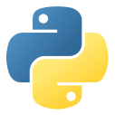
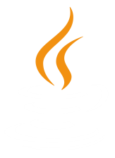
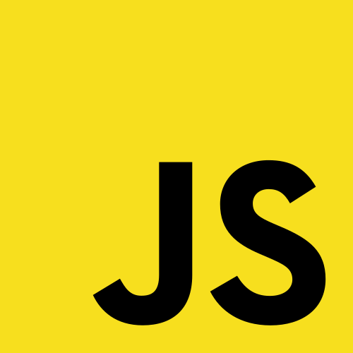
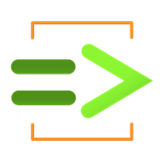

# sesion-05a

## Apuntes
###### ${\color{#3d3d44}Se \ recomienda \ usar \ modo \ oscuro, \ hay \ palabras \ en \ color \ blanco \ que \ de \ otra \ forma \ no \ son \ visibles.}$  
###### ${\color{#3d3d44}The \ use \ of \ dark mode \ is \ recommended, \ there's \ white \ colored \ text \ that \ otherwise \ is \ not \ visible.}$  

### [Clases](https://youtu.be/W1CjYKmTB-c?si=j0DhedhVqMTyQatA)

${\color{#b0e6e6}Definen}$ las ${\color{#b0e6e6}variables}$ y ${\color{#b0e6e6}funciones}$ que tiene cada objeto perteneciente a la clase.

### Objetos

Son elementos que pueden tener ${\color{#b0e6e6}información}$, ${\color{#b0e6e6}variables}$ y ${\color{#b0e6e6}funciones}$ heredadas de la clase a la cual pertenecen.

### [Bjarne Stroustrup](https://www.stroustrup.com/)

  

&nbsp;&nbsp;Creador de C++ y autor del libro introductorio al lenguaje, "The C++ Programming Language".

   

### [OpenFrameworks](https://openframeworks.cc/about/)

*Toolkit* de código abierto escrito en C++ diseñado para facilitar la ${\color{#b0e6e6}experimentación}$ y ${\color{#b0e6e6}creación\ artística}$ con tecnología, usando gráficos, audio, video y visión por computadora.

### Lenguajes de programación:

#### [Python](https://www.python.org/)

Según entiendo, es un lenguaje más ${\color{#b0e6e6}simple\ y/o\ fácil}$ que C++, porque asume y simplifica partes que se tienen que especificar en C++, lo que además permite que sea más rápido de escribir.

 

#### [Java](https://www.java.com/es/)

Principal lenguaje de programación empleado por empresas.

 La versión original de Minecraft, hecha por Notch, fue escrita en este lenguaje, a diferencia de la versión de Microsoft, Minecraft Bedrock, que fue hecha en C++ [*](https://www.laps4.com/preguntas-y-respuestas/como-esta-programado-minecraft).

 

#### &nbsp;[JavaScript](https://developer.mozilla.org/es/docs/Learn_web_development/Core/Scripting/What_is_JavaScript)

&nbsp;Lenguaje especializado en ${\color{#b0e6e6}desarrollo\ web}$, permite controlar multimedia, animar imágenes y más.

 

#### [ChucK](https://github.com/ccrma/chuck)

Lenguaje diseñado para ${\color{#b0e6e6}síntesis\ de\ audio}$ en tiempo real, es flexible y con un control del tiempo extremadamente preciso.

### [Esoteric programming languages](https://esolangs.org/wiki/Esoteric_programming_language)

Son lenguajes de programación diseñados no para ser usados, sino para experimentar, ser difíciles de escribir y leer. Son básicamente ${\color{#b0e6e6}memes}$ en lugar de cosas prácticas.

### [#include](https://youtu.be/IiZl3p-ZohM?si=hAfEcduuj1ZFJooz)

Al crear múltiples archivos (*libraries*) en Arduino IDE, para ${\color{#b0e6e6}modularizar}$ y ${\color{#b0e6e6}ordenar}$ el código, hay que decirle al IDE que utilice el código de los otros archivos, escribiendo `#include [nombreArchivo].[formatoArchivo]` al inicio del archivo `.ino`.

Dentro de los archivos `.h` (*header files*), hay que poner `#ifndef [nombreArchivo]_[formatoArchivo]` y `#define [nombreArchivo]_[formatoArchivo]` al inicio del código, y `#endif` al final del código, para ${\color{#b0e6e6}evitar\ errores}$ al compilar el código ocasionados por definir un mismo archivo en múltiples otros archivos.

En el caso de los archivos `.cpp` (C plus plus), solo incluimos el archivo `.h`, correspondiente a la librería, al inicio.

El archivo `.cpp` contiene la ${\color{#b0e6e6}lógica}$, ${\color{#b0e6e6}funciones}$ y ${\color{#b0e6e6}clases}$ definidas en el archivo `.h`.