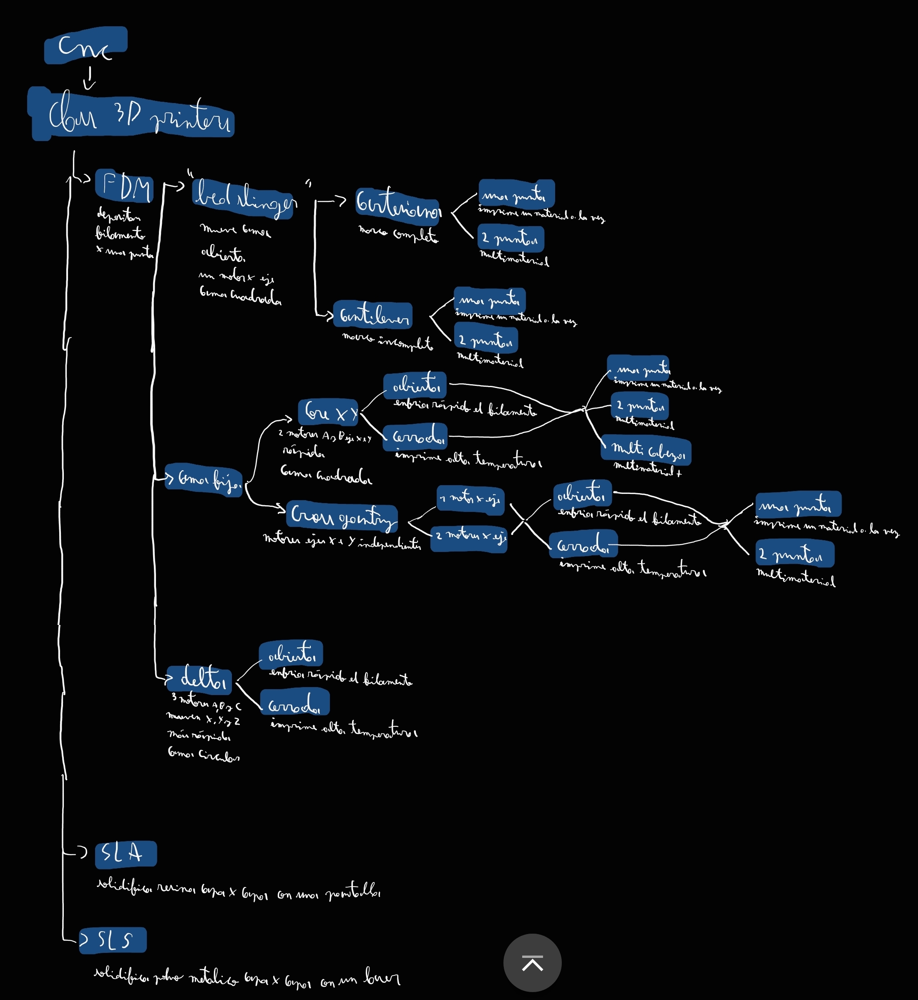

# sesion-05b

## Apuntes
###### ${\color{#3d3d44}Se \ recomienda \ usar \ modo \ oscuro, \ hay \ palabras \ en \ color \ blanco \ que \ de \ otra \ forma \ no \ son \ visibles.}$  
###### ${\color{#3d3d44}The \ use \ of \ dark mode \ is \ recommended, \ there's \ white \ colored \ text \ that \ otherwise \ is \ not \ visible.}$  

### [.h (header file) and .cpp (C++ file)](https://docs.arduino.cc/learn/contributions/arduino-creating-library-guide/)

El archivo de encabezado (header) contiene las distintas definiciones que utiliza nuestra biblioteca (library), es decir, en este archivo se encuentran todas las funciones, variables y clases que vallamos a utilizar, definidas; mientras que en el archivo fuente (source, C++) contiene el código que dicta cómo funciona cada función, cómo se utilizan las variables, etc.

### [Inheritance](https://whileinthisloop.blogspot.com/2016/05/c-in-arduino-inheritance.html)

Consiste en crear una nueva clase (child) a partir de una clase base ya existente (parent). La clase child tiene acceso a todas las funciones, variables y demás que conforman a la clase parent, esto nos permite crear una nueva clase que extiende las capacidades de la clase original.

#### Ejemplo:

* La clase CNC consiste en maquinas y/o herramientas controladas por un computador. 

* La clase 3D_printers añade la capacidad de fabricacion mediante adición de material. 

 * La clase FDM (Fused Deposition Modeling) construye un objeto capa por capa 
 depositando material derretido; la clase SLA (Stereolithography) genera un volumen solidificando resina líquida con luz UV; la clase SLS (Selective Laser Sintering) usa ul laser para derretir y soldar particulas de polvo. 

* A partir de la clase FDM, La clase Bed_Slinger mueve la superficie de construcción (cama) en el eje Y; la clase Cama_Fija no mueve la superficie de impresión en el eje Y, sino que mueven la cabeza (toolhead) en X e Y; la clase Delta tiene la cama fija (redonda), mueve la cabeza en X, Y y Z, y los 3 steppers trabajan en conjunto para realizar cada movimiento.

* Dentro de la clase Bed_Slinger, la clase Cartesian tiene un stepper para cada eje de movimiento y una estructura rígida, mientras que la clase Cantilever tiene el eje X sujetado en un extremo.

* De la clase Cama_Fija, la clase CoreXY emplea 2 steppers que trabajan en conjunto para mover la cabeza en X e Y; la clase Cross_Gantry tiene los motores que mueven la cabeza en X o Y independientes uno(s) del otro(s).

* Etc.

-----------------------------------------------------------------------------------------------------------
## Encargo 09 <!-- escuchar y comentar uno de los tres primeros discos de la banda Primus -->
### TITULO

-----------------------------------------------------------------------------------------------------------
## Encargo 10 <!-- investigar sobre la obra de Mitchel Resnick, leer uno de sus escritos o ver una de sus charlas, y comentarla críticamente -->
### TITULO