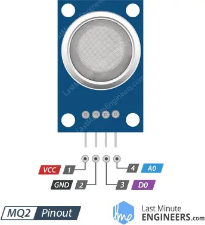
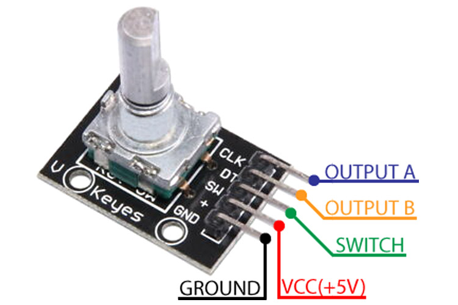
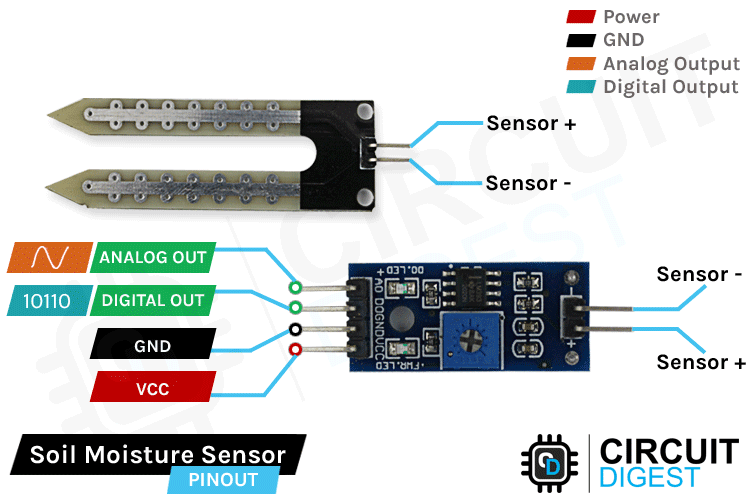
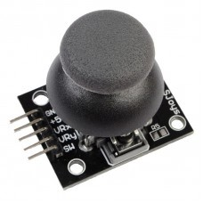

# sesion-06a

## Apuntes
###### ${\color{#3d3d44}Se \ recomienda \ usar \ modo \ oscuro, \ hay \ palabras \ en \ color \ blanco \ que \ de \ otra \ forma \ no \ son \ visibles.}$  
###### ${\color{#3d3d44}The \ use \ of \ dark mode \ is \ recommended, \ there's \ white \ colored \ text \ that \ otherwise \ is \ not \ visible.}$  

### [Scratch](https://scratch.mit.edu/)

Plataforma, lenguaje de programación visual y comunidad donde niños y estudiantes aprenden a programar jugando, creando animaciones, juegos, historias, etc. 

  

### [Pure data](https://puredata.info/)

Lenguaje de programación visual open source diseñado para crear multimedia de manera interactiva y en tiempo real

       

### [Github workflows](https://docs.github.com/es/actions/concepts/workflows-and-actions/workflows)

Es un proceso automatizado configurable que realiza acciones o trabajos cuando sea activado, ya sea por un cambio en un repositorio, tiempo de activacion pre-definido, menualmente, etc.

Los flujos de trabajo se definen en un archivo YAML (Yet Another Markdown Languaje) que se verifica o autoriza en el repositorio.

En nuestro caso el programa se activa cuando alguien actualiza sus forks y hace lint, aunque @montoyamoraga modificó este programa para que me ignore y así poder usar HTML y LaTex en mis bitacoras.   

#### [Lint](https://en.wikipedia.org/wiki/Lint_(software))

Es el proceso de automáticamente revisar el código en busqueda de errores programáticos y de estilo, cuando el programa encuentra estos errores los reporta al usuario.

### [LaTex](https://www.latex-project.org/get/)

Es un sistema de preparación de documentos que consiste de un lenguaje markup, que el usuario escribe, que es procesado y formateado por el programa.

LaTex es el lenguaje que utlizo para cambiar el color de las palabras en los archivos .readme.

#### [Tex](https://en.wikipedia.org/wiki/TeX)

Programa de tipografía creado por Donald Knuth en 1978, LaTex fue escrito con este programa como base.

El programa fue diseñado para que el output generado sea el mismo sin importar las diferencias entre computadores, version del programa, etc.

##### [Donald Knuth](https://en.wikipedia.org/wiki/Donald_Knuth)

Es una de las personas más influenciales en ciencia computacional, escribió la "biblia de computer-science" ([The Art of Computer Programming](https://en.wikipedia.org/wiki/The_Art_of_Computer_Programming)), creó [Tex](https://en.wikipedia.org/wiki/TeX), introdujo el concepto de [programación alfabetizada (Literate_programming)](https://en.wikipedia.org/wiki/Literate_programming), entre otros.

      

#### [Overleaf](https://www.overleaf.com/)

Editor de LaTex diseñado para hacer escribir usando LaTex más facil, rápido, accesible y colaborativo (aunque se tiene que pagar para poder colaborar).

     

### Proyecto 2: Máquina Saludadora

Vamos a hacer una maquina que salude, la cual tendrá que utilizar uno o más sensores como input.

### [Sensores](https://es.wikipedia.org/wiki/Sensor)

Un sensor es un aparato que detecta cambios en su entorno y envia señales eléctricas que un computador puede entender.  
Que cambio(s), cómo los detecta o mide varían dependendiendo del tipo de sensor.

-----------------------------------------------------------------------------------------------------------
## Encargo 11 <!-- investigar sensores vistos en clases, cotizarlos, encontrar referentes que los usen, y describir 3 pequeñas ideas que podamos aplicar a su proyecto-02 de máquinas de saludar -->
### Sensores vistos en clase

### [Sensor ultrasónico de distancia (HC-SR04)](https://projecthub.arduino.cc/lucasfernando/ultrasonic-sensor-with-arduino-complete-guide-284faf)

Emite ondas ultrasónicas y cuenta cuanto tiempo pasa antes de que estas regresen a él, igual como un murcielago.

Según lo que he podido encontrar en internet y testimonio de @misaaaaaa, el sensor no es muy preciso, sin embargo encontré una biblioteca llamada [NewPing](https://bitbucket.org/teckel12/arduino-new-ping/wiki/Home) que fue desarrollada para solucionar este problema.

| Pinout  |          |
|---------|----------|
| Vcc     | Alimenta con 5V al sensor |
| Trigger | hace que el sensor emita un pulso |
| Echo    | comunica cuando regresa el pulso |
| Gnd     | Tierra |

| Consumo    |      |
|------------|------|
| idle       | <2mA |
| trabajando | 15mA |

Ángulo efectivo: 15º

Distancia efectiva: 2cm a 4M

Referentes: [Sonar](https://youtu.be/KGwtit2bFyo?si=A_or_WnmgpEQNJxr) y [sistema experimental de posiscionamiento de dron](https://www.youtube.com/watch?v=7r3OAkqaziI) 

 
| Cotización  |          |
|---------|----------|
|    [Afel](https://afel.cl/products/sensor-de-ultrasonico-hc-sr04?variant=45125226365080&country=CL&currency=CLP&utm_medium=product_sync&utm_source=google&utm_content=sag_organic&utm_campaign=sag_organic&srsltid=AfmBOop5Ps48wG4CzlpsY6C8KO5xcNYxh0lGCjbrPNuP4vw_j6QItgmpDj0)  | $1500 |
| [Tenstar robot (aliexpress)](https://es.aliexpress.com/item/1005006039388853.html?src=google&pdp_npi=4%40dis!CLP!2895!1902!!!!!%40!12000035439724673!ppc!!!&snps=y&snpsid=1&src=google&albch=shopping&acnt=742-864-1166&isdl=y&slnk=&plac=&mtctp=&albbt=Google_7_shopping&aff_platform=google&aff_short_key=_oDeeeiG&gclsrc=aw.ds&&albagn=888888&&ds_e_adid=&ds_e_matchtype=&ds_e_device=c&ds_e_network=x&ds_e_product_group_id=&ds_e_product_id=es1005006039388853&ds_e_product_merchant_id=5551326180&ds_e_product_country=CL&ds_e_product_language=es&ds_e_product_channel=online&ds_e_product_store_id=&ds_url_v=2&albcp=21628548633&albag=&isSmbAutoCall=false&needSmbHouyi=false&gad_source=4&gad_campaignid=22457134733&gbraid=0AAAAA99aYpdUlCUf1lr4yY-dScBnL83TI&gclid=Cj0KCQjw3OjGBhDYARIsADd-uX4o03I0zXRkS0juNyjaJWFmuQ9_U5g88RtKTwuSvcWT1OfR9Tc3ZyoaAhs1EALw_wcB) | $1631 |

 

---

### [Sensor de temperatura y humedad 1](https://www.hwlibre.com/dht11/) [(DHT11)2](https://www.youtube.com/watch?v=nssXWNYdGT8&msockid=a89b07d59da211f0b745a4c3a2f1df11)

Mide la temperatura y humedad del ambiente en que sea colocado, hace el trabajo de 2 sensores distintos.

| Pinout  |          |
|:---------:|----------|
| Vcc     | Alimenta con 3V - 5V al sensor |
| Data | Emite las lecturas del sensor |
| NC    | No se conecta |
| Gnd     | Tierra |

| Características    |      |
|------------|:------:|
| Consumo | 2.5mA |
| Rango de temperatura | 0°C a 50°C |
| Precision de medición temp a 25°C | ± 2°C |
| Rango medición humedad | 20% RH a 90% RH
| Resolución | 8 bit

Output es digital, no se requiere un ADC (Analog to Digital Conveter).

Referente: [Medidor de temperatura con display que controla un ventilador](https://youtu.be/kLGKVRmA6qM?si=V6R917zREnDpwnpz)

 
| Cotización  |          |
|:---------:|----------|
|    [Afel](https://afel.cl/products/sensor-de-temperatura-y-humedad-dht11?variant=45125225316504&country=CL&currency=CLP&utm_medium=product_sync&utm_source=google&utm_content=sag_organic&utm_campaign=sag_organic&srsltid=AfmBOopBpDKEg6-cvMiIue9GO7GNhKvCGqIIK9aevydRV5MYtyGcVEXtNH8)  | $2300 |
| [Aliexpress](https://es.aliexpress.com/item/1005005975376014.html?spm=a2g0o.tesla.0.0.2735uhdQuhdQRA&afTraceInfo=1005005975376014__pc__c_ppc_item_bridge_pc_same_wf__h4dja19__1759199326305&gatewayAdapt=glo2esp) | $1800 |

 

---

### [Sensor de gas (MQ2)](https://lastminuteengineers.com/mq2-gas-senser-arduino-tutorial/)

Sensor capáz de detectar la precencia de LPG, humo, alcohol, propano, hidrógeno, metano y monoxido de carbono (entre otros), y reportar la concentración de estos gases en el aire.

El sensor funciona detectando el cambio de resistencia en su nucleo, este está hecho de un material que al ser calentado reacciona con el oxigeno, haciendo que la reistencia del elemento aumente drásticamente. Cuando hay gases inflamables presentes, estos le quitan el oxígeno de encima el sensor y la conductividad aumenta.

| Pinout |          |
|:------:|----------|
| Vcc    | Alimenta con 5V al sensor |
| Gnd    | Tierra |
| D0     | (Digital output) Emite LOW cuando detecta gases inflamables |
| A0     | (Analog output) Emite un voltaje variable correspondiente a la concentracion de gas  |

| Características    |      |
|------------|:------:|
| Consumo | 160mA |
| Rango de temperatura | 0°C a 50°C |
| Resistencia de carga | 20 KΩ |
| Resistencia del calentador | 33Ω ± 5% |
| Resistencia de detección | 10 KΩ – 60 KΩ |
| Rango de concentración | 200 – 10000ppm |
| Tiempo de precalentado |  24 - 48 hrs |

Referente: [Detector de gases y humo (alarma)](https://youtu.be/NxaBnZyyJbc?si=XW4T_a7Ml1KZaikI)

 
| Cotización  |          |
|:---------:|----------|
|    [Afel](https://afel.cl/products/sensor-de-gas-mq2?srsltid=AfmBOoq5M_UHANr3t04XnWjSg3IgZq2efVnBWjcL3aOSc_IBaPGnoTDs)  | $2300 |
| [Aliexpress](https://es.aliexpress.com/item/32328262269.html?spm=a2g0o.productlist.main.1.2dd731fbcIK0Wq&algo_pvid=bd3d189a-7ea9-4034-9970-8294608e4495&algo_exp_id=bd3d189a-7ea9-4034-9970-8294608e4495-0&pdp_ext_f=%7B%22order%22%3A%22252%22%2C%22eval%22%3A%221%22%2C%22fromPage%22%3A%22search%22%7D&pdp_npi=6%40dis%21CLP%211234%211234%21%21%211.24%211.24%21%402103246617592061878535430e8097%2156168146173%21sea%21CL%212216225714%21X%211%210%21n_tag%3A-29919%3Bd%3Abffa061c%3Bm03_new_user%3A-29895&curPageLogUid=tRUYAxk1qO41&utparam-url=scene%3Asearch%7Cquery_from%3A%7Cx_object_id%3A32328262269%7C_p_origin_prod%3A) | $1234 |

 

---

### [Rotary encoder](https://howtomechatronics.com/tutorials/arduino/rotary-encoder-works-use-arduino/)

Detecta dirección de rotación, distantancia rocorrida por la rueda, velocidad de rotación y en algunos casos un switch siendo pulsado.

Dentro del encoder hay 2 "switches", correspondientes a los outputs A y B correspondientemente, que al rotar la perilla, son pulsados uno tras el otro generando un patrón que el microcontrolador lee. 

| Pinout  |          |
|:---------:|----------|
|  Gnd  | Tierra |
|  Vcc  | Alimenta con 5V al sensor |
|  Switch | Botón |
|  Output A  | Emite pulsos digitales al rotar |
|  Output B  | Emite pulsos digitales al rotar |

Referente: [Lamp dimmer](https://www.edn.com/mouse-encoder/)

 
| Cotización  |          |
|:-----------:|----------|
| [Afel](https://afel.cl/products/encoder-rotatorio-ky-040-360-grados?variant=45125048434840&country=CL&currency=CLP&utm_medium=product_sync&utm_source=google&utm_content=sag_organic&utm_campaign=sag_organic&srsltid=AfmBOooE7x7yR-tF44NTYCKkC2BThQfQXfTGjPHL6s4V7ZJBz8LETi2QWSs)    | $2000 |
| [Aliexpress)](https://es.aliexpress.com/item/1005008554510924.html?spm=a2g0o.detail.pcDetailTopMoreOtherSeller.1.41barsRyrsRyPP&gps-id=pcDetailTopMoreOtherSeller&scm=1007.40196.439370.0&scm_id=1007.40196.439370.0&scm-url=1007.40196.439370.0&pvid=05f8adde-4efe-486d-bd99-aa4fa85f9310&_t=gps-id:pcDetailTopMoreOtherSeller,scm-url:1007.40196.439370.0,pvid:05f8adde-4efe-486d-bd99-aa4fa85f9310,tpp_buckets:668%232846%238109%231935&pdp_ext_f=%7B%22order%22%3A%22554%22%2C%22eval%22%3A%221%22%2C%22orig_sl_item_id%22%3A%221005008554510924%22%2C%22orig_item_id%22%3A%221005006459289182%22%2C%22sceneId%22%3A%2230050%22%2C%22fromPage%22%3A%22recommend%22%7D&pdp_npi=6%40dis%21CLP%212614%211307%21%21%2118.72%219.36%21%402103241117592718273342712ea3b3%2112000045689899837%21rec%21CL%212216225714%21X%211%210%21n_tag%3A-29919%3Bd%3Abffa061c%3Bm03_new_user%3A-29895&utparam-url=scene%3ApcDetailTopMoreOtherSeller%7Cquery_from%3A%7Cx_object_id%3A1005008554510924%7C_p_origin_prod%3A1005006459289182) | $1307 |

 

---

### [Sensor de humedad de suelo (HW-103A)](https://lastminuteengineers.com/soil-moisture-sensor-arduino-tutorial/)

El sensor es una resistencia cuyo valor varía dependiendo de cuanta humedad haya en el suelo, esta es conectada a un módulo comparador LM393, que se encarga de proveer las señales digitales y analógicas. 
 
| Pinout  |          |
|:---------:|----------|
| Vcc     | Alimenta con 3.3V - 5V al sensor |
| Gnd     | Tierra |
| Digital out | Emite señales digitales |
| Analog out | Emite señales analógicas |

Sensibilidad ajustable con el potenciómetro azul.

El comparador emite una señal digital cuando la humedad sobrepasa el rango configurado.

Referentes:  
 
| Cotización  |          |
|:-----------:|----------|
| [Afel](https://afel.cl/products/sensor-humedad-suelo-higrometro?variant=45125237997720&country=CL&currency=CLP&utm_medium=product_sync&utm_source=google&utm_content=sag_organic&utm_campaign=sag_organic&utm_term=&utm_campaign=@+Smart+Shopping+2&utm_source=adwords&utm_medium=ppc&hsa_acc=1808722794&hsa_cam=19569174895&hsa_grp=&hsa_ad=&hsa_src=x&hsa_tgt=&hsa_kw=&hsa_mt=&hsa_net=adwords&hsa_ver=3&gad_source=1&gad_campaignid=19560974580&gbraid=0AAAAADBMsFRv1iW7wu0slTHhMrJpnKr9l&gclid=CjwKCAjw_-3GBhAYEiwAjh9fUMSWx9J7hO0MX6ca4pbWIABuzP54sYI7wpU5bYXffFHxQRnXmW_fUhoCzb8QAvD_BwE)    | $2300 |
| [Aliexpress)](https://es.aliexpress.com/item/1005007463014084.html?src=google&pdp_npi=4%40dis!CLP!2166!1343!!!!!%40!12000040856282136!ppc!!!&snps=y&snpsid=1&src=google&albch=shopping&acnt=752-015-9270&isdl=y&slnk=&plac=&mtctp=&albbt=Google_7_shopping&aff_platform=google&aff_short_key=_oDeeeiG&gclsrc=aw.ds&&albagn=888888&&ds_e_adid=768550850310&ds_e_matchtype=search&ds_e_device=c&ds_e_network=g&ds_e_product_group_id=2432726605827&ds_e_product_id=es1005007463014084&ds_e_product_merchant_id=5551326180&ds_e_product_country=CL&ds_e_product_language=es&ds_e_product_channel=online&ds_e_product_store_id=&ds_url_v=2&albcp=22884625885&albag=182909670879&isSmbAutoCall=false&needSmbHouyi=false&gad_source=4&gad_campaignid=22884625885&gbraid=0AAAAA_eFwRBO1dBxPKHyiMm0EnL0srRcd&gclid=Cj0KCQjwovPGBhDxARIsAFhgkwRCssFY_8I0-_m1dOopTIm_LoAS8hhWv0BUI7PazFVSbLXxcFo7Z24aAvA7EALw_wcB) | $981 |

 

---

### [Joy1](https://arduinogetstarted.com/tutorials/arduino-joystick)[stick2](https://www.youtube.com/watch?v=vo7SbVhW3pE) 

Consiste de 2 potenciómetros, colocados a 90 grados uno del otro, conectados a una palanca, los cuales nos dan un voltaje que varía dependiendo de la posición en X e Y en que tengamos la palanca.  
Algunos joysticks tienen integrado un botón (switch) y algunos en lugar de utilizar potenciómetros utilizan sensores hall effect, que varían el voltaje dependiendo de la posición de un imán.

| Pinout  |          |
|:---------:|----------|
| Gnd    | Tierra |
| +5V    | Alimenta con 5V al módulo |
| VRx    | Voltaje del potenciómetro del eje X |
| VRy    | Voltaje del potenciómetro del eje Y |
| SW     | Switch, es LOW cuando está siendo presionado |

Referentes:  

 
| Cotización  |          |
|:-----------:|----------|
| [Afel](https://afel.cl/products/joystick-palanca-de-mando?pr_prod_strat=e5_desc&pr_rec_id=e0c87be65&pr_rec_pid=8381984080024&pr_ref_pid=8381917790360&pr_seq=uniform)    | $2000 |
| [Aliexpress)]() | $ |

 

---

###

###

###

descripcion

| Pinout  |          |
|:---------:|----------|
| Vcc     | Alimenta con 5V al sensor |
|     |  |
|     |  |
| Gnd     | Tierra |

| Características    |      |
|------------|:------:|
| Consumo |  |
|  |  |
|  |  |
|  |  |
|  |  |

Distancia efectiva: 2cm a 4M

Referentes:  

 
| Cotización  |          |
|:-----------:|----------|
| [Afel]()    | $ |
| [Aliexpress)](https://www.aliexpress.com/p/tesla-landing/index.html?scenario=c_ppc_item_bridge&productId=1005005484298907&_immersiveMode=true&withMainCard=true&src=google&aff_platform=true&isdl=y&src=google&albch=shopping&acnt=615-992-9880&isdl=y&slnk=&plac=&mtctp=&albbt=Google_7_shopping&aff_platform=google&aff_short_key=_oFgTQeV&gclsrc=aw.ds&&albagn=888888&&ds_e_adid=&ds_e_matchtype=&ds_e_device=c&ds_e_network=x&ds_e_product_group_id=&ds_e_product_id=es1005005484298907&ds_e_product_merchant_id=662189571&ds_e_product_country=CL&ds_e_product_language=es&ds_e_product_channel=online&ds_e_product_store_id=&ds_url_v=2&albcp=22559110785&albag=&isSmbAutoCall=false&needSmbHouyi=false&gad_source=1&gad_campaignid=22559111214&gbraid=0AAAAA_TvRHpt60gIvBG_sxPJyYtddY0sA&gclid=Cj0KCQjwovPGBhDxARIsAFhgkwQ0kI3djd3MsaDMxNj5ZvPFaQwuBJChG38GE8WXGCf3L1nwB7y-4bkaAmE-EALw_wcB) | $862 |

 

---