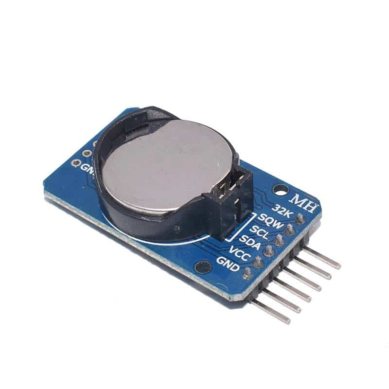
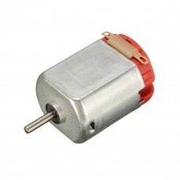
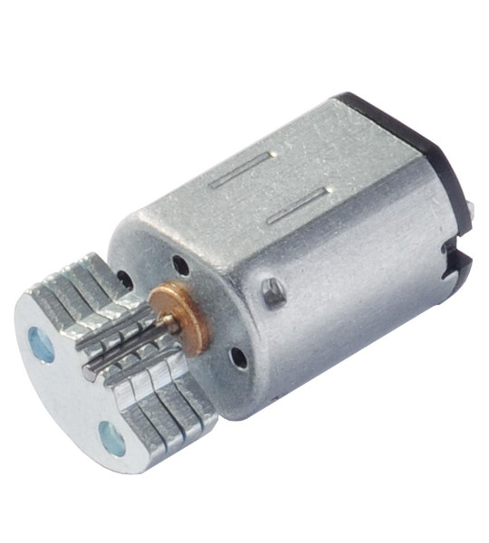
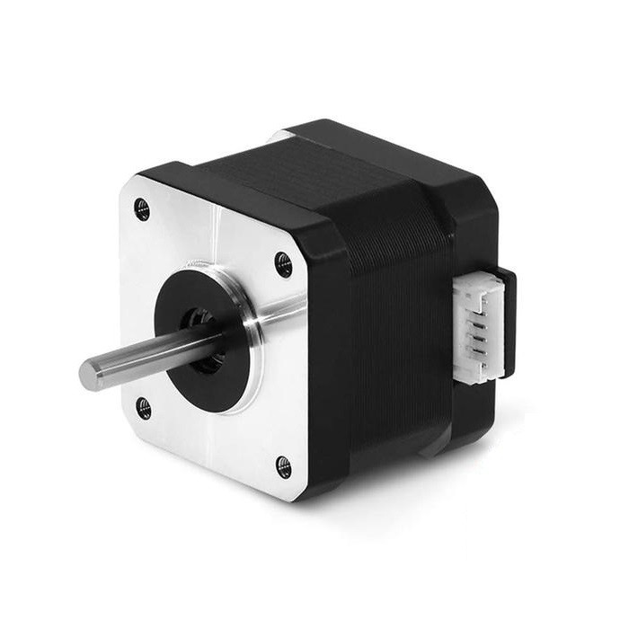
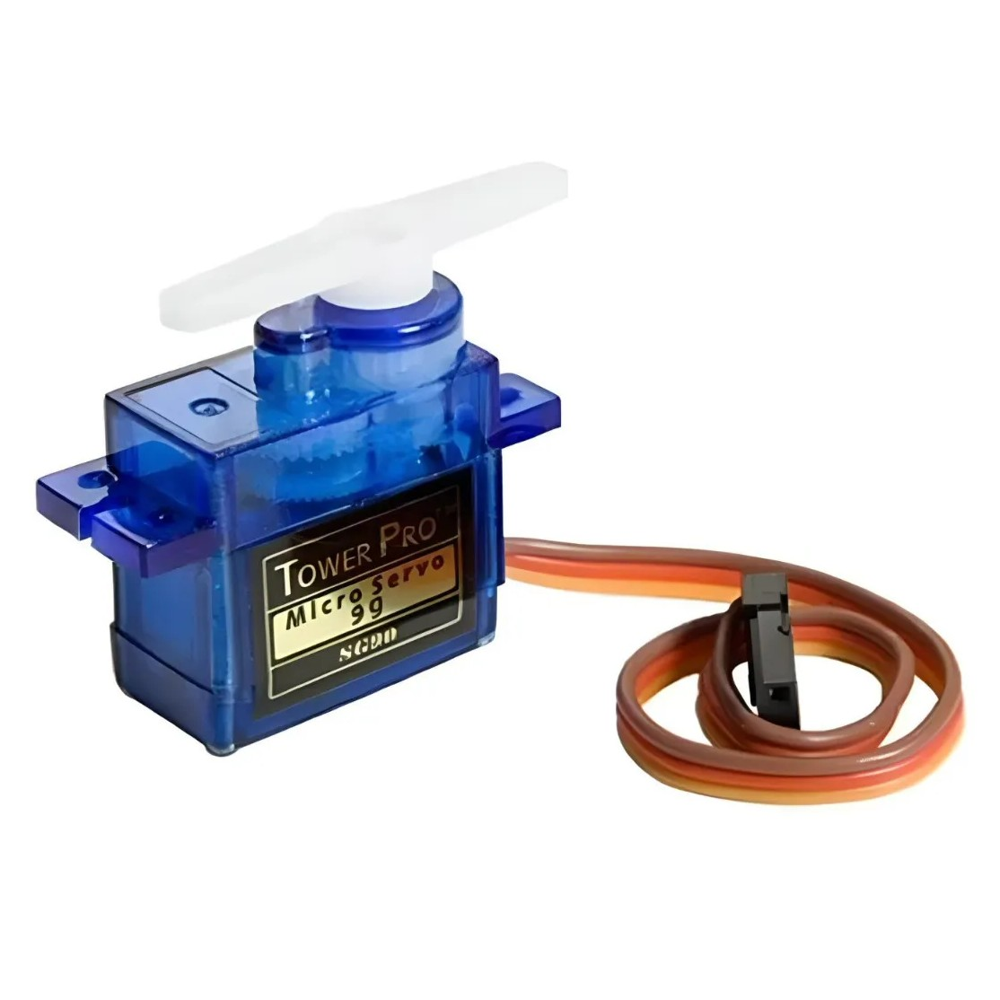
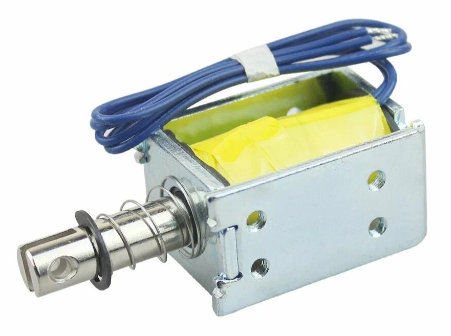
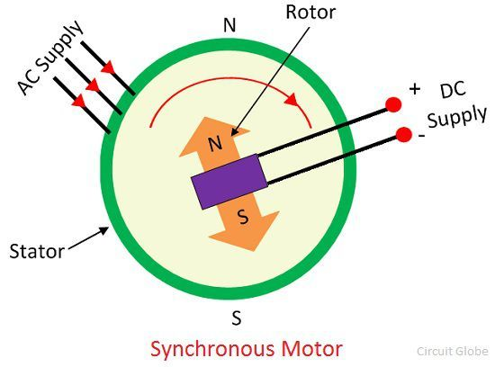
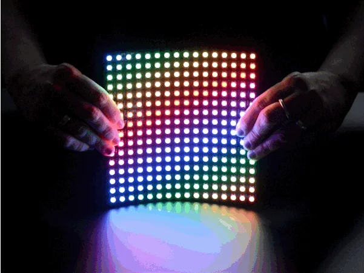

# sesion-07a

## Apuntes
###### ${\color{#3d3d44}Se \ recomienda \ usar \ modo \ oscuro, \ hay \ palabras \ en \ color \ blanco \ que \ de \ otra \ forma \ no \ son \ visibles.}$  
###### ${\color{#3d3d44}The \ use \ of \ dark mode \ is \ recommended, \ there's \ white \ colored \ text \ that \ otherwise \ is \ not \ visible.}$  

### [Physical computing](https://en.wikipedia.org/wiki/Physical_computing)

Son sistemas interactivos que sienten y responden a fenómenos físicos de su entorno, mediante sensores y actuadores electromecánicos.

### [Módulo1](https://afel.cl/products/modulo-rtc-ds3231-reloj-de-tiempo-real?srsltid=AfmBOorXrlfXdtQt1sqvbsxNZMsiro2GZl1JW-KAMuWVLju0_c73MNBp) [RTC2](https://en.wikipedia.org/wiki/Real-time_clock)

   

El reloj de tiempo real es un dispositivo electrónico que mide el paso del tiempo con precisión.

    

### [Nixi tubes](https://en.wikipedia.org/wiki/Nixie_tube)

  

Display electrónico vintage similar a un tubo de vacío en apariencia, es utilizado para mostrar números y símbolos. Cuando se le aplica voltaje a uno de sus cátodos se ilumina con una luz naranja rojiza.

    

### ["Las llamadas que nunca hice"](https://gam.cl/actividades/las-llamadas-que-nunca-hice-voyager/)

Instalación artística de Juan José Acuña, que consiste en un teléfono público de los años 90, que fue modificado para grabar y reproducir audio. El público interactúa con el teléfono grabando y escuchando los mensajes que graban.  

### [DC motor](https://youtu.be/GQatiB-JHdI?si=goIzT3UkHXowmdzj)

   

Cuando recibe corriente gira en un sentido, cuando se invierte la polaridad gira en la dirección opuesta.

    

#### [Vibrador](https://youtu.be/3hoBwa0ccys?si=pLKQnPnmO2eaj7h2)

   

Es un motor DC con un peso desbalanceado, al girar el peso se mueve alrededor del motor, generando la vibración.

    

### [Stepper motor](https://youtu.be/fQsdUhRwCU4?si=ZXM2dHAQC_YXJhkJ)

 

Son motores que rotan de forma continua en ambas direcciones en "pasos", lo que nos permite controlar su velocidad de rotación, distancia e incluso que mantenga su posición.
  Son utilizados en aplicaciones donde se requiere de alta precisión y la capacidad de rotar continuamente.

Requieren de un driver especializado para controlarlos. Algunos drivers, como los TMC2209, hasta permiten usar el stepper como un sensor, al monitorear la cantidad de corriente que el motor consume en tiempo real, para medir el peso/resistencia contra la cual el motor está actuando.

 

### [Servo motor](https://youtu.be/1WnGv-DPexc?si=TKe5yXUx39lavBYq)

 

Motor similar al stepper, en cuanto a que podemos controlar su posición, sin embargo solo puede rotar desde 0 a 180°.

Hay otro tipo de servos, de rotación continua, que pueden rotar 360°+ continuamente (de ahí el nombre), pero estos a diferencia de los anteriores no nos permiten controlar con precisión el ángulo, sino la velocidad de rotación.

  

### [Solenoide lineal](https://www.youtube.com/watch?v=nwVRMU9grSI)

 

Es un electroimán que al darle corriente en un sentido empuja con un pistón y al darle energía en el sentido opuesto, tira del pistón.  
Los utilizamos para hacer la [máquina percutora de Sokio](https://github.com/FranUDP/dis8645-2025-02-procesos/tree/main/28-FranUDP/sesion-02a).

   

### [Motor síncrono](https://youtu.be/Tk3lNBSAgEg?si=OWlQzhQpb5f_Sxfr)

 

Es un motor que combina corriente alterna (AC) y directa (DC), para lograr un motor que siempre gira a la misma velocidad, sin importar la carga o resistencias aplicadas al motor.

La velocidad a la que rota depende de la frecuencia de la corriente alterna que se le aplique.

   

### [RGB LED](https://youtu.be/wqzfbImsrPE?si=1A1LxJqlYxCm1sZ2)

Es un paquete que combina un LED (Light Emitting Diode) ${\color{red}rojo\ (Red)}$, uno ${\color{green}verde\ (Green)}$ y uno ${\color{cyan}azul\ (Blue)}$. Variando la intensidad de la luz que cada uno de estos "sub-LEDs" emite, podemos controlar el color que el LED RGB produce.

Estos LEDs tienen 4 pines, un ${\color{Red}Vcc}$ o ${\color{Gray}GND}$ común y la patita de la polaridad opuesta de cada "sub-LED".

 

#### [Neopixel](https://youtu.be/JpHJH5QsbTM?si=ESAErdHxjFRlsaZh)

  

Son LEDs RGB donde cada LED puede ser controlado individualmente por un microcontrolador.   [Creados por Adafruit](https://learn.adafruit.com/adafruit-neopixel-uberguide/the-magic-of-neopixels).

 

-----------------------------------------------------------------------------------------------------------
## Encargo 12 <!-- leer las bitácoras de colegas, encontrar similitudes, diferencias, preguntas y aciertos de sus máquinas saludadoras propuestas. Citar correctamente las fuentes -->
### Comparación con los otros grupos

#### [Grupo 1](https://github.com/disenoUDP/dis8645-2025-02-procesos/tree/main/04-yamna-bit/sesion-07a)

Quieren hacer que un reproductor mp3 reproduzca distintos audios con un parlante, dependiendo de la distancia a la cual se encuentre la persona de un sensor ultrasónico, y que además con un servo produzca un movimiento.

Nuestro proyecto también utiliza servos, pero uno de ellos se mantiene en constante movimiento, mientras que la posición del otro varía constantemente dependiendo de las mediciones del sensor ultrasónico.  
Su código nos podría servir para hacer que nuestro proyecto le hable al usuario al detectar que se ha acercado.

#### [Grupo 2](https://github.com/disenoUDP/dis8645-2025-02-procesos/blob/main/07-valechavezalb/sesion-07a/README.md)

Están haciendo un alien que te entrega un dulce de un color aleatorio, detecta el color del dulce con un sensor de color y te saluda de una forma distinta, dependiendo del color del dulce.

Según entiendo, al leer la bitácora y ver la lista de materiales, el usuario acciona un mecanismo para retirar el dulce, en lugar de que la máquina detecte al usuario y dé el dulce en respuesta.

Al igual que nosotros, utilizan un módulo mp3 y un parlante.

#### [Grupo 3](https://github.com/disenoUDP/dis8645-2025-02-procesos/tree/main/01-antokiaraa/sesion-07a)

Quieren hacer una pantalla que despliegue un menú de idiomas y que al seleccionar uno con un rotary encoder, un módulo mp3 conectado a un parlante te salude en dicho idioma.

Nosotros también usamos un módulo mp3 conectado a un parlante para reproducir mensajes, sin embargo queremos que el mensaje se reproduzca cuando un sensor ultrasónico detecte que la persona está cerca.

#### ${\color{orange}Grupo\ 4}$

Constituido por [10-brauliofigueroa2001](https://github.com/disenoUDP/dis8645-2025-02-procesos/tree/main/10-brauliofigueroa2001/sesion-07a), [13-Bernardita-Jesus](https://github.com/disenoUDP/dis8645-2025-02-procesos/tree/main/13-Bernardita-Jesus/sesion-07a), [17-jotamorales-romulus](https://github.com/disenoUDP/dis8645-2025-02-procesos/tree/main/17-jotamorales-romulus/sesion-07a), [20-Camila-Parada](https://github.com/disenoUDP/dis8645-2025-02-procesos/tree/main/20-Camila-Parada/sesion-07a) y 28-FranUDP (yo)

Estamos haciendo una máquina que con 2 sensores ultrasónicos, puestos en un ángulo haciendo que miren la misma zona, se triangule la posición del usuario.

Sabiendo dónde está ubicada la persona, un servo moverá un par de ojos, haciendo que el proyecto mantenga contacto visual en todo momento con el usuario. Esto se debe a que los seres humanos nos solemos sentir perturbados o incómodos ante el contacto visual prolongado, haciendo que una vez el usuario note que la máquina lo está siguiendo con la mirada, no pueda evitar interactuar con esta.

Una vez el usuario se acerque, un reproductor mp3 conectado a un parlante reproducirá un mensaje de saludo aleatorio.

También habíamos considerado la idea de tener otro servo que controle los párpados y que al detectar una persona los abra antes de seguirla con la mirada, y que tras saludarlo los cierre.

Una de las dudas que tengo es cómo evitar que el proyecto se mantenga mirando un objeto inerte, ignorando al usuario. Para evitar eso la máquina tendría que poder discernir entre un objeto inerte y un ser vivo, tal vez reconociendo si uno se mueve o no.

#### [Grupo 5](https://github.com/disenoUDP/dis8645-2025-02-procesos/tree/main/23-Coff4/sesion-07a)

Según entiendo, quieren hacer un robot que decide si te saluda o no, dependiendo de la temperatura ambiente. Si decide saludarte mueve la mano y muestra un mensaje en un display, en caso de no querer saludarte, solo muestra una explicación en el display.

Se asemeja a nuestro proyecto en cuanto a que detecta la presencia de un humano con un sensor ultrasónico.

#### [Grupo 6](https://github.com/disenoUDP/dis8645-2025-02-procesos/tree/main/12-santiagoClifford/sesion-07a)

Quieren hacer algo muy similar a nosotros, un robot que te sigue con la mirada para hacerte sentir incómodo.

A diferencia de nosotros, ellos decidieron emplear micrófonos para detectar la posición del usuario, lo cual me parece una solución bastante compleja.

Tras revisar las bitácoras del equipo no sé qué más hace su proyecto además de mirar en la dirección del usuario.

-----------------------------------------------------------------------------------------------------------
## Encargo 13 <!-- buscar 2 referentes asociados a tu proyecto de cada una de estas 4 categorías: 1. lenguaje natural (personas), código, materialidad, documentación. escribir un párrafo por cada uno de los referentes encontrados, citando las fuentes, y explicando por qué lo elegiste, qué te aporta, qué te inspira, o incluso si lo incluyes como antiejemplo -->
### Referentes

#### Lenguaje natural

#### Código

https://bitbucket.org/teckel12/arduino-new-ping/wiki/Home

Es una biblioteca desarrollada para facilitar el uso de los sensores ultrasónicos y aumentar su precisión, lo cual nos será de mucha ayuda al necesitar saber exactamente dónde se encuentra el usuario.

https://www.instructables.com/Accurate-2D-Tracking-Using-Multiple-HC-SR04-Ultras/

Tiene 2 o más sensores ultrasónicos con "campos de visión" sobrepuestos para detectar posición, esto es justo lo que necesitamos para poder determinar hacia dónde los ojos tienen que mirar.

#### Materialidad

#### Documentación

#### Potencial problema

https://forum.arduino.cc/t/ultrasonic-sensor-hc-sr04-tracking-and-following-object/1296914

En este foro hablan sobre un servo que mueve un sensor ultrasónico haciendo que siga al usuario, y el problema que parece estar teniendo el desarrollador con el cono de detección limitado de 15° del sensor.

Es posible que para seguir con la mirada al usuario necesitemos más de 2 sensores...

https://macduino.blogspot.com/2013/11/hc-sr04-using-multiple-ultrasonic.html

Según entiendo, emplea varios sensores en distintos ángulos para extender el cono de visión de su robot, efectivamente haciendo que 3 sensores actúen como uno. Lo más probable es que me haya confundido con la matemática, pero es posible que nos ayude a solucionar el problema del campo de visión.

https://blog.arduino.cc/2018/07/13/dual-ultrasonic-sensors-combine-for-2d-echolocation/

En este proyecto se utilizan 2 sensores ultrasónicos para determinar la posición de un objeto, haciendo que solo uno pueda emitir el ultrasonido y que ambos lo reciban después de que el sonido rebote en el objeto.

Esto genera un triángulo con un lado de distancia conocida y 2 que varían dependiendo de la posición del objeto, lo cual permite calcular la posición del objeto fácilmente.

Es posible que este método sea una mejor solución al problema.
